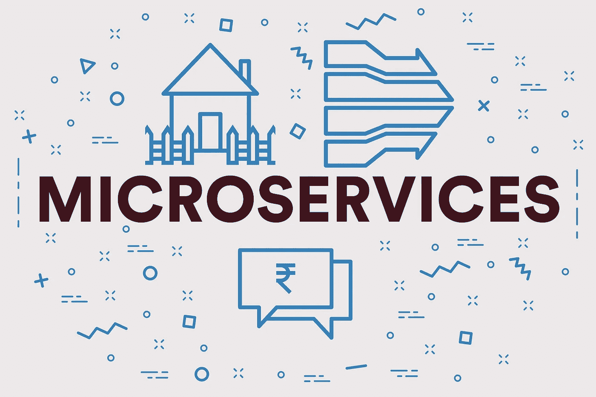

# 微服务架构——如何实施及其优势

> 原文：<https://medium.datadriveninvestor.com/microservices-architectures-how-to-implement-and-its-benefits-fadd27f68a7a?source=collection_archive---------12----------------------->

让我们沿着记忆的小路漫步。现在是 20 世纪 70 年代，你有数百万行 Vectran 代码。一切似乎都很好，所以你对自己说，“如果它没有坏，就没有理由去修理它。”问题是它坏了。如果你想增加一些新的功能，整个事情就完了。通过修复 bug，你正在制造更多的 bug。但是，如果你什么都不做，系统就一直工作。

要创新，你需要敏捷性和速度。世纪之交后成立的许多公司都超越了你的传统软件。当客户开始转向别处时，你的投资者正在要求下一件大事。解决方案是拆除你的整体架构，用微服务代替。让我们仔细看看微服务框架。

 [## 数据科学和软件工程哪个更有前途？-数据驱动型投资者

### 大约一个月前，当我坐在咖啡馆里为一个客户开发网站时，我发现了这个女人…

www.datadriveninvestor.com](https://www.datadriveninvestor.com/2019/01/23/which-is-more-promising-data-science-or-software-engineering/) 

# 什么是微服务？

微服务将功能分成几个轻量级应用，通过 RESTful APIs 连接在一起。一个很好的微服务例子是易贝。他们的平台需要能够处理 70 多个元素。这些元素中的每一个都是微服务。隔离在微服务架构中扮演着重要角色。每个微服务都有自己的扩展方法。例如，他们中的一些人使用关系数据库，而另一些人使用 NoSQL。

有几种微服务模式可供选择:

*   分解模式
*   整合模式
*   数据库模式
*   可观察模式
*   交叉关注模式

不管您最终选择哪一种模式，您都将能够享受到实现带来的一些好处。让我们来看看。

# 微服务的优势

微服务的一个显著好处是它使[软件编程](https://skywell.software/)变得更加简单。当你把应用程序分解成更小的部分时，创建和维护它们会更容易。由于您可以用各种语言、数据库和环境实现每个服务，因此您可以单独部署、重建、重新部署和管理每个服务。例如，如果您注意到某个特定的微服务需要太多的内存或对处理器造成太大的负担，则只有该特定服务会受到影响，而不是像单芯片架构那样影响整个系统。

由于微服务可以更快地部署，生产率和速度也得到提高。不同的团队可以同时处理不同的组件，而不必等待一个团队完成他们的工作，这样他们就可以开始工作了。此外，由于您可以单独测试每个单独的微服务，因此您的 QA 工作会大大增强。您还有机会在开发人员处理其他组件时测试已经创建的组件。

微服务为开发团队提供的灵活性不能被夸大。由于每个微服务都可以用不同的工具创建，因此您可以选择最适合您需求的技术组合。此外，用不同语言编写的解耦服务可以共存。如果您计划扩展您的产品，这是一个极好的消息，因为您将能够轻松地添加新组件或独立扩展每个服务。

如果你的团队成员分散在各个地理位置，微服务会因祸得福。原因是微服务让你的员工能够独立工作，在小群体中快速决策。如果您正在创建一个大型应用程序，并且您有分散的团队，强烈建议您使用微服务。否则，在整体架构下，事情很快就会变得一团糟。

最后，如果我们从业务的角度来看微服务，它们推动团队更加专注于创建业务功能，而不是粘合代码。基本上，人们更关注业务能力而不是技术，因为对后者的任何投资都必须有意义。这允许您的服务在多个上下文中使用。根据您的个人需求，它们可以在各种业务流程或渠道中回收。

# 微服务适合你吗？

仅仅为了改变而转向微服务架构没有太大意义。维护各种各样的微服务会让你感觉像是在不停地变戏法。此外，使用诸如 Kubernetes 这样的编排工具可能需要一些时间来适应。然而，如果你觉得传统的整体架构在可扩展性方面已经达到了极限，那么你应该转向微服务。如果您刚刚起步，从一开始就使用微服务来创建您的产品将是一个好主意，这样可以避免未来的可扩展性问题，并利用上面提到的所有优势。

如果我们看看行业巨头，如谷歌、亚马逊、贝宝、推特、网飞和许多其他公司，他们能够大规模扩张得益于微服务。它还允许他们促进业务创新，更快地将产品投放市场，并提高安全性。鉴于微服务提供的所有优势，您应该考虑使用它们来增强您的业务敏捷性。毕竟，客户在寻找一个能够最快、最可靠地交付产品的供应商。如果你不能满足顾客的需求，他们会去别的地方。这就是我们生活的现实。

*最初发布于*[*https://sky well . software*](https://skywell.software/blog/microservices-architectures-how-to-implement-and-its-benefits/)*。*