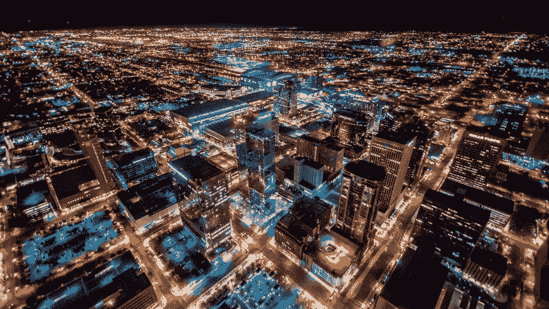
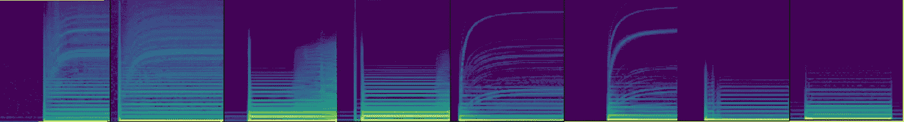
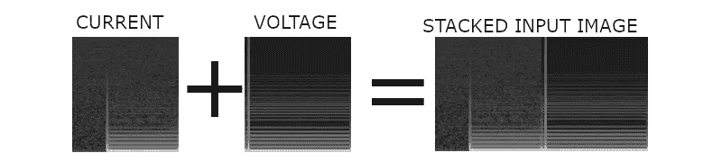
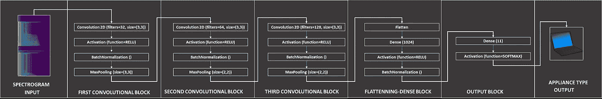

# 微软-人工智能-顶点

> 原文：<https://medium.datadriveninvestor.com/microsoft-ai-capstone-62e5dd56e933?source=collection_archive---------3----------------------->

## 通过考试并在比赛中获得高分

2018 年 10 月，微软与 [DrivenData](https://www.drivendata.org/) 合作推出了**微软专业顶点:人工智能**课程。课程本身基本上是微软专业计划中 AI track 的期末考试。

规则非常简单:在预测挑战中有 85%的预测准确率，你就能通过考试；少了，你就会失败(以及在当前运行中无法获得计划证书)。为了给好成绩增加更多的激励，微软决定在[驱动数据](https://www.drivendata.org/)的支持下组织一次公开比赛。

在下文中，我们将展示不仅确保通过考试(100 分中的 100 分)而且确保在比赛中获得第二名的核心模型和技术(参见[比赛排行榜](https://datasciencecapstone.org/competitions/10/appliances-energy-use/leaderboard/))。

# 挑战

Image credit: [Jerry Ferguson](https://www.flickr.com/photos/fergusonphotography/)

在美国能源信息管理局[预测到 2040 年世界能源消耗将增长 28%的背景下，挑战的一般领域与解释能源消耗模式有关。](https://www.eia.gov/todayinenergy/detail.php?id=32912)

竞赛的目标是**从电流和电压测量的频谱图组合中预测电器的类型**(一般来说，频谱图是声音或其他信号的各种频率随时间或其他变量变化的直观表示)。

Sample of spectrograms from the competition’s training set.

这些频谱图是从美国宾夕法尼亚州匹兹堡市 60 多个家庭的 11 种不同类型的电器中以 30 kHz 采样的**电流和电压测量值**生成的。数据收集发生在 2013 年夏季和 2014 年冬季。每种设备类型都由几十个不同品牌/型号的不同实例来代表。

对于每个电器，对插头负载测量进行后处理，以提取一个**两秒长的电流和电压测量窗口** e。一些观察将此窗口捕捉到**启动瞬态**(打开电器)，而其他观察将捕捉到**稳态操作的部分**(电器启动并运行)。训练和测试数据集中的每个设备都有两个频谱图:一个用于电流，一个用于电压(每个频谱图一个图像)。

# 数据建模

因为对于训练和测试数据集中的每个电器，我们都有一对电流和电压频谱图，很明显，对输入数据建模的最佳选择是以某种方式组合这些图像。

有许多可供选择的方案，但提供最佳结果的方案是**以水平方式堆叠(如图形堆叠)这些光谱图**。这意味着我们将通过在水平轴上连接电流和电压图像来创建新的图像。

Stacking the current and voltage spectrograms to produce the neural network’s input images.

在堆叠图像之前，它们被转换为灰度，在堆叠之后，像素值被除以 255，从而确保在灰度空间值(0-255)上良好的**数据标准化**。

关于标签(电器类型)，它们最初是作为一个整数值提供的，涵盖了测量中考虑的 11 种电器类型。我们通过使用 Sklearn 的[标签二进制化器](https://scikit-learn.org/stable/modules/generated/sklearn.preprocessing.LabelBinarizer.html)(无稀疏输出)，走了**一键编码值**的标准路线。

在这一点上，我们认为预处理数据对于尝试模型选择和评估结果来说是很好的(为了简单起见，我们将跳过以简单的二进制格式缓存预处理数据的技术细节，以便于阅读)。

# 神经网络建模

开始时，我们用简单的模型进行了实验，结果相当令人鼓舞(实际上，我们已经用一个使用单一卷积层的简单模型获得了 EDX 考试的及格分数；它具有超过 90%的预测率)。
为了超越简单的模型并提高我们的分数，我们需要寻找已经有良好记录的深度学习架构。

Credit GETTY Images

幸运的是，计算机视觉领域(尤其是图像识别)有着悠久的历史和各种标准/参考模型。
我们的灵感来自于 **VGG16** 车型(参见 KERAS creator 的一篇[优秀介绍材料)。](https://blog.keras.io/how-convolutional-neural-networks-see-the-world.html)

我们从 VGG 那里获得了使用卷积层和最大池层的核心概念。卷积块将如下所示:

Convolutional block structure

*   我们使用**卷积 2D** 层，这样我们既降低了维度，又从更宽的模型到更深的模型；
*   激活函数被选为标准 **RELU** (保守方法)；
*   我们使用**批处理标准化**层来加快收敛；
*   我们使用一个**最大池**层进行降维。

我们已经使用这种块结构将神经网络构建为串行模型(**改变一些参数，例如不同块之间的内核大小和过滤器数量**)。
最终神经网络有如下结构:

The general structure of the convolution neural network used in the competition. Actually, the output of the network is softmax result and we picked the appliance class having the higher value (probability) associated

建立该模型时考虑的一般原则如下:

*   通过使用卷积滤波器实现**深度学习**。这样，网络将从简单的特征中学习更复杂的特征；
*   **卷积层越深增加滤波器数量**，使模型适应更复杂的输入/特征；
*   使用**批处理规范化**保证**更快的模型收敛**；
*   使用 **MaxPooling** 到**减少可训练参数**、**的数量，防止模型过拟合**，提高训练性能。使用脱落层并没有显著提高性能，所以后来就被淘汰了；
*   考虑了**展平-密集**层组合，以便**稳定来自卷积块**的输出；
*   由于模型针对多类分类，因此使用了 [**softmax**](https://eli.thegreenplace.net/2016/the-softmax-function-and-its-derivative/) 函数。

在比赛期间，模型超参数已经被微调，然而这种神经网络模型架构产生了最好的结果。

## 三个艰难的教训

我不会谈论技术课程，有比我更有经验的人(目前)可以很容易地提供这些。我不会重复他们的故事。我将谈谈我个人从这次比赛中学到的东西以及这些东西的价值。

Lesson 1:**实验的速度和故障的识别至关重要**

一开始有这么多选择，所以排除错误/不相关的选择是必要的。
这很大程度上取决于**在 GPU/TPU** 配置上训练模型的能力**。设备问题**和 [**Google Colab**](https://colab.research.google.com/) 由于可以免费访问 GPU/TPU 运行时，所以帮助很大。

L**esson 2:****不要多此一举，不要从舶来品开始**

建立在坚实的基础上，如果你自己没有经验，就借用别人辛苦得来的经验。我曾经尝试过奇特的神经网络设计，结果却发现浪费了我的时间。
选择从一个表现良好的模型(VGG)开始，并使用一个有很多现成例子的著名框架(Keras ),这一切都不同了。

Lesson 3:**准确度越高，时间和知识上的代价越陡**

获得 0.9 的精度是轻而易举的(我用一个非常简单的卷积层做到了这一点，感觉在春天前进将是一条容易的道路)。

从 0.9 到 0.95 的准确性是重读课程和应用基础知识的问题(那时我停止了我的疯狂和失败的实验)。它证实了**花在培训上的钱在知识上是有回报的**。

从 0.95 升至 0.97 需要专注、耐心、适当的数据分析以及借鉴他人的智慧。这不容易，但却是可行的。我感觉在积累经验。感觉很好。
本文提出的神经网络将很容易提供这种准确性；阅读 GitHub 页面，文章末尾的链接。

从 0.97 到 0.98 的准确度是一场噩梦。我必须使用我所知道的一切(我做到了:错误分析，将我认为正确的测试数据预测输入到训练集中，图像过滤…我能做的一切)。这是一次强烈的、侵蚀性的经历，我觉得自己变得更聪明了，我知道我忽视的重要知识现在回来咬我了。

在比赛的最后一天之后，我感谢上帝一切都结束了。我获得了竞赛第二名和人工智能专业项目证书。

对比赛的关注已经开始进入我的个人生活。第二位数从 0.97 到 0.98 的精度翻转是我最具挑战性的追求之一。

# 结束语

首先，对于那些有兴趣获得并尝试基线模型的人来说——你可以在 GitHub 的[微软-人工智能-顶点-解决方案](https://github.com/INTERTECHNICA-BUSINESS-SOLUTIONS-SRL/Microsoft-AI-Capstone-Solution)找到它。

它是用 Python 实现的，我用的是[Keras](https://keras.io/)；最近发布的 anaco da 应该足以运行它。如果你正在做实验，请让我知道你的想法。

特别要感谢微软和数据驱动的[专业项目](https://academy.microsoft.com/en-us/professional-program/tracks/artificial-intelligence/)和[竞赛](https://datasciencecapstone.org/competitions/10/appliances-energy-use/)。这个话题很有趣，也是一个值得接受的挑战。

总的来说，**我感谢我的竞争对手**；你是我取得这些成绩的真正动力。与你竞争是我的荣幸，我感谢你不断提升自己的极限。铁磨铁，人磨人。