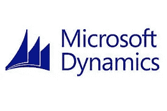
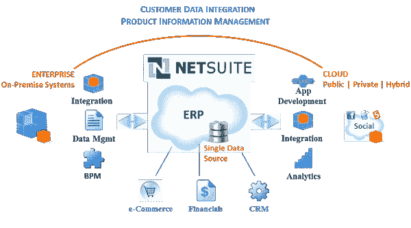

# 微软动力导航及其未来

> 原文：<https://medium.datadriveninvestor.com/microsoft-dynamics-nav-and-its-future-5c50c9dc6929?source=collection_archive---------10----------------------->

**MS Dynamics NAV 2018 的新功能**

您是否正在使用 Microsoft Dynamics NAV 2018 ERP 进行业务自动化和管理？最近，微软宣布 Dynamics NAV 2018 将是最后一个可用的版本，不再有进一步的升级。那么，MS Dynamics NAV 2018 未来的更新和路线图呢？作为迁移的一部分，微软推荐其最新的 MS Dynamics 365 云优先应用程序作为解决方案。您可能怀疑我们如何让内部部署和基于云的应用程序协同工作？

eweek.com

你认为迁移过程会更顺利吗？可能不会，以下是 Microsoft Dynamics NAV 升级面临的挑战:

*   升级将需要数百个小时，也很复杂。您需要使用在迁移过程中并不重要的每一点数据。
*   NAV 版本包含大量不再需要的自定义内容。
*   Dynamics NAV 365 的简单迁移会在测试或故障排除过程中产生问题。
*   Dynamics NAV 用户无法利用 MS Dynamics 365 中的智能功能，因为他们现有的定制很复杂。

Microsoft Dynamics 365 Business Central 是有效迁移的唯一解决方案吗？很可能不是，市场上有许多领先的 ERP 公司提供无缝集成和定制服务。NetSuite 是最好的云 ERP 系统提供商之一，在全球拥有 40，000 多家特权客户，并树立了新的业务增长基准。NetSuite 提供从中小型企业到大型企业的基于云的服务和全渠道商务软件。

**NetSuite ERP 的优势:MS Dynamics NAV 2018 Vs NetSuite ERP**

*   NetSuite 可以轻松集成和定制，以满足您的业务需求。
*   高水平的数据透明度
*   与您的企业一起成长。
*   直观的仪表板
*   准确的收益率识别
*   财务策划
*   经济上负担得起
*   增强的安全性
*   商业智能特性有助于做出明智的决策。

NetSuiteexpert.in

您是否正在寻找 Microsoft Dynamics NAV 的最佳替代方案？然后，NetSuite 云 ERP 解决方案将在升级、集成、安全性和定制方面为您提供竞争优势。许多行业专家预测，内部 ERP 解决方案将很快被无缝业务运营和可扩展性的云解决方案所取代**。**

Amzur 拥有从您现有的内部系统平稳迁移到 NetSuite Cloud ERP 所需的正确的技术和业务专业知识。我们是领先的 NetSuite 合作伙伴，拥有实施、迁移和培训方面的专业知识。

有关云 ERP 实施及其挑战的更多信息，请访问[**https://amzur.com/netsuite/**](https://amzur.com/netsuite/)