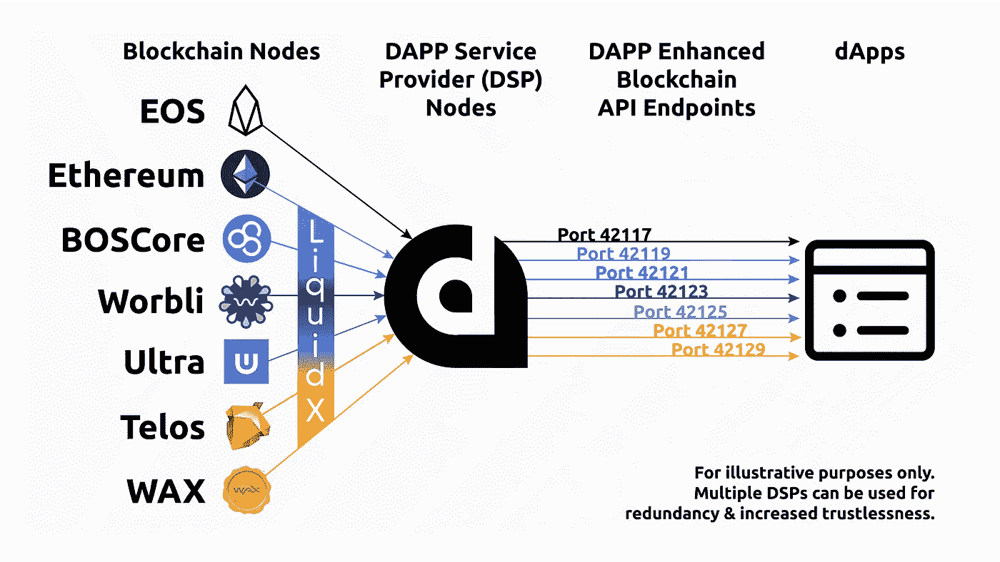
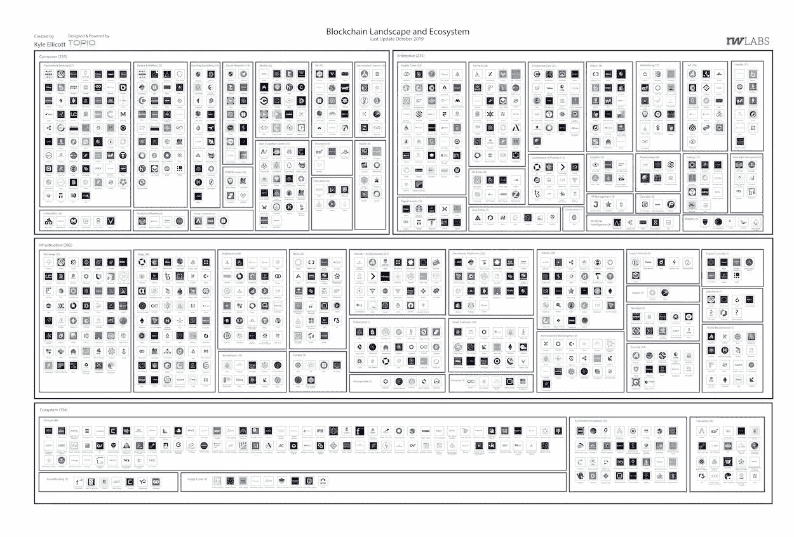

# 微软铸造企业级代币/可口可乐的大规模区块链扩张/中国的数字货币计划

> 原文：<https://medium.datadriveninvestor.com/microsoft-minting-enterprise-ready-tokens-coco-colas-mega-blockchain-expansion-china-s-6942b7e391dc?source=collection_archive---------10----------------------->

2019 年 11 月 6 日

既然我们已经正式开始疯狂奔向假期和年末，让我们开始每周更新吧！ ***微软*** *本周成为头条新闻，宣布推出 Azure 区块链令牌平台。* ***可口可乐*** *将其在区块链的业务从两家制造商扩大到 70 家，这些制造商每天向可口可乐商店运送 16 万瓶可乐。我们来看看****sales force****是如何在流程中使用区块链和 Hyperledger 的角色的。****IBM****计划在 2020 年春天首次亮相其伦理矿产采购区块链。本周我们还获得了额外的****Libra****新闻，以太坊 vs Fabric vs Corda 的技术分析，50 位全球金融科技领域的思想领袖和影响者，以及对* ***开放应用网络****【OAN】&以太坊营销 DAOs* 的介绍

*在 DApps 领域，我们有****liquid PPS****宣布推出 LiquidX，这是 DAPP 网络的一项强大的新功能。* ***三星*** *继续参与 DApps，ConsenSys 给了我们他们 2019 年 10 月的报告，我们对最强劲的 DApp 上升类别进行了细分。我们甚至在大量的研究(* [*Q3 2019 区块链格局*](https://www.topionetworks.com/events/5d79268b78e00230faba6f77) *) &书籍(关于* [*数字资产*](https://www.scribd.com/document/430637579/Current-Market-Overview-of-Digital-Assets)*[*企业区块链*](https://www.amazon.com/dp/B07Z3LJCHW/ref=cm_sw_r_tw_dp_U_x_C6iSDbACJJN2Z) *)以及对风险投资的见解(新基金！！)、基础设施、DApps、比特币、经济学、交易所和 Stablecoins。为了了解更多信息，让你跟上时代的步伐，这里有一张本周业内热门新闻的快照。**

* [## 帮助您实现财务目标的 21 款应用及更多...数据驱动的投资者

### 让我们点燃火焰。获取关于技术、金融、工作场所、生产力等方面的每日信息。跟我来…

www.datadriveninvestor.com](https://www.datadriveninvestor.com/2019/03/04/21-apps-to-help-you-reach-your-financial-goals-more/) 

## 📈[微软推出打造企业级加密令牌的平台](https://www.coindesk.com/microsoft-unveils-platform-for-minting-enterprise-ready-crypto-tokens)

微软宣布推出 [Azure 区块链令牌](https://azure.microsoft.com/en-us/services/blockchain-tokens/)平台。该平台允许企业从不断增加的令牌构建模板中进行选择，这些模板符合令牌分类倡议(tti)——由‌Microsoft…首席架构师 Marley‌ ‌Gray 领导的标准推动和企业联盟[阅读更多](https://www.coindesk.com/microsoft-unveils-platform-for-minting-enterprise-ready-crypto-tokens)

## 🇨🇳 [为什么中国的数字货币为美国敲响了警钟](https://fortune.com/2019/11/01/china-digital-currency-libra-wakeup-call-us/)

中国央行可能在未来 18 个月推出自己的数字货币，区块链得到了政府最高层的大力支持，这表明中国希望自力更生并具有全球竞争力，并为日益增长的美中科技竞争增添了另一个层面。… [阅读更多信息](https://fortune.com/2019/11/01/china-digital-currency-libra-wakeup-call-us/)

## 📖[可口可乐供应链公司将区块链推广到 70 家合作伙伴](https://www.coindesk.com/coca-cola-supply-chain-firm-to-expand-blockchain-effort-to-70-partners)

可口可乐瓶子制造供应链流程背后的 IT 公司似乎对区块链技术有了兴趣。可口可乐北美公司(CONA)表示，其与软件提供商 SAP 的试点项目现在将从两家制造商扩大到 70 家，这些制造商每天向可口可乐商店运送 160，000 瓶饮料……[阅读更多信息](https://www.coindesk.com/coca-cola-supply-chain-firm-to-expand-blockchain-effort-to-70-partners)

## 📈[sales force 如何使用区块链分散数据& Hyperledger 的角色](https://www.forbes.com/sites/justinoconnell/2019/11/01/how-salesforce-is-using-blockchain-to-decentralize-data--hyperledgers-role/#213d6f2a66a8)

Hyperledger 执行董事[布莱恩·贝伦多夫](https://www.linkedin.com/in/brianbehlendorf/)正在阐述美国云计算软件公司 Salesforce 如何在 Hyperledger 锯齿之上推出其区块链产品，以及它如何帮助改善他们的业务。他还提到，消除对数据集中化的担忧可以帮助 Salesforce 扩展到新的垂直领域。… [阅读更多](https://www.forbes.com/sites/justinoconnell/2019/11/01/how-salesforce-is-using-blockchain-to-decentralize-data--hyperledgers-role/#213d6f2a66a8)

## 📖[平台经济的意外后果](https://medium.com/theoan/the-unintended-consequences-of-platform-economies-b40f36f97db1)由[马修发言](https://medium.com/u/100864d3064f?source=post_page-----6942b7e391dc--------------------------------)

平台已经在每个初级产业中逆转了商业模式，并在利益相关者群体之间创造了复杂的双赢协调游戏，所有这些都有利于更多的后期使用。平台有许多形状和大小；然而，在绝大多数情况下，利益集团的出现是一致的，它们围绕一个问题或一系列挑战形成了一个更高的实体“生态系统”……[阅读更多信息](https://www.linkedin.com/pulse/libra-dead-long-live-ethan-pierse/?trackingId=bcMsHG98LnEadRE8P3dobQ%3D%3D)以及更多关于[开放应用网络的信息](https://medium.com/u/26219f78865e?source=post_page-----6942b7e391dc--------------------------------)

## 📖[新的区块链工具承诺在 30 秒内完成可验证的审计](https://www.coindesk.com/accounting-firms-blockchain-tool-claims-to-perform-a-30-second-audit)

Armanino 周三在区块链推出了一种新工具，承诺在几秒钟内完成公司发起的财务审计。这款名为 [TrustExplorer 2.0](https://www.armaninollp.com/about/press-releases/press-releases/armanino-launches--real-time-attestation/) 的产品是几款有望颠覆公司内部会计方式的产品之一……[阅读更多](https://www.coindesk.com/accounting-firms-blockchain-tool-claims-to-perform-a-30-second-audit)

## 🇨🇳 [中国引入基于区块链的城市识别系统](https://cointelegraph.com/news/china-introduces-blockchain-based-identification-system-for-cities)

中国继续升级其区块链游戏，在区块链独立开发了城市识别系统，作为其智慧城市基础设施的一部分。总部位于区块链的身份识别系统将为中国的智慧城市分配一个唯一的全球数字身份，旨在改善这些城市之间的连通性和数据共享……[了解更多](https://cointelegraph.com/news/china-introduces-blockchain-based-identification-system-for-cities)

> *👉立即注册领取 2019 年第三季度* [*区块链基础设施景观*](https://www.topionetworks.com/events/5d79268b78e00230faba6f77) *版*

## 📖[以太坊联合创始人表示，脸书不应推动 libra 加密货币项目](https://www.cnbc.com/2019/11/05/facebook-shouldnt-be-driving-libra-project-ethereum-co-founder-says.html)

区块链以太坊的联合创始人表示，脸书不应该成为天秤座加密货币项目的先锋。“我是像 Libra 这样的项目的忠实粉丝，”Joseph Lubin 周二告诉美国消费者新闻与商业频道的“Squawk Box”。“我不认为脸书应该推动这个项目，因为我们担心脸书的信任和个人身份。”… [阅读更多信息](https://www.cnbc.com/2019/11/05/facebook-shouldnt-be-driving-libra-project-ethereum-co-founder-says.html)

## 📖 [IBM 道德矿产采购区块链将于春季亮相](https://www.coindesk.com/ibm-ethical-mineral-sourcing-blockchain-to-debut-in-spring)

福特、大众汽车、LG 和沃尔沃计划明年在生产中的精炼过程中进行跟踪钴的试点项目。建立在 [Hyperledger Fabric](https://www.hyperledger.org/projects/fabric) 基础上的国际财团[Responsible Sourcing block chain Network(RSBN)](https://www.rcsglobal.com/blockchain-traceability/)周三宣布，它已经成功完成了一个[试点项目](https://www.coindesk.com/ford-lg-to-pilot-ibm-blockchain-in-fight-against-child-labor)，以防止剥削性的采矿行为。经过五个月的提炼，这些公司将 1.5 吨刚果钴运往三个不同的大陆，为该项目在 2020 年春天投入运营扫清了道路。… [阅读更多信息](https://www.coindesk.com/ibm-ethical-mineral-sourcing-blockchain-to-debut-in-spring)

## 📖[金融科技全球思想领袖和影响者 50 强(2019 年 11 月)](https://www.thinkers360.com/top-50-global-thought-leaders-and-influencers-on-fintech-november-2019/)

Source: [Thinkers360](https://www.thinkers360.com/top-50-global-thought-leaders-and-influencers-on-fintech-november-2019/)

# 本周的更多内容:

📖[企业区块链协议:以太坊 vs Fabric vs Corda 的技术分析](https://kaleido.io/a-technical-analysis-of-ethereum-vs-fabric-vs-corda/)及更多来自 [Kaleido](https://medium.com/u/209f16e6ac4a?source=post_page-----6942b7e391dc--------------------------------)

📖[介绍以太坊营销道](https://medium.com/marketingdao/introducing-the-ethereum-marketing-dao-89ce07229c3c)以及来自[营销道](https://medium.com/u/31459cf69106?source=post_page-----6942b7e391dc--------------------------------)的更多内容

📖[霍德林的回归与](https://blog.zerion.io/returns-of-holding-vs-defi-ing-c6f050e89c8e)[叶夫根尼·尤尔塔耶夫](https://medium.com/u/e89b7d654968?source=post_page-----6942b7e391dc--------------------------------)的犯规

📖[开放应用和解决平台经济的未来](https://readwrite.com/2019/11/05/open-applications-and-solving-the-future-of-platform-economics/)

📖[国会通过法律应对包括“分散加密货币”在内的威胁](https://www.forbes.com/sites/jasonbrett/2019/11/05/congress-passes-new-bsa-laws-due-to-threats-including-decentralized-cryptocurrencies/#42a86f986206)

💰[全球监管机构表示，包括脸书为首的 Libra 在内的稳定银行可能会受到证券规则的约束](https://www.theblockcrypto.com/linked/45838/stablecoins-including-facebook-led-libra-could-come-under-securities-rules-says-global-watchdog)

💰[戴稳币发行突破 1 亿“债务上限”](https://www.theblockcrypto.com/linked/46135/dai-stablecoin-outstanding-supply-hits-100m-debt-ceiling)

💰[土耳其致力于数字货币；试点项目预计于 2020 年底完成](https://www.theblockcrypto.com/linked/45865/turkey-working-on-digital-currency-pilots-expected-to-finish-by-2020-end)

💰 [Nervos Network 计划在 11 月推出 7200 万美元的代币销售](https://www.coindesk.com/nervos-network-targets-november-launch-with-72-million-token-sale)

🇨🇳 [专栏:在中国，这是区块链和暴政对比特币和自由](https://bitcoinmagazine.com/articles/op-ed-in-china-its-blockchain-and-tyranny-vs-bitcoin-and-freedom?fbclid=IwAR0dVVCqPAyzB26uQreeCls3goR05BWHxpYW_DWk8iu-6yKe8a629yqKrYo)

📖 [TRON、Stellar 加入 Mousebelt 的区块链教育联盟，培训学生开发者](https://www.coindesk.com/blockchain-education-alliance-to-train-next-developers)以及更多由 [MouseBelt Labs](https://medium.com/u/ea4623bd9f5e?source=post_page-----6942b7e391dc--------------------------------)

📖[最重要的区块链雇佣](https://medium.com/beyondhype/most-important-blockchain-hire-62a4a3b2098d)作者[杰克·斯托特](https://medium.com/u/f36a8363188f?source=post_page-----9a563b8f19c9----------------------)

💸[交易所正在开放金融](https://multicoin.capital/2019/10/29/exchanges-are-open-finance/)作者[凯尔·萨马尼](https://medium.com/u/2e8de4ec5cc0?source=post_page-----9a563b8f19c9----------------------)

📖[美国梦:通往财务自由之路](https://medium.com/@CelsiusNetwork/the-american-dream-the-road-to-financial-freedom-ded56e853c4d)作者[亚历克斯·马辛斯基](https://medium.com/u/5d291010601c?source=post_page-----9a563b8f19c9----------------------) & [摄氏度网](https://medium.com/u/c09fb7bc863a?source=post_page-----9a563b8f19c9----------------------)

📖[当前数字资产市场概述](https://www.scribd.com/document/430637579/Current-Market-Overview-of-Digital-Assets)作者 [David Nage](https://medium.com/u/b23d2fb9948a?source=post_page-----b48e000a0f21----------------------)* 

# *分散式应用程序手表*

## *📖 [LiquidX 为所有 EOSIO 链和 dApps 带来 DSP 服务](https://medium.com/the-liquidapps-blog/liquidx-brings-dsp-dapp-services-to-all-eosio-chains-ethereum-b992ab561a10)*

**

*Source: LiquidApps — LiquidX enables DAPP Service Providers to offer DAPP Network services on new blockchains.*

*[liquid PPS](https://medium.com/u/111b26bf40a9?source=post_page-----6942b7e391dc--------------------------------)宣布推出 LiquidX，这是 DAPP 网络的一项强大新功能，允许 DSP 在任何 EOSIO 链上提供服务。当该团队开始在 DAPP 网络上推出服务时，他们设想了在其他链上实现的基本开发人员服务的 DSP 市场… [阅读更多信息](https://medium.com/the-liquidapps-blog/liquidx-brings-dsp-dapp-services-to-all-eosio-chains-ethereum-b992ab561a10)*

## *📖[嘉手纳上线，宣布新的代币销售目标为 2000 万美元](https://www.coindesk.com/kadena-goes-live-announces-new-token-sale-aiming-for-20-million)*

*嘉手纳的正式名称为 Chainweb 的区块链工作证明(PoW)网络于周一在 mainnet 上上线。公司创始人希望再筹集 2000 万美元。目前，嘉手纳共有 10 个电力网络。这一数字可能会在未来通过系统范围的升级而增加……[阅读更多信息](https://www.forbes.com/sites/cognitiveworld/2019/10/24/ai-and-blockchain-double-the-hype-or-double-the-value/#105d6d125eb4)*

## *📖[三星 Galaxy S10 用户现在可以访问 Tron DApps](https://www.forbes.com/sites/lukefitzpatrick/2019/11/01/samsung-galaxy-s10-users-can-now-access-tron-dapps/)*

*据《福布斯》杂志报道，Tron 已经被集成在[三星的区块链密钥库](https://developer.samsung.com/blockchain/keystore)上，这是一个迄今为止只为以太坊资产和比特币保留的空间。三星的区块链密钥库(Blockchain Keystores)是一个安全的飞地，用于托管区块链的资产和应用程序，这些资产和应用程序首次大规模可用，可能会在数百万台移动设备上使用。Galaxy S10 的所有者现在可以通过三星设备访问 Tron 令牌和 Tron dapp……[了解更多](https://www.forbes.com/sites/lukefitzpatrick/2019/11/01/samsung-galaxy-s10-users-can-now-access-tron-dapps/)*

## *📖 [ConsenSys 月度总结—2019 年 10 月](https://media.consensys.net/consensys-monthly-report-september-2019-8ffaebb68fd2)*

*10 月，4000 多名开发人员、设计人员、研究人员和奖学金获得者齐聚日本大阪参加 Devcon5。ConsenSys 号召[一百万以太坊开发者](https://onemilliondevs.com/)。Gitcoin 发布了 [Gitcoin Quests —](https://gitcoin.co/blog/gitcoin-quests-is-now-live/) 一种丰富多彩的游戏化方式，可以了解 web3 生态系统，赚取奖励，并增强您的去中心化知识。 [7 个以太坊项目获得了 175，000 美元的 ConsenSys 资助](https://www.coindesk.com/7-ethereum-projects-are-getting-175000-in-grants-from-consensys)，第三波申请[现已开放](https://www.grants.consensys.net/)……[阅读更多信息](https://media.consensys.net/consensys-monthly-report-september-2019-8ffaebb68fd2)*

## *📖DApps 的变脸:哪些 DApp 类别是最强的？*

*大约有 3000 个 dApps 存在，主要分布在以太坊、EOS 和 TRON。区块链理工大学的粉丝们相信 dApp 可以挑战传统的网络应用——但是对于哪种 dApp 类别最有前途却鲜有共识。根据他们的[Dapp.com](http://dapp.com/)评估，DeFi 量正在上升，因为游戏应用程序似乎已经达到顶峰，而赌博应用程序也占据了重要地位……[阅读更多信息](https://coinfomania.com/opera-adds-trx-wallet-tron-dapps/)*

# *📺收听:*

*本周，我正在收听 [Nisa Amolis](https://twitter.com/AmoilsNisa) 的数字资产报告&，你也应该收听！*

*HEADLINES: Paxos, Digital Euros, China, and Tokenizing Real Estate*

> **👉下载最新* [*区块链用于基础设施景观*](https://www.topionetworks.com/events/5d79268b78e00230faba6f77) *Q3 2019 版**

**

*Q3 2019 Edition of the Blockchain for Infrastructure & Ecosystem Landscape*

*不想等到下周，[现在就订阅](http://click1.m.readwritelabs.com/xsdqkbbrgsdtqkmntpjlstcnkytvpvphsnhsqlvbrhhd_yfqbfcmslnskglmckvqv.html?source=post_page---------------------------)📥有关区块链、DApps 等的实时行业见解！*