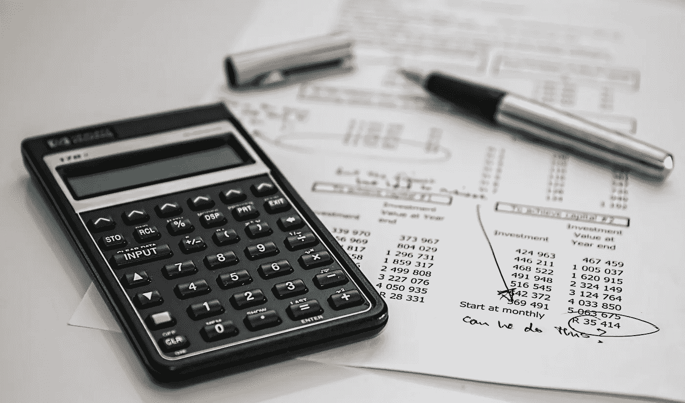
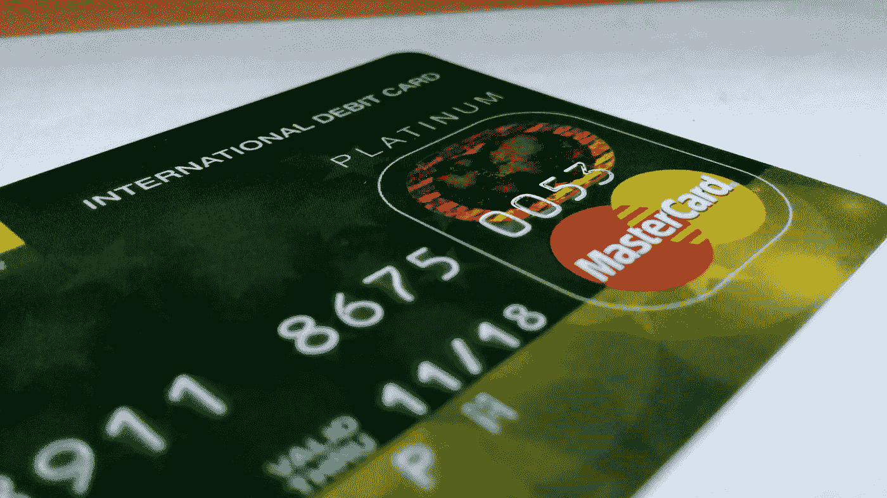
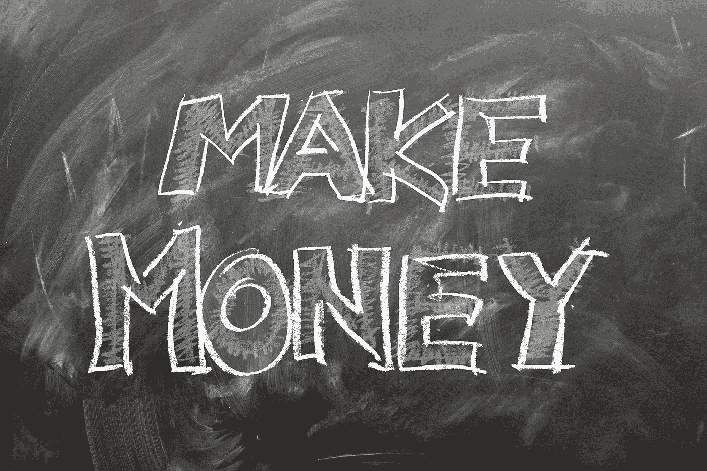

# 家庭如何为即将到来的经济衰退做准备

> 原文：<https://medium.datadriveninvestor.com/middle-class-families-really-need-to-plan-for-the-coming-recession-1ebaafc19d3b?source=collection_archive---------12----------------------->

是时候重新发现我们在上一次衰退中形成的应对机制了。2007 年和 2008 年的全球金融危机已经过去了十年，我们再次看到了一些相同的迹象。你可能已经读到了美国国债收益率曲线自上次衰退以来首次反转的消息。为什么这个深奥的短语很重要，它对办公室和工作中的普通人意味着什么？彭博在这里简单地解释了一下。令人担忧的答案是，在最近七次衰退之前，收益率曲线都出现了反转。我们可能不会立即进入衰退，但经济放缓和不确定性增加似乎很有可能。

这篇文章的重点是，我们现在可以做些什么来避免即将到来的经济放缓或衰退，以便在风暴来袭时做好准备。

**认真审视你的中长期财务承诺**

Make a list of your financial commitments

遭受经济衰退打击的最痛苦的部分之一是背负着不断重复的财务承诺，却没有能力偿还这些债务。像买房子或第二辆车这样的重大决定是基于对未来的乐观假设做出的。当我们处于繁荣的初始阶段或中期时，这些都是很好的假设，但当繁荣逐渐消退时就不是这样了。这是根据对未来的保守假设做出决定的时候了。不要推迟购买你已经存了钱并且几乎已经决定的房子，但是在考虑扩大你计划购买的房子或者比你最初打算的更加奢华的时候，一定要小心。同样，想想你有多需要那辆新车？

**开始偿还现有贷款&信用卡余额**

Get back in control of your credit cards

2017 年，美国信用卡债务总额首次突破 1 万亿美元。在许多其他国家，如果不是大多数国家，也可以看到同样趋势。家庭承担的支出越少越好。没有什么比信用卡上的高息未偿余额更令人痛苦。是的，花点时间想想你有多少张信用卡，以及所有信用卡的欠款。银行对信贷限额并不宽容，因为它们被对客户的感情所征服。如果不加注意，信用额度很快就会达到，数额很快就会变得太大而无法一次付清。当与必须支付的利息相比时，收集忠诚度积分和能够获得现金返还的满足感就相形见绌了，即使这样也不足以减少收取的本金。意识到需求和欲望之间的区别是一个艰难但有效的方法，可以在经济形势还不错的时候开始偿还债务。不得不做出选择，或者放弃我们想要的东西，这不是一种愉快的感觉，但也不是真正的痛苦。这种情况发生在你没有得到每月奖金的几个月里，当你收到信用卡账单的时候。

**转借记卡**

Debit cards are your friend, NOT credit cards

这也许是坚持每月财务纪律的最好方法。你只能花掉你所有的钱，看到银行存款余额随着每次购物而减少是坚持计划的好方法。当你需要现金的时候，你通过从信用卡中扣除费用而“赚取”的所有飞行里程都不会有任何帮助。没有人需要两张以上的信用卡。最好现在就把它们分割开来，而不是在经济不景气的时候被付款困住，而纠正错误的时机已经过去了。

**开发新的收入来源**

Monetize your hobby

我们中的大多数人都有一些爱好或才能，但这些爱好或才能从来不会给我们带来赞美。现在是将这些爱好货币化的时候了。从自己一直擅长的事情上赚钱，不是一朝一夕甚至一个月的事情。这个过程可能需要几个月的时间，但是你可以决定什么时候开始计时。当事情进展缓慢时，你会浪费时间和金钱。相反，一步一步地走出去，建立你的信誉和名声。想想你给自己的家人买的东西——蛋糕、家居装饰品、孩子房间的艺术品、孩子的珠算课。任何东西都有市场，机会是存在的。这只是你从未想过要做或付诸实践的事情之一，即使你有过这样的想法。那些每月额外的一千或两千美元可以创造一个不同的世界。入门也不是火箭科学。如果你想知道更多→ [决定要做什么后该做什么](https://medium.com/datadriveninvestor/what-to-do-after-youve-decided-what-you-want-to-do-701647bb779f)

**紧急工作**

Get ahead before everyone starts running

知道一些事情将要发生和积极地努力让自己避免最坏的情况或者甚至利用环境是非常不同的事情。工作中的每个人都认为这种“照常营业”的时代将会无限期持续下去。如果有一个时刻让事情进入高速运转，让自己更有价值，更引人注目，那就是这个时刻。在工作中多做事，多认识人，多帮助别人。这些似乎是非常基本的事情，可以在大多数公司的核心价值观中找到，但很少被作为行动点。在经济形势好的时候，过去几年确实很好，人们默认会做少于他们能力所及的事情。这不是懒惰，只是人性。只有当麻烦迫在眉睫时，大家才开始采取紧急行动。为什么要和你办公室的其他人同时开始比赛呢？现在*就这么做*，给自己一个好的开始。

问题是，这一切都没有坏处。这些行动将对你有好处，即使事情有所好转，完全无视所有迹象表明经济放缓即将到来。所以，不管接下来会发生什么，把自己放在一个有利的位置，继续保持控制。

衰退会对经历过衰退的人产生持久的影响。2008 年的全球金融危机如何改变了你，你今天会因此有什么不同？