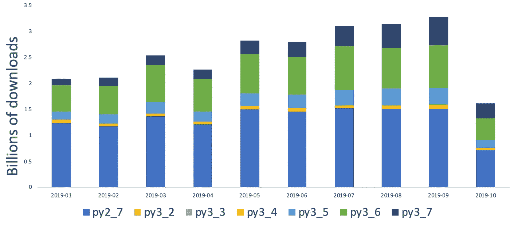

# 将 Python 2.x 迁移到 3.x

> 原文：<https://medium.datadriveninvestor.com/migrating-python-2-x-to-3-x-65cca44814e?source=collection_archive---------3----------------------->


Photo by [NeONBRAND](https://unsplash.com/@neonbrand?utm_source=medium&utm_medium=referral) on [Unsplash](https://unsplash.com?utm_source=medium&utm_medium=referral)

# 介绍

根据 Python 2.7 的倒计时，再过几天 Python 2.7 就要寿终正寝了。

我能够将一些使用 Python 2.x 的整体代码库和服务迁移到 Python 3.x。

Python 3.x 是 Python 社区的第一个向后不兼容的版本，这使得采用率非常低，截至 2019 年 9 月，PyPI 中 40%的包下载是在 Python2.x 中



source: [https://stackoverflow.blog/2019/11/14/why-is-the-migration-to-python-3-taking-so-long/](https://stackoverflow.blog/2019/11/14/why-is-the-migration-to-python-3-taking-so-long/)

现在是我们迁移到 Python 3.x 版本以充分利用 Python 的时候了，因为所有的新特性都只在 Python 3.x 中发布。

多年来，Python 社区开发了许多工具来支持从 Python 2 到 3 的平滑迁移。

我使用了社区提供的一些工具和材料从 Python 2.x 迁移到 Python 3.x，这让我的迁移体验比我想象的更顺利。

# 迁移策略

*   这项研究
*   准备迁移
*   迁移工具
*   迁移步骤

## 这项研究

因为这是向后不兼容的迁移，所以对迁移进行彻底的研究和制定策略总是好的。我从下面的材料开始，这些材料是我从社区和以前做过的人那里找到的，

*   [将 Python 2 代码移植到 Python 3](https://docs.python.org/3/howto/pyporting.html)
*   [支持 Python 3](http://python3porting.com/toc.html)
*   [Python 3 在脸书](https://lwn.net/Articles/758159/)
*   [丁辉郭美孜主题演讲 PyCon 2017](https://www.youtube.com/watch?v=66XoCk79kjM&feature=youtu.be)

## 迁移准备

*   具有良好的测试覆盖率
*   了解 Python 2 和 Python 3 之间的区别
*   检查 Python 3 对应用程序中使用的包的支持
*   尽可能使用可用的工具

## 迁移工具

没有这样的工具可以将整个代码库从 Python 2 转换到 Python 3，但是有一些工具可以简化迁移过程。

> **2to3**

[2to3](https://docs.python.org/2/library/2to3.html) 是一个读取 Python 2.x 源代码并应用一系列修复程序将其转换成有效的 Python 3.x 代码的程序。

2to3 将作为脚本与 Python 解释器一起安装。

2to3 包可以用来直接修改或显示文件中大部分 Python 2 兼容代码与 Python 3 兼容代码的区别。

**基本用法**

```
$ 2to3 example.py
```

上面的命令将在终端中显示与原始源文件的差异。

```
$ 2to3 -w example.py
```

该命令将把 Python 3 兼容的更改写入原始源文件，并将旧代码保存在一个备份文件中，扩展名为 ***example.py.bak***

这个模块用于 Python 代码的单向移植。如果需要同时支持 Python 2 和 Python 3，可以使用 [***Python 未来***](http://python-future.org/) 包。

> **未来**

[未来](http://python-future.org/)包允许你使用 Python 3.x 代码库以最小的开销同时支持 Python 2 和 Python 3。

future 是 2to3 包的一个包装器，用于将 Python 2 代码库转换为 Python 3，并在未来的导入中应用修复程序以支持 Python 2 和 Python 3。

**基本用法**

```
$ futurize example.py
```

上面的命令将在终端中显示与原始源文件的差异。

```
$ futurize -w example.py
```

该命令将把 Python 3 兼容的更改写入原始源文件，并将旧代码保存在扩展名为***example . py . bak***的备份文件中

除了添加必要的修复程序 future 之外，该模块还从 future 库中添加了如下所述的必要导入，以支持 Python 2 和 Python 3 版本。

```
**from** **__future__** **import** absolute_import, division, print_function
```

> 我能使用 Python 3 吗

[我可以使用 Python 3 吗](https://pypi.org/project/caniusepython3/)帮助找出不支持 Python 3 的第三方依赖包。

**基本用法**

从项目根目录输入下面的命令，模块将列出阻碍您迁移到 Python 3 的依赖项。

```
$ caniusepython3 -r requirements.txt
```

> **覆盖范围**

[覆盖率](https://coverage.readthedocs.io/en/coverage-5.0/)是一个测量 Python 程序代码覆盖率的工具。它监视你的程序，记录下代码的哪些部分已经被执行。然后，它分析源代码以识别本可以执行但没有执行的代码。

覆盖率可以和任何首选的测试库一起使用，比如 pytest、unittest 和 nosetest。

**基本用法**

```
$ coverage run -m pytest example.py
```

该命令生成一个包含测试数据的报告文件，可以使用下面的命令查看该文件

```
$ coverage report -m
```

或者使用下面的命令以交互式 HTML 格式查看覆盖报告

```
$ coverage html
```

> **蝗虫**

[Locust](https://locust.io/) 是一个负载测试 python 工具，用于使用 python 定义用户行为，并同时向应用程序发送多个请求。

Locust 可用于监控应用程序的性能。

**基本用法**

```
$ locust
```

在终端中输入上述命令，启动 locust 应用程序。

一旦你启动了蝗虫，在浏览器中打开下面的链接，并输入主机，用户数量模拟和孵化率。可以在浏览器中查看实时性能报告。

```
[http://127.0.0.1:8089/](http://127.0.0.1:8089/)
```

## 迁移步骤

*   检查 Python 2 是否有足够的覆盖率，以便继续进行迁移和更新，直到在迁移之前有足够的覆盖率。
*   在部署管道中实现 linter，比如 flake8，以帮助捕捉任何被推送到存储库的不兼容代码。
*   使用 **caniusepython3** 模块检查 Python 3 中是否支持所有的依赖项。
*   如上所述，使用 ***未来*** 模块将 Python 2 代码更改为 Python 3 代码。这不会转换整个基本代码，因此剩余的代码应该手动转换。
*   使应用程序运行时不会因代码更改而出现任何错误。
*   运行测试套件，检查应用程序中的所有功能是否都按预期运行。
*   应该进行端到端的质量保证。
*   使用 Locust 工具进行性能测试，并检查在迁移过程中是否出现了任何瓶颈。

## 最后的想法

Python 3 引入了更多激动人心的特性和改进，将增强应用程序的性能。

迁移到 Python 3 减少了内存占用和 CPU 利用率，并提高了响应时间。

使用诸如 [mypy](http://mypy-lang.org/) 之类的工具实现静态类型检查，以最少的调试找到 bug。

使用基于 Python 3 的习惯用法和特性，并逐步改进代码库。