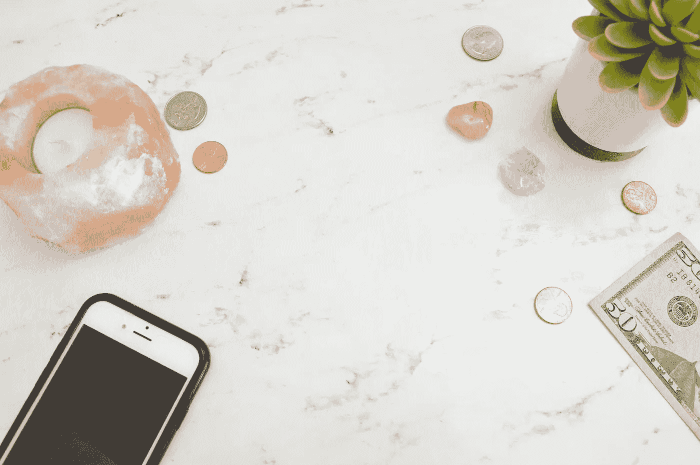

# 千禧年的钱:我个人理财之旅的开始

> 原文：<https://medium.datadriveninvestor.com/millennial-money-the-beginning-of-my-personal-finance-journey-e481edddbe2?source=collection_archive---------3----------------------->

我在大学时，在 SFSU 咨询部做活动协调员，时薪 10.35 美元，由一个古怪的日本人管理和指导我，他可以就个人理财谈上几个小时。如果你让他在周五下午 4 点的办公时间快结束时说话，你可能会让他带着激情和兴奋大喊大叫，向我抛出冗长的金融术语，告诉我我应该拥有一个积极进取、多元化的投资组合。同时给自己倒了一天中的第五杯咖啡。

*复利！富达，罗斯个人退休帐户，401K，投资帐户！读富爸爸穷爸爸！你还年轻，应该尽可能多存钱。*

我会盯着他，朝他点点头，然后我会试着溜出门去，然后和我的朋友一起去斯通斯顿购物中心，在那里我会买一大杯星巴克拿铁和其他快速时尚的东西，这些东西后来会堆满我的衣柜。我后来会后悔在年纪较大的时候反复购买这些东西，并理解为什么我的老板一直向我宣扬这些东西。

在大学生涯的剩余三年里，我一直在这个部门工作，这真正塑造了我思考和了解金钱的方式。个人理财从来没有人教过我；我的父母没有时间教我这个概念，我们在学校也没有学到任何东西。但是我知道我的父母生活节俭，理由很充分。来到美国后，基本上一无所有，我的父母通过两年的全职工作在德克萨斯州获得了他的硕士学位，而我的母亲则照顾我和我的妹妹。我的婴儿床是一辆购物车，我们的夏天不是在水上公园度过的，而是在一个阳光明媚的日子里在停车场用水管度过的。衣服来自救世军，我们得到了拉雷多邻居的支持和帮助。我们生活简单，但很快乐。

我第一次知道兼职工作的价值，是以每辆 5 美元的价格清洗我们的家用汽车。我是一个年轻的骗子，确保每一条水线都消失了，因为我的父亲用军人的精确眼光检查每一个表面。其他的例子包括当我父亲是房地产经纪人的时候，帮助他设置开放日的标志。当他还梦想着让我和妹妹成为职业网球运动员时，他也会在我们练习网球时能碰到的每一个球筒上贴上 1 美元的价格标签。这并不容易，但我每次练习都会打出 500 个网球，希望能得到额外的现金。钱从来没有真正交到过我手里，除了我打到中学的时候，我爸长了软的一面；当我和朋友去购物中心或看电影时，他会给我 20 美元。

我的个人职业生涯对我管理和处理财务的方式产生了很大的影响；我可以把我的成功归功于努力工作和不怕换工作。获得大幅加薪比在一家新公司获得更高的薪水要困难得多。

*这是我职业生涯的越轨工资。* * *为了保护我的身份，有些事情我不会透露。**

酸奶店收银台——8.00 美元

OBC 出版社——每小时 10.25 美元

SFSU 咨询部——每小时 10.55 美元

大二暑期实习——300 美元/3 个月

Tripit，公关实习——每小时 28.66 美元

Booking.com——每小时 24 美元

谷歌(合同)——每小时 28.66 美元

X 公司(合同)——每小时 30 美元

当前公司——85000 美元

当前公司——六个无花果

那么，是什么改变了我的个人选择，让我开始专注于制定财务目标，它是如何对我变得重要的？在我在 Booking.com 的第一份真实工作中，我一直在随机向 401(k)计划缴款，并试图在我的大通储蓄账户中存钱。我曾经投资中国的初创公司和交易所交易基金。那时我所有的账户上大约有 6000 美元，但我是一个缓慢的储蓄者，因为我过着一张张支票的生活。

在大 25 之后，我更深入地了解了金融。我做了很多关于从哪里开始的研究，但是有一个特殊的奇怪现象激发了我存钱的动机。蔡斯往我的储蓄账户里存了几分钱，而我毫不知情。我很快意识到是 0.01%的 APY 给了我回报；我大吃一惊。我查找了更好的储蓄率，在那里我找到了 SoFi，然后最终与 Wealthfront 达成了高达 2.57%的 APY。(费率可能会有所不同。)在我的进一步研究中，我偶然发现了这个叫做 FIRE 的社区——财务独立提前退休。这让我大开眼界，我觉得我找到了一个令人难以置信的支持团体，他们欢迎各种类型的学习者。

我要说的是，我不会竭尽全力去节省每一分钱。我会从地上捡起一便士，但我不会为了更快到达火场而放弃我的部分生活方式。例如，我会预订一张去巴哈马的机票，并找到聪明的方法来支付某些部分，比如用工作中的积分来支付我的机票或酒店费用。

目前，我将薪水的 18%存入 401(k)计划，并尽可能将 100-300 美元存入我的罗斯个人退休帐户。我不再把所有的钱都存在大通银行，而是以 2.57%的 APY 利率存在他们的现金账户里，同时投资于他们。我也把钱存入不同的桶里，因为我的投资账户是 Wealthfront 或 Fidelity。大约存了 3.3 万美元，如果可能的话，我希望到今年年底能存 7.5 万美元。最初我想达到 100，000 美元，但随着一些额外成本的增加，这似乎不太可能。

通过这一系列的文章，我将透明而详细地介绍我如何管理我的个人理财，以及我用来增加财富的技巧和诀窍。

干杯，E