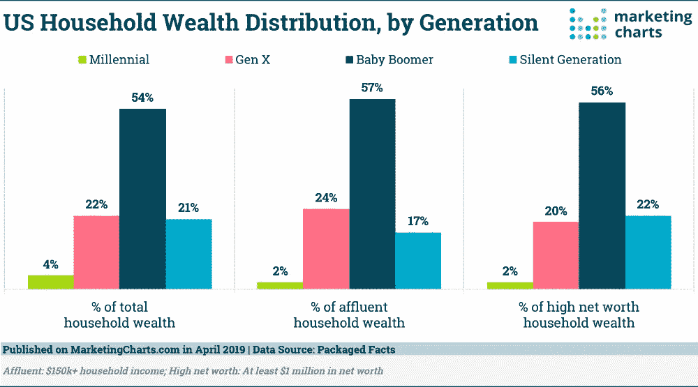
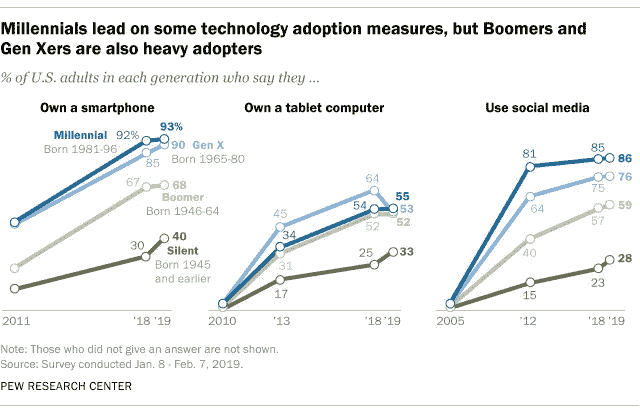

# 千禧一代正在将金融服务公司拖向未来，但婴儿潮一代和 X 世代目前控制着更多财富

> 原文：<https://medium.datadriveninvestor.com/millennials-are-dragging-financial-service-firms-into-the-future-but-boomers-gen-x-currently-59ba55b435cd?source=collection_archive---------1----------------------->

## 金融服务公司要想在未来几年保持成功，就必须实施高科技、高接触度的多代战略

Future of Wealth Management Photo by [Austin Distel](https://unsplash.com/@austindistel?utm_source=unsplash&utm_medium=referral&utm_content=creditCopyText) on [Unsplash](https://unsplash.com/s/photos/wealth?utm_source=unsplash&utm_medium=referral&utm_content=creditCopyText)

毫无疑问，金融业的面貌正在改变。从我们与机构的互动方式，到我们期望的服务水平，再到我们愿意支付的费用，财富管理领域正面临颠覆。千禧一代，即亚马逊的黄金一代，是驱动因素，但那些“好吧，婴儿潮一代”和 x 世代控制着更多的财富，寿命也更长。

**千禧一代和财富大转移**

我们听到大量关于千禧一代和即将到来的*巨大财富转移*的传言，他们将继承数万亿美元。千禧一代在推动数字化采用方面发挥了重要作用，他们是第一代完全数字化的本土一代，零售营销人员正在加倍关注他们。由 Kelton Research 进行的 RetailMeNot 年的一项研究发现，接受调查的零售商报告说，针对年轻一代的预算有所增加。大约三分之二的受访者表示，他们正在增加针对 Z 世代(65%)和千禧一代(68%)的营销支出。

 [## 分散金融的出现|数据驱动的投资者

### 当前的全球金融体系为拥有资源、知识和财富的人创造了巨大的财富

www.datadriveninvestor.com](https://www.datadriveninvestor.com/2019/03/14/the-emergence-of-decentralized-finance/) 

根据 Coldwell Banker 的一份新报告，美国有 618，000 名千禧一代百万富翁，预计未来 30 年婴儿潮一代将继承 68 万亿美元。到 2030 年，千禧一代将比现在富裕五倍。

对于希望留住和吸引千禧一代的企业来说，这意味着更多的应用和自动化服务可以简化流程，节省时间，减少面对面的时间和电话。

Financial Services for Millennials Photo by [Austin Distel](https://unsplash.com/@austindistel?utm_source=unsplash&utm_medium=referral&utm_content=creditCopyText) on [Unsplash](https://unsplash.com/s/photos/wealthy?utm_source=unsplash&utm_medium=referral&utm_content=creditCopyText)

**婴儿潮一代和 X 世代控制更多财富**

然而，Packaged Facts 的一份新报告称，婴儿潮一代控制了超过一半(54%)的美国家庭财富，其次是 X 一代，占 22%。将营销策略仅仅聚焦于千禧一代可能是短视的。根据美国人口普查局的数据，到 2029 年，估计仍将有 6100 万婴儿潮一代，价值约 26 万亿美元，到 2030 年，x 世代将持有约 22 万亿美元。

U.S. Household Wealth by Generation — Marketingcharts.com April 2019 Data Source: Packaged Facts

好消息是，研究发现这几代人比我们想象的更相似。尽管千禧一代是技术采用的明显催化剂，但有充分的证据表明，老一代人也在接受它。

***是的，那个还好的婴儿潮也可能是数字通。***

根据 [Pew Research，2019](https://www.pewresearch.org/fact-tank/2019/09/09/us-generations-technology-use/) 的数据，自 2012 年以来，老一代人对技术的采用有了大幅增长，特别是 x 世代和婴儿潮一代。该报告发现，超过十分之九的千禧一代(2019 年年龄在 23 岁至 38 岁之间的人中有 93%)拥有智能手机，而 x 世代(今年年龄在 39 岁至 54 岁之间的人)的比例为 90%，婴儿潮一代(年龄在 55 岁至 73 岁之间)的比例为 68%，沉默一代(74 岁至 91 岁)的比例为 40%。

U.S. Technology Adoption By Generations — PEW Research Center

三分之一的客户计划在未来三年内更换财富管理提供商。公司需要现在就采取行动来留住和吸引客户。— EY 2019 全球财富研究报告

无论是哪一代，客户都希望透明、灵活、无缝沟通、数字接入和教育，由于新兴技术的出现，在各个方面提供这些服务并不困难也不复杂。财富管理公司可以实施多代战略，同时解决不断上升的管理和合规成本。

**数字金库——为未来的财务顾问赋能**

技术淹没了我们的生活，据说是为了简化它。然而，随着每个新应用的出现，生活似乎变得越来越复杂。对于依赖于安全、大量纸质流程的企业来说，围绕这些操作进行协作和沟通的能力非常重要。大多数商业文件程序都不安全或不严密。我们的许多个人信息存在于电子邮件、文件柜、各种电脑和硬盘中。到处都是。

数据保护研究公司 [Ponemon Institute 和 Shred-It](https://www.shredit.com/en-us/about-us/press-room/press-releases/shred-it-study-finds-seemingly-innocent-workplace-mistakes-put-north-american-businesses-at-risk-for) 最近的一项调查发现，68%的受访公司报告了一年内机密文档的数据泄露。这些数据泄露大多涉及纸质文档或电子设备的丢失。

[Buy the latest marketing book by Audrey Nesbitt](https://www.smashwords.com/books/view/1025113)

将我们所有的基本信息都放在一个安全的地方的需求正在推动数字保险库革命。数字金库是一个基于云计算的文档管理系统(DMS ),对于财富管理和其他行业的未来来说，是一个非常有价值的工具。企业在过渡到无纸化办公、不断上升的管理和合规成本以及对端到端数字工作流解决方案不断增长的需求方面所面临的挑战，都可以通过实施数字保险库平台来解决。除了财政和运营方面的改善，数字金库还能帮助品牌迎合当前和未来客户的思维空间。

像 FutureVault、BOX 和 Egnyte 这样的公司是数字金库开发公司，它们为财富管理公司提供独特的文档协作平台，为主动企业提供成为客户生活中的数字中心的机会。一种超越客户、家庭成员和其他外部可信赖的顾问的品牌意识，仅仅凭借其纯粹的效用。金融服务提供商为其客户增加这一额外价值的机会正在推动一个行业，预计到 2023 年复合年增长率(CAGR)将达到 13.6%。

> 在最近于拉斯维加斯举行的 Money 2020 会议上，汇丰银行(HSBC)美国创新主管、多次获奖的作者杰里米巴尔金(Jeremy Balkin)表示:“就像银行传统上是人们金融资产的保护者一样。“谁能说 21 世纪的银行不会成为人们个人数据资产的保护者或保险库呢？我认为那不是不可能的。"

采用正确的解决方案可以消除对实施新技术的异议。数字保险库是技术手段。用户友好的界面确保即使是最不了解技术的人，不管有没有代沟，都可以从数字保险库解决方案中受益。价值链中的每个人都受益于围绕重要信息进行安全协作的中心点，无论是财务顾问、值得信赖的专业人士、教育工作者还是家庭成员。

**机器人顾问——朋友还是敌人？**

技术的快速发展正在重塑金融顾问和客户互动和决策的方式。Robo Advisors 是利用人工智能和机器学习的计算机程序，以低成本提供投资建议和投资组合管理，几乎没有人工干预。随着这些计算机程序变得越来越好，人们担心有一天它们会完全取代人类顾问。

机器人非常适合自动化投资服务，能够以低成本自动买卖资产和重新平衡投资组合。人类顾问非常擅长帮助客户根据生活环境而不是算法来诊断金融挑战和机遇。利用 Robo Advisors 进行投资组合管理，可以解放财务顾问，让他们参与客户寻求的高接触点互动。

目前还很难说 Robo Advisors 对这家财富管理公司的真正影响，但许多人认为他们将是“朋友”而不是“敌人”——这是未来几年保持竞争力的一个宝贵工具。

Hybrid Financial Advisor — Robo Advisor Photo by [h heyerlein](https://unsplash.com/@heyerlein?utm_source=unsplash&utm_medium=referral&utm_content=creditCopyText) on [Unsplash](https://unsplash.com/s/photos/robot?utm_source=unsplash&utm_medium=referral&utm_content=creditCopyText)

**混合型财务顾问**

根据[安永 2019 年全球财富管理报告](https://assets.ey.com/content/dam/ey-sites/ey-com/en_gl/topics/wealth-and-asset-management/wealth-asset-management-pdfs/ey-global-wealth-management-research-report-2019.pdf)，42%的受访客户希望与他们的顾问进行面对面的互动。尽管这些客户希望在信息、KYC 和交易确认方面实现数字化，但他们仍然希望在重大生活变化和整体财务规划方面获得人性化的财务建议。

随着公司利用机器人顾问服务进行投资组合管理和后台自动化，技术革命或“颠覆”将会到来，这使得财务顾问能够专注于客户-顾问关系。

**面向千禧一代投资者的机构级加密货币工具**

千禧一代正在扰乱替代投资类别，如房地产基金和其他非传统投资如加密货币。

全球通信营销公司 [Edelman](https://www.edelman.com/sites/g/files/aatuss191/files/2018-10/Millennials-With-Money-2018.pdf) 最近的一项研究发现，25%的富裕千禧一代(24 至 38 岁)使用或持有密码。拥有至少 50，000 美元的可投资资产或 100，000 美元的个人或共同收入)。

美国千禧一代更喜欢加密货币，这是他们对 x 一代的长期投资的 3 倍。[2019 年 7 月的一项 Bankrate 调查](https://www.bankrate.com/investing/financial-security-july-2019/)发现，9%的千禧一代选择加密作为他们的首选长期投资选项。社交交易和多资产经纪公司 [eToro](https://www.etoro.com/blog/from-etoro/etoro-survey-finds-millennials-are-leading-the-shift-from-stocks-to-crypto/) 在 2019 年进行的另一项研究发现，千禧一代正在引领向加密货币投资的转变。

● 43%的千禧一代网上交易者表示，相比股市，他们更相信加密技术

● 71%的千禧一代会投资传统金融机构

提供的加密技术●半数网上投资者表示对他们 401k(养老金)计划中的加密分配感兴趣

Cryptocurrency Investing — Bitcoin Photo by [Clifford Photography](https://unsplash.com/@cliffordgatewood?utm_source=unsplash&utm_medium=referral&utm_content=creditCopyText) on [Unsplash](https://unsplash.com/s/photos/crypto?utm_source=unsplash&utm_medium=referral&utm_content=creditCopyText)

有一点是明确的，为了满足当前财富持有者的期望，同时吸引或留住千禧一代，财富管理提供商必须灵活，并拥有随着市场条件变化而快速调整的营销和 IT 资源。

奥黛丽·奈斯比特

[奥黛丽·奈斯比特在 Linkedin 上](https://www.linkedin.com/in/audrey-nesbitt-mba-pmp-0388a52a/)

[@ audreynesbit 11 在推特上](https://twitter.com/AudreyNesbitt11)