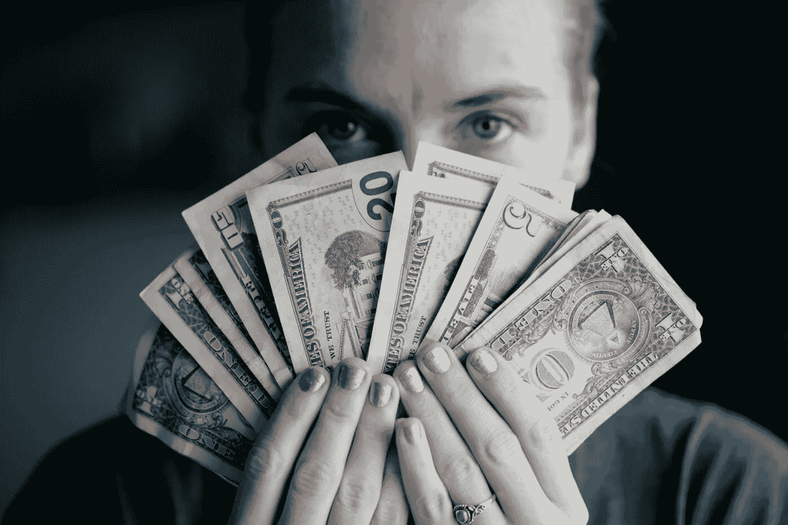

# 千禧一代省钱指南

> 原文：<https://medium.datadriveninvestor.com/millennials-guide-to-saving-money-d73aec39307d?source=collection_archive---------14----------------------->

也许你还在上学，花了几千美元在你的教育上，或者也许你决定参加工作，并发现独自生活是昂贵的，你发现你是靠薪水生活的。

你并不孤单。数百万美国人靠薪水过活。不要再浪费时间了，现在是你应该把省钱放在首位的时候了。

不知道从哪里或者怎么开始存钱？

我没有足够的钱来增加我的存款或 401(k)计划。

从哪里开始？如果你觉得有帮助的话，你可以使用很多个人理财软件。YNAB，薄荷。它们都可以显示你把钱花在了哪里，但是费用必须正确分类，这样你才能看到你把钱花在了哪里。

根据国家退休保障研究所的一项调查，20 至 32 岁的千禧一代中有 65%没有为退休或应急基金储蓄。

资金管理、预算、费用跟踪和在经济独立周期开始时进行投资。请记住，加入金融大潮永远不会太晚，你也不能太早开始。

因此，以下是你开始财务自由之旅需要采取的步骤。

1.预算基础知识:每周五，你登录你的账户，看看你会带多少钱回家。但是知道你花了多少钱也同样重要。Mint 和 YNAB 是两个帮助你做预算的流行应用。你的预算应该列出你的净收入，然后扣除你的支出，包括固定支出和可调支出。固定支出的一个例子是你的房租或手机账单。每月数量相同的东西。你的可调整支出是像花钱、食物等东西..这些项目每个月都会发生变化。你总是想在你的可调整支出的高端做计划，这样万一你有一个糟糕的月份，你是安全的。

2.**记录你的支出**:记下或记录你几个月来的每一笔支出。

。这是最难也是最容易看到你每天/每月花费多少的方法。如果你是守旧派，你可以从写下你所有的固定和可变开支开始。你会希望每天都这样做。例如，你在午餐上花了 10 美元，那么你应该把它写下来。如果你是高科技。或者像更现代的方式，你可以使用像 Mint 或 YNAB 这样的应用程序。这些应用程序会尝试根据位置对你在哪里花钱进行分类。它知道一家餐馆的名字，并把它放在食物下面。这些应用程序相当准确，但并非没有缺陷，所以准备花一点时间重新分类一些费用。

3.**管理你的债务**

根据 ValuePenguin 的数据，超过 4400 万千禧一代背负着超过 3.3 万美元的沉重债务，其中大部分来自金融机构的学生贷款。事实上，大多数千禧一代正在推迟像成家和买房这样的“人生里程碑”，因为他们的巨额债务碍事，而一些人被迫搬回家和父母一起住，只是为了不负债。然而，摆脱债务并不是一件容易的事，因为大多数人大学毕业后的收入并没有预期的高。

像 Debt payment Planner 这样的智能手机应用程序可以帮助减轻你的负担，鸟瞰你欠了多少钱，以及合理的逐步方法和技术，以更快地摆脱债务。该应用程序可以跟踪你的债务支付情况，并给你一个财务自由的时间框架。这意味着你可以通过一个真正的游戏计划来跟踪你的进展，并对你的资金状况感觉更好。这个应用程序最好的部分是它是完全免费的。

4.**专心存钱**

。这是最重要也是最难做到的事情之一，因为大多数人不喜欢生活中没有更好的东西。我们生活在一个即时满足压倒延迟满足的时代。千禧一代更喜欢现在拥有东西，而不是为未来储蓄。

有了这种心态，省钱的最好方法就是永远看不到。大多数银行都有办法把钱从一个账户转到另一个账户。这样，当你查看你有多少钱可以使用时，你会看到已经扣除了你的存款。你看不到的，就不会错过。从不会影响你每月开销的少量开始，每隔几个月增加一次。如果你不能每隔几个月增加一次，至少在你获得年薪增长时增加你的储蓄。

5.**现在开始投资**

在当今的环境下，投资是必要的。在通货膨胀率约为 2.5%的情况下，定期存款或储蓄账户不足以跟上经济的增长。此外，如果你足够早地开始投资，复利将在未来几年让你的储蓄增长 10 倍以上。既然你已经设法存了一些钱，也许是时候投资并获得一些个人资本了。如果你对投资几乎一无所知，罗宾汉是个不错的起点。这个智能手机应用程序让任何人都可以免费进入股市。虽然这对新手来说很好，但你的投资选择有限。因此，如果你真的在寻找最好的长期选择，你可能会想看看更好的选择，如富达或 ETrade。

多年来，购买和交易股票只属于富人和知情人士。你必须雇用一名股票经纪人，他必须代表你为任何购买和交易提供便利，同时还要从中分一杯羹作为佣金。

然而，有许多选择，提供了一个完全免费或低成本的方式进入和获得 24/7 的股票市场游戏，零费用和佣金。

6.**建立您的信用评分**

你知道 18 至 29 岁的成年人中只有 33%至少有一张信用卡吗？根据这项调查，大约三分之二的千禧一代没有信用卡，他们对在学生贷款债务之外增加更多债务的提议感到害羞。

如果你害怕越陷越深，但你想建立信用，你必须获得信用卡，使你的信用评分飙升。一旦您注册并获得批准，下载 Credit Karma 应用程序来帮助您管理您的信用。这是一个免费的应用程序，让您可以访问您的信用评分和信用报告，同时它也可以提供信用监控。

Credit Karma 还可以为您提供如何提高分数的信息，包括哪些因素导致了好分数和坏分数，以及什么样的产品和服务可以帮助您获得非凡的信用。

Credit Karma 适用于 iOS 和 Android。

遵循所有这些或遵循其中的几个。不管怎样，你正在增加你的储蓄。不要低估其中任何一个的力量，因为它们对你的财务健康的成功都是至关重要的。