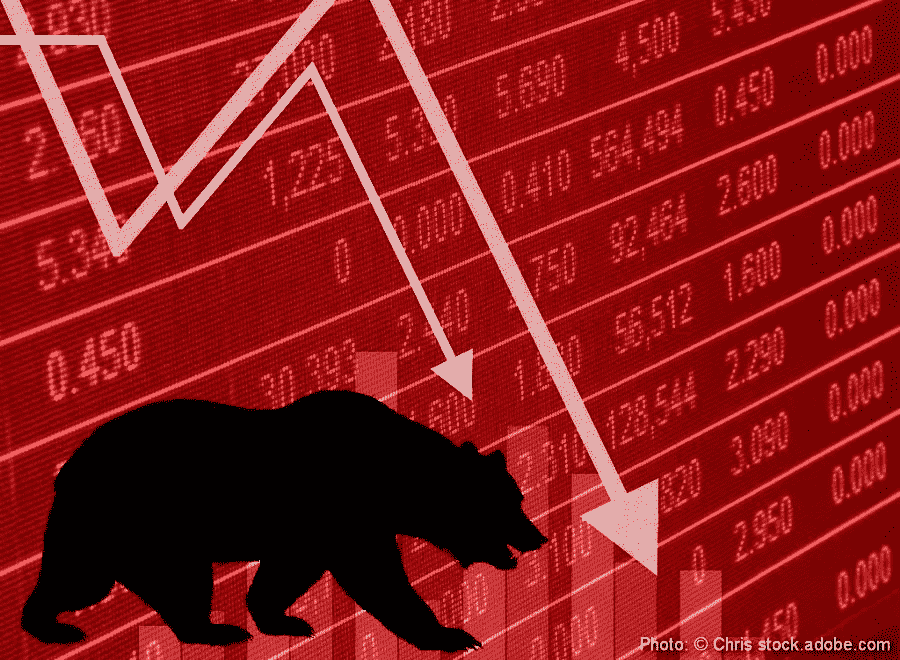

# 千禧一代注意到:熊市有他们的好处

> 原文：<https://medium.datadriveninvestor.com/millennials-take-note-bear-markets-have-their-benefits-4160613797d3?source=collection_archive---------1----------------------->

Photo: © Chris stock.adobe.com

*> >市场低迷时期加密投资者应考虑的 6 个策略*

在过去的几个月里，我们目睹了加密货币价格飙升至月球，然后暴跌回地球。自 2018 年初以来，由于不确定性和之前的高速增长期，市场已经失去了 60%以上的价值。这种长时间的下降趋势就是通常所说的熊市。熊市通常是指投资价格下跌 20%或更多的时候。加密货币目前仍处于熊市，尽管在过去几周我们已经看到了一些复苏的迹象。然而，这不是第一次也不是最后一次冲击这种新资产类别的熊市，所有投资者都应该做好充分准备。

***千禧一代在加密熊市中承受最大负担***

人们发现，这一熊市尤其会影响千禧一代，因为[估计显示](https://www.independent.co.uk/news/business/news/bitcoin-latest-news-millennials-cryptocurrency-investment-2018-london-block-exchange-a8108106.html)到今年年底，三分之一的千禧一代将拥有某种形式的加密货币。对于许多千禧一代来说，这是他们面临的第一个低迷市场。这种波动将导致许多人恐慌性抛售，彻底离开市场。但熊市绝不是丧钟。尽管最近价格大幅下跌，但仅凭情绪销售是你最不想做的事情。有了正确的策略，千禧一代可以直面熊市，并仍然处于领先地位。在这篇文章中，我们将介绍一些应对熊市的策略——但是有许多不同的方法可以采用，所以你可以选择最适合你的投资目标和需求的方法。

1.保持冷静，做你的作业

作为过去十年金融挑战的一部分，千禧一代在接近职业生涯中期时，在新的投资市场面临障碍。尽管在数量上超过了前几代人，但千禧一代的薪水和就业水平较低。难怪千禧一代更有可能把钱投入加密货币，而不是“缓慢而稳定”的养老基金。当我们将最近加密货币价值的下降与年轻且经验不足的投资者结合起来时，熊市产生负面影响的可能性很大。

当市场正在经历下跌趋势时，抑制你的情绪会对你有利。在股票市场，平均熊市持续大约 15 个月。在这 15 个月内，保持冷静并有计划的投资者能够生存下来，而没有计划的投资者要么遭受重大损失，要么彻底退出市场。尽量保持冷静客观，一定要做好功课。从长远考虑，你认为这项资产在未来 5 年内会升值吗？不要低估技术分析的力量——如果你对保证金交易这样的策略感兴趣，一定要做研究，更深入地了解如何做和为什么做。

*> >记住:自我教育会帮助你避免恐慌性抛售。对自己感兴趣的资产做一些研究，制定一个投资计划。*

*为了支持技巧 1，这里有一些重要的术语和指标:*

*   贝塔系数是衡量你的投资组合相对于市场其他部分的风险或波动性的指标。你可以用一种叫做[回归分析](https://www.investopedia.com/exam-guide/cfa-level-1/quantitative-methods/regression-analysis.asp)的方法来计算贝塔。这对于评估资产的交易趋势很有用。
*   另一个有用的指标是[夏普比率](https://www.investopedia.com/terms/s/sharperatio.asp)，它指的是每单位总风险中超出无风险利率的平均回报率。夏普比率帮助投资者定义风险和回报之间的关系，今天被广泛使用。[标准夏普比率方程式](https://www.investopedia.com/ask/answers/010815/how-do-you-calculate-sharpe-ratio-excel.asp)如下:

***夏普比率=(平均投资组合收益率——无风险率)/投资组合收益率标准差***

*   然后是[均线](https://www.investopedia.com/terms/m/movingaverage.asp)。移动平均线是指通过跟踪价格波动来跟踪和识别趋势。该指标广泛用于技术分析，有助于从随机价格波动中去除不必要的信息或干扰。使用的移动平均线有两种类型:简单移动平均线(SMA)和指数移动平均线(EMA)。简单移动平均线是一种证券在一定时间周期内的平均值，而指数移动平均线则更重视近期价格。

*> >记住:指标和技术分析会帮助你建立投资事实。在制定投资计划时利用它们。*

2.多样性的优势

对任何市场来说，尤其是在低迷时期，一个重要的策略就是分散投资。在 Harry Markowitz 的论文 [*投资组合选择*](https://www.math.ust.hk/~maykwok/courses/ma362/07F/markowitz_JF.pdf) 中，他描述了他的“现代投资组合理论”，该理论指出，厌恶风险的投资者可以根据可接受的风险量，以最大化预期回报的方式建立他们的投资组合。这篇论文指出，更高的回报自然伴随着一定程度的风险。通过接受这种风险，你可以建立一个投资组合，通过将股票和债券等更传统的投资与加密相结合来分散投资，降低贝塔系数，增加回报。在[*Crypto Assets:The Innovative investors ' s Guide to bit coin and Beyond*](https://www.amazon.com/Cryptoassets-Innovative-Investors-Bitcoin-Beyond/dp/1260026671)*一书中，作者克里斯·伯恩斯克和杰克·塔塔尔描述了 2008 年熊市中存在的三种投资者:*

*   *激进投资者的投资组合通常分为 90%的多元化股票和 10%的固定收益*
*   *温和的投资者将他们的投资组合分为 70%的多样化股票和 30%的固定收益*
*   *保守的投资者分成 50%的多元化股票和 50%的固定收益*

*以保守的投资前景分散投资组合有助于在整体下跌趋势中保持稳定，并让你做好“长线投资”的准备。多样化不仅仅包括你投资组合中的资产类型，还包括你持有这些资产的时间:将你的投资分散到短期和长期产出中。另一种策略叫做[【刷单】](https://www.investopedia.com/articles/trading/05/scalping.asp)，指的是从微小的价格波动中获利。如果你有时间定期交易，并且想要更激进的方法，这可能是熊市期间尝试的好方法。*

**> >记住:将股票等更传统的投资与加密结合起来，降低你的贝塔系数，使你的投资组合多样化，以最大化你的预期回报。**

*3.最小化你的债务*

*你的熊市“生存发展”计划的下一步与杠杆和债务有关。问题在于，在充满挑战的经济时期，债务可能会成为沉重的负担。对千禧一代来说尤其如此，因为研究显示，三分之二的人至少有一种长期债务来源，通常分为学生贷款、汽车贷款或住房抵押贷款。这个群体中有 30%的人有超过一个来源的债务。对于试图度过熊市的千禧一代来说，消除并避免增加任何新债务至关重要。*

**> >记住:避免负债有助于你在动荡时期坚持你的投资计划。**

*4.重新平衡你的投资组合*

*重新平衡你的投资组合可能是帮助减少损失的更合适的方法。重新平衡你的投资组合指的是卖出一些表现良好的，买入一些最近贬值的，目的是让它慢慢增长(回到短期和长期多样化)。这通常包括转向更安全的避风港，比如上调你持有的债券比例，或者通过一种交易所交易基金(ETF)做空股票，这种基金将从股价下跌中获利。加密做空策略也是可能的，但是，这种方法应该留给有经验的交易者，因为可能会发生重大损失。*

*记住:重新平衡你的投资组合的一个重要部分是建立你的现金储备，并根据重要性排列你的非投资资本需求。*

*5.购买，但要明智地购买*

*在熊市中，一个人的垃圾可能是另一个人的财富。在许多代币持有者开始冲动抛售的时候，一个对机会有敏锐眼光的投资者可能会受益匪浅。[恐慌性抛售代币、股票和债券](https://www.financialexpress.com/money/how-to-handle-panic-selling-in-stock-markets-what-investors-can-do-to-save-themselves/902473/)为投资者提供了以较低成本购买资产的独特机会，以期在未来升值。这里的重要性是能够区分正在出售的并且在熊市结束后将继续贬值的代币或资产，以及那些折价出售但很有可能升值的代币或资产。便宜并不总是有价值的。熟悉市场，寻找价值——寻找你真正长期信任的公司，拥有强大的团队和优秀的产品创意。他们可能会回来。当市场反弹时，在这里找到平衡可能是成功的关键。*

**> >切记:寻找买入机会。尝试寻找那些由于熊市而成本较低，但从中长期来看会升值的资产。**

*6.如果其他方法都失败了，就装死*

*一些更积极参与的策略可能会让缺乏经验的投资者望而生畏。“[装死](https://www.investopedia.com/slide-show/survive-bear-market-financial-crisis/)是持有所有资产不交易的方法。另一种方法是在一家加密公司找份工作，其中许多公司支付加密货币，当市场转向时，这可能对你非常有利。*

*波动是投资的一个自然组成部分，我们必须记住，熊市虽然可怕，但也是暂时的。在 1973 年的熊市中，道琼斯指数下跌了 48%。20 世纪 90 年代的互联网泡沫在 21 世纪初破裂，纳斯达克指数下跌了 78%，花了几年时间才回升。应对秘密熊市的千禧一代不必担心之前熊市中的损失，只要他们做好了适当的准备，并以冷静和耐心的态度对待投资。通过选择这里讨论的一种(或多种)策略，你就有可能在别人失败的时候获利。在熊市期间，通过有效地分散投资、最小化债务和重新平衡投资组合，这可能是在下一轮牛市中回报更强劲的机会。*

*无论你选择哪种策略，都要把熊市的波动视为一个机会。毕竟，正如超级投资家和商业巨头沃伦·巴菲特曾经说过的:*

*“如果你希望在一生中继续购买股票，你应该欢迎价格下跌，因为这是一种更便宜地将股票加入投资组合的方式。”*

**免责声明:虚拟货币不是法定货币，不受政府支持，账户和余额不受消费者保护。本新闻稿仅供参考，并非财务建议。未来的利润并不意味着或保证，过去的表现并不保证未来的结果。该信息不构成投资建议或投资要约。Caviar tokens 目前和将来都不会在 SEC 注册，也不会提供或出售给美国和开曼群岛的个人和实体。**