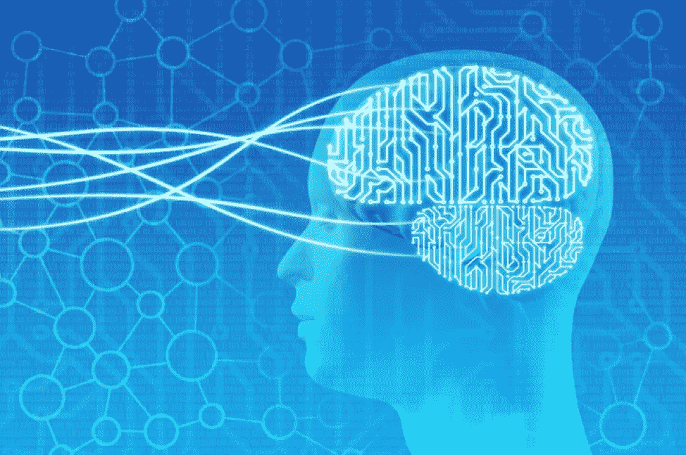
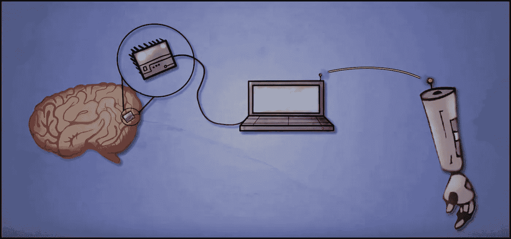

# 头脑与机器:导论

> 原文：<https://medium.datadriveninvestor.com/mind-and-machine-an-intro-16b46056a97c?source=collection_archive---------5----------------------->

## 脑机接口

## 想象一下将量子力学的基础知识直接下载到你的大脑中。

今天早上，你可能被闹钟吵醒了。你起床开始梳洗打扮。上班前，你会查看手机上的天气预报和电视上的新闻。现在，想象被一个警报程序在内部自动唤醒。脑海中有一个声音告诉你“今天的最高温度将达到 20 摄氏度”，以及最新的本地/世界新闻。了解工作进展，和同事交流你的想法。

这不是科幻小说。很快，我们将能够使用脑机接口做所有这些事情，甚至更多。

# 什么是脑机接口？

**脑机接口(BCIs)** 简单来说，就是**从大脑**接收信息并**将信息发送给计算机的设备。计算机可以利用这些数据做一系列事情，比如绘制脑电波图或控制假肢。**

# 但是我们怎样才能把你的大脑和电脑连接起来呢？

## 非侵入性方法:

**脑电图(EEG)** ，这是从大脑收集数据的最便捷的方式。脑电图就像戴在用户头上的帽子一样，可以检测大脑活动。

**磁共振成像(MRI)** ，产生一个改变质子排列的磁场。当能量场关闭时，它们重新排列，并在这样做时释放能量。我们可以检测到这种能量，并将其转化为数据

## 侵入性方法:

**神经尘**，这是一种微小的可植入芯片，你可以把它放在体内。它可以记录来自大脑神经元的电信号。

由埃隆·马斯克的公司 Neuralink 制造并获得专利的神经网，是一种超薄的网状物，由一组电极组成，可以从大脑中收集数据

# 为什么要使用脑机接口？

BCIs 可以做很多事情。我们可以控制假肢和机械。见鬼，你可以花 30 美元在亚马逊上买一个玩具，然后控制你的汽车！

但是我们不一定要控制机器。我们也可以扩充我们的大脑。

有了它们，我们可以控制大脑的每一部分。我们可以**在脑海中创造一个虚拟现实**。通过增强记忆，你可以在考试的关键部分回忆起那个等式。

还有更多一般的使用案例:

*   我们将能够**从我们的大脑上传信息到互联网。**
*   我们将能够从互联网上下载信息。
*   我们可以**分享记忆**并且字面上**开源我们的生活和经历。**

你看过《黑客帝国》里尼奥钻进机器下载功夫的场景吗？是的，你能做到的！

但是也有不利的一面。我相信你们都听过这句话。互联网让我们可以接触到一切。但它也给了我们接触一切的机会。”

# 所涉及的风险

如今，黑客可以侵入任何发射信号或连接其他设备的东西。您的**手机、笔记本电脑、电脑、电视、智能手表等。都可以被黑。**

现在，记住这一点，想象将你的大脑连接到互联网。我想强调这一点，因为我们必须非常谨慎地做出决定和采取行动。

以前，他们窃取银行账户和凭证，但是有了互联网，他们就可以窃取你的信息！他们可以把你从未有过的记忆植入你的大脑；他们可以删除记忆。想象一下，你被绑架了，绑架你的人把你从所有认识你的人中抹去了。

你看过电影《超人前传 2》吗？在那部电影中，对抗者使用催眠来精神控制任何看着显示催眠视频的屏幕的人。

坦率地说，现实生活中可能发生的事情要可怕得多。他们可以真的执行精神控制，而你甚至不会知道。

这对人类来说是一个重大的决定。这项技术**可以是天堂，也可以是地狱。**

# 我们将何去何从？

就像我说的，这将是人类的一个重大决定。如果你愿意，我们将真正成为一体，一个人类互联网，一个超级人类。BCIs 可以预示人类的进步或崩溃。我们将不得不制定新的法律、基础设施和技术来支持和保护 BCIs。坦率地说，我完全支持像假肢这样的 BCI，但我还不能百分之百确定我想成为一个超人。由于这项**技术还处于起步阶段，我们还不能真正决定是否进行到底。**

# **外卖:**

*   脑机接口从大脑获取信号，并将其转换成计算机数据。
*   获取数据有非侵入性和侵入性两种方式。
*   脑机接口可以控制机器，但我们也可以增强我们的思维。
*   我们可以从大脑上传和下载信息。
*   BCI 有优点也有缺点。

我希望我已经让你明白了什么是 BCI，它的好处和风险。感谢阅读！

*如果你喜欢读这篇文章，或者有任何建议或问题，请鼓掌或评论，让我知道。你可以在*[***LinkedIn***](https://www.linkedin.com/in/ronit-taleti-7558b4193/)*上找到我的最新工作和更新。*