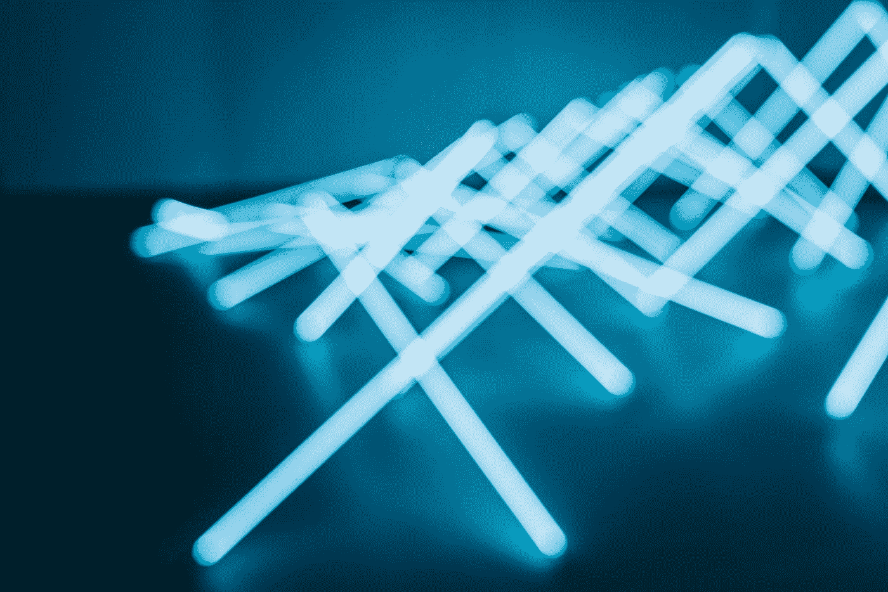

# 思维折叠[多层次思维]

> 原文：<https://medium.datadriveninvestor.com/mindfolding-multi-level-thinking-39981a232a18?source=collection_archive---------2----------------------->

## 不仅仅是一个吸引人的标题

Photo by [Victor Lam](https://unsplash.com/@vuitor?utm_source=medium&utm_medium=referral) on [Unsplash](https://unsplash.com?utm_source=medium&utm_medium=referral)

> “悖论”只是现实和你对现实“应该”是什么的感觉之间的冲突——理查德·费曼

不要担心——这篇文章不一定是关于量子物理学的。

量子物理学的一项新研究最近发现，在量子层面上可能存在两种不同版本的现实。在小到可以避免遵守物理定律的尺度上，量子力学的世界用每一个新的发现让科学家们眼花缭乱。

简而言之，这项研究发现，两个不同的实验可以促使所述实验的各自观察者同时得出相同的结论，指出两个观察都是正确的和可证明的。

 [## 准备在 2019 年改变世界的技术-数据驱动的投资者

### 很难想象一项技术会像去年的区块链一样受到如此多的关注，但是……

www.datadriveninvestor.com](https://www.datadriveninvestor.com/2019/01/17/the-technologies-poised-to-change-the-world-in-2019/) 

对于这篇文章的上下文来说，这个发现的真正意义在这里并不重要，为什么和如何也不重要。这里重要的是设定一个背景，一个要求认识到每件事情都有多个层面的背景，包括我们自己对现实的理解和我们头脑的现实，这些层面的存在远远超出了我们自己的理解。

> “量子世界的领域是如此令人惊讶地奇怪，甚至让外星人绑架的故事听起来完全合理”― **吉姆·艾尔·哈利利**

我不会说人类是简单的生物，他们更喜欢以一维的方式看待现实，或者我们更喜欢相信可以理解、划分和分类的简单事物。虽然我们中的许多人都懒得去探索更深层次的问题，去问我们的现实是如何构建的，或者我们的思想如何对我们有利或不利，但我们大多数人都花时间去思考我们是如何思考的，去思考自我实现和热切的改善。

以这种方式，量子物理学戏弄我们，因为它永远打破了我们理解的范式；我们不顾一切地坚持的原则在量子水平上消失了，最终让我们困惑但受到鼓舞，也许困惑甚至愤怒。任何研究自己大脑运作的人也可能是这种情况。

> “通往光明的旅程始于一支蜡烛。一旦点燃，黑暗就一去不复返了。”― **阿德里亚诺·布拉**

很长一段时间以来，我一直被我们拥有的颅骨潜力所迷惑。十多年前，我经历了一次迷幻之旅，在那次旅行中，我能解释的最好的描述是，我的头骨中有三个大脑同时工作，这点燃了我的好奇心，让我想得更深，学得更多，想得更努力。从那以后，这火焰越来越亮。

在大学里，我在我的选修课要求中寻找答案——心理学有助于对一些事情进行分类，但没有多大作用；东方哲学做得很好，但让我不满意，而西方哲学只不过是一个令人满意的扫兴的东西。直到毕业后很久，我才开始进入吠陀冥想和更深层次的佛教教义，量子物理学和深奥的形而上学思维范式转换。这些开始最终打破作为理解我们面前的世界的通用模板而灌输给我们的认知的束缚。

> “认识你自己是智慧的开始。”——苏格拉底

书籍和讲座、课程和哲学都很好，但它们不会真正击中要害，除非你带着对现实(和思想)如何真正运作的完全未解的感知去接近它们。当意识到地球只是星云海洋中的一粒尘埃，非洲的溶解盐滋养了亚马逊雨林的盆地，时间的本质是多么主观，或者多重现实显然可以在量子水平上存在时，头脑会闪烁。至于我们如何能够获得这种未解开的感知——幸运和不幸的是，这取决于每个人自己。然而，与此同时，分享经验，交流理解，引发更多的形而上学思考，一次一个句子，这并没有坏处。

也就是说，我们发现自己处于这篇文章的核心:我对多层次思考的体验。

头脑——尽管它有无限的能力，却很少被充分利用。我们从反复出现的老生常谈中了解到这一点，这些老生常谈不断提醒我们，在任何给定的时间，我们只使用了大脑的某个百分比。千真万确，我们可以达到提升的 [**意识状态**](https://theascent.pub/fathoms-of-consciousness-9261c9d52f65) 和 [**自我意识**](https://medium.com/@mmworonko/self-actualization-awareness%C2%B2-2897b71d6a1b) (我已经写了令人生厌的*和 *infintum* )。*

*但是就思考而言，我们能提升我们思考得更快或更有效的潜力吗？同时在许多层面上思考？我注意到，在某种程度上，我们当然可以追求更快的决策技能和更高的有效判断状态，但这不一定是比赛中的奖品。*

*对我自己来说，这可能是一种主观体验，从客观应用的角度来看，这种体验完全失败了。我已经意识到，同步分析可以达到令人难以置信的程度，这一切都与三个概念有关，这三个概念似乎交织在高级思维工作的每个方面——意识、意图和个人体验。*

> *“当一个人真正渴望某样东西时，整个宇宙都会协力帮助这个人实现他的梦想。”— **保罗·柯艾略***

*经过几个月的自我认知、追求自我实现和拥抱自我发现，我已经意识到一种新的思维方式的形成，这种思维方式适用于我的生活和我解释现实的方式。这种新的思维方式不仅让我能够用一种以前无法理解的理解模式来处理问题，而且令人惊讶的是，它并没有取代我旧的思维方式。*

*实际上，就好像我有两个大脑在不停地工作。平常的头脑，在表面上作出反应，运用其常规的分析模式和思维处理的倾向，会做它必须做的事情。但是，好像一个微妙的、辅助的头脑已经开始出现并占据中心舞台，评估第一头脑的行动，在影响深远的背景下吸收信息，从许多完全不同的角度看待事物。*

*这种潜在的意识可以计算出表面意识永远不会或者甚至可能会计算出的东西:通过手边的问题编织出的因果关系原则，一个命题背后不可告人的动机，也许成本和收益分析濒临即时性的边缘。*

*举一两个例子。在工作中咨询我的上司或提出新的想法——我不仅会传达我通常会传达的信息，而且我会充分意识到我传达信息的方式，观察他们的反应，思考如何在我已经发表的演讲的基础上更进一步，即兴发挥和说服比我想象的更好。当骑山地车时，我不再将大脑中的所有精力放在反应时间和绕过岩石或树根上——我还会同时分析我的悬挂系统的紧密响应性，我的后刹车片的摩擦减少，与秋天霜冻相比，我在春天泥泞中到达某一部分所需的时间，等等。*

*在很大程度上，我们在不知情的情况下做到了这一点——例如，事情已经成为我们的第二天性。但是当我们意识到这一点，并且意识到这一点的时候，事情会变得更加有效和迅速。*

*我不想把自己描绘成《无限》中的布莱德利·库珀或某种露西——这一点也不美妙。但是，在现实生活中，有点像。当你意识到你的思维有了如此显著的提高，变得如此不可思议地增强，这在很大程度上是由于有意识的努力——这是一种巨大的实现。*

*尝试并透露这是如何做到的并不是一件容易的事，尽管我会把它归因于意识、意图和个人经验。*

*这种意识需要一段时间来建立——就我个人而言，我觉得这需要像冥想和自省、自我实现和精神提升这样的实践，深入挖掘潜意识的深处。这不是一夜之间可以完成的事情——至少对我来说是这样。*

*然后，是意图。这并不完全是可以假装的——它代表了一种真正的渴望，想要获得更好的思想和自我意识。意图是动力——它驱动一致性和目的，引导我们走向我们所寻求的结果。*

*最后，我觉得有必要提一下，个人经历是至关重要的。在某种意义上，它结合了上述两种需要。一个人可以研究形而上学、哲学和心理学几十年，但仍然拥有与一个人完全不同的思维方式，比如说，一个人从未读过关于这些主题的一页文献，但发誓保持沉默十年。我们每个人都有自己的自我发现和实现的方法，认为我们可以从书本、教程或静修中获得这些方法是相当错误的。灵感必须是纯粹的——不懈地致力于揭示自己心灵的秘密，激发变化的戏剧性生活事件，提升自己心灵的无污染动机。*

> *“你可以自由创造自己的范式，而不是简单地接受别人给你的范式。”
> ― **拉塞尔·埃里克·多巴***

*这绝不是什么新信息。随着时间的推移，它被无休止地呈现、改造、重述和重申。从柏拉图和亚里士多德到卡尔·荣格和西格蒙德·弗洛伊德——似乎有这种永恒的努力来传达思想的真正力量，这种努力，只要被置若罔闻，就不会得到回报，直到它在那些因无法解决的谜而看到心灵现实的人的头脑中实现，那些已经完全根除了他们传统的思维方法并打破了关于心灵如何工作的传统范式的人的头脑中实现。*

*可以这样想:每当你和我在面对一个难以下咽的概念时说“啊，我明白了”的时候，可能是我们没有完全明白。这太容易被愚弄了，无数次，以为我们真正理解荣格的无意识理论，或者薛定谔想唤起他的猫，或者老子试图向我们揭示的关于道教的秘密。当然，从表面上看，我们可能认为我们完全理解了这些事情，但是我们也完全有可能在几年后带着更深刻和更丰富的理解重新审视它们。*

*我不想描绘一幅有两种思维在这里发挥作用的画面——事实上，这只是好像我已经升级了我最初的思维方式，以包括一个更加全面和全景的范围。虽然我很欣赏这里可能有一些读者已经找到了交织更多思维模式的方法，但这种能力的真正本质无法用语言来概括。*

*[**继续阅读:心流状态——超能力**](https://medium.com/datadriveninvestor/flow-state-the-super-mind-5265932ba900)*

**

*A Thought Experiment Into the River of Our Intent*