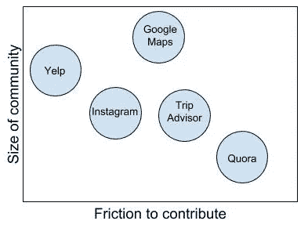
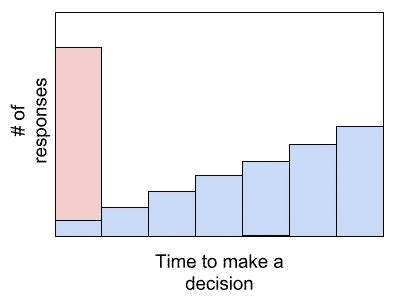

# 通过机器学习最小化决策疲劳@猫途鹰

> 原文：<https://medium.datadriveninvestor.com/minimizing-decision-fatigue-through-machine-learning-tripadvisor-37bc2fbcf26e?source=collection_archive---------17----------------------->

每天，我们做出大约 35，000 个决定。[1]不可否认，技术已经并将继续在使我们的生活更加便利方面发挥巨大作用。然而，互联网提供的信息过载和丰富的选择只会加剧决策疲劳的流行。研究表明，我们的认知资源是稀缺的，我们往往会因决策而感到枯竭。[2]机器学习(ML)正在帮助限制信息过载对众包评审平台的影响，使它们成为更好的决策辅助工具。机器学习的大趋势是将*评论*平台转变为*推荐*平台，因为用户希望技术更具决定性。猫途鹰就是这样一个点评平台，它已经成为旅行者决定旅行中要做什么的有用工具。

目前，猫途鹰正致力于超个性化排名和优化评论的有用性。通过限制用户为做出决定而必须解密的信息量，猫途鹰正在向成为一个推荐平台迈进。

Diagram 1: A visualization of where competitor platforms stand on the size of user base vs. friction for users to contribute

为了帮助框定 ML 如何塑造猫途鹰的产品方向，理解推荐平台当前的局限性是很重要的。根据图表 1:

1.  用户可以依靠一个大的社区来获得建议
2.  摩擦让用户贡献自己的意见。

机器学习可以解决这些问题，因为它可以减少平台对大量用户基础的依赖，这些用户基础被激励来提供评论。他们所需要的只是足够数量的用户贡献作为“训练数据”。然而，完全依赖人工智能而没有额外的用户贡献，将需要用户偏好的*稳态*。这时，模型的学习模式不是面向未来的，并且“过拟合”现象开始出现。[6]

**个性化排名**

除了目前的排名算法，在产品的不同部分还有一系列围绕个性化推荐的发布。例如，猫途鹰的电子邮件摘要包括一系列算法化的建议。

**回顾有用性**

猫途鹰有太多的评论，人类版主无法排列显示哪些评论。针对这一点，他们建立了一个分类器，对评论的内容是否可能对其他旅行者有帮助进行评分。然而，目前的性能仅足以过滤评论，以路由到版主，但“即使在其最佳精度，它有太多的误报，以自动拒绝任何评论。”分类器仍然不能在没有人工干预的情况下运行。[5]

从长远来看，有迹象表明，猫途鹰正在开发更具预测性的工具。例如，对于评论有用性，“考虑用户的评论写作历史；如果他们过去写过有帮助的评论，也许我们会在边缘评论上给他们更多的怀疑。”[5].猫途鹰感受到了变得更加直接的压力。因此，大趋势的真正力量将通过猫途鹰的更广泛的愿景来实现，即能够考虑用户的偏好以及各种用户生成的评论，为用户提供最适合他们和场合的明确建议。

Diagram 2: The # of responses and time dichotomy

根据用户生成的评论的加权平均值(例如，根据评论者的可信度进行加权)来训练分类器以提供一个推荐有很大的局限性。

反思我们如何在现实中寻求建议，我们一次与一个人接触并寻求他们的建议。通过每一次一对一的互动，我们可以获得额外的“数据点”，帮助我们做出合理的决定。我们有时也会对一大群人进行民意调查，以判断大多数人对某个话题的看法。尽管需要更长的时间，我会假设一串 1:1 的交互在考虑上下文时更有效。这种二分法如图 2 所示。

在猫途鹰的洗钱活动中，后一种情况成立，主要关注的是预测模型中仅包含有限的信息量。对于他们的产品团队来说，猫途鹰利用 hivemind 并对反馈进行平均以实时计算出建议的问题是一个重要的考虑因素。

总的来说，重要的是要记住，个性化推荐是“对人们偏好的预测，即使它们不会告诉你人们为什么喜欢他们做的事情，或者如何改变他们喜欢的东西，它们也是有帮助的。”[6]这就提出了一个问题:用户对机器生成的推荐的期望是什么？

此外，还有决策标准化的问题。社会理解的标准化结果将满足对具体决策的要求——例如，我应该去哪家餐馆——因此将个人选择平坦化为社会一致性，这提出了一个问题，即通过机器学习最小化决策疲劳是否是以牺牲个人代理为代价的？

[1]萨哈基安，B. J 新泽西州 labuzetta(2013 年)。决策如何出错，以及智能药物的伦理。伦敦:牛津大学出版社。

[2]鲁迪格等人(2013 年)。自我控制耗尽后的努力减少:认知资源在使用简单试探法中的作用。认知心理学杂志。

[3]波尔曼，e .，&沃什，K. D. (2016 年)。决策疲劳、替他人选择和自我意识。社会心理学和人格科学，7(5)，471–478 页。

[4] Amis，G. (2015)猫途鹰的哪些评论实际上是有帮助的？工程和产品运营猫途鹰博客。[http://engineering . tripadvisor . com/哪些 tripadvisor 点评实际上是有用的/](http://engineering.tripadvisor.com/which-of-tripadvisors-reviews-are-actually-helpful/)

[5]约曼斯，M. (2015 年)。每个管理者都应该知道的机器学习。哈佛商业评论。

[6]湖。Stitch Fix 的首席执行官向大众市场销售个人风格。*哈佛商业评论* 96 期，第 3 期(2018 年 5 月/6 月):35–40。

【rctom.hbs.org】最初发表于**。**