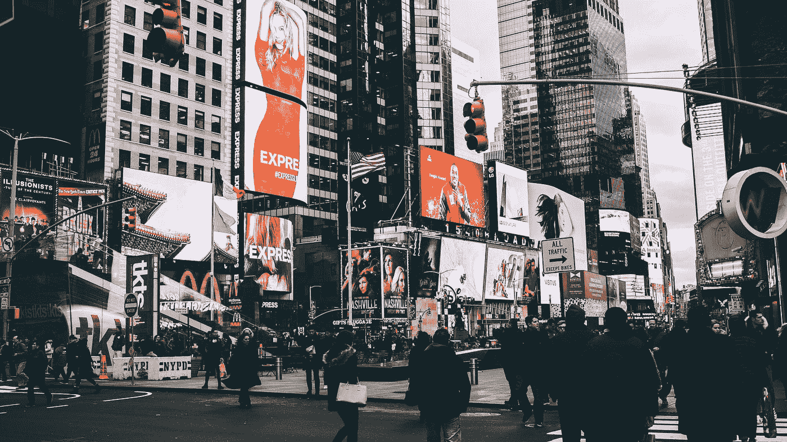
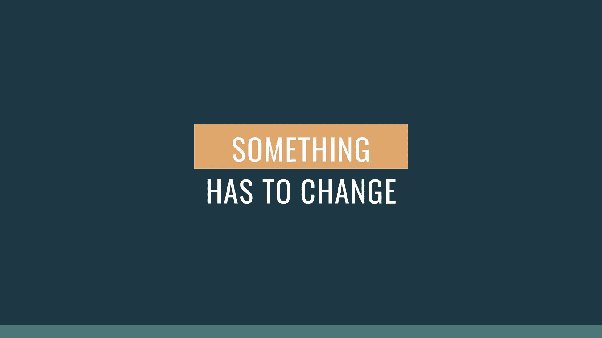

# 最小化简约主义

> 原文：<https://medium.datadriveninvestor.com/minimizing-minimalism-57dd8a1a2d0a?source=collection_archive---------1----------------------->

## 对自己的生活方式不诚实的后果

“group of people walking along the street near buildings” by [Brandon Holmes](https://unsplash.com/@brankotsu?utm_source=medium&utm_medium=referral) on [Unsplash](https://unsplash.com?utm_source=medium&utm_medium=referral)

> “消费主义最糟糕的本质是让人们去购买那些实际上并不能改善他们生活的东西。”
> 
> *—* 亚马逊创始人兼首席执行官杰夫·贝索斯

这些天来，每当我们环顾四周，似乎都有新的东西从阴影中冒出来。大屏幕。更快的处理器。更多功能。我们今天生活的世界无疑是创新的，这很好。

但是，伴随着这种独创性的出现，出现了对我们并不真正需要的东西垂涎三尺的诱惑。对我们的生活或其他人的生活没有重大价值的事情。

在这个过程中，我们逐渐将*新*和*需要*联系起来。我们爱上了消费主义的阴暗面。

每一个广告似乎都更能打动我们的心，展示具有更好的面部识别功能的手机，设计更好的鞋子，或者具有更好的垂直开门功能的汽车(你总是梦想着和你的一群所谓的朋友一起驾驶一辆；他们可能不太关心你，而更关心他们开着豪华昂贵的汽车到处跑的事实)。

事情是这样的:**我们都是周围环境的产物**。这是无法逃避的。但在很大程度上，我们仅仅满足于这一现实，忽略了看到同一枚硬币的另一面并为此做些什么。

# 解决问题

你可能以前听说过或见过这个词，无论是在观看另一个 YouTube 视频时还是在滚动你的社交媒体订阅源时。它以*极简主义*而闻名。

这一运动最近引发了强烈的追随者。从本质上来说，极简主义针对的是一种强迫性的欲望，即增加或囤积那些限制我们过上有意义的、富有成效的生活的东西。

如今，许多人都将这个标题作为他们新的生活方式，记录下他们在这一过程中所做的所有后续改变。正因为如此，有一个很好的理由来假设人们开始为他们的生活方式负责。

在过去的一年左右的时间里，每天我都会拿出我的记事本，记下第二天要做的事情。有时我甚至会在接下来的一周这样做，这取决于我有多忙。任务很简单，没什么特别的。

然而，这个特殊的星期是不同的。

在需要完成一些课堂作业的间隙，我浏览了 YouTube。碰巧其中一个推荐的视频是关于极简主义和如何变得更有生产力和创造力——游戏规则改变者！

我人生中第一次开始环顾四周，所有的小玩意和小发明，所有过去的“顶级”商品都被搁置在我称之为家的地方。我立刻有一种冲动，想做一些我以前从来没有勇气去做的事情。

除了其他必要的事情——比如*阅读某某人的第五章，回复某某人的电子邮件，去跑步*——我补充道:

> 扔掉所有你不需要的垃圾。

# 真的有那么严重吗？

现在，我不是说你应该把你所有的东西都叫做“垃圾”那将是不健康的，也许是你以后会后悔的事情。

我只是说，你应该问自己一些问题，这些问题触及到为什么你拥有你所拥有的东西的根本原因，以及为什么你渴望得到你经常遇到的东西。

这种认识促使我们诚实地面对我们今天已经做出和正在做出的选择。它把我们放在一面评估的镜子前，这样我们可以分析我们自己*和*我们的东西。但是，当我们淡化极简主义的概念时，我们就把自己暴露在我们都知道的买多多社会的压力之下。

不要误解我，有些人对极简主义者的生活方式应该是什么样子有严格的看法，并以完全不必要的方式来评判他人。

你只能有这么多袜子。你的衬衫上不应该有字。墙上是一幅彩色的画吗？

像这样的心态回避了问题，“真的有那么严重吗？”简而言之答案是否定的。

想想一个即将退休的人，想要更有意向的如何生活。他们的过程看起来会和刚从大学毕业的单身男人大不相同。因此，假设你追求极简主义的方式是最好的方式是走得太远了。

然而，仍有工作要做。

我不想让这听起来很容易。不是的。这可能是你做过的最艰难的决定之一，取决于你对你的财产有多依恋。但是改变是好的。

如果你拥有的东西让你变得没有效率和意愿，你应该考虑扔掉它或者减少对它的消耗。如果有必要的话，采取小步骤，但不要最小化极简主义概念提供的生活方式。

老实说，这不是我们倾向的想法。我们的文化充满了为什么我们需要“新”的理由，它们听起来很好。即使你仍然拥有的“二手”基本上是一样的，并且完成得很好，但很难摆脱拥有一长串更好的功能和更吸引人的框架的东西。

我和你一样被拉进来。那部新手机看起来确实不错，而且那辆车门可以垂直打开的汽车会吸引很多人的注意。陌生人会从很远的地方蜂拥而来，只为了能给我的朋友打电话。

但是我不想在我的一生中把我买的每样东西都建立在其他人是否会喜欢它的基础上。我不想有一大堆我称之为朋友的人，尽管我知道他们实际上不是。

我只需要一小群知己，他们会支持我，我也会支持他们。这部我用了五年的手机现在工作正常。也许以后我会考虑升级。

但只在我需要的时候；只有当它对我生活的整体价值有贡献的时候。

凯文·霍顿他写了一些关于创造力、生产力和令人愉快的简单生活的有用的文字。

*下次见。感谢阅读！*

## 相关故事

 [## 错过并热爱它

### 内向者的快乐指南

theascent.pub](https://theascent.pub/missing-out-and-loving-it-1baa5e5db3b9) 