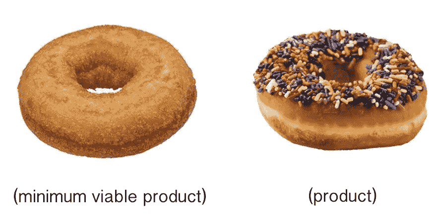
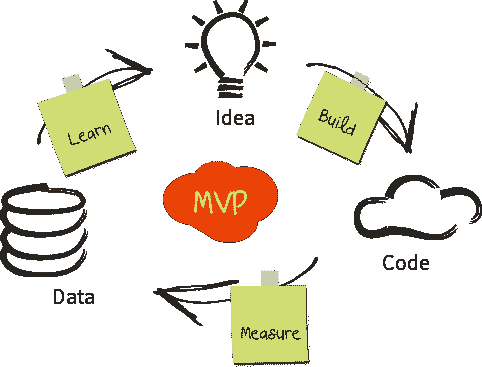

# 超额完成者的最低可行产品

> 原文：<https://medium.datadriveninvestor.com/minimum-viable-product-for-the-over-achiever-d76b18b4492?source=collection_archive---------3----------------------->

Note: MVP does not have sprinkles.

我即将结束我的沉浸式 web 开发。我在一月份开始上这门课，我所有的课程都是自定进度和在线的，这对于我的工作日程来说太棒了，但对我已经糟糕透顶的预算来说却是一种巨大的压力。我目前正在进行我的第四个作品集项目。在此之后，只有两个简短的课程和最后一个项目-结束确实在望。

在着手这个项目时，我有一些非常大的抱负。我的应用程序最终将被部署为我工作的博物馆网站的一部分。除了我简单的投资组合网站，这将是我的第一个现场项目。我遇到了一些指导性的支持，以便更好地理解其中一个需求，并了解如何根据项目的需求对我的项目进行改进，以满足我的部署目标。我告诉我的导师我希望在最终的可部署产品中集成什么，删除什么。

就在那时，我的教练打断了我。他指出，虽然我可以做到这两点，但这需要一些时间，而且会有些脱节——项目的这个部分和前面部分的需求与我希望的最终产品没有任何关系。他让我考虑 MVP。我的想法是确定通过项目评审的需求，然后废弃我所有的东西，重新开始最终项目，拥有一个真正强大的可部署产品，减去所有奇怪的东西，允许我避免浏览所有必要的编辑，从长远来看，可能会节省我很多时间和挫折。

那周我已经不是第一次听到“MVP”这个词了。这是在我的 GDI 聚会上提出的，又是在工作中，最后是我的导师关于我的项目。奇怪的是象征性的-第三次是魅力，对吗？我越是发现我的应用程序需要改变的地方，就越觉得有意义。而且，我完全没有时间和金钱。虽然我以前已经听过无数次“MVP”了，但这是我第一次真正理解它。

那么，最小可行产品到底是什么？MVP 一词最早由弗兰克·罗宾逊使用，后来由硅谷企业家史蒂夫·布兰克和《精益创业》的作者埃里克·里斯推广开来。基本上，你想找到一个平衡点，引入最小的产品，没有太多的风险或投资，但也完成所需的功能或特性。从敏捷开发的角度来看，这是一个很好的方式来启动这个球，获得客户反馈，并通知未来的产品开发。在我的例子中，这意味着做最少的工作——生产一个功能刚好满足项目需求的产品。

MVP Cycle

这听起来很理想，也很容易实现，对吗？我可以很快通过这一关并继续学习课程。我真的可以把我的最终作品制作成博物馆想要的样子。如果我能熬过这一切。五个简单的 AJAX 需求。这将是敏捷开发中的一个很好的实践，帮助我思考一家初创公司或开发公司可能如何处理一个问题或客户请求。

虽然听起来很棒，但我发现最小可行产品对我来说是个挑战。我是一个有点超常发挥的人，并且已经养成了把事情做到极致的习惯。我倾向于对自己严格要求，并以这样的方式行事:任何值得做的事情都值得做对。房子的其他地方都很脏，为什么还要打扫浴室？当你可以有四个大学学位时，为什么要有一个呢？为什么要做一个你不再喜欢的项目，或者一个在很多方面都搞砸了的项目，如果你不打算修复它的话？

总之，我已经讨厌我的项目中的很多东西了。虽然我喜欢最终项目将有助于我的博物馆的想法，但我对我的项目所围绕的主题毫无兴趣。我的一些造型相当笨拙，我使用的一些功能对于博物馆最终需要的东西来说已经没有什么意义了，而且总的来说还有很大的改进空间。

作为我们项目评审的一部分，我们经常被要求实现其他特性或者做一些实时编码。结果，在我的项目中有很多额外的东西没有完成，只是半功能性的，而且从来不是我首先想要的。我不想花时间来修复和删除所有这些，但我想考虑一下我可能会被要求为这一部分做些什么。由于我的项目目前处于一种相当草率和随意的状态，我不确定我能展示什么。

这个项目主要是实现 AJAX 调用和动态更新 DOM。在我的项目中，我使用函数来绑定特定的点击事件。点击处理程序根据用户点击的链接显示一个模型或另一个模型的索引。如果用户正在查看父模型显示页面，他们可以单击前进到下一条记录，而无需刷新页面。用户还可以查看父模型显示页面，并单击处理程序帮助来动态显示属于特定父对象的子对象的实例。最后，用户可以向父模型添加子模型，创建资源并将其附加到页面，而无需刷新。我可能会被要求序列化和显示另一个子模型，但是我又回到了奇怪的事情上，我从来没有真正想把它作为我项目的一部分。

在我的项目中，这些模型是站点，它们的孩子是彩色玻璃窗。因此，您可以按站点或窗口过滤索引。当你点击一个单独的站点时，关于这个站点的细节会通过 JSON 和 AJAX 呈现出来。在这里，您还可以查看下一个站点的记录，将站点的窗口动态加载到页面，或者添加一个新窗口。

我希望我已经预料到的一件事是，用图像创建一个资源是有问题的。我的这个项目的早期版本依赖于 Ruby on Rails，当一个新的模型被创建时，它使用一个叫做回形针的宝石来将图像存储在数据库中。因为我现在使用 AJAX 和 ActiveModel Serializer 来添加新创建的子模型，所以它不能再保留图像。一旦信息被序列化以添加新的模型，jpg 就从记录中被切断。尽管有插件可以帮助我做到这一点，而且看起来似乎很容易，但我仍然在追求最小可行的产品，并且不得不克制自己不花时间去搞清楚实现。

现在我已经检查了所有的要求，我几乎一直在拖延上交。我不是那种典型的拖延的人。这真是忙碌的一周，尽管我非常需要结束这件事，但出于某种原因我一直在回避它。一个简单的事实是，我并不为我上交的东西感到自豪，也不为在你并不自豪的东西上花了这么多时间感到自豪——嗯，这太糟糕了。在某些方面，尽管很难把它交上去，但令人欣慰的是知道我没有在它上面花太多时间，因为前面会有一个更好的成品。我知道我想为可部署项目实现什么，我期待着开始着手它。我想那样的话，如果没有别的，我真的达到了 MVP 周期。