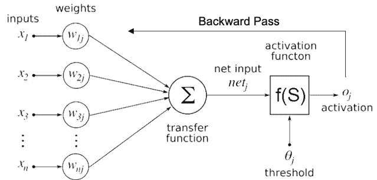
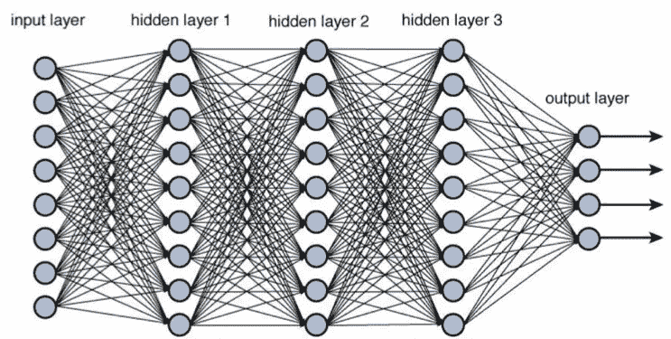

# 在黑暗的数据中挖掘你的道路

> 原文：<https://medium.datadriveninvestor.com/mining-your-path-through-dark-data-4285c521ac07?source=collection_archive---------21----------------------->

今天，我们有一半以上的数据没有被使用。新兴技术能帮助弥合这一差距吗？

根据最近的一份[报告](https://www.veritas.com/content/dam/Veritas/docs/reports/veritas-strike-global-report_a4-sdc2.pdf)，今天 85%的数据没有被使用。三分之一是由于冗余、过时或无关紧要的数据，52%的数据被认为是“暗数据”，即其价值尚未确定的数据。在不断增长的数据环境中，用于处理和分析数据的工具和技术显然跟不上我们消费和创建数据的速度。

数据生命周期中有许多点会成为流程的瓶颈，并使收集和分析之间的差距永久化。将各种来源的数据编译到一个存储库中可能是一个痛苦而缓慢的过程，同时确保数据得到正确分类和清理是一项劳动密集型工作。如果您的公司使用流数据，实时处理这些信息可能是时间关键和资源密集型的。

几十年来，用于处理这些过程的现有技术都是基于 CPU(中央处理器)的，这主要是因为它能够处理各种复杂的指令。虽然 CPU 的通用方法是通用的，但它不如可以加速数据处理和缩小障碍的更专业的工具有效。

由 NVIDIA 于 1999 年推广的 GPU(图形处理单元)长期以来一直用于图像处理。GPU 拥有数百个旨在处理矢量化数据的简单内核，在执行重复的“简单”任务(如矢量操作或矩阵运算)时表现出色。虽然这些任务通常有助于图形处理等目的，但 GPU 作为主要的数据处理加速器正在企业市场中占据一席之地。

训练深度学习模型的过程体现了 GPU 的加速能力。深度学习模型基于深度神经网络，即用于识别和分类模式的算法集。它们由输入和权重组成，因此当输入被传递到网络时，基于权重生成输出。这些模型需要大量的训练，包括向前和向后传球。当输入被传递到网络并产生输出时，前向传递完成。然后通过基于前向传递的误差调整权重来完成后向传递。

如果权重矩阵很小，向前传递对于 CPU 或 GPU 来说都是一项简单的任务。然而，典型的深度学习模型具有数百万个权重和多个隐藏级别，这意味着需要数百万次计算来计算单个输入的输出。

这个过程对于 CPU 来说非常耗时，因为它要在多个周期中处理这些向量计算。然而，使用并行的众多内核，GPU 执行这些向量乘法的速度可以快 100 倍。

那么，谁在利用 GPU 的优势:

GPU 硬件:

NVIDIA 为这个用例提供了动力。他们的并行计算平台， [CUDA](https://developer.nvidia.com/cuda-zone) ，集成了现有代码(C++，Python 等)。)将通用处理专用于 GPU。

[AMD](https://www.amd.com/en) 和[英特尔](https://www.intel.com/content/www/us/en/homepage.html)也是 GPU 硬件领域的玩家。

支持 GPU 的技术:

[Anaconda](https://www.anaconda.com/) 为创建高级分析提供了一个 GPU 加速的数据科学平台。

[H20.ai](https://www.h2o.ai/) 提供了一个 GPU 加速的机器学习平台，你可以在这个平台上建立和训练深度学习模型。

[FastData.io](https://www.fastdata.io/) 开发了一个支持 GPU 的流引擎，将流处理加速到[1000 倍](https://www.fastdata.io/plasma-engine)。

包括 [Kinetica](https://www.kinetica.com/) 、 [SQream](https://sqream.com/) 、 [Omnisci](https://www.omnisci.com/) (原 MAPD)和 [BlazingDB](https://blazingdb.com/) 在内的许多玩家发布了支持 GPU 的数据库，可以将查询速度提高 100 倍。

[Datalogue](https://www.datalogue.io/) 开发了一个由深度学习模型支持的 GPU 加速的数据准备平台，该平台可以自动执行准备/清理数据以进行分析的 ETL 过程。

云中的 GPU:

由提供商( [AWS](https://aws.amazon.com/ec2/elastic-gpus/) 、[谷歌](https://cloud.google.com/gpu/)、[阿里巴巴](https://www.alibabacloud.com/product/gpu)等)提供的支持 GPU 的处理领域中增长最快的领域之一。)，云允许基于订阅的 GPU 处理入口，而无需购买大量硬件。

值得注意的是，GPU 是一项重要的前期成本，因为它们的能量密度非常高，每单位机架空间需要更多的功率。对于处理更易管理的大块数据的较小公司来说，GPU 处理不一定是最佳解决方案。然而，对于有大量数据要处理的公司，GPU 为加速数据处理提供了一个很好的选择。

GPU 不是唯一可用于加速数据处理的替代处理芯片。现场可编程门阵列(FPGAs)和专用集成电路(ASICs)可以专门用于加速特定的用例。例如，张量处理单元(TPU)是由谷歌编程的 ASIC，用于加速他们原生的 [TensorFlow](https://www.tensorflow.org/) 框架中的机器学习。再比如深度神经网络处理单元( [DNPU](http://koreabizwire.com/kaist-develops-new-ai-chip-capable-of-deep-learning/93050) )，由韩国科学技术高级研究院(KAIST)开发，用于执行深度神经网络训练。随着 TPU 和 DNPU 等更多处理单元的不断发展，它们的成本和性能可能会在市场上挑战 GPU。

随着数据的不断增长，我们需要开始考虑如何切入我们数据中“黑暗的”52%。更快的查询意味着有更多时间来创建新的分析和见解。训练更好的深度学习模型意味着发现更多的模式，并对我们周围的世界提出更好的问题。虽然我们还不知道揭露黑暗数据的最终解决方案，但 GPU 使我们能够花更少的时间等待，花更多的时间探索隐藏在表面下的洞察力。

*Trace3 了解这些黑暗数据趋势可能具有挑战性，请联系我们的* [*数据智能*](https://trace3.com/data-intelligence/) *团队，讨论有助于您开始探索的解决方案。*