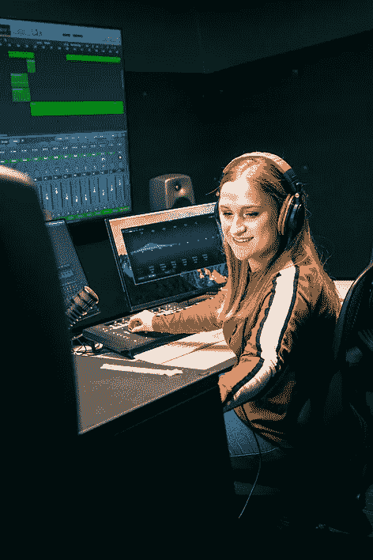
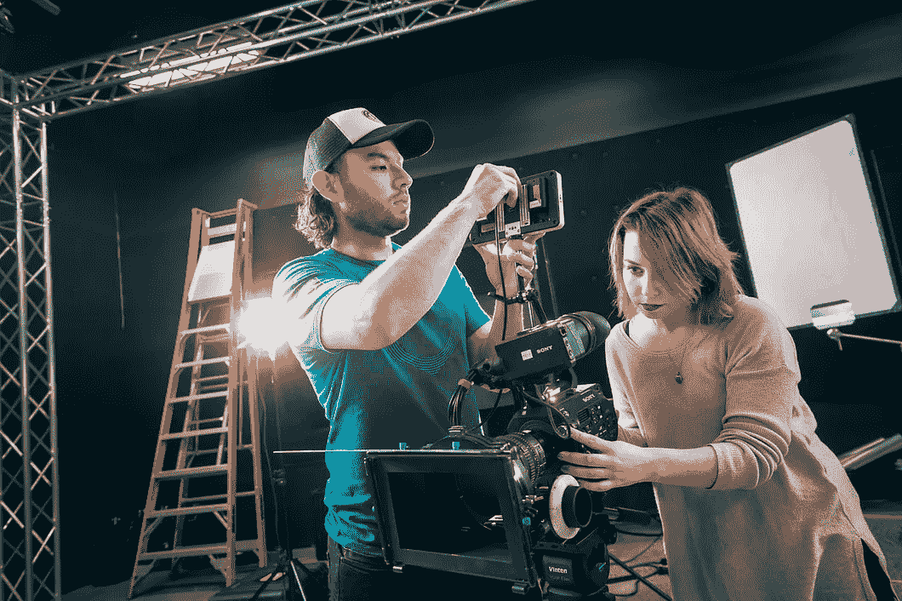
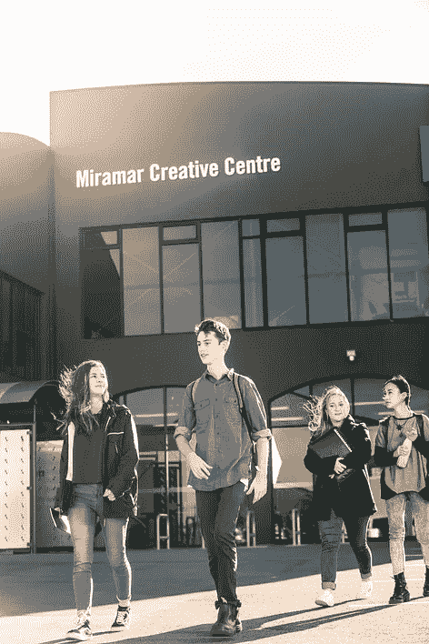

# 美丽华创意中心:在这里，产业和教育聚集在一起，培养下一代电影制作人、游戏设计师和视觉特效专家

> 原文：<https://medium.datadriveninvestor.com/miramar-creative-centre-where-industry-and-education-come-together-8f2603a696fe?source=collection_archive---------41----------------------->

Students at the Miramar Creative Centre. Photos courtesy of Paul Wolffram.

下一个 100 年高等教育将会怎样？随着如此多的技术进步在我们眼前迅速展开，很难跟上这些变化。更难想象下一个世纪的教育会是什么样子。但是也许新西兰可以给我们一个可能的答案。

2017 年 8 月，世界知名制作公司——其中包括彼得·杰克逊的 Weta Digital 和公园路后期制作公司，它们发布了《指环王》三部曲和《金刚》等国际大片——与惠灵顿的维多利亚大学合作，创建了米拉马尔创意中心。目标是什么？培训下一代电影制作人、游戏设计师和视觉特效专业人士，让他们直接向米拉马尔的行业专家学习，米拉马尔是新西兰首都郊外林立的创意中心。

米拉马尔创意中心主任保罗·沃尔夫拉姆博士说，在这个地方，“学生们可以看到业内人士是如何工作的”。Wolfram 一直在维多利亚大学教授电影课程，并于去年发布了他的最新纪录片《真相是什么》。

该项目提供两个研究生学位:电影或音乐艺术硕士(创作实践)和设计技术硕士。这两个项目都是一年制项目，所有申请这两个专业的美术硕士的申请人都会被自动考虑申请部分支付学费的奖学金。

招收国际学生是该中心的核心使命。Wolffram 说，Miramar 的目标是在随后的每一批学生中拥有近 40%的国际学生。目前，有 40 名学生注册了该项目，沃尔夫拉姆预计到 2023 年，这个群体将增长到 60 人。然而，他预计该项目将保持“相当精品化”，以便对毕业生的就业前景做出回应。“向 100 名学生开放没有什么意义，因为可能没有 100 个机会，”他说。

教员是该中心独特教育方法的关键。与其他重视学术研究的高等教育机构不同，该中心以将最优秀的专业人士带入课堂为荣。“每个人都是实践者、研究者和教师。这意味着我们只雇佣那些有着惊人研究记录并正在制作电影的人，”沃尔夫拉姆说。这些员工大多在街对面的工作室做全职工作，然后来中心教几个小时的课。

学生也很容易获得最佳资源。最先进的设施包括绿屏工作室、剪辑室、计算机实验室以及协作空间。最终，目标是为学生提供制作行业标准作品的必要元素。

一种将行业专业知识与学生学习相结合的新模式，一个教师本身就是该领域专业人士的地方，一个为世界各地最有前途的人才提供最佳成功工具的生成空间——也许这就是教育的未来走向。只有未来 100 年才能证明。