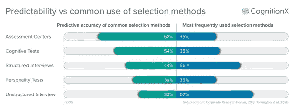
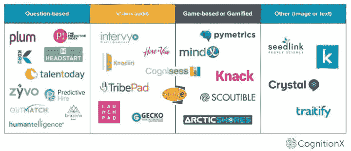

# 魔镜，魔镜，他们中谁是最好的候选人？：

> 原文：<https://medium.datadriveninvestor.com/mirror-mirror-whos-the-best-candidate-of-them-all-59b118e4bbb2?source=collection_archive---------19----------------------->

**利用人工智能(AI)改善招聘决策**

随着劳动力市场的紧张、技能需求的变化以及就业生命周期的缩短，招聘已经成为首席执行官和 CHRO 最关心的问题。然而，这不仅仅是雇佣人才，而是雇佣合适的人才。根据 Josh Bersin (2013 年)在[的研究，与糟糕的招聘决定相关的实际成本可能是员工年薪的 1.5 倍到 2 倍。对于一家拥有 60，000 名员工和第一年平均离职率的大型公司来说，仅提高 10%的保留率就意味着每年节省 400 万美元或更多。](https://www.linkedin.com/pulse/20130816200159-131079-employee-retention-now-a-big-issue-why-the-tide-has-turned/)

这看起来很疯狂，在这种具有挑战性和高成本的活动中，许多人仍然使用主观经典——简历、面试和参考资料三者结合来推动直觉决策(Taylor，2014)。然而，在过去，使用更复杂的认知或个性测试需要考生和 I/O 心理学家花费大量时间来解释结果。由此产生的成本可能会超过收益，尤其是在大量招聘的情况下。

**这就是人工智能正在提供一种新的、充满希望的颠覆的地方！**

我在 CogntionX 的研究中发现，大约有 25 种以上的产品提供了以某种方式使用人工智能的评估工具。尽管所有的工具都提供了某种形式的心理测量评估，但是有四种不同的方法被用来完成评估。

CognitionX.com

一些产品正在特定领域发展自己的优势，例如 [Seedlink](https://cognitionx.com/directory/products/11306/Seedlink) 使用基于语言分析的算法来衡量公司内部角色的关键行为特征和能力。对于考生来说，使用自由文本回答三个问题只需要几分钟。对于招聘经理来说，它提供了数据点来改进招聘决策。在全球消费品供应链解决方案公司[李&丰](https://cognitionx.com/research/ai-hr-membership/)、 [Seedlink](https://cognitionx.com/directory/products/11306/Seedlink) 被用来招聘新的高级经理。随着公司开始下一个 100 年的运营，拥有正确的数字思维至关重要。但是，你如何检查或测试数字思维呢？Seedlink 与李[冯](https://cognitionx.com/research/ai-hr-membership/)合作开发了一种特定的算法，用于测试数字思维以及其他特定的行为和能力。该项目的早期结果证明有利于提高保留率。[点击此处获取完整报告。](https://info.cognitionx.com/ai-assessment-tools)

对于西门子[来说，改进初级招聘流程非常重要，每年要从 15，000 到 20，000 份申请中选出 350 名候选人。](https://cognitionx.com/research/ai-hr-membership/)[北极海岸](https://cognitionx.com/directory/products/11344/Arctic%20Shores)“基于游戏的评估”被选为第一阶段的过滤器，以取代后期的传统心理测量评估工具。第一年的结果显示，在剩余的选择过程中，转换率很有希望，第一年的保留率也有所提高。此外，女性候选人的总体通过率有了显著提高。对于候选人来说，他们花在玩游戏上的时间会得到一份全面、个性化的报告，概述他们的结果。总的来说，候选人和招聘经理都报告说，基于游戏的评估是选拔过程的一部分，有着积极的体验。[点击此处获取完整报告。](https://info.cognitionx.com/ai-assessment-tools)

还有一些产品，如 [TribePad](https://cognitionx.com/directory/products/11309/TribePad) 和 [Knockri](https://cognitionx.com/directory/products/11479/Knockri) ，将情绪检测作为其视频采访平台的一部分。评估提供了对候选人更深入的了解，并有助于创建一个更公平的比较方法。与传统的简历相比，视频面试可以让候选人分享更多关于他们自己和他们个性的信息。招聘人员可以设计一些问题，帮助填写申请或简历中没有的关键信息。

一些公司像 [HireVue](https://cognitionx.com/directory/products/11480/HireVue) 和 [Karen](https://cognitionx.com/directory/products/11483/karen) 提供综合技术。HireVue 将视频面试和基于游戏的评估结合在一个产品中，提供了两个世界的最佳选择。Karen 的智能助手提供了聊天机器人和语言分析师，改善了早期的选择过程，同时也提高了候选人的参与度。[点击此处查看完整报告。](https://info.cognitionx.com/ai-assessment-tools)

像联合利华这样的公司正在通过使用多种技术来改进整个选择过程。联合利华以候选人为中心的方法有助于为他们选择最佳候选人，并帮助候选人找到理想的工作——即使是在不同的公司！观看 CogX 2018 的完整报道，Mel Gee Kee 现任联合利华中东人力资源副总裁，Frida Polli 首席执行官兼 Pymetrics 联合创始人— [点击此处](https://www.youtube.com/watch?v=VokEVT4CAoI&t=615s)

如果不看看使用人工智能和算法进行选择的关键方面，没有一篇博文是完整的。2018 年 10 月，有报道称亚马逊的招聘算法被废弃，因为它对女性有偏见，导致人们担心在选择中使用人工智能(Datsin，2018)。2018 年 11 月，就业研究所(ies)发布了一份报告，概述了关于人工智能和算法在人力资源(包括招聘)中的使用的许多关键问题，[单击此处查看文章，并单击从 IES 获得报告。](https://cognitionx.com/directory/news/128477/Advent%20of%20artificial%20intelligence%20demands%20HR%20managers%20look%20at%20the%20world%20in%20new%20ways%20-%20Workplace%20Insight)该报告强调了人力资源专业人员需要了解和处理的一些挑战，以降低相关风险。主要的收获是，这项技术确实带来了好处，但是我们仍然需要在整个招聘过程和最终决策中使用批判性思维。

**分析师观点:**在我们的研究结束时，很明显，有一些工具可以帮助改善招聘决策。这些工具不是大型组织的专利，即使是最小的中小型企业也可以使用。挑战在于将算法和雇佣决策中的定量和定性数据结合起来。然而，随着对优秀人才的竞争不断加剧，如果公司不利用候选人选择工具相对于简历-面试-推荐信三者的显著优势，那将是疯狂的。

想要更多的认知 x？

需要帮助找出使用人工智能的改进过程或了解更多关于人工智能产品的信息吗？[在我们的专家网](https://cognitionx.com/expert-network)上问一个人工智能专家——免费！

你喜欢这个博客并想了解更多吗？[查看报告全文和其他内容，包括本文提到的案例研究，访问我们的网站](https://info.cognitionx.com/ai-assessment-tools)或发送电子邮件[HR-research @ cognition x . io](mailto:hr-research@cognitionx.io)

什么保持最新的一周最新最好的关于人工智能在人力资源和工作的未来的新闻？点击此处，注册我们每周一期的人力资源和工作未来简讯。

CognitionX 为买方和卖方提供各种研究、研讨会、咨询和其他合作选择。联系以了解我们如何合作来帮助您加快在您的企业中采用人工智能，请发送电子邮件[HR-research @ cognition x . io](mailto:hr-research@cognitionx.io)

— — — — — — — — — — — — — — — — — — — — — — — — — — — — — — — — — — — — — — — — — — — — — — — — — — — — — — — — — — — — — —

CognitionX 以第三方中立的眼光看待人工智能市场，利用 3D 方法深入探讨各种主题——行业、功能和技术。我们的研究团队有多名专家，他们提供了人工智能市场的全方位视角。我们每年在伦敦举办的活动 [CogX](https://cogx.co/) 汇集了我们的专业知识以及全球专家和思想领袖，为期两天的所有人工智能活动。

#人工智能#人工智能#人力资源#人力资源# AIHR #人工智能# FoW #人力技术#招聘#招聘

# 引用的作品

Bersin，2013 年。*留住员工现在是一个大问题:为什么潮流已经转向。*【在线】
可在:[https://www . LinkedIn . com/pulse/20130816200159-131079-employee-retention-now-a-big-issue-why-the-tide-have-turn/](https://www.linkedin.com/pulse/20130816200159-131079-employee-retention-now-a-big-issue-why-the-tide-has-turned/)
【2018 年 7 月 1 日获取】。

Dastin，2018。*路透社:亚马逊废弃秘密人工智能招聘工具，该工具显示出对女性的偏见。*【在线】
可在:[https://www . Reuters . com/article/us-Amazon-com-jobs-automation-insight/Amazon-scraps-secret-ai-recruiting-tool-that-show-bias-against-women-iduscn1 MK 08g](https://www.reuters.com/article/us-amazon-com-jobs-automation-insight/amazon-scraps-secret-ai-recruiting-tool-that-showed-bias-against-women-idUSKCN1MK08G)
【2018 年 11 月 11 日访问】。

s .泰勒，2014 年。*资源和人才管理。*6 版。伦敦:特许人事与发展学院。

注意:本报告中提到的所有产品都来自第三方的独立研究。没有产品付费成为这个博客的一部分。