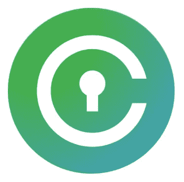

# 区块链的厄运:比特币自动取款机的教训

> 原文：<https://medium.datadriveninvestor.com/misadventures-on-the-blockchain-a-lesson-in-bitcoin-atms-b6a7a64af8db?source=collection_archive---------4----------------------->

Crypto expectations flipped upside down

T 何的日子终于到了！一个小时的自由让我有机会第一次朝拜一座[T3 自动化**T**o kenization**M**achine](https://www.coinflip.tech/)。

我觉得自己像一个去糖果店的孩子；我几乎是蹦蹦跳跳地走进咖啡店。

CoinFlip 让你很容易找到离你最近的机器——该网站的地图功能显示了全国范围内每台机器的存在。

尽管数以百万计的居民生活在我这个庞大的美国城市，但我们只共用 4 个硬币盒。

根据该网站的地图，当地四台自动取款机中有三台位于可以被称为“Shady Shawn 's Smokey Shanty”的地方。

所以，穿过城镇 12 英里的咖啡店似乎是最好的选择。

## 任务:使用菲亚特从一个机械箱中购买 20 美元 KMD。

我对 CoinFlip 公司的服务一无所知，直到科莫多平台的每周简讯将它们公之于众。$KMD 是硬币翻转机中可用的六种加密货币之一。

比起应付比特币基地到币安的洗牌——每次都要付费——我更喜欢有机会走进一家咖啡店，在有机玻璃上展平我手机的二维码，把菲亚特放进一台机器，然后带着一个更大的袋子离开。

毕竟， [**硬币翻转网站**](https://www.coinflip.tech/) 承诺了快速的便利和低廉的费用。

手里拿着电话，口袋里装着脆脆的安德鲁·杰克逊牌香烟，我正走向成为我最喜欢的加密来源的地方。

直到它不是。我相信你现在已经猜到了…进展不顺利…

# 好:容易找到

我不是来抨击 CoinFlip 的。我喜欢这个想法，并感谢该项目给区块链和 crypto 带来的主流采用努力。

实体自动取款机只能提高非铸币者对加密货币的兴趣。

这些机器流通得越多，我们就能让越多的人坐上这个我们大多数人每天都在乘坐的过山车。

购买密码的离线网关是这个行业受欢迎的补充。

这里有一个有趣的想法:

> 把这些放在酒吧里，这样顾客就可以用短期价格预测作为赌注和饮酒游戏的燃料。参与者在决定谁的手机充当钱罐后，将现金投入自动取款机。设定一个时间框架，密码将被赢家获得。

现在，由于从未去过存放机器的地方，我必须找到它。它又大又亮的屏幕使它非常容易找到。

具有讽刺意味的是，旁边的菲亚特自动取款机的屏幕上挥舞着一个手写的“停止服务”的标志。

到目前为止，一切顺利。但是事情在开始的瞬间就开始走下坡路了…

# 不好:窥探的眼光

从技术上来说，你不能把它贴上侵犯隐私的标签，但当时确实是这样的感觉。

自动取款机想要的第一条信息是电话号码。

当你打字时，你的号码会通过占据整个屏幕三分之一的巨大的 4 英寸数字显示出来。

> 我觉得我在把我的电话号码输入大屏幕，让店里的每个人都能看到。

当你在笔记本电脑上打字时，感觉有人不请自来地从背后看你，你会害怕或不舒服吗？当我感觉到有旁观者时，这种感觉席卷了我。

接下来，系统需要你的名字。所以，那个喝着三倍汽水的摩卡奇诺的家伙，如果他在乎的话，现在可以给我打个电话，用我的名字来打破僵局。

那些覆盖在销售点终端上的 PIN 输入板的小塑料鳍是有原因的。甚至像电话号码这样温和的东西也不适合向陌生人展示。

# 丑陋:这里没有密码！

这个实验的全部目的是在不使用传统交易所的情况下购买密码。

人们期望支付不到 7%的费用来获得使用现金的特权。不完全便宜，但速度和方便往往是溢价。

没有人喜欢支付任何形式的费用，但 20 美元的 7%只是 1.40 美元。没什么大不了的为了发现！

一些投资者可能不同意，但我认为这笔费用可以忽略不计，可以接受。

## 惊喜定价

现在才是真正有趣的时候。

在走进咖啡店之前，我看了一眼 Blockfolio，现行汇率是 1 美元 KMD 兑换 0.77 美元。

在忍受着坐在离机器不到两英尺远的桌子旁的可疑人物的目光输入我的名字和号码后，自动取款机声称每枚硬币的价格为 0.82 美元。

这个数字与 CoinFlip 的网站一致。一切都好。

继续操作时，机器通知我“四舍五入”到每枚硬币 0.99 美元。如果我只插入一美元，那没问题。但是如果 20 美元和 0.82 美元有任何四舍五入的话，我要 24 个硬币，非常感谢。

虽然 7%对于这样一笔小交易来说是可以忍受的，但我们已经接近了 30%的溢价。

现在，我已经搜寻了从信用卡到贝宝的密码获取方法。我见过高达 25%的费用，但硬币机的收费是我见过的最高的。

好了，现在我们讨论的是每枚硬币一美元，费用吞掉了我 20 美元中的 6 美元。

这不完全是区块链理工大学承诺的削减成本的分散服务！

既然已经走了这么远，我不愿意打退堂鼓，于是我同意了，把我的菲亚特放进了自动取款机的发光槽里…

## 可怕的干钱包

在我经历了这么多才到达这个关键的十字路口之后，就像是一记耳光，自动提款机立即结束了任何成功的机会…

> "很抱歉，这台机器没有足够的$KMD 来完成您的交易."

你在开玩笑吗？20 个微不足道的硬币要求太高了吗？在我到达之前，$KMD 有大规模的挤兑吗？啊…真高兴我开车来了。

我相信我们有技术来创建一个足够智能的合同，在余额耗尽时自动填充 ATM 地址。

# 美丽:如何简化体验

再说一遍，我不是来抱怨的；我是来提供解决方案的。

我将在这里讨论两个主要的争论点。

是的，对服务的一些调整可以让顾客带着一种“我有秘密”的感觉离开，而不是陷入沮丧。

除了需要密切监控 ATM 余额之外，以下是我对任何提供加密货币的机器的期望:

## 1)让我们提前敲定个人细节

如果自动取款机依靠步行交通，这些客户仍然需要一个应用程序来与机器互动。

除非你已经提前计划好，或者你的手机上已经有一个带有二维码的加密应用，否则你必须在交易前下载软件。

我们现在不是在一时冲动购买的领域。我没出去买咖啡，碰巧看到 crypto 有空。相反，我出去买了加密咖啡和一杯可选的咖啡。

> 在交易发生之前，二维码应该知道你是谁。与诸如 Civic 或 Ontology 之类的数字身份证服务提供商集成可以加快 ATM 操作时间。

Civic’s digital IDs can follow you all over the blockchain

在我走进放置比特币 ATM 的地方之前，我更愿意选择我的硬币和我计划交易的现金数量。

移动钱包需要一种机制来触发与硬币翻转机的简单交互。

通过识别顾客并提前做好安排，整个结账过程可以简化为几个步骤:

*   **持手机二维码上机**
*   **插入现金**
*   **带着一袋更重的硬币或代币离开**

我总觉得自己是菲亚特 ATM 的靶子，比特币 ATM 也不例外。我想花尽可能少的时间与货币交换硬件互动。

你有没有在自动提款机前被人堵在后面，不得不兑现一张支票并从三个不同的账户中取款？拜托，硬币，别让我在你的机器前呆那么久。

我想用我的手机做任何事情，加快结账过程。

## 2)坦率地谈论价格

如果我知道会有这么高的费用，我可能会干脆不去了。然而，对产品知识的渴望，以及一点好奇心，可能足以促使一项任务。

不是每个人都喜欢惊喜，尤其是涉及到钱的时候。诱饵和开关策略未能吸引回头客。

听着，我们知道买卖有溢价。如果我走进一家当地的钱币商店，打算购买盎司白银，我完全知道我会支付比当前现货价格更高的价格。

不同的是，我知道我期望支付的确切百分比。以合理的市场价格出售服务的企业不必担心隐藏其真实的定价结构。

# 最后的想法…

我真心希望我在寻找硬币的过程中找到了一个新的伙伴。

加密市场的长期悲观情绪已经导致大多数项目的价格暴跌。这个行业的大多数垃圾硬币不会从它们坠落的深渊中出来。

然而，众所周知，粪堆中有未经雕琢的钻石。这些项目目前的价格非常便宜。根据我的推测，**非财务建议观点**，现在是买入一些被低估的代币的好时机。

当你在比特币自动提款机旁，口袋里有几块多余的钱时，还有什么比这更好的平均成本和增量装满袋子的方式呢？

从表面上看，这场灾难似乎是区块链的又一次失信。然而，我仍然抱有希望。

像我使用的比特币自动取款机可以帮助建立一个不断增长的加密倡导者社区。但这只是在解决了隐私问题和费用更加透明之后。

类似于区块链本身，我们可以把这一次归因于需要解决问题。毕竟，新兴技术需要数年时间来发展。

我们不能总是期望一开始就有一个顺利的结果，不是吗？

## 顺便说一下…

如果你喜欢你刚刚读到的东西，并且想要帮助你把你的加密信息传递给大众，我很想听听你的项目。

即使你只是想聊聊加密或你最喜欢的区块链创新，你也可以在这里找到我:blockchainauthor at Gmail