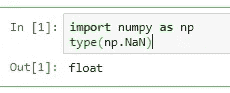
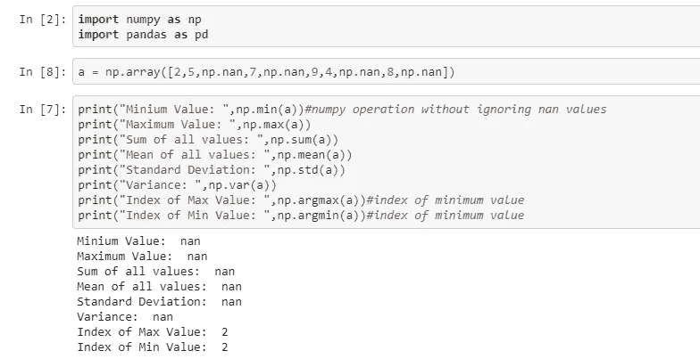
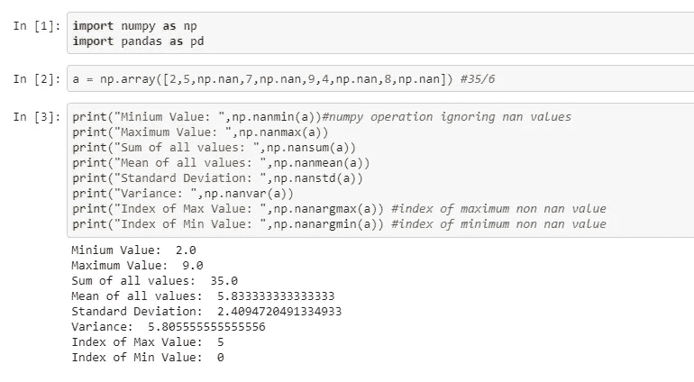

# 缺失值和 nan 函数

> 原文：<https://medium.datadriveninvestor.com/missing-values-and-nan-functions-ba3e76233abf?source=collection_archive---------3----------------------->

在现实生活的数据集中，缺失值是不可避免的。处理这些值是清理数据时不可或缺的一部分，如果处理不当，可能会导致完全错误和无用的结果。

缺失值的存在有多种原因。

例如:对于一个产品的在线调查，人们不会填写所有的信息。

在 python 中，缺失值表示为 NaN，而不是数字。

让我们看看什么是 NaN，它的类型，如果我们不删除这些值，我们的结果会发生什么，最后我们如何忽略这些值以获得更好的结果。

**南是什么？**

NaN 是没有产生明确结果的操作的结果。产生 NaN 的一些常见运算是零除零、无穷运算和任何涉及 NaN 值的运算。

**检查南的类型**

Numpy。NaN 是 [IEEE 754](https://en.wikipedia.org/wiki/IEEE_754) 的浮点表示，而不是一个数字(NaN)。

**具有 NaN 值的操作:**

因为我们的数据中有 NaN 值，所以任何与 NaN 相关的操作都会给出 NaN。为了克服这个问题，python 提供了不同的 NaN 函数。

**NaN 函数**在执行此类操作时会忽略 Nan 值，这在我们需要避免这些 Nan 值时非常有用。

**具有 Nan 功能的操作**

**其他一些处理缺失值的常用技术有:**

用标量值替换 NaN

向前和向后填充

删除缺少的值

估算缺失值

感谢阅读！