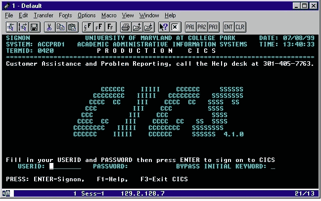
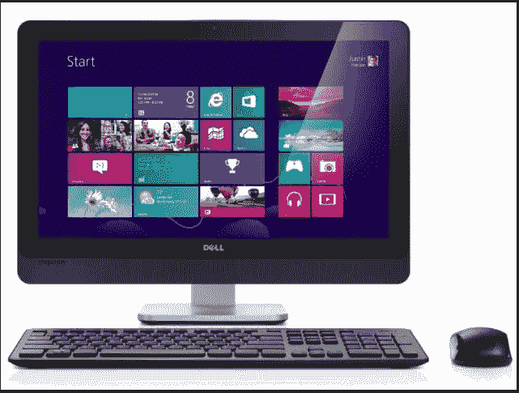

# “探索未知的使命”

> 原文：<https://medium.datadriveninvestor.com/missions-into-the-unknown-52a0571d753d?source=collection_archive---------32----------------------->

> 创造性的工作不能完全符合计划、预算和日程。麦哲伦、刘易斯和克拉克以及柯克船长都被派往未知的地方执行任务，他们清楚地知道，他们可能不会带任何东西回来，甚至根本不会回来。”——斯科特·伯昆

当我读到以下两个在一天之内相继发表的故事时，我一点也不感到惊讶。

> **“在洛德&泰勒，一切都必须走。女儿的负罪感会一直存在。”—** 《纽约时报》2018 年 12 月 31 日
> 
> **“零售业的亚马逊解药:网上购买，店内提货”——**CNN，12/31/18

从表面上看，洛德&泰勒的故事是关于一个女儿因为没有购买挂在曼哈顿第五大道 L&T 旗舰店大厅的铭牌而产生的负罪感，这些铭牌上写着曾在军队服役的 L&T 雇员的名字。这同样意味着自 20 世纪 90 年代中期以来一直存在的传统百货商店的末日即将到来。

相比之下，亚马逊的故事是关于“*实体零售商，如沃尔玛、塔吉特和百思买，通过为 Amazon.com 的网上订单提供**店内取货服务，找到了相对于亚马逊的优势**。"*

建立新的信息系统当然比不上刘易斯和克拉克或麦哲伦的努力，但克服那些被要求使用新信息系统的人的阻力通常是一项“进入未知领域的任务”，因为我们真的不知道这些人会对他们面临的变化做出什么反应。比较洛德和泰勒以及沃尔玛的活动，两者都很突出。

在 20 世纪 90 年代中期，当互联网从美国政府的控制中释放出来时，我被要求为一家规模与当时的 Lord & Taylor 和 Wal-Mart 相当的零售商设计和实现一个新的信息系统*架构*。我强调了“*架构*”这个词，因为当我开始我的新任务时，很快就发现要求我“设计和实现新的信息系统架构”*的人很少知道什么是“信息系统架构”。他们只是知道企业正经历着困难，而大多数员工可以归咎于这些困难的最方便的事情是一个“*信息系统架构*”的抽象。*

我的新任务的另一个方面很快变得对我来说很明显，那就是信息系统"*架构*"不是员工用来完成工作的计算机技术，至少不是那些员工桌子上的计算机技术。当我开始我的任务时，个人电脑在家庭和工作场所都很流行。大多数大型企业还没有采用个人电脑，但他们的员工已经采用了，员工带着电脑去工作或在家里完成任务并不罕见。

毕竟，在 20 世纪 90 年代中期，大多数大型企业要求员工使用的计算机看起来就是这样的。

下面是 20 世纪 90 年代开始使用视窗软件的新型个人电脑的样子。

几乎所有的员工都很快意识到使用个人电脑比传统的电脑终端更容易。如果只是放在员工桌子上的计算机的外观和感觉，那么设计我的信息系统架构将是一件轻而易举的事情。我需要做的就是对我的老板们说:"*你要一个‘新架构’，只要给我钱，把成千上万的电脑终端换成个人电脑，你就有了你的新架构"*。事情没那么简单。还有一个问题是，如何使新的个人计算机能够与中央大型计算机一起工作，在中央大型计算机中，存储着由雇员创建和修改的用于经营企业的所有数据。

开发“信息系统体系结构”的努力很快变成了开发使不同制造商的计算机能够互操作和交换数据的方法。这个架构与计算机本身无关。正是“*协议*”使得计算机能够互操作。该协议定义了[通信](https://en.wikipedia.org/wiki/Communication)的规则、[语法](https://en.wikipedia.org/wiki/Syntax)、[语义](https://en.wikipedia.org/wiki/Semantic)和[同步](https://en.wikipedia.org/wiki/Synchronization)以及可能的[错误恢复方法](https://en.wikipedia.org/wiki/Error_detection_and_correction)。协议可以由[硬件](https://en.wikipedia.org/wiki/Computer_hardware)、[软件](https://en.wikipedia.org/wiki/Software)或两者的组合来实现。

“Prachi Juneja” and Management Study Guide Content Team.

在此之前，计算机通过各种计算机制造商的专有通信协议进行互操作。例如，IBM 提供了它在 1974 年创建的专有[网络](https://en.wikipedia.org/wiki/Computer_network)架构**系统网络架构** ( **SNA** )。这是一个完整的[协议栈](https://en.wikipedia.org/wiki/Protocol_stack)，用于互连[计算机](https://en.wikipedia.org/wiki/Computer)及其资源。微软从未提供有竞争力的协议。

当 IBM/微软战争正在进行时，互联网工程任务组(IETF)已经发布了互联网通信协议。IEEE[处理有线和无线网络，国际标准化组织](https://en.wikipedia.org/wiki/IEEE)[处理其他类型的网络。所有的计算机制造商最终都采用了标准的互联网协议，很明显，我们的架构需要采用 IETF 发布的互联网通信协议。通过采用 IETF 协议，这意味着无论我们选择让员工使用哪种计算技术，它都可以与其他员工被要求使用的技术进行互操作。](https://en.wikipedia.org/wiki/International_Organization_for_Standardization)

分析公司 comScore 和联合包裹服务公司最近进行的一项年度调查发现，现在消费者在网上购买的东西比在商店购买的多。沃尔玛采用了开放的互联网架构，这使得它现在能够与 Amazon.com 交换信息，这样顾客可以向 Amazon.com 下订单，但让沃尔玛知道他们将在沃尔玛商店提货。相比之下，Lord Taylor 继续使用专有协议，阻止其向顾客提供类似的服务，期望他们进入 L & T 商店购物，而不是在线购物，这只会导致 L & T 的衰落并最终倒闭。

一旦顾客进入沃尔玛商店，取走在 Amazon.com 购买的物品，体贴的沃尔玛销售人员就有责任了解每个顾客，找到顾客可能感兴趣但在 Amazon.com 找不到的产品和服务。