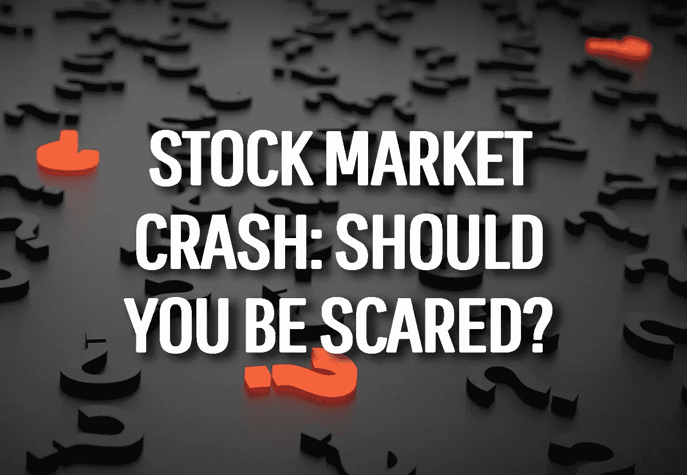
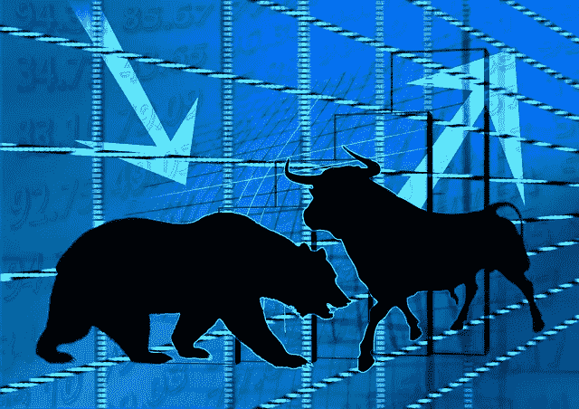

# 对混乱的股票市场的复杂感觉

> 原文：<https://medium.datadriveninvestor.com/mixed-feelings-about-a-confused-stock-market-3ef3f3d49edc?source=collection_archive---------9----------------------->

于是，又发生了。股票市场出了问题。

目前还不能确定这是感冒、48 小时病毒、流感还是可怕的人流感(在这种情况下，放弃所有希望)。

 [## 算法交易的机器学习|数据驱动的投资者

### 当你的一个朋友在脸书上传你的新海滩照，平台建议给你的脸加上标签，这是…

www.datadriveninvestor.com](https://www.datadriveninvestor.com/2019/01/30/machine-learning-for-stock-market-investing/) 

至少在澳大利亚，市场似乎不知道自己想要什么(海外的情况看起来也一样动荡)。

上周的一天，它面临降息。从技术上讲，这对股票市场来说是一件好事——人们追求股票回报，而不是不断缩水的银行存款。当利率如此之低时，谁又能责怪他们呢？

同时，这也是灾难即将来临的征兆。澳大利亚央行距离量化宽松(“印”钱)只有一步之遥。为什么？因为经济形势不佳。失业率相当高，就业不足现象普遍(尽管没有人正式承认)，像零工经济([及其所有风险](https://hishermoneyguide.com/fear-the-gig-economy))这样的事情对许多人来说是一个不值得羡慕的退路。

在海外，有贸易战，一个国家想要离开它的伙伴，因为…原因？石油工厂被炸(虽然这是*的一种*一直是一件事)，其他人摆弄核武器和洲际弹道导弹，一个倒置的收益率曲线指向美国的衰退(见贸易战)。

然而，尽管如此，当地股市一天上涨 0.8%，接下来两天下跌 3.8%。因为……原因。很好的理由，请注意(见上)——但显然一些预期的工厂数据足以让世界瞬间旋转。

随后的市场收益很快被亏损抹去。

所以我们在这里——我们所有人都在这里——坐在场边，看着各国玩弄和挥舞军刀，机构投资者和对冲基金在他们之间博弈，而我们这些纯粹的个人感受到所有这些诡计给我们带来的任何后果。

当市场表现如此不理性时，难怪我过去害怕股票。

我已经继续我的总体思路*了。但坦率地说，我不知道我对目前发生的一切有什么感觉。实际上，我真的很纠结。*

所有迹象都表明，在不久的将来，市场会崩盘。但这是好事，还是坏事呢？害怕什么，还是一个机会？

The current situation locally and globally is … complicated.

# 游戏中的皮肤

不管我们喜欢与否，我们都以这样或那样的方式受到当前经济环境的影响。我们汽车的燃料成本或高或低，或者储备食物的食品价格；取决于全球市场趋势的潮起潮落的工作。

坦率地说，你或我在股票市场上是否有钱并不重要。不管我们喜欢与否，在这些巨大的经济力量的作用下，我们都是赢家或输家。

每个人都应该关注正在发生的事情——这可能是一种让自己做好财务准备的方式。

然而，尽管这看起来很无助，事实是你可以采取一些措施来应对。

问题是，没有水晶球，就不可能说出正确的*步骤是什么。*

你有退休金吗？如果你是澳大利亚人，你会的。你可能会将你的策略从激进或平衡的策略转变为防御性策略，以保护资本。但是如果大崩盘在一年、两年或五年内不会发生呢？再见增长机会。

如果你持有股票，你可能会将它们转向更具防御性的资产类别，比如债券。但是现在*是正确的时机吗？我不知道。*

既然你的房屋贷款偿还额处于历史低点，你应该调整吗？嗯，当我们的投资房地产贷款持续下降时，我们受到了轻微的伤害(尽管我们现在实际上是持平的，因为银行没有通过全面降息——干得好，银行！).但它们毕竟还可以降得更低。

到目前为止，我们没有改变任何投资来应对最近的市场动荡。我们最接近的回应是在下跌后的第二天买入一些股票。

我担心当地和国际经济的状况，但我们是否应该做出更多回应？

# 像你我这样的人面临的风险

从长远来看，我当然不会对我们的前景大惊小怪，即使股市碰巧在一夜之间暴跌 50%。

总的来说，这肯定不是一个好结果。世界各地肯定会有大量的人失去工作，每个人重新找到工作都需要时间。也许*我们*会是这些人中的一员，但我并不太担心艾莉和我目前的工作保障，即使在那样的情况下。我想，类似恶性通货膨胀的风险会更大，这取决于政府如何应对。

更有可能的情况是，看看我们是否能在市场崩盘时保持冷静，而不是在抄底过程中卖出。

作为长期投资者，我的观点是，市场总是在崩盘后反弹。只要我们保持这种心态——并把握住我们的牌——我们就会没事，即使它需要十年才能完全反弹(这是 ASX 在全球金融危机后花了多长时间……我们现在已经回到低于这些水平的水平。*。*

埃莉作为投资者看到了 GFC，并遭受了随之而来的账面损失。但她从未出售过，随着时间的推移，她所有的财富都回来了。

我唯一担心的是公司是否会开始倒闭。如果你听到一个谣言，说有一家大银行要倒闭，那该怎么办？你卖吗？

然后是银行的*挤兑*。钱被集体提取。股价暴跌。你卖吗？

谣言四起，说下一个是另一家银行*。你卖吗？*

*ETF 目前风靡一时，你可能会认为它们是安全的。但是，如果有什么事情让先锋或贝塔股份公司的*公司*处于危险之中呢？您拥有该公司经营的产品中的单位(就像您拥有上市投资公司中的单位或退休金中的单位一样)。ETF 的风险既分散*又集中*。*

*如果你听说他们有危险，你会怎么做？如果他们真的*垮了*你会怎么办？*

*那是当你陷入可怕的场景和棘手的情况时，我不知道该如何应对。*

*这种结果让我害怕，我真的不愿意去想，因为它们可能会有后果。*

*因此，伴随风险而来的也是机遇，这是一件好事。*

**

*You *can* profit from share market crashes.*

# *熊市阴云中的一线曙光？*

*我非常高兴市场从现在到我死的那天都保持平稳。我们是股息投资者，如果收益率保持不变，我们会很好。*

*老实说，我每天最担心的是股票无缘无故上涨，给股息收益率带来压力。*

*所以有时候我希望市场至少能停下来喘口气，如果不是下跌的话。*

*为什么？*

*买入机会。*

*如果你坐拥现金，你可以给自己买一些资产——房子、股票等——以正常价格(以及它们的“公平”价值，如果有这种东西的话)打折。*

*就像我说的，从历史上看，价格总是会回到原来的位置。所以就我个人而言，我不太担心在低迷时期买入。*

*即使我不抄底，我也很乐意捡一些便宜的股票。*

*如果你坐在一些现金上，在那些时候你是在包厢座位上。现金的确是王道。*

*对我们来说，我们很少坐拥超过几千美元的现金。一旦我们在一两个月内投入足够的资金，我们就会投资。所以我们真的没有能力利用它。*

*但是，如果澳大利亚 ASX 曾经回落到中低 4000，我会很想动用我们的住房贷款。你看，我们实际上从来没有关闭它。它只是坐在那里与钱抵消，但我们有能力提取超过 250，000 美元，如果我们想要或需要。我们让它活着就是为了这个场景。*

*在这种超低利率的环境下，这是非常有诱惑力的。你可以以资本折扣购买股票，股息能够超过贷款本身的支付。*

*这是一个有趣的前景。想象一下股价有 30-35%的折扣。*

*事实上，在 GFC 最深的时候——大约崩盘六个月后——ASX 的价值是其峰值的一半。六个月后，市场从低点疯狂上涨了 40%。*

*即使市场下跌到更低的水平，下降到这些数字肯定会吸引人扣动扳机。*

*伴随着巨大的风险而来的是巨大的回报。*

**

*The bulls and bears do their sultry tango, and we can only watch on.*

# *你能有多大胆？*

*我不会说我可以预测市场崩溃的底部，但如果我们能从 250，000 美元中获得 40%的利润，那就是 100，000 美元的资本利润。*

*那会让我们提前 6 个月退休。*

*这是一场能带来巨大回报的赌博。*

*然而，如果市场崩溃伴随着房地产市场崩溃，另一种选择是尽早购买我们梦想中的房产。*

*我们或许可以以优惠的价格买下我们在 T2 的梦想之屋(T3)(如果有合适的房子出售的话)，然后把它租出去，直到我们准备好搬进去。有了更低的购买价格，我们可以节省印花税，任何现金支出都可以被房价的下跌所弥补。所以这是另一件需要考虑的事情。*

*也就是说，就像在股市大幅下跌时我是否能保持冷静的问题一样，我不知道自己是否有勇气举债购买股票或买房。*

*就像我之前说的，崩溃会给就业和整体经济带来风险。我们可能会把自己扔进狼群(尤其是像房子这样的大件商品)。*

*但这表明，即使在最糟糕的时候，机会也会出现。这也正是为什么我对市场崩盘一直百感交集。我能看到风险和危险；我能看到机会和回报。*

*老实说，写下这些想法并没有帮助我解决内心的矛盾。但至少我希望我已经帮助减轻了你对市场崩溃的恐惧。如果你担心经济低迷会带来什么，只要意识到你也可以从这种情况中获利，并加速你的[财务独立之旅](https://hishermoneyguide.com/what-is-financial-independence)。*

*干杯，*

*亚历克斯*

*PS:如果股票市场暴跌，你会看到一线希望吗？*

**原载于 2019 年 10 月 10 日*[*【https://hishermoneyguide.com】*](https://hishermoneyguide.com/share-market-crash-thoughts/)*。**