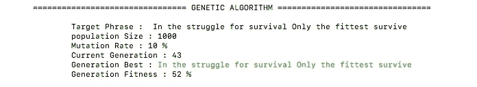

# ML ||遗传算法 1 分钟。

> 原文：<https://medium.datadriveninvestor.com/ml-genetic-algorithm-in-1-min-e29e06fa643b?source=collection_archive---------36----------------------->

这是一种基于进化论为 NP-搜索问题寻找最优解的算法

> "代数越少，算法越好."

# 什么时候？为什么？

最佳用例是在大型复杂数据集中搜索目标元素/输出，并降低时间复杂度。例子:用给定的 26 个字母组成一个单词或句子。

# 工作

该算法背后的基本思想是创建具有 N 个人(元素)群体的一代(G ),并执行以下操作:*计算适应度得分、选择、交叉、变异*

> 适应性分数:计算群体中每个元素的适应性分数。
> 
> 选择:这包括根据下一步(交叉)的适合度分数选择元素。
> 
> 突变:这是一个可变因素，可以从 0%变化到 100%突变；* *这是唯一可以改变元素适合度分数的因素。
> 
> 交叉:创建具有 N 个元素群体的新一代(G1+i );通过基于适应度分数从上一代中选择元素并应用变异来产生新元素。

执行上述操作，直到我们到达具有其中元素的适合度分数是 100%的群体的世代(G ^ n)。

# 获得更好的结果

与任何其他 ML 算法一样，只有很少的因素/变量可以调整以提高效率

总体中元素的数量；理想情况下，必须有 200 到 500 个元素。初始一代(G1)，用于在一代中创建种群的交叉方法。突变率；0.1 (10%)到 0.3 (30%)。

注意:世代(G n)将会变化，没有突变率(0)将会导致适合度分数可能永远不会增加到 100%的世代。

例子

> GitHub 链接:[https://GitHub . com/achalukkhal/algorithms-python/tree/master/Genetic % 20 algorithm](https://github.com/achalukkhal/algorithms-python/tree/master/Genetic%20Algorithm)