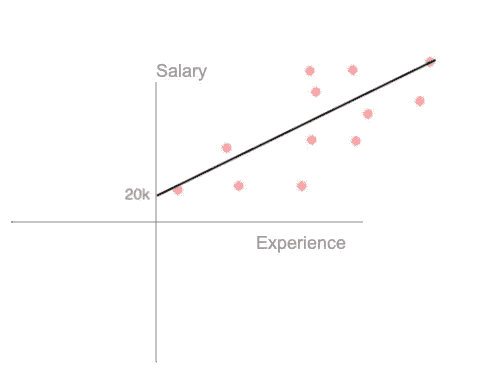
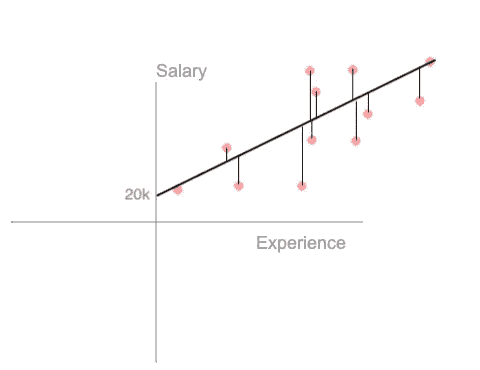
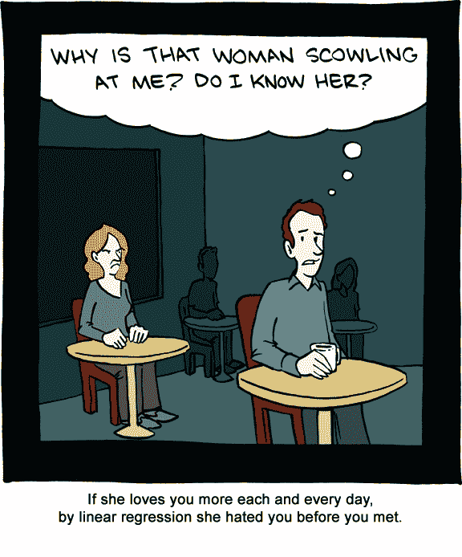

# ML 摘要 001—简单线性回归

> 原文：<https://medium.datadriveninvestor.com/ml-summaries-001-simple-linear-regression-615c3494414a?source=collection_archive---------29----------------------->

Photo by [Marvin Meyer](https://unsplash.com/@marvelous?utm_source=medium&utm_medium=referral) on [Unsplash](https://unsplash.com?utm_source=medium&utm_medium=referral)

它已经被统计学家和工程师使用了 200 年，它又快又简单。最明显和最吸引人的例子是**通过多年的经验计算工资**。这是摘要。

# 它是如何工作的？

简单线性回归(SLR)，得到一个基本变量的点，画一条线，填充公式中的空白点。正如前面说的一个朗朗上口的例子；

假设你刚刚毕业，或者在另一个领域开始了新的职业生涯。你没有任何经验，所以这里显示的起薪是 20k。

无论你是高级开发人员还是刚毕业的学生，20k 是一个底线，当你有经验的时候，它会用这个公式计算；

> y = b0 + (b1 * x)

*在这个例子中它代表；*

> 工资=起薪+(直线斜率*经验)

在这里，薪水是因变量**的**，经验是自变量**。**

# **线是怎么画的？**

**有一种方法叫做，**普通最小二乘法**来源于[高斯-马尔可夫定理](https://en.wikipedia.org/wiki/Gauss–Markov_theorem)。该方法通过考虑线的每个点和相关(最近)点之间的 **距离**的**总和******平方** **来连续创建许多线，直到找到最小结果。******

********

****Calculating distance of the each point****

****在下面的链接中，您可以看到线条是如何随着周围环境的变化而变化的！****

**** [## 普通最小二乘回归直观解释

### 编辑描述

setosa.io](http://setosa.io/ev/ordinary-least-squares-regression/) 

[Disadvantage of SLR?](http://www.smbc-comics.com/index.php?db=comics&id=2328#comic)****