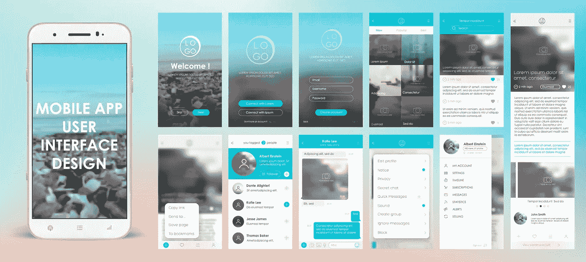

# 移动应用程序设计功能—提示和可用性指南

> 原文：<https://medium.datadriveninvestor.com/mobile-app-design-features-tips-and-usability-guide-afb2e9bb43db?source=collection_archive---------24----------------------->

人们花在手机上的时间比以往任何时候都多，他们使用各种应用程序来帮助管理他们的职业和个人生活。人们对移动应用有很多期望:

1.  快速加载时间
2.  易用性
3.  直观的界面
4.  响应式设计
5.  离线可用性

移动应用程序设计师的工作是获取用户需求，并将其纳入技术规范，以制作一个将被广泛使用的应用程序，并在竞争中脱颖而出。在这篇文章中，我们将看看一些移动应用程序设计的技巧，以便客户在使用应用程序时感到舒适。

# 设计简单易用的应用程序

一个充斥着各种功能的移动应用用户界面设计不会被用户接受，因为他们最看重的是简单性。当你设计移动应用程序时，少即是多，因为用户会立即理解你的应用程序是关于什么的。人们从手机上删除应用程序的最大原因之一是因为它们难以导航，移动用户界面设计的一个常见错误是，很多时候设计师认为在笔记本电脑上工作的应用程序也可以在手机上工作，但这很少发生。

因此，在你开始开发你的应用程序之前，一定要做好用户需求的功课，以便去掉一些阻碍你实现主要目标的多余功能。

# 省时设计

一个简单明了的移动界面会让你在用户中获得更多的分数，因为他们不必浪费时间去弄清楚应用程序是如何工作的，而且快速的加载时间会让应用程序更容易访问。用户正在寻找一个基于触摸的功能设计，没有任何额外的东西会分散他们的注意力。考虑到这一点，各地的[移动开发服务](https://skywell.software/mobile-app-development/)都在问自己的关键问题是，用户通过使用他们的移动应用程序试图完成什么目标？通过找到这个问题的答案，你将能够给用户更高水平的舒适性和可用性。

例如，如果你的应用程序帮助人们管理他们的财务，你必须考虑到用户试图实现的主要目标是保持盈利，不仅仅是这个月，而是长期。所以，你必须让用户很容易看到他们的财务状况，让他们很容易把他们的财务安排好。

# 离线可用性

通过创建一个离线工作的应用程序，你给了用户额外的安慰，知道他们将能够传输重要的信息，不管他们发现自己处于什么情况。这对于旅游应用来说尤其重要，因为用户担心访问他们的旅游信息、地图、照片和其他信息，尤其是因为 Wi-Fi 热点并不总是在附近。话虽如此，如果你的应用程序处理机密或敏感信息，一定要研究一下应用程序的哪些方面应该可以离线使用，并保存在手机上，而不泄露任何敏感数据。

例如，一些虚拟数据室公司提供移动服务来帮助他们的客户访问存储在移动应用程序中的文档，因此他们的客户可以在旅途中甚至离线时访问他们的文件，但下载或共享等更高级的功能只能在线使用。它们还采用了响应式移动设计，允许客户在各种设备上访问文档。

我们希望这些提示能对你创建手机应用有所帮助，因为它们都是为了改善用户体验。如今，竞争是如此激烈，即使是在非常特殊的市场，如果你不给你的用户一个易于使用的应用程序，他们就会去别的地方。首先，一定要考虑最初的目的，即用户下载你的应用的原因。一旦你能够回答这个问题，并把你的设计集中在帮助用户实现他们最初的目的上，其他的事情就会水到渠成。

*最初发表于*[*sky well . software*](https://skywell.software/blog/mobile-app-design-features-tips-and-usability-guide/)*。*

## 来自 DDI 的相关故事:

 [## 数据科学和软件工程哪个更有前途？

### 大约一个月前，当我坐在咖啡馆里为一个客户开发网站时，我发现了这个女人…

medium.com](https://medium.com/datadriveninvestor/which-is-more-promising-data-science-or-software-engineering-7e425e9ec4f4)