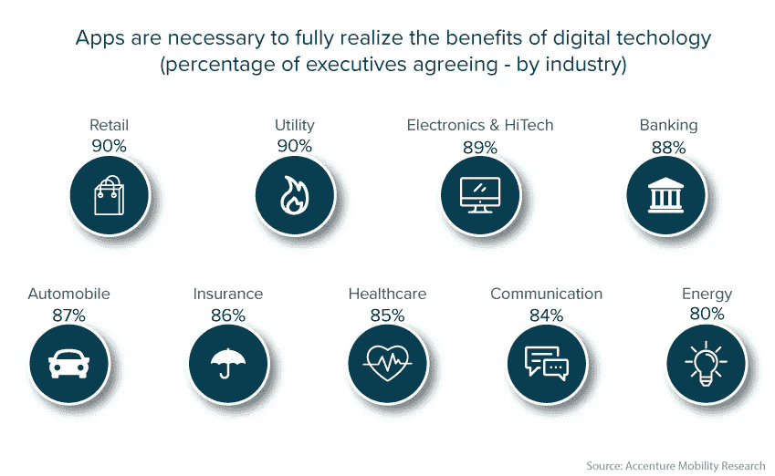

# 移动应用开发——提高企业生产力的最快方式——小天鹅

> 原文：<https://medium.datadriveninvestor.com/mobile-app-development-the-fastest-way-to-improve-business-productivity-cygnet-6e68f53c0be3?source=collection_archive---------14----------------------->

在移动优先的时代，使用移动应用程序来改善业务的各个方面是希望在不断变化的业务模式中有效发展的企业家的先决条件。那些仍然依赖手工和纸质流程的公司不会长久。使用传统的工作方式进行基本的业务活动会限制生产力。

那么，您是否已经移动了您的业务流程？还是你还在寻找机会去做？然后，抓紧时间，考虑开发一个移动应用程序来优化您的业务流程。

 [## 2019 年移动应用开发之路|数据驱动的投资者

### 任何在移动应用程序开发行业工作的人，无论他们是专注于在伦敦开发 iOS 应用程序还是…

www.datadriveninvestor.com](https://www.datadriveninvestor.com/2019/01/15/the-path-of-mobile-app-development-in-2019/) 

此外，[根据研究](https://go.apperian.com/rs/300-EOJ-215/images/Apperian%202016%20Executive%20Enterprise%20Mobility%20Report_FINAL_20160216.pdf?aliId=16373787)，据信高性能公司已经看到了数字化转型的好处。

*   53%的受访者更有可能表示他们改进了业务流程和生产力。
*   其中 20%的人表示他们正在获得竞争优势
*   12%的受访者更有可能表示他们可以提高员工满意度

使用现代技术，您可以构建一个应用程序来增强用户参与度，真正反映您的品牌，在每个数字接触点提供丰富的个性化体验，无论是在线、电话还是在展厅。

客户的期望极高——他们更感兴趣的是随时获得个性化体验，而不是简单地购买一件产品。

这就是为什么许多市场领导者，如 Airbnb、亚马逊、威瑞森和其他公司，将他们的企业移动应用程序与 web 应用程序结合在一起，以方便移动中的客户和员工随时随地相互交流。

简单地说，移动应用程序是一个真正的商业互动和营销渠道，无论是 B2B、B2C 还是 B2E。它为客户提供易于访问的信息，简化流程和在线购买过程。使用移动应用程序的[好处](https://www.cygnet-infotech.com/blog/take-your-small-business-to-the-next-level-with-a-mobile-app)是不可否认的，这就是为什么每个企业都必须考虑拥有一个移动应用程序来实现更智能的业务。

**移动应用的关键能力**

如果我们通过基于云的移动服务来扩展应用程序的功能，移动应用程序可以提供创新和难忘的体验。移动应用程序的以下功能可以为如何开发解决方案和交付服务创建一个基准。

*   **全面的安全性:**最大限度地降低风险和漏洞，防范威胁
*   **优化功能发布**:无需重新部署应用程序即可修复和发布错误
*   **A/B 测试**:洞察用户行为
*   **应用生命周期管理**:版本控制和增量更新
*   **推送通知**:提高用户参与度
*   **离线数据同步**:离线使用智能数据同步
*   **构建和测试:**允许在多平台设备上进行并行自动化测试
*   **移动分析**:为了更好地了解用户行为
*   **崩溃和应用内报告:**更快地调试应用中的错误

应用程序不再局限于数据中心或系统。如今，它们在任何地方都发挥着至关重要的作用——无论是智能手机、无人机、无人驾驶汽车还是可穿戴设备。它们全天候连接到一个庞大的动态生态系统，该生态系统由设备、数据库、传感器、网络、分析引擎和第三方即插即用系统组成，有助于为企业提供洞察力。

开发更智能、主动和个性化的应用程序可以细致地理解用户命令并更快地执行，而不会经常崩溃。也许，他们可以在各种平台上工作，每天为数百万个企业提供动力，并拥有成功运营的能力。

如果不开发一个基本的移动应用程序，人工智能、区块链、混合现实、机器学习、云计算和物联网等数字技术的许多好处都将失去。

合适的定制移动应用程序可以提高工作效率，因为它在各个领域(无论是资产管理、财务管理、供应链管理、客户服务还是人力资源服务)的业务流程转型中发挥着至关重要的作用。

选择合适的移动应用程序开发类型

然而，要开始您的移动 [**应用程序开发服务**](https://www.cygnet-infotech.com/application-development-services) 之旅，选择正确的技术和平台以及移动应用程序的类型非常重要。

然而，各种因素有助于确定技术的选择。其中一些是团队技能、技术生态系统、上市时间等。移动应用程序的类型如下:

*   原生移动应用开发
*   混合移动应用程序开发
*   Web 应用程序开发

您的移动应用应该推动数字生产力和盈利能力。因此，在构建专属的移动应用程序时，您必须根据您的业务需求和目标选择最佳的技术和平台。

第一步是确定开发移动应用程序的机会和成果，然后评估企业现有交付智能应用程序的能力差距。

**将移动应用推向新的高度**

在建立了一个持续集成和测试的基础 app 后，添加高价值的 API 来提升用户体验。此外，通过利用物联网(IoT)、认知和数据分析技术的潜力，您的移动应用还可以提供强大的交互体验。

准备好开始您的移动应用程序开发之旅，或者只是想知道我们如何帮助您使用创新技术开发应用程序？联系我们的移动应用顾问，电话:Cygnet Infotech+1–609–245–0971 或 inquiry@cygnetinfotech.com。

***原载*** *于*[*【https://www.cygnet-infotech.com*](https://www.cygnet-infotech.com/blog/mobile-app-development-way-to-improve-business-productivity)*。*