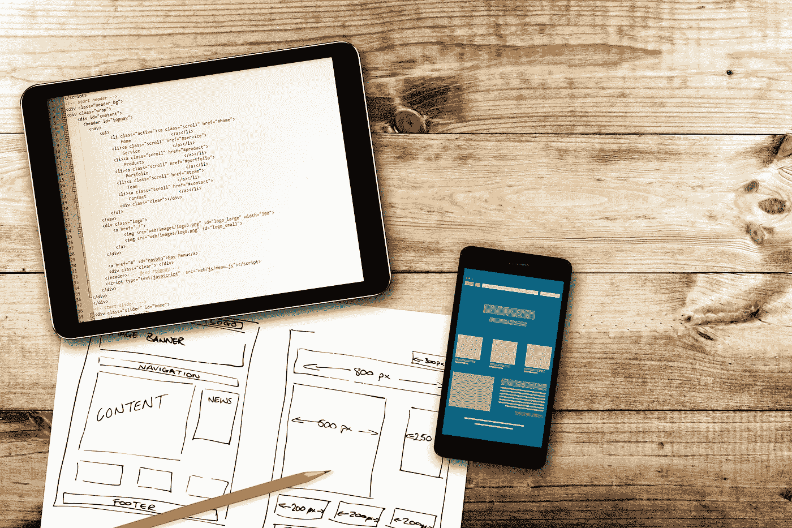

# 移动应用与网站——选择什么以及何时选择

> 原文：<https://medium.datadriveninvestor.com/mobile-app-vs-website-what-and-when-to-choose-74c672ae47c2?source=collection_archive---------6----------------------->

如今，网络上事物发展的闪电般速度令人震惊。某一天对你有用的东西，第二天可能就不管用了，企业越来越难以跟上。在过去美好的日子里，当互联网就像西部大开发一样，各种规模的企业可以在他们的网站上赚钱，只是因为他们有一个网站，而其他人没有多少。不用说，格局已经改变，企业必须适应用户在移动设备上访问他们的网站。这就给很多公司提出了一个选择:是有手机 app 好，还是有网站好。让我们仔细看看。

# 手机 App 和手机网站的区别

这两种技术都是为移动设备而设计的。移动网站将由基于浏览器的 HTML 页面连接而成。它们旨在响应所有可用于访问网站的各种设备，并考虑屏幕大小和布局等因素。从本质上说，它们给了你两个世界中最好的东西:你可以像在一个常规的桌面网站上一样显示你需要传达给客户的所有信息，但你也可以混合一些只能在移动设备上执行的东西，比如添加一个点击呼叫按钮。

 [## 2019 年移动应用开发之路——数据驱动投资者

### 任何在移动应用程序开发行业工作的人，无论他们是专注于在伦敦开发 iOS 应用程序还是…

www.datadriveninvestor.com](https://www.datadriveninvestor.com/2019/01/15/the-path-of-mobile-app-development-in-2019/) 

相反，移动应用程序必须下载并安装在智能手机或平板电脑上。它可以有和你的网站一样的内容，但是有额外的优势，比如可以离线访问。

# 移动应用与移动网站

响应式应用的优势包括:

*   更多的品牌推广机会——由于公司的应用和网站是两个独立的实体，你可以在应用上尝试新的品牌策略和风格。同样重要的是要指出，当用户在手机上访问你的内容时，他们会获得比在电脑上更好的体验。如果有什么是你的网站不能提供给用户的，那么投资[移动开发](https://skywell.software/mobile-app-development/)来摆脱这种限制是值得的。
*   更好的个性化——当响应式应用程序设计正确执行时，您可以允许客户选择他们的偏好，并根据他们的浏览历史为他们提供内容，从而为用户提供更定制的体验。
*   利用所有功能—利用推送通知、设备提醒、即时更新等功能以及许多其他功能来增强客户体验。
*   离线访问——虽然移动应用程序需要互联网连接才能享受所有的可能性，但它们也可以离线工作。
*   品牌形象——因为用户必须下载应用程序，所以它会占据他们屏幕上的空间。这样，即使他们没有使用你的应用程序本身，他们仍然会被提醒你的品牌，因为它就在他们的屏幕上。

以下是你在移动网站上得到的东西:

*   扩大受众范围——用户可以在任何设备上访问网站并轻松分享。此外，客户可以使用搜索引擎找到网站，而不是从各自的商店下载应用程序。
*   更便宜——创建一个响应式网站通常比支付响应式应用程序设计的费用更便宜，尤其是如果你希望应用程序可以在各种平台上使用的话。
*   SEO 的好处——移动优化的网站在搜索引擎排名中将会更靠前，从而提高你的网站流量。
*   易于升级——更新网站比更新手机应用程序要容易得多，也便宜得多。
*   即时可用-用户可以立即访问移动网站，而不必等待应用程序下载。

# 响应式网站与移动应用:选择哪个

随着移动用户数量的增加，这个问题将在很大程度上留在那些希望建立或扩大其移动业务的企业领导人的脑海中。选择哪一个最终取决于你的具体情况。如果你开始建立你的移动形象，你应该先创建一个移动网站，再创建一个应用程序。此外，如果你的预算有限，选择[网络开发](https://skywell.software/web-development/)会更好，但你应该记住，这将限制你向客户提供的个性化水平和你的参与度。例如，在零售业，用户体验非常重要，而移动服务将有助于赢得客户的青睐。此外，您将能够利用手机的功能来提供更加个性化的体验。你还必须考虑到，移动网站的导航可能更具挑战性，因此你需要让用户更容易获得他们正在寻找或检查的内容。

然而，如果你的业务目标是提供可以在移动设备上更好地浏览的内容，那么移动网站就很适合你。例如，如果你是一个博客写手，你所要做的就是以一种吸引人的方式向用户传递信息，并在网上建立自己的形象，那么一个移动网站就足够了。如果你想超越仅仅提供信息，你想与用户互动，以增加品牌忠诚度，只有移动应用程序会给你这样的可能性。

值得指出的是，有些情况下两者都需要。例如，如果你注意到很多人通过智能手机和平板电脑访问你的网站，那么你可以创建一个移动网站，然后向用户提供你的应用程序，在那里你可以与他们建立更密切的关系。

*最初发表于*[*sky well . software*](https://skywell.software/blog/mobile-app-vs-website/)*。*