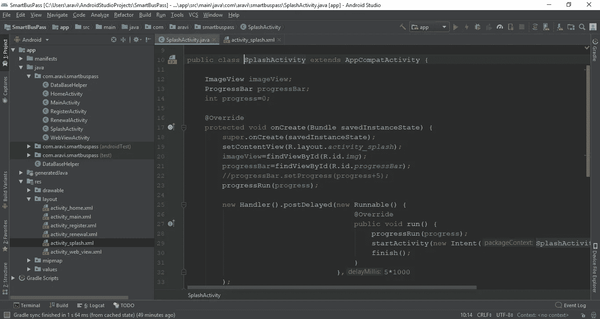

# 移动应用程序开发:本地 V/S 混合

> 原文：<https://medium.datadriveninvestor.com/mobile-application-development-native-v-s-hybrid-d093895fb919?source=collection_archive---------12----------------------->

## 老家很适合生活，但这并不总是可能的，因为时间将决定我们的命运。

Photo by [Samuel Zeller](https://unsplash.com/@samuelzeller?utm_source=medium&utm_medium=referral) on [Unsplash](https://unsplash.com/?utm_source=medium&utm_medium=referral)

几十年来，移动应用程序的开发变得越来越流行，但当时的应用程序开发是在原生环境中完成的，只不过是为了开发 Android 应用程序，开发人员最好使用 JAVA，类似地，为了开发 IOS 应用程序，他们使用 Objective-C。这种趋势目前仍在继续，但原生应用程序开发的问题是，我们只能在特定的环境生态系统中运行我们的应用程序。我们不能把它分配给另一个生态系统。长期以来，这一直是一个大问题。

随着技术的日益发展，新技术被引入市场以构建移动应用。几年来，本地应用程序开发变得非常流行，新技术完全改变了移动应用程序开发环境生态系统。

因此在本文中，我们将探讨本地和混合应用程序开发的各种利弊。除此之外，大多数初学者都面临着一个共同的问题，即他/她应该选择哪种开发方法来开始他们的移动应用程序开发生涯。这些问题可以在这篇文章中得到准确的回答。

Photo by Aravind medamoni.

这些是借助基于操作系统环境的特定编程语言构建的应用程序，例如用于 IOS 开发的 Objective-C、SWIFT、用于 Android 开发的 JAVA 和 KOTLIN 以及用于 Windows Mobile 应用程序开发的 C-SHARP。

原生应用程序开发的主要优点和缺点是—

# 本机应用程序开发的优势

## 流畅的表演

由于我们是在核心编程语言和 API 的帮助下开发应用程序，因此创建的应用程序可以很容易地进行优化。因此，这款应用效率更高，性能也更好。

## 安全性

如前所述，由于应用程序使用核心 API，这些 API 比第三方 API 安全得多，因此为了保护我们的数据，本地应用程序是最佳选择。

## 灵活性

这些应用程序是为特定环境开发的，它们可以很容易地继承操作系统。因此，用户可以轻松地与应用程序交互，并且比混合应用程序感觉更舒服。

## 访问权限

除了上述优点之外，本机应用程序是为特定环境构建的，在该环境中，它们可以轻松地利用完整的硬件资源和操作系统功能，因此它们执行速度快，自动地，用户将感受到比混合应用程序更好的体验。

## 用户化

Android 或 IOS 中有不同类型的设备具有不同的屏幕大小，因此在混合应用程序开发中调整屏幕布局和定制应用程序并不容易，因为它们是基于 web 界面语言构建的。因此，只有本地应用程序开发是调整每个应用程序布局的最佳方式。

# 本机应用程序开发的缺点

## 时间

开发一个应用程序需要大量的开发时间，因为根据每个设备尺寸定制设计需要开发人员和设计人员花费大量的时间和精力。

## 费用

如果你想在其他平台上也有相同的应用程序，因为应用程序只能在单一平台上使用，所以你需要更多的开发人员在不同的平台上开发相同的应用程序，因为大多数开发人员基本上都只在单一平台上有专长。这导致了一个问题。

# 混合应用程序开发

Photo by [Pankaj Patel](https://unsplash.com/@pankajpatel?utm_source=medium&utm_medium=referral) on [Unsplash](https://unsplash.com/?utm_source=medium&utm_medium=referral)

混合应用程序是为在 Android、iPhone、Windows 和 Blackberry 等多种平台上使用而创建的单一产品。它是原生应用和 web 应用的结合。

这些应用程序的构建方式与网站类似。两者都使用 HTML、CSS 和 JavaScript 等传统技术的组合进行开发。然而，混合应用程序的目标不是移动浏览器，而是本地容器中托管的 WebView。这使他们能够访问移动设备的硬件功能。

混合应用程序开发的各种利弊是—

# 混合应用程序开发的优势

## 成本效率

由于我们对所有平台的投资都是一次性的，所以我们不需要更多的开发人员，因此，开发一个产品并将其放入应用商店是划算的。

## 要求

它减少了开发应用程序的需求数量。开发人员不需要学习几种编程来开发应用程序，他们可以直接使用几种可用的开源框架来构建应用程序，例如

1.  React native (Javascript 框架)。
2.  PhoneGap (C-Sharp 框架)。
3.  Flutter(开源谷歌 SDK)。
4.  Xamarin 框架。

## 维护

正如我已经讨论过的，混合应用是在网络核心外壳下工作的网络应用。因此，我们可以根据我们的要求多次改变我们的内容。

## 设计

因为我们可以很容易地改变我们的应用程序内容，我们可以很容易地添加新的布局和功能。混合应用程序是轻量级的，因此它们可以快速加载高质量的图形和内容。所以用户会定期感受到新的体验。

# 混合应用程序开发的缺点

## 用户体验

与原生应用程序开发相比，在不同的移动环境(如 Android、IOS 和 Windows)之间保持适当的用户体验非常困难。

## 表演

混合应用程序在源代码和目标移动平台之间有一个额外的层，尤其是像(React、PhoneGap、flutter)这样的混合移动框架。它会导致应用程序的性能下降。混合应用性能可能因设备而异。而本地应用在所有设备上具有相同的性能。

# 结论

最后，本机应用程序开发和混合应用程序开发之间的赢家很难预测，因为它取决于 ***业务需求。***

如果你想在短时间内开发一个应用程序，那么绝对正确的选择是 ***混合应用程序开发。***

如果你想在市场上拥有良好的声誉，那么 ***原生应用开发*** 将是正确的选择。