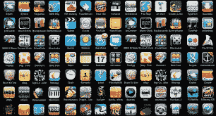

# 移动应用及其在科技世界中的力量

> 原文：<https://medium.datadriveninvestor.com/mobile-apps-and-their-power-in-the-world-of-tech-79eeb99917a0?source=collection_archive---------15----------------------->

Iphone Applications {Source: securitytoday.com}

众所周知，世界的大部分现在都是通过互联网运行的。多年来，对 web 应用程序的需求呈指数级增长。每个公司都需要一个网站，总会有一个网站开发者的市场。但另一方面，虽然每个公司都需要一个网站，但几乎每个公司都需要一个移动应用程序。近年来，移动应用的需求和使用案例也呈指数级增长。

对于一个新的开发人员来说，相对于 web 开发来说，进入移动开发可能是值得的。追求任何一条道路都是有原因的，没有必要把自己局限在其中。来自一个蓬勃发展的 web 开发背景，移动开发的阴谋和好处当然是我考虑和研究的事情。

 [## 2019 年移动应用开发之路|数据驱动的投资者

### 任何在移动应用程序开发行业工作的人，无论他们是专注于在伦敦开发 iOS 应用程序还是…

www.datadriveninvestor.com](https://www.datadriveninvestor.com/2019/01/15/the-path-of-mobile-app-development-in-2019/) 

# **移动开发的好处**

正如我所说的，现在几乎每个公司都需要一个有用而复杂的移动应用。想想你用手机做的所有事情。指路、网上购物、社交媒体、游戏，你能想到的，你都可以下载一个应用程序。手机的实用性在日常生活中产生了一种极度重要的感觉。想象一下，哪怕一天没有电话。我将如何订购我的优步？我将如何与我的家人交谈？我如何查看火车时刻表？电话现在是任何个人生活中一个关键的几乎是必须的部分。在这种情况下，移动开发领域永远不会缺少工作岗位。当你的竞争对手都有时髦的移动应用程序，而你坐在一个 2008 年生产的手机上，你怎么能公平地竞争呢？

手机开发人员不仅职位过剩，而且薪酬也有上涨的趋势。虽然有很多工具可以构建一个简单的网站，像 Wordpress 和 Squarespace 这样的模板网站，但是很少有移动模板网站。在自由职业者的世界里，公司可能为一个网站支付少得可怜的 400 美元，而同一家公司可能为他们的移动应用支付超过 3000 美元。根据 2017 年 Payscale.com 的一份报告，移动开发者的平均工资为 71，102 美元，而网络开发者的平均工资为 53，036 美元。

{Source: signitysolutions.com}

移动应用程序还具有一些 web 应用程序所不具备的内在价值。移动电话可以更方便、更高效地跟踪你的位置、联系人和日历等信息。想象一下，用一张打印好的地图在一个陌生的大城市导航。在这个时代，一些像日常导航这样简单的事情可能看起来微不足道。移动应用程序提供的这些好处在许多情况下是无价的。事实上，移动应用程序就是移动的，这是一个价值，将永远伴随着它的价值。

# **转移技能**

我并不主张从整体上远离 web 应用程序和开发。事实上，对于一个 web 开发者来说，从 web 应用程序转移到移动应用程序本身就更容易。有许多可移植的技能可以让你轻松学习用于构建移动应用的语言和框架。学过任何软件开发之后，人们可以很容易地学会移动开发语言。

{Source: thriveglobal.com}

最近，开发移动应用程序的能力和语言也发生了转变。借助 HTML5 移动开发，用户可以利用之前对 HTML、CSS 和 JavaScript 的知识和熟练程度，通过 Sencha Touch 和 PhoneGap 等工具构建移动应用。除了这些工具和直接技能接力，以下是一些最流行的移动开发语言及其用法:

*   目标 C，Swift:原生 iOS 开发
*   Java:原生 Android 开发

总的来说，追求移动开发，或者至少将工具和语言添加到一个人的技能清单中，是一个非常有趣的想法。我决不会放弃我对 web 开发的追求，但是我肯定会学习一些移动语言，你也应该这样做。