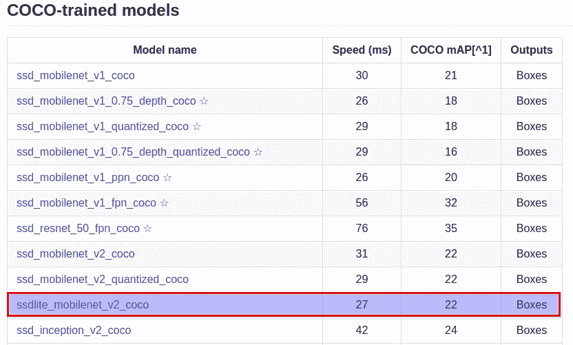

# 具有 TensorFlow Lite 的移动物体检测器

> 原文：<https://medium.datadriveninvestor.com/mobile-object-detector-with-tensorflow-lite-9e2c278922d0?source=collection_archive---------0----------------------->

[](http://www.track.datadriveninvestor.com/1B9E)

本文是上一篇文章[“使用 RASPBERRY PI 和 PYTHON 进行对象检测”](https://medium.com/@Quantum_inc/object-detection-with-raspberry-pi-and-python-bc6b3a1d4972)的逻辑延续。今天，我们尝试使用 TensorFlow Lite 优化对象检测模型并提高性能。

TensorFlow Lite 是在移动和嵌入式设备上运行机器学习模型的官方解决方案。它能够在 Android、iOS、Raspberry Pi 等设备上实现低延迟、小二进制大小的机器学习推理。TensorFlow Lite 为此使用了许多技术，例如允许更小更快(定点数学)模型的量化内核。

[](https://www.datadriveninvestor.com/2019/03/22/fixing-photography/) [## 修复摄影|数据驱动的投资者

### 汤姆·津伯洛夫在转向摄影之前曾在南加州大学学习音乐。作为一个…

www.datadriveninvestor.com](https://www.datadriveninvestor.com/2019/03/22/fixing-photography/) 

我们将优化 SSD Lite MobileNet v2 型号，以便进行适当的比较。

使用随附的 docker 映像并预装 TensorFlow 1.9 和对象检测 API，您可以跳过接下来的两个部分:

```
docker pull c1emenza/tf-1.9-object-detection-api:v1
```

# 安装 Tensorflow

如果主机上没有安装 TensorFlow，请安装 TensorFlow。可以使用[官方指令](http://[https/www.tensorflow.org/install/)。或者按照此处[的说明](https://www.tensorflow.org/install/source)使用 Bazel 从源安装 TensorFlow。还有，要注意 TF 版本，因为 TF 不是向后兼容的。如果用 1.11 版本构建模型，那么模型可能无法在 1.9 版本上工作。所以最好用 1.9 版本进行 TF Lite 优化。

# 安装 TensorFlow 对象检测

如果你不熟悉 TensorFlow 物体检测，欢迎！要安装它，您可以遵循来自官方 git 库的说明。

然后，从 [TensorFlow 检测模型 zoo](https://github.com/tensorflow/models/blob/master/research/object_detection/g3doc/detection_model_zoo.md) 下载 SSDLite-MobileNet 模型，解包。



model ZOO

# 使用 TensorFlow Lite 转换模型

您也可以跳过这一部分，因为我们在这里提供了一个预训练模型。

为了使这些命令更容易运行，让我们设置一些环境变量:

```
export CONFIG_FILE=PATH_TO_BE_CONFIGURED/pipeline.config export exportCHECKPOINT_PATH=PATH_TO_BE_CONFIGURED/model.ckpt export exportOUTPUT_DIR=/tmp/tflite
```

我们从一个检查点开始，得到一个 TensorFlow 冻结图，其中包含可以与 TensorFlow Lite 一起使用的兼容操作。因此，您已经必须安装 TensorFlow 和对象检测 python 库。然后，要获得冻结的图形，使用以下命令从 models/research 目录运行 export_tflite_ssd_graph.py 脚本:

```
object_detection/export_tflite_ssd_graph.py \
 — pipeline_config_path=$CONFIG_FILE \
 — trained_checkpoint_prefix=$CHECKPOINT_PATH \
 — output_directory=$OUTPUT_DIR \
 — add_postprocessing_op=true
```

在 */tmp/tflite* 目录下，你现在应该看到两个文件: *tflite_graph.pb* 和 *tflite_graph.pbtxt* 。请注意，添加后处理标志使模型能够利用自定义优化检测后处理操作，该操作可视为 tf.image.non_max_suppression 的替代。确保不要在同一个目录中混淆 export_tflite_ssd_graph 和 export_inference_graph。两个脚本都输出冻结图:export_tflite_ssd_graph 将输出冻结图，我们可以直接将其输入到 TensorFlow Lite 中，这也是我们将要使用的。

接下来，我们将使用 TensorFlow Lite，通过使用 TOCO(tensor flow Lite 优化转换器)来获得优化的模型。这将通过以下命令将生成的冻结图形(tflite_graph.pb)转换为 TensorFlow Lite flatbuffer 格式(detect.tflite)。或者浮点模型，从 *tensorflow/* 目录运行这个:

```
bazel run -c opt tensorflow/lite/toco:toco — \
 — input_file=$OUTPUT_DIR/tflite_graph.pb \
 — output_file=$OUTPUT_DIR/detect.tflite \
 — input_shapes=1,300,300,3 \
 — input_arrays=normalized_input_image_tensor \
 — output_arrays=’TFLite_Detection_PostProcess’,’TFLite_Detection_PostProcess:1',’TFLite_Detection_PostProcess:2',’TFLite_Detection_PostProcess:3' \
 — inference_type=FLOAT \
 — allow_custom_ops
```

# 在树莓 Pi 上运行我们的模型

要在设备上运行 TensorFlow Lite 模型，我们需要设置 TensorFlow 和 openCV。你可以在这里阅读这个过程[。](https://www.quantumobile.com/mobile_detector/)

现在，让我们实现一个使用“精简”图形的类:

以上所有代码都可以在 [GitHub](https://github.com/QuantuMobileSoftware/mobile_detector) 上获得。

# 摘要

如果我们运行模型的 TFLite 和非 TFLite 版本，我们可以观察到以下情况:

*   固态硬盘 MobileNet Light —平均每秒 1.02 帧；
*   固态硬盘 MobileNet Light 采用 TensorFlow Lite，平均每秒 1.73 帧。

> 从结果来看，我们可以说 TensorFlow Lite 提供了大约 70%的**性能提升**，对于这样一个简单的操作来说，这是相当令人印象深刻的。

*撰稿*[*Klym Yamkovyi*](http://www.linkedin.com/in/kyamkovyi) *校对*[*nadia Pyvovar*](https://www.linkedin.com/in/nadiia-pyvovar/)*[*Cherepanov oleks andr*](https://www.linkedin.com/in/oleksandr-cherepanov/)*

**原载于 2018 年 12 月 7 日*[*www.quantumobile.com*](https://www.quantumobile.com/mobile-object-detector-with-tensorflow-lite/)*。**