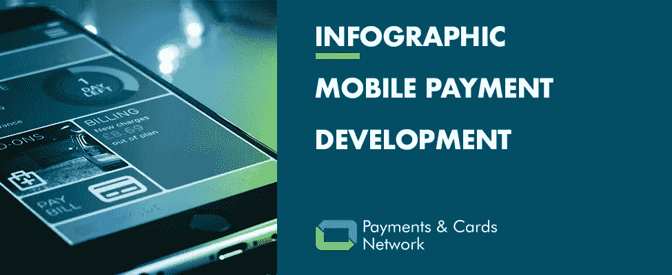

# 移动支付发展(信息图)

> 原文：<https://medium.datadriveninvestor.com/mobile-payment-development-infographic-86d853b4c1c1?source=collection_archive---------7----------------------->

## 你知道移动支付是如何改变世界的吗？下面的信息图总结了一些关键进展。

## 需要强调的一些要点:

据[透明市场研究](https://www.prnewswire.com/news-releases/the-global-mobile-payments-market-is-set-to-grow-on-increasing-smartphone-penetration-853814600.html)报道，2017 年全球支付技术市场价值为【2026，435 亿美元，预计 2018 年至 2026 年年增长率为 **37.8%。据他们称，新兴经济体智能手机的采用率不断上升，以及近场通信(NFC)和销售点(POS)等先进技术的普及，继续推动全球移动支付技术的采用率不断上升。**

由 Machine Machine 进行的一项研究调查了各国手机钱包的使用情况，并突出显示了使用率最高的国家。**据报道，中国是手机钱包使用率最高的国家(47%)**，微信支付和支付宝是最受欢迎的两个支付平台。挪威位居第二，有 42%的公民使用手机钱包。英国占据第三位，有 24%的手机用户使用支付应用。接下来是日本和澳大利亚，分别占手机钱包使用量的 20%和 19%。

在全球移动支出方面，**汇款在 2017 年**的 [**支出中占了 68.9%**](https://www.primeindexes.com/indexes/prime-mobile-payments-index/whitepaper.html) **的大部分，其次是商品购买和账单支付，分别占 23.3%和 5.1%。**

在全球不同数字钱包的使用情况方面，移动钱包在中国的普及使**微信支付以总计** [**6 亿**](https://merchantmachine.co.uk/) **用户**超过其他竞争对手，其次是支付宝，2017 年估计有 4 亿用户。另据报道，36%的 iPhone 用户在手机上设置了 ApplePay，占全球用户的 8700 万。

## 使用不同形式的近距离支付技术可以方便地进行移动支付:

**近场通信(NFC)** :作为射频识别(RFID)的一个子集，NFC 被认为是两个设备之间最流行的非接触式通信方式之一。支持 NFC 的设备会产生射频电流，可被兼容 NFC 的支付机器捕获，以读取和处理支付。交易不需要多级认证，这提高了便利性、安全性和速度。然而，一个主要的缺点是需要一个额外的硬件，通常不会集成到智能手机或 POS 设备中。Google Pay 使用 NFC 在智能手机之间进行转账。

**基于声波的技术**:这项技术使用一种算法将数据编码成声波，可以在没有互联网的情况下传输。当商家的支付设备产生包含加密支付数据的声波时，交易发生，智能手机用户可以通过响应信号使用算法将该声波转换成模拟信号，以完成交易。与 NFC 不同，基于声波的支付不需要额外的硬件，但需要算法的软件。

**磁保密传输**:该技术利用磁信号传输信息。它的功能相当于传统支付卡上的磁条，通常不需要任何额外的软件。该技术利用了令牌化，即使用专有算法将卡的号码转换为唯一的字母数字标识符。该唯一标识符然后被发送到卡的支付网络，在那里它被解密以授权交易。Samsung Pay 利用这项技术进行数字支付。

**二维码**:快速响应(QR)码是旧版二维码的高级形式。在二维码的帮助下，它允许银行提供不同的服务，包括账单支付、移动充值、点对点或点对点转账。它使客户能够在几秒钟内完成支付，并且由于个人数据不会被泄露，因此是安全的。微信支付和支付宝为其用户配备了这种技术来进行交易。

## 对移动支付的未来提出了一些预测:

**实体卡的消亡**:过去三年，全球金融科技行业吸引了超过[1220 亿美元](https://home.kpmg.com/xx/en/home/media/press-releases/2018/02/global-fintech-funding-tops-us-31b-for-2017-fueled-by-us-in-q4-kpmg-pulse-of-fintech-report.html)的投资。这笔钱的一部分已经被用来投资寻找处理支付的新方法。移动钱包的便利性和易用性继续吸引着移动用户。根据[电气和电子工程师协会](https://www.techrepublic.com/article/2030-the-year-mobile-payments-kill-cash-according-to-security-report/)的预测，到 2030 年，移动支付可能会让现金和信用卡变得多余。

可穿戴设备的崛起:可穿戴设备有望在移动支付的未来扮演重要角色。例如，可穿戴设备可以配备 NFC 技术，成为支付系统的一部分。它允许人们在没有互联网连接的情况下，只需在 POS 终端上挥动或点击设备就可以进行支付。其他移动支付公司也在探索使用[蓝牙技术和接近传感器](https://www.quicken.com/future-mobile-payments)来处理可穿戴设备的支付。

**生物识别技术的颠覆**:生物识别支付有望成为移动支付行业的下一个颠覆性技术。使用指纹和面部扫描已经成为解锁智能手机的主流。到 2022 年，预计每年将有[56 亿台支持生物识别的移动设备](https://www.biometricupdate.com/201709/acuity-market-intelligence-publishes-biometrics-in-the-cloud-report)处理 1.37 万亿笔交易，逐渐在全球范围内取代传统的数字身份。

> 想获得支付和金融科技行业的最新消息和更新吗？在 [LinkedIn](https://www.linkedin.com/company/payments-&-cards-network/) 上关注支付和信用卡网络！