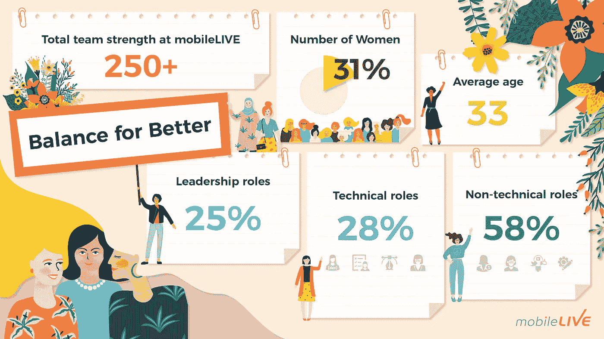

# 移动生活在技术领域超过了女性的全国平均水平

> 原文：<https://medium.datadriveninvestor.com/mobilelive-surpasses-the-national-average-for-women-in-tech-566d781f28e?source=collection_archive---------23----------------------->

布鲁克菲尔德创新和创业研究所最近发布的一份报告称，加拿大女性在加拿大科技劳动力中的代表性不足。鉴于国际妇女节及其主题“平衡更好”，加拿大科技服务提供商 mobileLIVE 决定展示他们如何努力实现更平衡的劳动力。

 [## 数据科学和软件工程哪个更有前途？-数据驱动型投资者

### 大约一个月前，当我坐在咖啡馆里为一个客户开发网站时，我发现了这个女人…

www.datadriveninvestor.com](https://www.datadriveninvestor.com/2019/01/23/which-is-more-promising-data-science-or-software-engineering/) 

“我们是一个由 250 多名技术和非技术人员组成的团队，共同努力为我们的客户加速数字化转型。mobileLIVE 人力资源总监 Aftab Ali 解释道:“毫无疑问，我们非常自豪地宣布，我们的团队中有 31%是女性，这是一项精心策划的战略举措，旨在提高女性在我们团队中的比例。”。

布鲁克菲尔德创新和创业研究所解释说，女性占科技劳动力的 20%,而男性占 80%。此外，该报告还声称，“在所有年龄组中，女性参与科技行业的比率较低。”

2018 年， [MaRS、Feminuity 和 Fortay](https://talentdevelopment.marsdd.com/wp-content/uploads/2018/09/MaRS_Tech_for_All_Report.pdf) 进行了一项调查，以考察多伦多科技行业的多样性、包容性和归属感。多伦多科技行业的女性报告称“与男性相比，多样性、包容性和归属感水平较低。”该报告还强调，“多伦多科技行业的女性也觉得自己在工作中参与决策过程的程度较低。”

“mobileLIVE 的女性平均年龄约为 33 岁，但我们的范围很广，”Aftab 肯定地说。“从 GenZ 到千禧一代，再到婴儿潮一代，每个人都在职业生涯中表现出色。同样值得注意的是，我们的领导团队中有 25%是女性，这在公司内部实现了巨大的平衡。”

目前，mobileLIVE 中 28%的技术职位由女性担任，包括软件开发人员、业务系统分析师、数据科学家、项目经理、质量保证工程师、网络工程师。另一方面，涉及人力资源、营销、财务和行政等部门的非技术性职位中，有 58%由女性担任。

从灵活的工作时间表、照顾孩子的休假、专属购物津贴、健康福利和家庭式文化，mobileLIVE 继续重申其促进女性在工作场所和世界上的平等和平衡的承诺。