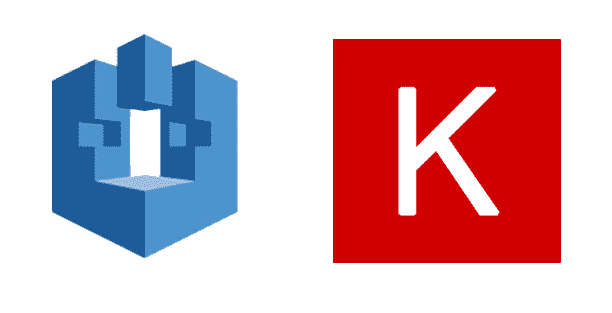
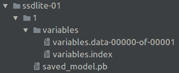
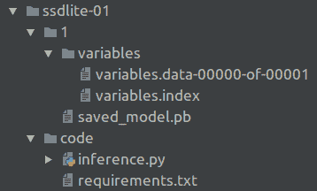

# 使用 AWS SageMaker 的模型部署

> 原文：<https://medium.datadriveninvestor.com/model-deployment-using-aws-sagemaker-8116adea7184?source=collection_archive---------1----------------------->

[](http://www.track.datadriveninvestor.com/1B9E)

如今，人工智能在我们生活的各个领域都有广泛的应用，从电影搜索到太空火箭控制。通常，当我们想到数据科学时，我们会想到如何使用一些数据来建立和训练机器学习模型。之后，模型集成到生产环境(模型与业务系统交互的地方)的过程就开始了。这个过程叫做“部署”。

将模型部署到生产环境有多种方式:

[](https://www.datadriveninvestor.com/2019/01/23/deep-learning-explained-in-7-steps/) [## 深度学习用 7 个步骤解释-更新|数据驱动的投资者

### 在深度学习的帮助下，自动驾驶汽车、Alexa、医学成像-小工具正在我们周围变得超级智能…

www.datadriveninvestor.com](https://www.datadriveninvestor.com/2019/01/23/deep-learning-explained-in-7-steps/) 

*   用 REST API 和其中的模型手动构建一个 web 服务器。例如，创建一个带有处理程序的 Flask 端点，该处理程序接收请求中的图像，使用模型处理图像，并使用图像上检测到的对象进行响应。
*   使用类似 TensorFlow 服务的工具。它是一个灵活、高性能的机器学习模型服务系统，专为生产环境而设计。它涉及机器学习的推理方面。
*   此外，您可以使用云服务来启动和扩展您的生产模型。AWS 及其 SageMaker 就是一个很好的例子。它是一个开发、训练和部署 ML 模型的平台。

在本文中，我们将在 AWS SageMaker 的帮助下研究 Keras 对象检测模型的部署过程。

# AWS SageMaker

Amazon SageMaker 是一个云机器学习平台，使开发人员能够在训练和部署机器学习模型时，在多个抽象级别上进行操作。SageMaker 的一个特性是部署和管理 Tensorflow 实例。它有点像里面有 Tensorflow 服务的 Docker。为此亚马逊提供了一个 [Python SDK](https://www.google.com/url?q=https://sagemaker.readthedocs.io/en/stable/&sa=D&ust=1564478642238000) 。简而言之，SageMaker 运行一个 Docker 图像，TF 从 Amazon ECR 提供服务，并使用 Docker 容器中上传到 S3 的重量。

# 部署

我们采用一个 SSD Lite 对象检测模型，该模型使用来自[git 库](https://www.google.com/url?q=https://github.com/tanakataiki/ssd_kerasV2&sa=D&ust=1564478642239000)的 Keras 实现。因为 Keras 使用 TensorFlow 后端，所以可以将 Keras 权重转换为 Tensorflow 服务。首先，克隆这个 repo 并下载 XceptionSSDLite 的预训练权重。

让我们将重量转换为 TF 服务:

我们需要安装和配置 AWS CLI。AWS 命令行界面(CLI)是管理 AWS 服务的统一工具。只需下载和配置一个工具，您就可以从命令行控制多个 AWS 服务，并通过脚本实现自动化。

之后，我们可以将包含已保存模型的 tar.gz 存档文件上传到 S3。该档案应具有以下结构:

```
Model
|-- Model_version
    |-- variables
    |-- saved_model.pb
```



An example

SageMaker 模型需要打包成. tar.gz 文件:

```
tar -C "$PWD" -czf ssdlite-01.tar.gz ssdlite-01/
```

在创建 SageMaker 模型之前，我们需要将它上传到 S3:

现在，我们可以使用上传的权重创建端点:

几分钟后，当端点被初始化时，我们可以使用它:

正如您在上面看到的，我们应该在向端点发送请求之前调整图像大小并进行规范化。

Sagemaker 允许我们添加前/后处理。为了做到这一点，我们需要用“推理. py”脚本添加文件夹“代码”,如果脚本使用任何库，我们在其中添加一个处理程序以及“requirement.txt”文件。欲了解更多信息，请咨询此链接。

让我们添加预处理(使用链接从 S3 加载图像，调整大小和正常化)和后处理(边界框修复):

因此，最终归档的结构应该如下:



model’s folder

你注意到我们没有使用 OpenCV 进行预处理吗？就是 OpenCV 在 Docker 容器里面的一些像 libsm6 或者 libxext6 这样的包有问题。而且我们无法访问容器来修复这些问题。

之后，将新模型存档上传到 S3，并使用最后的权重重新创建端点。

# 摘要

正如你所看到的，AWS Sagemaker 是一个非常有趣和有用的工具。它允许快速简单地部署 ML 模型。但是任何事情都是有成本的——使用它我们会失去控制，有时这是很关键的，而且非常不方便。

有用的链接:

*   [https://github . com/AWS/sagemaker-tensor flow-serving-container](https://www.google.com/url?q=https://github.com/aws/sagemaker-tensorflow-serving-container&sa=D&ust=1564478642243000)
*   【https://github.com/awslabs/amazon-sagemaker-examples 

*撰稿*[*Klym Yamkovyi*](http://www.linkedin.com/in/kyamkovyi?source=post_page---------------------------) *校对*[*nadia Pyvovar*](https://www.linkedin.com/in/nadiia-pyvovar/?source=post_page---------------------------)