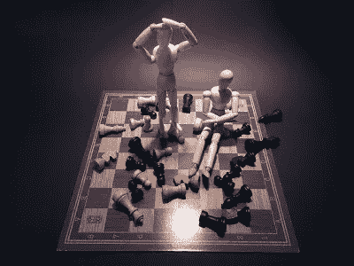

# 模拟典型的金融危机

> 原文：<https://medium.datadriveninvestor.com/modeling-a-typical-financial-crisis-6108dfddf5a6?source=collection_archive---------9----------------------->

上周，我偶然听到有人提到白芝浩定律，该定律本质上是“向有偿付能力的公司，以良好的抵押品为抵押，以惩罚性利率无限制放贷”。白芝浩在他那个时代最为人所知的是担任《经济学人》的编辑，列宁称这份报纸为“为英国百万富翁代言的杂志”。但我认为，我们不应该因为他的阶级地位而不考虑他。他担心的事情和我们担心国家的物质福利一样。他是在 1873 年恐慌的阴影下写下这篇文章的，这场恐慌导致了所谓的长期萧条，或者说是大萧条，直到 60 年后才被冠以这个头衔。

除了在十九世纪的历史学家和一些经济学家的头脑中，这次衰退今天被遗忘了，但是白芝浩的统治继续存在。他因 2008 年后的救助而被引用，即使我们不知道这些公司的偿付能力有多强，或者抵押品有多好，或者我们是否使用了足够高的罚款率来使支撑足够痛。我们仍然可以援引白芝浩定律，这意味着我们仍然可以看到商业周期的轮廓，并将周期的起伏视为可以建模的更广泛的现象。

 [## 另一场精心策划的全球经济危机正在逼近？如果我们的数据经济可以帮助它|数据…

### 我们的 DApp 的开发，称为 DECENTR，目前正与我们的 R&D 同步进行，作为我们即将到来的…

www.datadriveninvestor.com](https://www.datadriveninvestor.com/2019/03/06/another-engineered-global-economic-crisis-looming-not-if-our-data-economy-can-help-it/) 

尽管如此，正如查尔斯·金德尔伯格(Charles Kindleberger)在他的书《狂热、恐慌和崩溃》(Manias，Panics，and Crashes)中所说，历史学家希望仔细观察并详细描述每一次崩溃——对于那些经历过崩溃的人来说，这感觉像是一次专门针对你的独特的恶意事件，特别是在西方，因为最近几代人的崩溃次数较少。

[https://www.pexels.com/@pixabay](https://www.pexels.com/@pixabay)

我们可以回过头来大致描述一次典型的崩溃，这就是金德尔伯格在他的书的第二章中所做的。金德尔伯格用明斯基的作品来画他的模型。按照这种观点，崩盘是基于信贷流动。随着经济增长，杠杆率也在增长，人们对资产价值和未来的增长路径更加乐观。所以，经济在增长，银行在分发钱。这种增长来自外部事件。来自体系外的某种积极冲击，让人们重新思考自己的头寸、未来的增长路径以及他们借入持有的资产的风险。这种积极的冲击带来了繁荣；感觉这一次不同了。金德尔伯格指出，从高速公路的发展到互联网技术，冲击是多种多样的。信贷和繁荣携手并进，这是一个自我强化的循环。这可能会使经济进入一种需求超过供给的乐观状态，推高价格并造成通货膨胀。尽管现在回想起来，这些措施显然会导致毁灭，导致不参与繁荣，甚至让你容易被指责为把钱留在桌上。作为一个商人，甚至只是一个个人，世界上最糟糕的事情不是变得不富有。最糟糕的是当你周围的人变得富有时，你却没有变得富有。繁荣可以扩散——随着投资抛出现金，资金从狂热中流出。大量资本坐在那里等待事情发生。日本人在曼哈顿买了房地产，美国在线与时代华纳合并，每一次，这都是不会出错的新经济。

不过，这种狂热找到了一个顶点。一直都是。迟到的人开始买进，擦鞋男孩正在传递股票提示。每个人都被吸进了先动者开始寻找获利机会的点。观望的人越来越少，意味着价格不会被快速抬高。人们开始怀疑这是不是顶部。所以，他们卖光了。其他人看到这一点，他们出卖了。信贷海啸已经崩溃，人们开始试图抛售。卖方多于买方，资产价格暴跌。基于更高价格借贷的人开始认为他们的债务是不可逾越的，所以他们必须出售。崩溃发生了，要么突然发生，要么以慢动作发生。我让金德尔伯格用这句漂亮的话来解释下面的问题:“直到价格下跌到如此之低，以至于投资者被诱惑去购买流动性较差的资产，或者直到通过限制价格下跌、关闭交易所或以其他方式结束交易来停止资产交易，或者最后贷款人成功地说服投资者，资金将达到满足现金需求的数量，因此证券价格将不再因为流动性短缺而下降”(32-3)。

问题是，如果你接受这种增长到狂热到崩溃的模式，你如何防止它？在筹备阶段，有各种各样的不正当投资，事后看来，这些资本投资不当，但投向这些项目是有意义的。例如，在芝加哥，河边的地面上有一个洞，他们打算在那里建造一座 2000 英尺高的螺旋塔，这是世界上最高的全住宅楼。在房地产泡沫破裂之前，这些计划看起来很不错。你会干预以阻止泡沫吗？你甚至能在泡沫上升时识别出一个吗？格林斯潘在 1996 年对“非理性繁荣”发出警告，但他仍然放任其发展。从政策角度来说，很难介入并说你现在创造了太多的财富，让我来阻止它--即使这是央行工作的一部分。另一件要做的事情是等待，直到坠机，并尽量使其软着陆。即使这样，我们也有上面看到的问题。白芝浩说，有偿付能力的企业需要良好的抵押品——随着世界开始燃烧，这两者都很难找到。如果你什么都不做，那你就什么都没做，靠边站，直到找到底部，让这个循环一次又一次地运行，直到世界末日。

*最初发表于*[*【http://econautodidactic.blogspot.com】*](https://econautodidactic.blogspot.com/2019/07/modeling-typical-financial-crisis.html)*。*