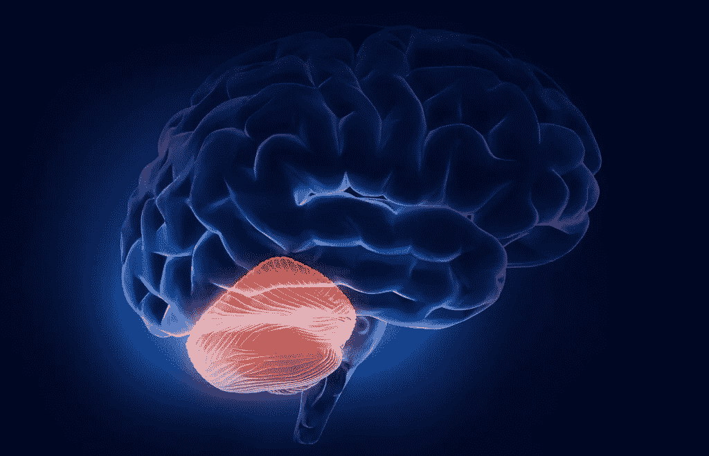
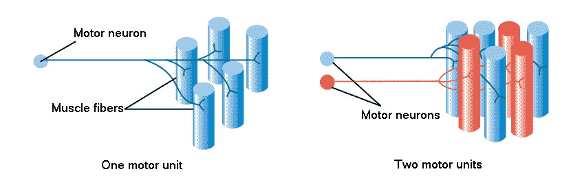
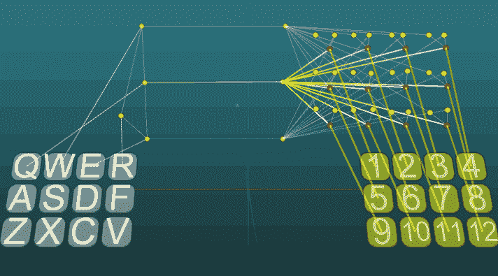
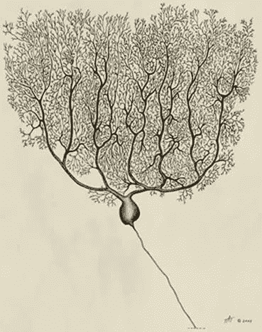
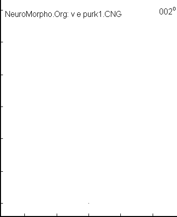
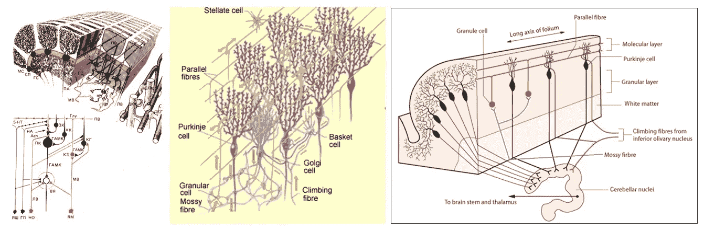
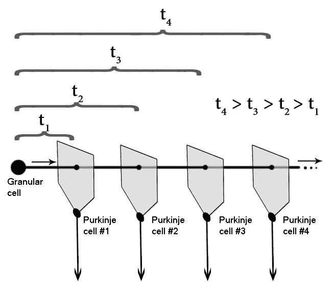
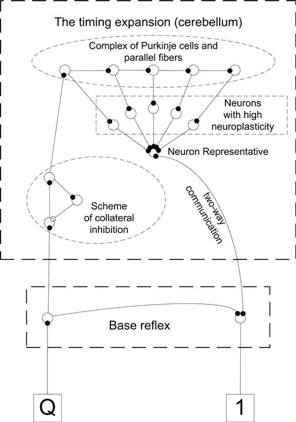
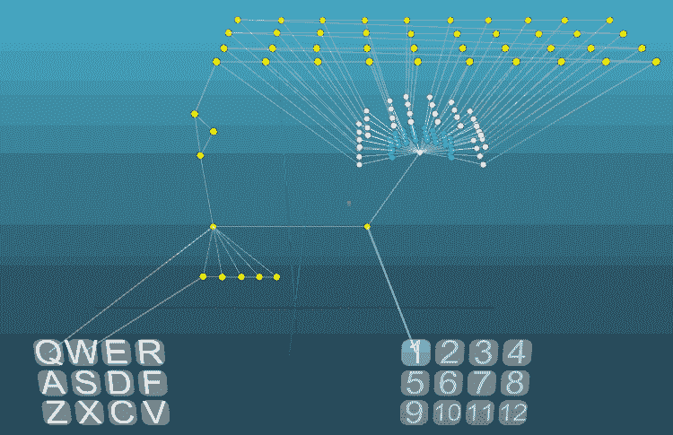
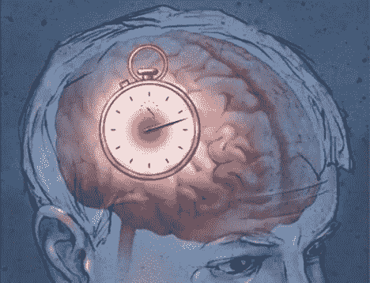

# 小脑的建模

> 原文：<https://medium.datadriveninvestor.com/modeling-of-the-cerebellum-c841023a4dcf?source=collection_archive---------9----------------------->

小脑有什么令人惊讶的地方？这是大脑的一部分，它让我们有机会欣赏音乐的美丽和辉煌，舞蹈动作的准确和优雅。这是大脑中一个神奇的部门，执行着一项非常有意义的功能。

大脑和神经系统作为一个整体使用相同的离散信号，即振幅相同的短脉冲。控制不同器官的方法是改变单位时间内的脉冲数，也就是信号的频率。此外，对受体的影响程度由脉冲频率的变化精确确定。

我们的运动系统有潜力做出非常精确的动作，平滑的运动或精确的肢体运动。为了实现这一点，管理中需要高度灵活性的肌肉被分成了运动单元。运动单位是运动神经元和相关的肌肉纤维。参与活动的运动单元越多，肌肉收缩产生的力就越大。此外，不同运动单位的肌肉纤维为了负荷分布和作用领域的目的而交织在一起。因此，不仅由于运动单元的激活频率，而且由于参与活动的运动单元的总数，控制肌肉是可能的。

想象一个简单的反射，其头部的激活导致肌肉的完全收缩。在这种反射中，所有的运动单位几乎同时被激活。但是在生命活动的过程中，可能需要，例如，平滑地减少，或者计划放松肌肉，或者它只需要平滑地放松肌肉，但是随后快速地收缩肌肉。

在模拟的例子中，考虑到每个动作的指示器是一个肌肉的运动单位，几个反射导致假想肌肉的激活的不同特征。在这个例子中，有一个基本反射，它的激活导致所有运动单位的同时启动。在这种反射的基础上，产生了确保运动单元顺序打开或关闭的反射，这增加了一定的时间因素。

在发展的过程中，动物学会控制自己的身体，学习不仅以创建联想、链接某些事件的形式发生，而且以这些事件在时间上的比例发生，而且相当准确。当然，兴奋通过反射弧的传播给出了一个时间因素，但反射形成的机制不允许这个因素足够准确。在神经系统中，应该有一种机制可以让你记住动作之间的时间间隔，并且对于再训练的可能性足够灵活。

在发展大脑工作理论和研究神经系统时，我对小脑感到非常惊讶，它的特征与大脑结构的其余部分非常不同。首先，这是小脑的大小和规定功能的比例。小脑约占整个大脑的 14%(对于动物来说，这个比例会更大)，众所周知，小脑用于协调我们的身体，也执行一些自主功能。在这种情况下，小脑的失败导致协调性的破坏，表现为难以保持平衡、动作不准确、书写不均匀、说话缓慢等。对于动物的成功来说，这些功能是非常重要的，但是小脑的大小比例如 Wernicke 和 Broca 区域的总和还要大，尽管这些区域负责人类的语言，也就是说，它们以较小的尺寸执行更复杂的功能。

其次，小脑中有不寻常的神经元——浦肯野细胞。这些细胞的树突从细胞核的一侧强烈分支，在一个平面上分支。这种细胞形式一定是由什么引起的，通常神经元的树突在平面上没有严格的定向生长。

第三，小脑皮层的结构明显不同于新皮层的结构。在小脑皮质中，仅区分三层:分子层、浦肯野细胞层和颗粒层。如果新皮层的进化增加了它的层数，那么这不会发生在小脑。通常，进化不会触及那些工作良好并充分发挥其功能的东西。鉴于小脑进化得相当早，我们可以说，其皮层的结构在其功能下通过进化得到了完美的完善。

小脑皮质结构的特征之一是存在平行纤维——这些是颗粒细胞的轴突，它们彼此平行传播，并垂直于浦肯野细胞颗粒的生长平面。可能，浦肯野细胞的形状是由于它增加了浦肯野细胞的平行纤维和树突与它们的皮质生长和发育接触的可能性。浦肯野细胞是颗粒细胞平行纤维的“陷阱”。

众所周知，动作电位具有短脉冲的形式，并以有限的速度在神经组织中传播，大约为 1m/s。这导致了平行纤维和浦肯野细胞的复合物是一种通过激活颗粒细胞来触发的计时器，并且通过沿着平行纤维传播的动作电位对浦肯野细胞的顺序激活来计算时间间隔。

基于这一假设，一个模型被开发出来，它代表了小脑结构的一个强有力的简化。通常浦肯野细胞在小脑的细胞核中具有抑制作用，以及许多其他差异，但为了简单起见，我们将不考虑所有这些。该模型的目的是形成对小脑原理的理解。

想象一个简单的反射，一个动作会发生在一个单一的刺激上。我们需要训练神经网络，使给定的刺激不是一个单一的答案，而是一系列有一定节奏的反应。用通常的联想法几乎不可能做到这一点。你需要某种计算事件间隔时间的工具。这样一个工具就是定时扩展，它是生物小脑的一个类似物。

时间扩展的核心是一个顺序连接的神经元素链。运行这个链的信号通过侧枝抑制方案，这个电路只跳过一个信号，链的元素之间没有相互作用和竞争是必要的。所有导致学习的变化都发生在具有高度神经可塑性的神经元的突触中。每一个这样的神经元都有自己的元素，类似于浦肯野细胞和平行纤维的复合体。

当具有高神经可塑性的神经元的活动与代表反射弧的一部分的神经元一致时，连接它们的突触的强度和强度增加。在没有巧合的情况下，会有强度的降低。这些变化的速率取决于神经元的神经可塑性的测量。最初，可塑性神经元的突触强度不足以激活一个代表，只有在几个连续的突触发生作用后才足以激活突触。重复几次后，这个位置就会加强。当然，我们可以通过改变神经元的可塑性来控制训练的速度。

现在，如果我们重复反射，以必要的节奏激活刺激，那么过一会儿，通过刺激的一次激活，我们会以记忆的节奏得到答案。

在这个例子中，节奏被记住了。当然，任何节奏都可以设定。示例方案基于早期文章中描述的模型神经元。

可以得出结论，小脑的功能是在各种运动动作中保存短时间间隔的记忆。

从定时扩展的工作实例中可以看出，它只能用一个电机单元工作，对于每个电机单元它都需要自己的综合体。每个运动单位都有自己的浦肯野细胞链，由于每个运动单位在时间上的协调，不仅可以学习“拍出”节奏，还可以学习运动的性质(平滑度、锐度)。

当人们的活动与需要记忆运动动作的准确时间间隔(计时)的任务相关时，他们的小脑会增加。最重要的是音乐家、舞蹈家和运动员。

可以注意到，相当数量的细胞需要在记忆中储存时间间隔，这导致小脑的相对尺寸较大。但是进化选择的方案主要是为了可靠性和灵活性。

当创建大脑的主要模型时，没有必要考虑进化选择的所有方案，并且可以使用像浦肯野细胞和平行纤维的整体复合体一样工作的模型神经元。