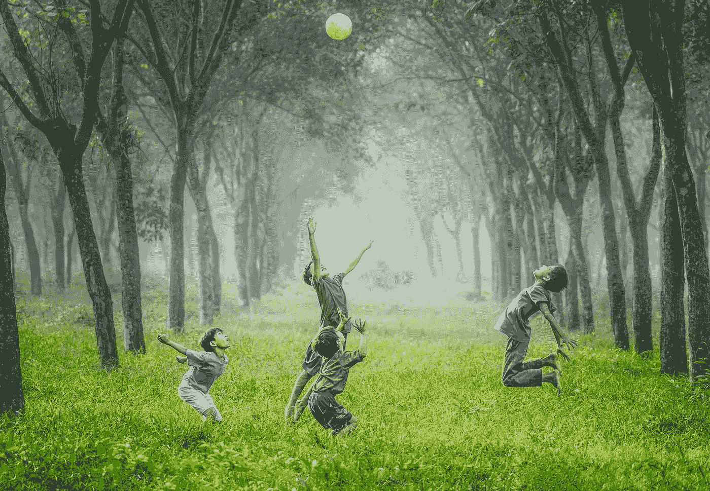
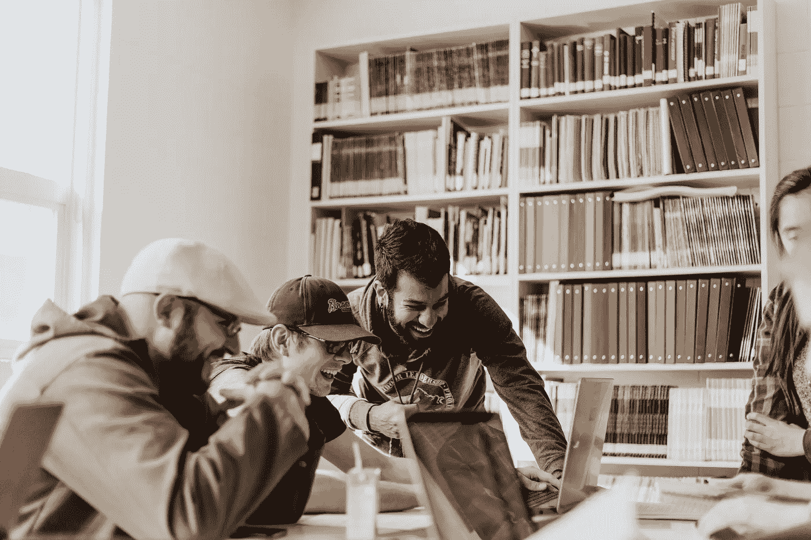

# 现代教育方法

> 原文：<https://medium.datadriveninvestor.com/modern-approaches-to-education-e43eedef6707?source=collection_archive---------5----------------------->

—好奇的头脑对知识有着永不满足的渴望。

Photo by [Aaron Burden](https://unsplash.com/@aaronburden?utm_source=unsplash&utm_medium=referral&utm_content=creditCopyText) on [Unsplash](https://unsplash.com/search/photos/education?utm_source=unsplash&utm_medium=referral&utm_content=creditCopyText)

从历史上看，政府控制着公共教育的课程和测试。经过几十年的教学方法的研究和创新，科学界慢慢认识到现代生活和当前的教育模式不同步。

一些问题是:

*   缺乏维持学术生活的计划习惯。
*   无效的写作、倾听和领导技能使团队合作变得复杂。
*   课程过时或不相关。
*   学生普遍缺乏专注、梦想和归属感

 [## 教科书行业如何最终被颠覆，并将继续改变|数据驱动…

### 就此而言，教科书产业在美国乃至全世界都有着悠久的历史。事实上，他们已经…

www.datadriveninvestor.com](https://www.datadriveninvestor.com/2018/09/25/how-the-textbook-industry-has-finally-been-disrupted-and-will-continue-to-change/) 

结果是，大多数公司只在一次培训或多次实习后才雇佣新员工。在 LinkedIn 上，你会看到要求至少三年工作经验的初级职位。在我看来，这些要求是不合理的，并且减缓了社会流动的速度。

幸运的是，世界从未停止旋转。

因此，这里有四种解决教育危机的现代方法。

# 基于好奇心的学习

在路易斯新学校，他们认识到兴趣对于有意义地理解世界至关重要。

这所学校的老师将科目与孩子们的输入联系起来，例如，当学生对一条河流感兴趣时，老师会将波函数的数学原理与该科目联系起来。

孩子们通过模仿老师的行为学到了很多东西。因此，工作人员以开放、好奇、批判和嬉戏的精神行事。

# 基于快乐的学习

在纪录片[中，米歇尔拜访了对教育有独特见解的芬兰人。](https://www.youtube.com/watch?v=4-DcjwzF9yc)

为了最大化学习的投入，头脑必须休息。因此，上课时间和家庭作业保持在最低限度。

标准化考试、私立学校和自上而下的控制已经成为过去。

所有的学校都成了发现快乐的公共场所。

Photo by [Robert Collins](https://unsplash.com/@robbie36?utm_source=unsplash&utm_medium=referral&utm_content=creditCopyText) on [Unsplash](https://unsplash.com/search/photos/happy-child?utm_source=unsplash&utm_medium=referral&utm_content=creditCopyText)

# 速成学习法

你学习经济、法律或医学是因为你的父母想保障你的未来，但你私下里总是希望成为其他人吗？

别担心，现在有新兵训练营。

在那里，他们会在 1.5 到 6 个月内改变你的生活，这取决于职业所需的技能。

专门的教育机构可以教你一门专业的设计/成长黑客/编码技能，帮助你创建自己独特的作品集，有的还能为征集过程提供便利。

[UI 设计训练营 9 周](https://www.ironhack.com/en/courses/ux-ui-design-bootcamp-learn-ux-design?utm_source=google-sea&utm_medium=cpc&utm_campaign=AMS_lead_campus_EN&utm_term=generic&utm_content=ux&gclid=CjwKCAjw5fzrBRASEiwAD2OSVx7lp4WKqTxlOexL7eLy76LWkmibW279aCc2D3rEE2yS1AoHRGoQbBoC5aQQAvD_BwE)[铁黑](https://www.ironhack.com/en)

[6 个月成长](https://growthtribe.nl/growth-hacking-academy/6-month-traineeship)[成长部落](https://growthtribe.nl)的 6 个月 AI 实习

[获得 IOS 开发纳米学位](https://www.udacity.com/course/ios-developer-nanodegree--nd003)[uda city](https://www.udacity.com/career-services)6 个月

Photo by [Priscilla Du Preez](https://unsplash.com/@priscilladupreez?utm_source=unsplash&utm_medium=referral&utm_content=creditCopyText) on [Unsplash](https://unsplash.com/search/photos/study?utm_source=unsplash&utm_medium=referral&utm_content=creditCopyText)

# 教育中的常见做法

公有是所有权的公共、私人和个人壁垒瓦解的过程。经常在城市规划和高等教育发展中看到，人们重新思考机构固有的基本关系。

例如，在 [UVA Commoning](https://www.folia.nl/actueel/105016/het-belang-van-een-goed-gesprek-wordt-onderschat) 中，邀请学生和教师交流阿姆斯特丹大学的开放和安全空间方向，并对发现的问题给出建设性的反馈。

或者当 Silke Helfrich 在 2012 年组织了一个暑期学校，学生和老师共同创建了这个项目，这个项目极大地改变了参与者。

要进一步研究，请阅读大卫·波利耶&西尔克·赫尔弗里奇写的《自由天赋与生存——平民的反叛力量 》一书。

# 最后的想法

这些教育创新将为人类进化的下一次范式转变做好准备；让我们更好地理解意识、量子物理和精神疾病等复杂性。

因此，我们生活在一个新世界的黎明。[尤瓦尔·诺亚·哈拉里](https://www.youtube.com/watch?v=XOmQqBX6Dn4)会称之为 [*德乌斯人*](https://www.youtube.com/watch?v=4ChHc5jhZxs) *。阿尔贝托·维罗多和冰人维姆·霍夫将它描述为控制人类 DNA。*

用我的话来说，就是为人类的命运承担集体责任。

Photo by [Pete Nowicki](https://unsplash.com/@shadypete?utm_source=unsplash&utm_medium=referral&utm_content=creditCopyText) on [Unsplash](https://unsplash.com/search/photos/life?utm_source=unsplash&utm_medium=referral&utm_content=creditCopyText)

*注:这篇博客反映了我对西方当前教育模式的看法。写这篇文章是为了让你对教育的替代方法感到好奇，而不是作为学术研究的来源或引发一场辩论。我是弗吉尼亚大学的学士学生；因此，我意识到我的偏见。我希望你尊重我的观点，并能有意识地反思教育的现状和未来。*

*这篇博文是 30 天创意写作挑战的第 8 篇。*