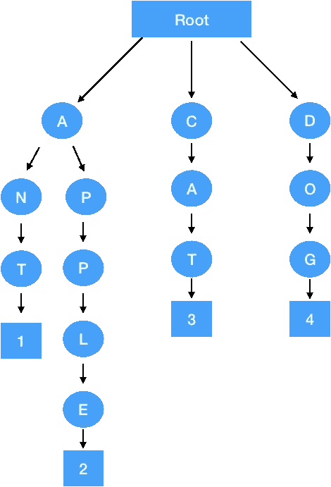
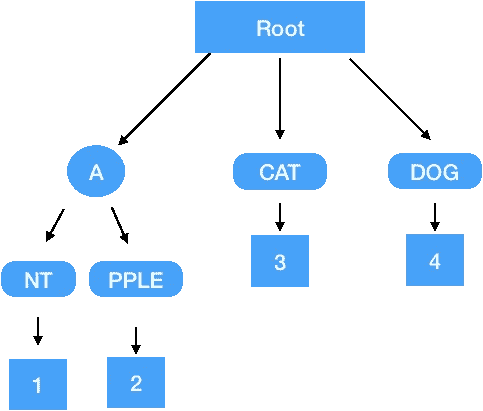
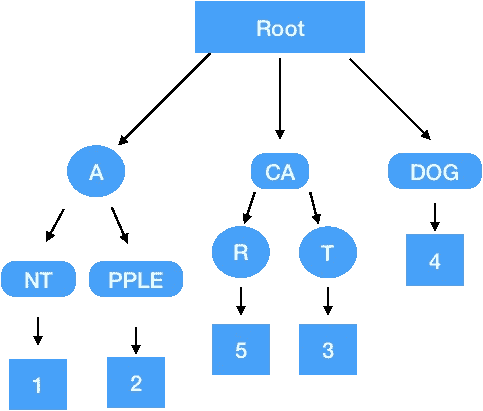
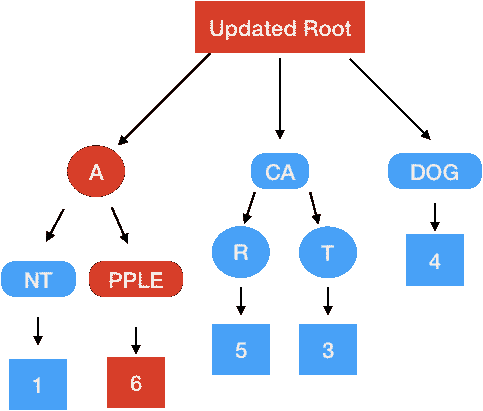
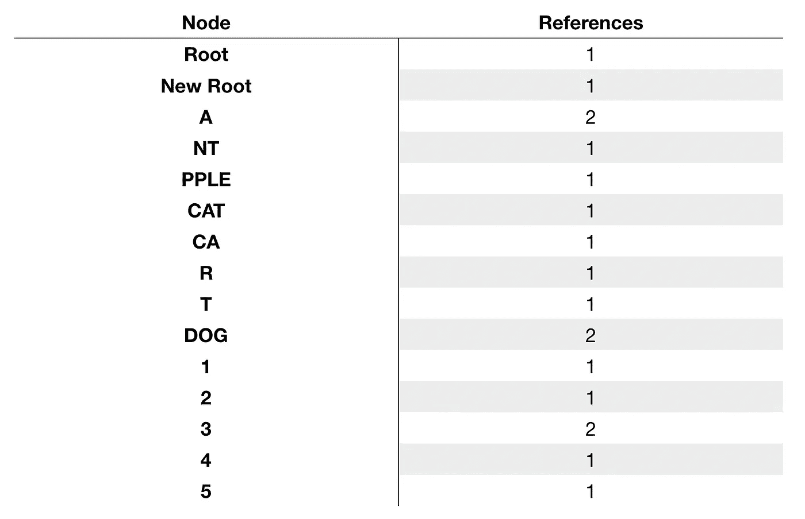
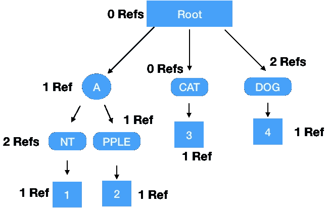
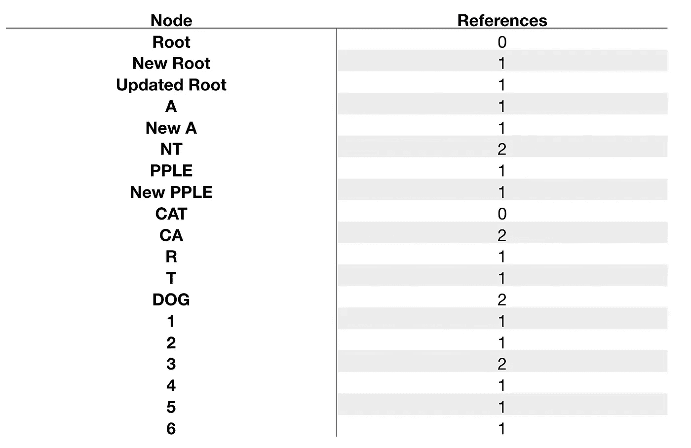

# 修改 Merkle Patricia Trie

> 原文：<https://medium.datadriveninvestor.com/modifying-the-merkle-patricia-trie-4b15813d8e6b?source=collection_archive---------0----------------------->

在过去的几个月里，我的重点完全放在了 Hycon 代码库向 rust 的迁移上，这导致了对系统的各个方面的深入研究，而我对此并没有太多的投入。我目前的工作领域是世界政府。[上一篇文章](https://medium.com/@niallmoore22/binary-merkle-trie-aad76f422983)提到了我们希望使用的一种新的高性能状态树，然而向后兼容性迫使我也实现了我们当前的状态树，以允许正确处理这种转换。

## 什么是 Merkle Patricia Trie？

这个结构对于任何使用过以太坊的人来说都很熟悉，本质上它是一个散列基数树。最简单的解释方式是视觉上的，用文字作为我们的钥匙。假设我们将单词限制为小写英文字符。这使得树中的每个节点的发散因子为 26，或者更简单地说，一个单词中的下一个字母有 26 种可能的选择。让我们首先构建一个简单的树，树中有 4 个单词。我们将使用的单词是蚂蚁、苹果、猫和狗，数据为 1、2、3 和 4。

Naive Tree with 4 Keys

为了从这个树中提取相关数据，需要读取关键字中的每个字母，并沿着相应的路径前进。这种布局实际上代表了这种结构的最坏情况，其中每一层都是饱和的，必须读取整个密钥来提取数据。幸运的是，我们可以对更稀疏的问题空间进行一些优化。

 [## 正在改变行业的 5 个真实世界区块链应用——数据驱动的投资者

### 除非你一直生活在岩石下，否则我相信你现在已经听说过区块链了。而区块链…

www.datadriveninvestor.com](https://www.datadriveninvestor.com/2019/02/13/5-real-world-blockchain-applications/) 

## 优化树

在这种情况下，可以进行的主要优化是分支压缩。在上面的例子中，很明显在某些分支的末端只有一个数据点，特别是 AN-、AP-、C-和 D-。我们可以压缩这些分支，这样只需要一次数据库查找就可以到达唯一分支点之后的数据。生成的树看起来有点像这样。

Compressed Tree

从上面可以看出，为了检索存储在地址“APPLE”的数据，只需要 3 次数据库查找(ROOT，A，PPLE)，而不是 6 次。

## 插入

为了插入到树中，我们需要遍历，直到沿着键的路径到达一个空节点，然后在该位置插入一个表示该键的剩余部分及其数据的新节点。假设我们正在插入一个键为 CAR、值为 5 的节点。从根节点开始，我们将沿着“C”分支往下走，这个分支目前只包含“CAT”。在比较了这些键之后，我们可以看到需要两个新的节点，一个表示到位置 CA 的遍历，另一个表示从 car 开始的“R”分支。我们必须将 CAT 节点拆分成一个新的 CA 节点，并将数据从 CAT 节点移动到新 CA 节点的“T”位置。然后，我们在 CA 节点的位置“R”添加一个包含值 5 的新节点。根节点有三个子节点——A、CA 和 DOG。

Updated Tree with CAR

## 从树上看书

为了从树中读取数据，我们需要两条信息——我们的当前位置，以及我们想要遍历的下一个节点的数据库位置。假设我们想要获得“APPLE”的数据，我们首先需要从我们的数据库中读取根节点，以给出我们的起点。然后我们切掉第一个字符，检查“A”位置的根节点。这将为下一个节点提供一个 DB 引用，允许我们沿着树向下移动。我们继续以这种方式遍历，直到我们到达我们的关键结束。在压缩分支的情况下，当键匹配分支地址时，我们可以沿着键前进。在读取“A”节点时，我们的键的剩余部分是“PPLE ”,所以我们寻找“P”节点。“P”节点是一个包含“PPLE”的压缩节点，这意味着我们的操作已经完成,“P”节点中包含的数据就是我们试图检索的数据。在多次读取的情况下，从根开始遍历树是没有意义的，所以我们可以缓存我们已经采用的路径，并从当前键与我们已经采用的路径分开的点开始。

为了扩展上面的例子，假设我们想要检索 ant 和 APPLE 的数据。对于 ANT，我们检索根节点、“A”节点和“NT”节点。为了检索 APPLE，我们可以从“A”节点开始遍历，我们已经访问过这个节点，所以现在检索 APPLE 需要一个额外的 DB 查找。

## 更新条目

在本例中，APPLE 地址被更新为值 6。首先，我们需要从树上取回苹果。作为这个过程的一部分，我们将检索节点 root、A 和 PPLE。这些节点在树中的物理位置不会改变，但是由于我们更新了信息，数据库条目会有所不同。PPLE 现在将包含值 6。现在，a 将包含 NT 的现有数据，以及新的 PPLE 节点。根节点将包含更新的 A 节点、CA 节点和 DOG 节点。

## 删除根引用计数

允许安全删除和维护数据库的机制称为引用计数。作为任何操作的一部分，我们可以跟踪在操作过程中没有改变的节点。让我们参考上面的例子来逐步完成这个操作。

我们的初始状态包含 6 个节点:根节点、A、NT、PPLE、CAT 和 DOG。这些节点中的每一个都用参考计数 1 和数据条目 1-4 初始化。当我们通过插入“CAR”来改变我们的树时，我们的引用被调整如下。

Updated Reference Count after CAR Insertion

现在我们可以看看在 APPLE 上执行更新操作时会发生什么。

Reference Count After Update to APPLE

从上面可以看出，我们添加了一些新节点(更新的根节点、新的 A 节点、新的 PPLE 节点和 6 节点),并且更新了未更改节点的引用计数。

为了使我们的数据库更小，我们决定删除旧的根。为了安全地做到这一点，我们可以检查该根引用的节点的引用，并决定是否可以从 DB 中删除这些条目。为了唤起我们的记忆，让我们回顾一下我们最初的树，这次是带注释的引用。

Reference Counts for Original Root

当我们删除一个根时，我们必须遍历树并减少子树的引用计数。如果任何节点的引用计数变为零，我们就遍历它的子节点并递减引用计数。

Updated Ref Counts for Delete Operation

查看上表，我们可以看到，在此操作之后，可以安全地删除 Root 和 CAT 的 DB 条目，因为它们在任何地方都不再被引用。

## HYCON Merkle Patricia Trie

上面的例子使用字母作为分支度量，HYCON 树在字节级分支，这意味着每个节点可能有 256 个分支。实际上，这意味着我们有一棵矮胖的树，可以说是一棵大树。Hycon 树中有大约 11000 个帐户，结果是每个帐户最多只需要 3-4 次数据库查找就可以检索到余额。

## 概括起来

这篇文章的重点实际上是深入研究 rust 中 HYCON 树的具体实现细节，然而，它有点罗嗦，所以我将把它留到下一篇文章中，并将这篇文章作为 Merkle Patricia 树的初级读本。