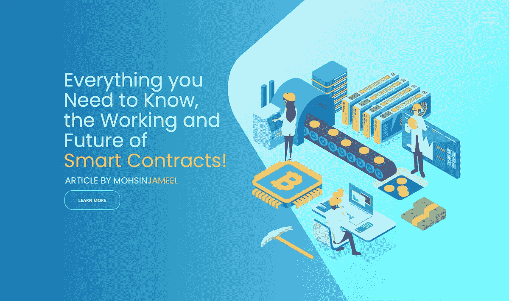
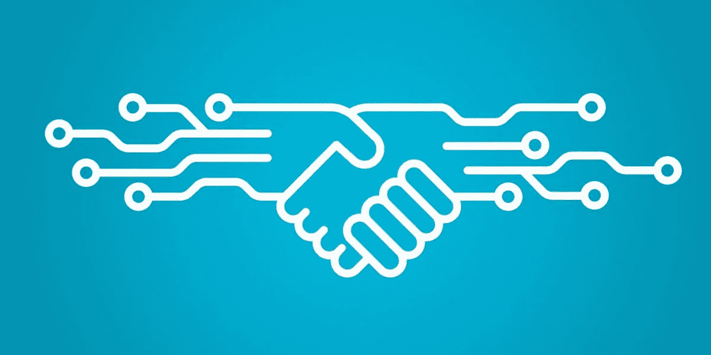

# Mohsin Jameel 解释你需要知道的关于智能合约的工作和未来的一切

> 原文：<https://medium.datadriveninvestor.com/mohsin-jameel-explain-everything-you-need-to-know-about-the-working-and-future-of-smart-contracts-1ea94b5902c0?source=collection_archive---------24----------------------->

Working and Future of Smart Contracts — Article by Mohsin Jameel

除了流行语之外，区块链、人工智能、加密货币——智能合约是目前流行的短语之一。

在这篇文章中， [**莫辛·贾米尔**](http://www.mohsinjameel.com/) 向你解释你需要知道的关于智能合约的一切，以及它是否值得大肆宣传。

系好安全带，我们开始吧。

智能合约是加密货币背后的技术区块链最有趣的方面之一。它帮助区块链应用程序做得更多。

**那么，智能合约到底是什么？**

Smart Contracts

简而言之，顾名思义，“智能合同”是一种新时代的合同，可以帮助用户交换、出售或购买任何东西，而没有任何麻烦、冲突或欺诈。它消除了执行合同时对中间人的需要。

它们是预定义的决策规则，有助于现实世界合同的执行。它们快捷、简单且合法。

这里有一个智能合约的类比。把智能合同想象成居住在区块链的公证人。但是，与现实世界的公证人不同，你不必为起草法律合同等上好几天。这一切都是在没有任何干预的情况下快速、高效地完成的。

它包含遵守某些规则的法律协议。不执行规则会受到处罚。智能合约可以智能地自行执行。

**想象一下:**

你想租一套公寓。公寓业主没有用正常的方式起草租赁协议，而是使用区块链创建了一份协议。你用加密货币付房租。租赁合同是这样设计的，如果你在某个特定的日期不付租金，合同就会自动失效。要续租，你必须付租金和罚金。

该合同基于数字密钥。数字钥匙是用来支付租金的进入钥匙。因为整个合同是在区块链托管的；付款可以在几分钟内完成。

智能合同的美妙之处在于它不能被任何一方更改或修改。如果您想终止协议，那么您只需停止付款，智能合同将自动销毁。

而且，如果你想对合同进行修改，那么就需要双方的同意。没有另一方的同意，任何一方都不能改变或篡改它。

现在，您已经了解了智能合约的工作原理，

**让我们来看看它的创新之处:**

**自力更生**

通过使用智能合约，你不再需要任何第三方。无论是律师、公证人、经纪人还是任何其他法律组织。此外，当您使用智能合约时，您消除了任何欺诈和其他操纵的机会。合同的所有内容都在区块链上，由整个区块链网络监控。

**信任**

合同及其支持文件存放在区块链。它是加密的，只有参与协议的人才可以使用。其他人都看不懂。更重要的是，智能合同是数字化的、安全的并且可以随时访问。

**安全**

这一点怎么强调都不为过。该合同是加密的，这意味着它受到保护，免受攻击。此外，您的文档会备份到最新版本。也就是说，协议中涉及的每个人在任何时候都有协议的最新副本。你没有机会失去它。

**速度**

这是智能合约的最大优势。传统上，处理协议既麻烦又耗时，涉及大量的文书工作。智能合同执行起来很快，因为它们不涉及任何中间人。

**无错误**

智能合约做了它们应该做的事情，没有任何错误或缺陷。当满足特定条件时，它会自动执行，没有任何例外。没有错误或偏见的空间。

**快速了解智能合约在区块链中的工作方式**

Smart Contracts in Blockchain

下面来看看智能合约的组成部分。

签署者——这是指作为协议一部分的人员。可以是两个人或者更多人。智能合同可以在个人、团体、社区甚至组织之间形成。

主题—这是智能合约中定义的协议。主题使用最新的加密技术进行编码。

条款或规则—在传统协议中，规则或条款用英语等母语描述。然而，对于智能合同，条款或规则是使用编程语言编写的。它包括一切，如规则、协议、条款、费用、奖励、参与方、时间限制等。

环境—为了良好运行，智能合同需要一个特定的环境。一个分散的数据库(又名区块链)，公钥加密是一些需求。

现在，这看起来是不是非常有趣？看起来智能合同是合同的未来，对吗？但是，并非一切都是美好的。智能合约有几个问题，这将带我们进入下一部分。

**智能合约的主要问题**

简单地说，智能合约不过是一些代码。这意味着它容易受到细菌和病毒的攻击。当智能合约失败时会发生什么？谁该负责？

如果有人试图篡改智能合同，这是一种犯罪活动吗？这个案子会在法庭上成立吗？直到今天，没有政府或权威监管机构支持智能合约。

如果出现双方对合同规则做出妥协的情况怎么办？但是，既然合同是不可逆的，你能阻止它执行条件吗？

如你所见，智能合同有很多问题需要解决。它们远未取代传统合同。

那么，智能合约的前景如何？

如果有一件事是确定的，智能合约离完美还有很长的路要走。它们被区块链专家、程序员和其他组织不断改进。如果智能合约得到完善，那么我们将进入一个传统协议和监管机构变得过时的世界。一切都将变得数字化并完美执行，无需任何人工干预。

**莫辛·贾米尔的最终想法——智能合约的真相**

[**穆赫辛贾米尔**](http://www.bullinfotech.com/) 认为智能合约有很大的潜力。是的，有很多问题需要解决，但它带来的机会是难以置信的。交给你了，你觉得智能合约怎么样？你认为它会一直存在下去，还是又一个会消失的时尚？

在下面的评论中分享你的观点，别忘了和你的朋友们分享！