# 市场前趋势的动量交易

> 原文：<https://medium.datadriveninvestor.com/momentum-trading-with-pre-market-trends-29f696d1215?source=collection_archive---------2----------------------->


任何曾经盯着显示器上的股票图表期待开盘的人都知道，股票不会以收盘时的价格开盘。大多数图表软件不包含盘后和盘前的价格走势，因此大多数图表看起来像这样:

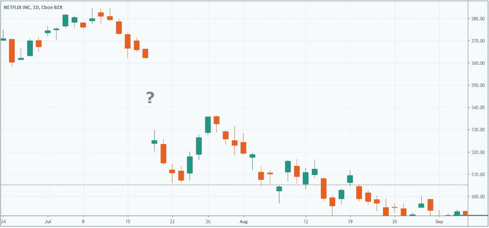

Netflix is notoriously active in the Q2 reporting period pre-market session.

一旦一个人开始深入长时间交易的领域，他们就会开始问很多问题。盘前价格上涨的股票白天会继续上涨吗？如果特斯拉的财报不好，我应该做空它吗？如果 S&P500 在盘前已经上涨，它还会保持正值吗？

我们可以通过使用 Python 研究历史定价数据来回答这个问题。这篇文章的所有代码都可以在 Github 上找到。

# 目标

让我们试着发现盘前价格是否有任何预测性。有没有可能利用延长时间内的股票表现建立一个成功的交易系统。

1.  盘前价格行为相对于日内表现有多重要？
2.  在盘前上涨的精选股票在整个盘中上涨的概率有多大？
3.  一只在盘前走势的股票在盘中交易时继续向同一个方向发展的概率有多大？
4.  财报季有什么影响，公告后的盘前趋势是日内价格的更强还是更弱的指标？

# 数据收集和方法

我们的目标是检验盘前波动是否预示着日内价格波动，价格波动在多大程度上能影响我们的投资决策。为此，我们将需要定义某些条件，确定我们将分析哪些变量，概述我们的方法，并最终构建一个将输出一些结果的程序。

# 定义前期市场

盘前交易和盘后交易是分别发生在主要交易日之前和之后的两个时段。传统上，我们会单独看这两个时段，因为它们被一个 8 小时的“死”时段分开，在这个时段没有交易发生。盘前时间从 4:00 到 9:30，盘后时间从 16:00 到 20:00，20:00 到 4:00 之间没有交易。盘前和盘后非常相似，有着相同的市场参与者和流动性特征。在公司报告周期中，它们都是收益公告的发布者，这意味着这是大多数价格变动发生在公告之后的时候。

[](https://www.datadriveninvestor.com/2019/01/30/machine-learning-for-stock-market-investing/) [## 算法交易的机器学习|数据驱动的投资者

### 当你的一个朋友在脸书上传你的新海滩照，平台建议给你的脸加上标签，这是…

www.datadriveninvestor.com](https://www.datadriveninvestor.com/2019/01/30/machine-learning-for-stock-market-investing/) 

我们不是从个人的角度来研究这些时段内发生的事情，而是喜欢把盘前市场整体视为当天收盘和第二天开盘之间的时间；16:00–9:30.无论该公司是在盘后还是盘前发布报告，盘中交易总是晚一些。因此，我们将全面检查盘前市场，并在接下来的盘中分析价格的反应。

# 数据收集

为了收集数据，我们使用了 Ramaroussi 的 Yahoo！金融 Python 库，它允许我们获取单个股票的历史价格数据。我们选择了标准普尔 500 指数和纳斯达克 100 指数成份股作为股票样本，它们的交易量没有罗素 3000 指数成份股那么低。

```
def get_hist(symbol): 
    target_tickers = [] 
    target_tickers.append(symbol)     
    fetch = yf.download(tickers = target_tickers, 
        period = "5y", 
        interval = "1d", 
        group_by = "ticker", 
        auto_adjust = False, 
        prepost = True, 
        treads = True, 
        proxy = None)
```

我们使用了每种证券过去 5 年的历史数据。不包括盘前和盘后价格数据，只使用开盘价和前一天收盘价之间的差异就可以完成这一分析，因此任何 EOD 数据源都是可以接受的。

该分析的一个组成部分考虑了与报告期相关的价格变动差异。*在公告发布后的漂移中，股票往往在收益报告之前和之后的短时间内表现出更高的波动性和回报率。重要的是，我们要找到一个数据源，使我们能够快速确定五年样本期内的报告期。为此，我们使用了美国证券交易委员会的 [EDGAR 数据库](https://www.sec.gov/edgar/searchedgar/companysearch.html)。虽然美国证券交易委员会提供了一个免费的 API，可以用来获取结果，你也可以使用 Beautiful Soup 4 刮锉，这就是我们所做的。*

将 5 年业绩的报告日期并列起来，可以让我们分析由信息变化引起的价格行为，这对理解价格发现过程至关重要。出于这项研究的目的，我们排除了 2019 年上市的公司，因为样本量较小。

# 结果

对于第一个测试，我们考察了盘前活动对总(接近收盘)价格行为的贡献。

因为我们想把重点放在 SP500 和纳斯达克 100 指数上，所以我们将通过向函数传递一系列符号来启动第一个测试。

```
stocks = qqq() + spy() 
test_sample_contribution(stocks)
```

> 我们发现，在样本股票中，平均而言，盘前交易对绝对每日价格行为的贡献为 36.68%。

下面的柱状图直观地展示了个股的盘前价格走势。这清楚地表明，很大一部分价格变动发生在正常交易时间之外。

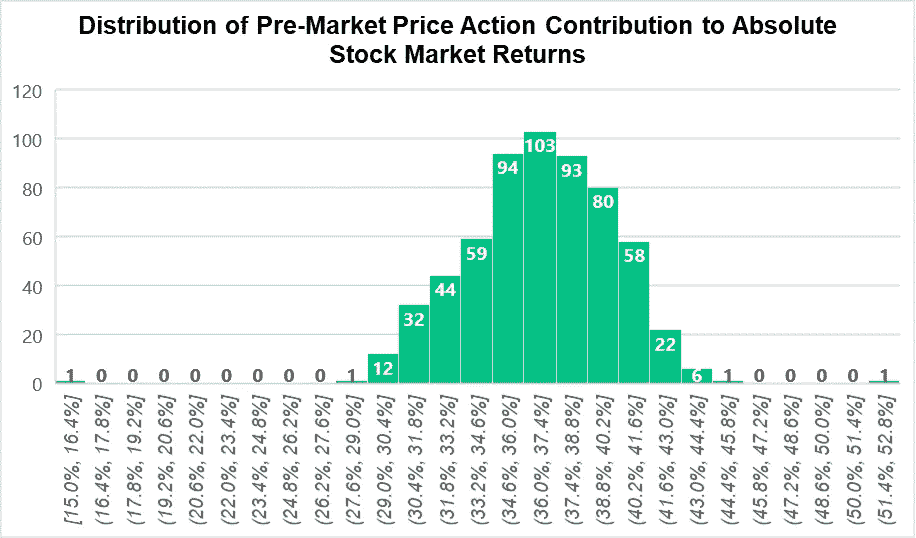

We can see that the data shows little deviation from the mean, with few outliers. Suggesting that pre-market trading contributes to a significant amount of price action across all SP500 and Nasdaq 100 component companies.

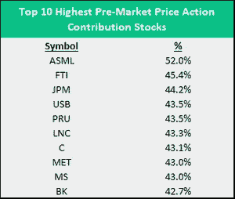

Using this table we can see that the stock ASML (ASML Holding) actually has more price movements occurring in pre-market than during intraday.

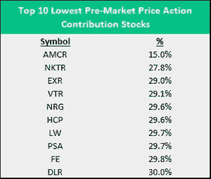

This table illustrates that even on the lowest end of the spectrum, pre-market trading still contributes to total price action.

进一步来说，我们现在的目标是确定一只在盘前增值的股票是否会在盘中继续增值。毕竟这是你是否应该买一只一夜爆红的股票的决定因素。

我们使用下面的函数，并将 SP500 和纳斯达克股票作为参数传递到一个列表中。

```
test_sample_long(stocks)
```

我们发现，总的来说，**一只在盘前增值的股票有 50.77%的概率在整个正常交易时段保持其价格走势**。这很有趣，因为它表明几乎没有相关性，股票继续上涨的几率就像掷硬币一样。有些人会说，这是市场效率的一个很好的证明，因为它展示了一种反持久性的特性。

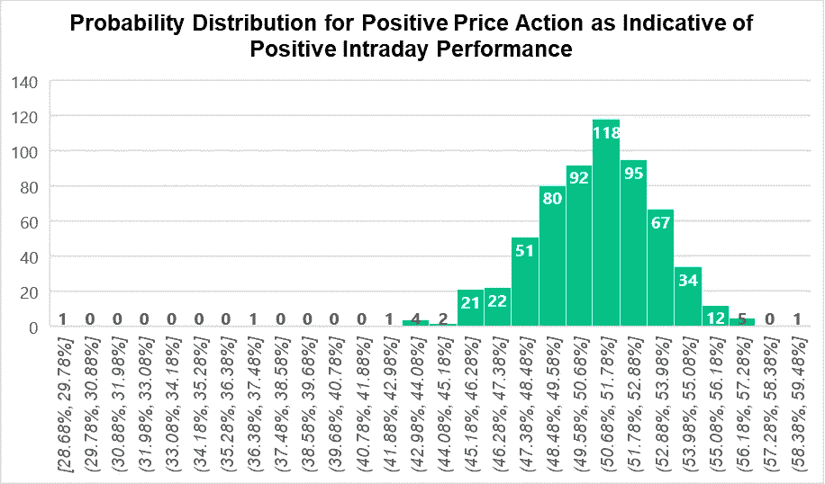

In assesing the seminal research question of “Should you buy a stock that is going up in pre-market”, we can see that the data suggests close to even odds.

尽管如此，仍有一些股票具有更高的可预测性，如下所示。

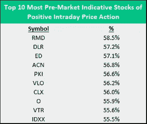

Even the stocks that show a higher probability of increasing in intraday following a pre-market increase don’t boast stellar predictability. Depending on the sampling period that you use in your own tests you may not encounter probabilities higher than 60%.

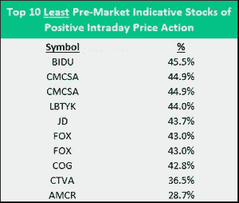

Interestingly, on the bottom end of the test results we find two Nasdaq listed Chinese companies; JD and Baidu.

之前的测试只考虑了积极的价格行为，现在我们必须测试盘前价格行为是否代表了当天的表现。这意味着我们要考虑盘前和盘中表现都是正面或负面的事件。类似于投资者如何使用[的公平价值交易策略](https://www.morpher.com/blog/pre-market-futures)进行期货交易。

我们应用下一个函数，传递相同的股票样本作为参数。

```
test_sample_indication(stocks)
```

我们发现**盘前活动在 49.65%的时间里预示着日内表现**。这意味着，从统计数据来看，市场实际上更有可能与上市前的情况相反。

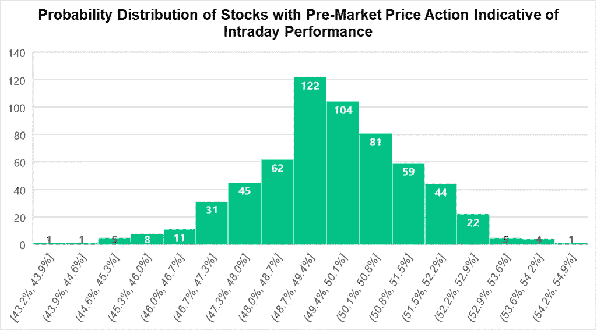

Testing all-time predictability based off pre-market yields results that are almost academic in nature. We see that on an aggregate level pre-market movements are not indicative of intraday performance.

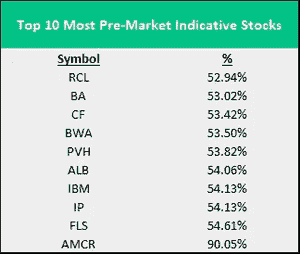

In this table we see Amcor (AMCR) as the most indicative stock, however since it appears in the previous test as not positively indicative this points to a strong downside correlation. If AMCR decreases in value in pre-market, it is very likely to continue falling through the intraday.

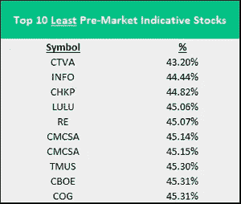

Those stocks that show an indicative probability of less than 50% are more likely to reverse on their pre-market price action throughout the intraday.

这没有给我们留下任何可操作的结果。对单个市场的研究表明，偏离均值的情况很少，而且很少有股票在盘前表现出任何指示性行为。

当然，相对于盘前市场而言，股市肯定会有以更可预测的方式运行的时候。在最后的测试中，我们的目标是运行相同的统计数据，但是我们将改变样本，只包括季度报告期之后的反应期。

```
test_sample_earnings(stocks)
```

使用上面的函数，我们现在将从 EDGAR 数据库中提取报告日期，并从下一个交易日提取历史回报。

> 在财报公布后，纳斯达克 100 指数的股票在盘前和盘中都上涨，有 27.10%的时间。

鉴于我们之前看到的结果，在盘前和盘中之间价格行动的四种可能性中，27%符合我们的预期。我们希望在报告期内看到更多的相关性，因为事件的重要性值得投资者更多的关注。因此，可以推断，在更高的交易量的压力下，价格行动将有更多的动力，导致价格向同一方向移动。

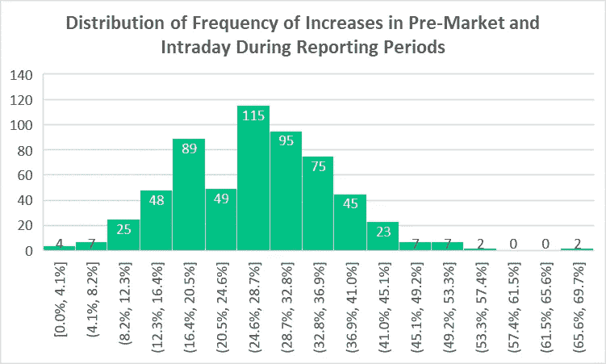

The histogram above illustrates how most datapoints lie within the 24% 28% range.

在该测试之后的数据中存在明显更高的离差。重要的是要记住，对于某些股票，报告期的数量较少，因为这些公司是交易所的新成员，这在限制样本方面起着很大的作用。

下面我们可以看到盘前和盘中涨幅居前和垫底的十只股票。高频率不仅表明该公司在此前报告后的几个交易日中表现更好，而且存在内在的价格-行为一致性，我们可以期待在进一步的测试中更多的因果归因。

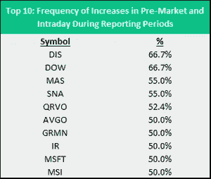

Disney, and Dow Inc., both showing a frequency in positive pre-market and intraday price action.

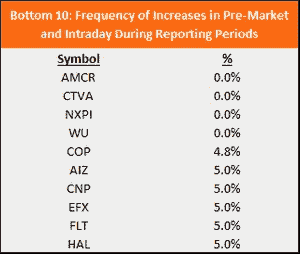

On the other hand we are presented a list of stocks that rarely experience simultaneous positive returns across both sessions.

> 股票在盘前上涨后全天上涨的概率为 52.4%。

类似于 5 年综合测试，我们看到一个接近公平的结果，是否前市场的价格行动是一天内行动的指标。然而，与之前的测试一样，有一个更高的离差，我们能够识别出有助于显著提高可预测性的公司。

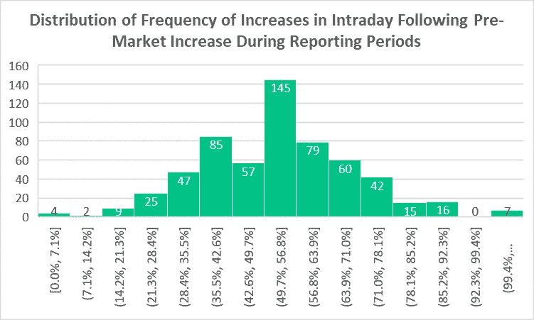

The histogram shows that the odds are slightly in favour of a positive intraday session following a positive pre-market session. Additionally, we can see that several stocks clearly show exceptional predictability, albeit possibly influence by sample size.

在下面的案例中，我们看到了 7 家公司，它们表现出了完美的市场前价格行为。换句话说，如果博通公司(Broadcom Inc .)或迪士尼公司(Disney Inc .)在盘前公布收益和增长，它们也会在盘中上涨。

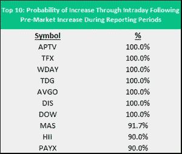

Disney inc. (DIS) is a great example of a stock that has a considerable reporting history, a high level of liquidity, and could be considered for actionable tests.

相反，每当 Corteva Inc .在盘前市场公布收益和价值增长时，你最好做空它。

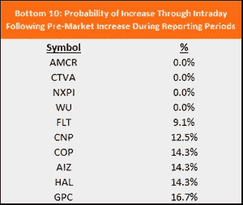

Stocks low down on the spectrum actually showcase high negative correlations to pre-market price action.

# 结束语

在测试盘前行为是否预示着日内表现时，我们可以得出几个结论。

*   盘前价格行为在所有样本股票中起着重要作用，不应被忽视。
*   总体而言，盘前价格行为并不决定盘中价格行为。
*   历史表明，精选股票的盘前价格波动更具指示性。
*   在报告期内，股票波动性更大，但盘前价格行为仅比五年历史水平略具指示性。
*   在精选股票的情况下，报告期可以显示出指示性的盘前行为。
*   特定股票应该在更长的时间内进行测试，以评估盘前价格行为的真实可预测性，但是一些公司太年轻，没有足够的报告期来进行分析。

请记住，这些测试容易受到误解，价格行为可能仍然受到股票独特基本面的驱动，这些股票表现出高度指示性的盘前行为。此外，过去的回报可以用于估计未来的价格行为，但不能保证未来的表现。最后，请记住，市场在不断变化，今天有效的策略可能明天就无效，但是使用这些市场前分析方法可以帮助做出更好的决策。

```
**Disclaimer:** All investments involve risk, and the past performance of a security, industry, sector, market, financial product, trading strategy, or individual's trading does not guarantee future results or returns. Investors are fully responsible for any investment decisions they make. Such decisions should be based solely on an evaluation of their financial circumstances, investment objectives, risk tolerance, and liquidity needs. This post does not constitute investment advice.
```

*原载于 2019 年 12 月 2 日*[*【https://www.morpher.com】*](https://www.morpher.com/blog/pre-market-momentum-trading-strategy)*。*