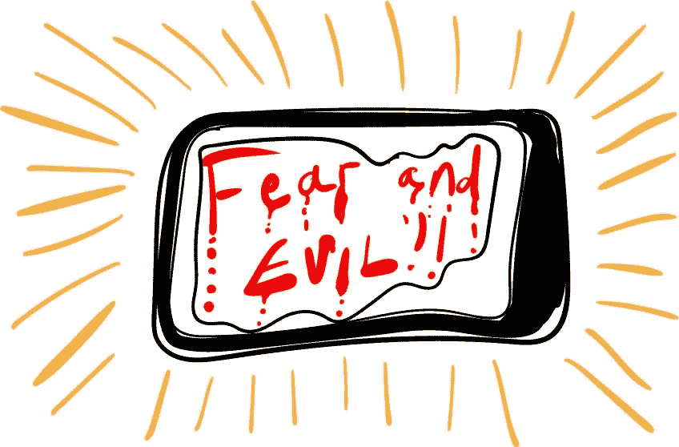
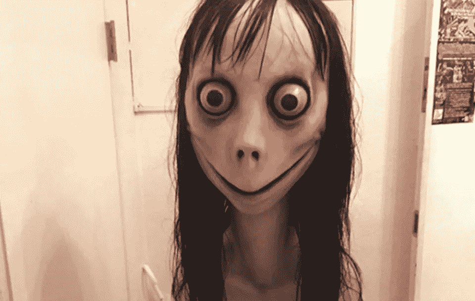
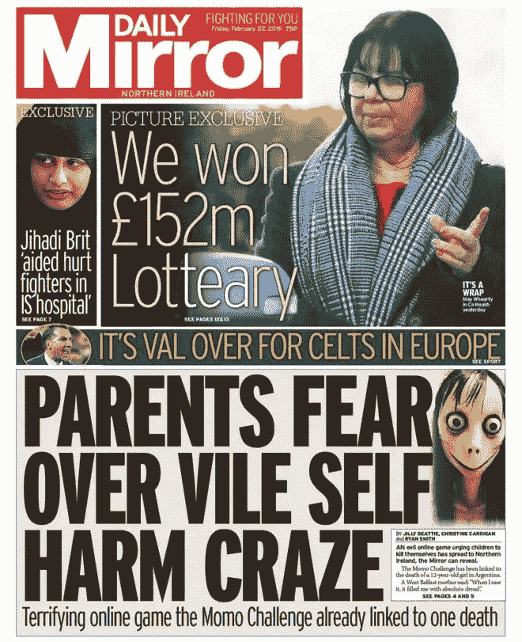
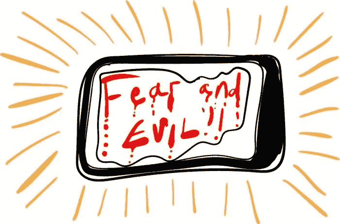

# 莫莫:致命的互联网热从来没有过(直到他们说它是)

> 原文：<https://medium.datadriveninvestor.com/momo-the-lethal-internet-craze-that-never-was-until-they-said-it-was-c05411b30570?source=collection_archive---------8----------------------->

## 多年来，对“莫莫挑战”的报道涉及了英国一些最不负责任的新闻业。我们是怎么到这里的？

《卫报》的吉姆·沃特森(Jim Waterson)称，最近关于“陌陌挑战”的报道“可能是这个国家多年来最不负责任的新闻报道之一”。在过去的一周里，一个[网络恶作剧](https://www.theguardian.com/technology/2019/feb/28/viral-momo-challenge-is-a-malicious-hoax-say-charities)给英国儿童带来了巨大的破坏和焦虑。但这并不是因为他们是它的目标，也不是因为他们彼此分享它。

相反，是他们的父母和当局相信这是真的，并警告他们的孩子。现在老师们不得不告诉学生这不是真的，以此来安抚他们；他们被一个骗局识破了。

这个怪物是莫莫的化身。根据社交媒体上流传的断章取义的理论，陌陌是一个出现在儿童视频和移动应用程序中的角色，并鼓励他们伤害自己或家人。这张照片是日本艺术家白泽圭佑在东京一家画廊拍摄的雕塑。

他令人印象深刻的令人不安的作品的照片让[有了自己的生活](https://knowyourmeme.com/memes/momo-challenge)。它第一次引人注目的出现是在 YouTube 上一个名为“[探索陌陌处境](https://www.youtube.com/watch?v=0jLuF0OQZ-g)的视频中，该视频迅速走红。该视频讨论了墨西哥的年轻人从使用该图片的账户接收挑衅性信息的情况。“Momo Challenge”的广告出现了，上面有一个电话号码，你可以发信息来参加。

这可能是持续恐慌的根源。但广告的目的很可能是一种机会主义，试图收集人们的电话号码，然后出售，利用病毒图片来激起人们的兴趣。像在墨西哥那样，用图像来吓唬人，可能与此无关。但是这个故事被报道得越多，越多的网络恶作剧者制作了涉及面部的可怕视频，越多的人使用虚拟形象创建在线账户来吓唬人们。

这就是故事里的真相。网上有人想窃取你的信息或金钱。其他人为了他们自己的快乐而寻求吓唬你。不真实的是曾经有过某种中央控制的“Momo 游戏”或“Momo 挑战”的想法。但这并没有阻止报纸说有。

上个月,《先驱报》报道了一名妇女，她说一个使用该图像的账户告诉她的儿子把刀放在他的喉咙上。报纸是这样描述莫莫的:

*这项挑战鼓励孩子们在被匿名控制者邀请参加后伤害自己。这款游戏的插图是一张可怕的大眼女性的脸，分享暴力图像并威胁用户。据认为，这种游戏在哥伦比亚、澳大利亚、墨西哥和英国都有报道，并且与至少两起死亡事件有关。*

莫莫从未与任何死亡有关联。《先驱报》是从去年来自 T4 的一篇报道中得到这个想法的，报道中一个年轻女孩结束了自己的生命。警方在她的手机上发现了莫莫的照片，但后来排除了与她的死有关的可能性。但《先驱报》是一份受人尊敬的报纸，因此，所有随后的报道都包含了一个可疑的想法，即一个来自拉丁美洲的病毒游戏正在杀害全球的儿童。

急于超越彼此的媒体加大了宣传力度。标题下'*什么是陌陌挑战赛？《镜报》写道，恶心的 WhatsApp“自杀”游戏瞄准了年轻人*:

可怕的 Momo 挑战赛已经来到英国，家长们被警告要格外警惕，因为据报道黑客的目标是 Peppa Pig、堡垒之夜和 YouTube 上的孩子们。这种危险的现象已经与阿根廷一名 12 岁女孩的自杀和俄罗斯至少 130 名青少年死亡联系在一起。’

像这样的报道来自知名报纸——尽管毫无道理(*黑客入侵堡垒之夜？在那里放一张照片？！* ) —关心的家长和老师，不知道更好。学校发出了关于“陌陌挑战”的信件，“目前正在席卷网络媒体”。

接下来是当地警方，他们在自己的社交媒体页面上分享了自己不懂技术的信息。就这样，一个反馈循环开始了:报纸发布耸人听闻的报道，成年人变得担忧，学校寄信，警察试图通过自己提供信息来跟上，给报纸更多的报道。

成千上万的孩子被卷入其中。对他们来说，第一次听说陌陌是来自他们焦虑的父母。这种威胁、恶意的力量让他们害怕，尤其是当它来自他们的父母——他们在这个世界上最信任的人。学校发出的信也是如此。他们的学校只发关于严肃和重要事情的信。

对“陌陌”现象的恐慌反应是由对孩子们在网上观看的内容越来越怀疑引起的。几年前，一位名叫詹姆斯·布里德的作家在互联网上发表了一篇名为“[有些不对劲](https://medium.com/@jamesbridle/something-is-wrong-on-the-internet-c39c471271d2)”的文章。它深入研究了 YouTube Kids 应用程序的黑暗和令人不安的世界，在那里出版商创建了涉及受欢迎的儿童角色的[怪异视频](https://www.avclub.com/take-a-trip-to-the-automated-hellscape-of-youtube-video-1820196139)，试图被 YouTube 用于向观众推荐视频的算法选中。

更令人担忧的是，这种算法也被恶作剧者滥用，他们制作像 Peppa Pig 这样的节目的抄袭剧集。在一个视频中， [Peppa 喝了一瓶漂白剂](https://www.theguardian.com/technology/2018/jun/17/peppa-pig-youtube-weird-algorithms-automated-content)。YouTube 的算法可以有效地找到符合那些喜欢吃粉红猪小妹的人口味的视频；它不太理解向孩子展示他们最喜欢的角色大口大口地喝下一瓶清洁液的危险性。

令人作呕的揭露是，每当父母给他们的孩子一台平板电脑时，他们的孩子就暴露在这样一个地狱般的场景中，这使得人们对新的互联网趋势更加警惕。

成年人总是担心年轻一代在做什么。想想 60 年代电视上的性；七八十年代的重金属和 LGBT 题材；21 世纪初的说唱；最近比较污的音乐。和以前一样，合理的担忧变成了偏执。

当孩子们阅读关于神秘游戏的信件时，他们焦虑地询问自残和自杀的情况。这个可怕的怪物和它神秘的控制者将要渗透并摧毁他们的生活——这是学校来信中说的。

但这只是幻想。没有怪物。相反，是父母和学校将恐惧如雷鸣般地带入了他们孩子的生活。是媒体的歇斯底里给了恶作剧者制作涉及这种生物的恐怖视频的想法——而不是相反。

当像撒马利亚人这样的慈善机构说他们认为这是一个骗局的时候，金·卡戴珊已经向她的数百万粉丝发布了威胁。当这封邮件发出时，世界各地仍会有父母相信，一群神秘的黑客正在以某种方式向手机应用程序中插入信息，在这些信息中，一张脸告诉他们的孩子伤害自己。当你阅读时，道德恐慌正在蔓延。

艺术家爱泽圭试图用他自己的方式安抚人们，他透露，在模型开始腐烂后，他不久前就把它扔掉了。

孩子们会对父母的行为感到困惑。解决这种情况给了我们一个给他们上重要一课的机会:通常，看似不会犯错的权威人士会犯错误。他们所说的一切都不应该被当作真理；他们和其他人一样容易歇斯底里和轻信。当有人告诉你要害怕新事物，或者某事或某人会伤害你时，你应该总是问:你确定那是真的吗？

[*【怪异西班牙】*](https://weirdspain.substack.com/) *是一份时事通讯，面向那些想更深入了解他们的第二故乡及其人民的移民，以及世界各地想更多了解这个神奇国家正在发生什么以及为什么会发生的西班牙爱好者。* [*在这里订阅，在你的收件箱里收到这些文章。*](https://weirdspain.substack.com/subscribe)