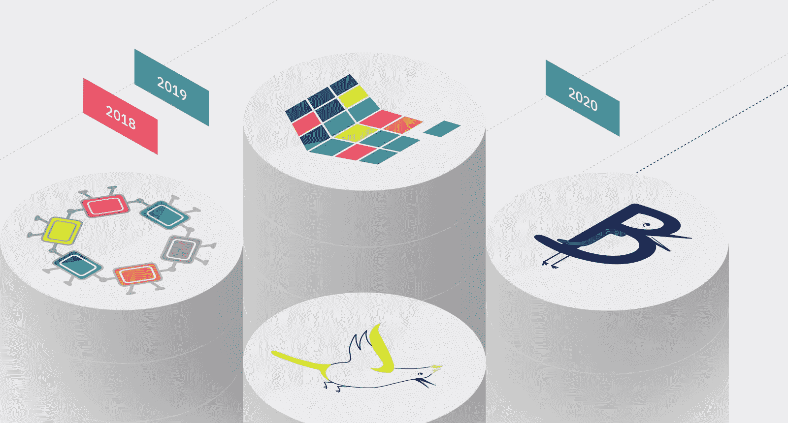

# 莫奈——改变区块链游戏经济的新意识形态

> 原文：<https://medium.datadriveninvestor.com/monet-a-new-ideology-changing-the-blockchain-gaming-economy-65eba3147171?source=collection_archive---------17----------------------->

## 创新通常来自于新的创造，或者来自于现有技术的改进，从而产生更有效的方法来开展日常活动。随着人口的不断发展，创新至关重要，因为某些操作发生的条件会随着时间的推移而不断变化。

[Source](https://unsplash.com)

> 移动设备面临的主要挑战是，在尊重消费者隐私的同时，通过渠道吸引消费者，并在不同设备间准确识别用户。

互联网是人类在 20 世纪后期经历的最大变化之一，它已经成为我们日常生活的一部分。现在，我们正处于区块链时代，这个时代的目标也是要像互联网一样彻底改变世界。许多公司在日常活动中推出了自己的区块链应用，而一些公司专注于提供区块链服务的平台，以托管这些应用。[莫奈](https://monet.network/)是提供区块链解决方案的公司之一。它在区块链上有独特的方法，因为它旨在消除当前区块链系统中存在的障碍，以提供具有改进的安全性、性能和功能的平台。

# 真实世界应用🏛

区块链的本质是通过现有的沟通渠道改变世界互动的方式。沟通的某些方面受到更多人的重视。隐私和安全连接是用户在使用所提供的一些应用程序时要考虑的一些重要方面。区块链开始提供更安全和更私人的连接，以吸引他们的目标市场🔐。然而，用户也重视的另一个方面，这甚至可能超越隐私和安全，就是方便。用户有时更看重便利性，而不是浏览安全。

> 要让区块链在现实世界中被大规模采用，便利性必须优先于一切。这从失败的分散应用程序的数量就可以看出。

开发人员已经开发出了真正安全实用的应用程序，但在区块链圈之外的社区中，他们的反应并不像预期的那样好。大多数人通常更喜欢便利，而区块链还没有提供大多数应用程序用户所期望的便利。

当前区块链的部分问题是可扩展性。这阻碍了它们的实用性和功能性。以以太坊协议为例。它拥有许多创新的应用程序，这些应用程序可能会从根本上改变世界，或者至少改变世界的运行方式。由于以太坊的结构造成的延迟，这些应用程序未能如其创造者所预期的那样出现。以太坊最多只能以 30 TPS 的速度处理事务，尽管这可能略有改善。其无力处理流量的一个很好的例子出现在 2017 年末。该网络主办的 CryptoKitties 游戏成为区块链用户的最爱。在此期间，以太坊的网络速度大幅下降，因为这款游戏对♨️.的网络基础设施造成了损害

因此，区块链的实际应用需要系统能够容易地适应随着它的流行而出现的需求。区块链经历了许多阶段，试图改善其缺点；然而，莫奈的解决方案可能是最可行的解决方案，尤其是在实用性和安全性方面。

Monet 提出了不需要集中式服务器的特设区块链，以帮助应对大多数区块链目前面临的挑战。特别是对于用户来说，专用区块链可以带来更好的安全性。他们有能力决定谁进入他们的平台；因此，每个参与者可以彼此认识。中央服务器的缺乏也增加了使用 Monet 的 D'Apps 的安全性，因为数据分布在特定的 ad-hoc 区块链的用户之间。与其他区块链一样，记录也保持不变，并且可以由任何参与者根据需要进行审计👮🏻。这些网络是基于邻近性形成的，因为无线技术用于特定范围内的通信。例如，蓝牙或 Wi-Fi 可用于建立这些连接。这些只能服务于特定的半径。Monet 正在监测 LTE-direct 技术的发展，尤其是在它可能覆盖的范围内，这将有助于改善他们平台的功能。

对于开发人员来说，Monet 可以很容易地集成到现有的应用程序中，或者与那些仍在开发中的应用程序集成。很多控制权都留给了开发者，因为他们是决定交互标准的人，比如谁可以使用他们的 D'Apps 或访问某些服务所需的要求。因此，开发人员对他们的应用程序有更多的控制权，而 Monet 为他们的应用程序提供了更高的效率和强大的安全性。

# 📺赌博

博彩业价值超过 890 亿美元，而且随着时间的推移，其价值还会增加。莫奈对区块链的看法可以通过改变这个行业的收入流动方式来挖掘这个行业产生的收入。与大多数行业一样，这一价值的很大一部分由行业内的少数公司持有。这是由于行业的集中性质以及游戏玩家和游戏开发者之间存在的中介。

With such a massive industry to tap into, there’s tremendous potential for Monet to upset the order of balance | [Source](https://unsplash.com/photos/5hBREM-5mnQ)

去中心化就是要打破这种格局，让这种产业中的每个参与者都能公平分享他们对产业价值的贡献。根据莫奈的方法，这可能是事实，尤其是在游戏方面。

隐猫的流行😺表明这个行业已经为区块链游戏甚至是令牌化游戏做好了准备。事实上，代币化游戏是行业内收入分配方式的一部分。据[估计，全球有 23.41 亿游戏玩家，区块链有潜力挖掘其中。莫奈的特别区块链可以帮助游戏开发商进一步进入这个市场，为玩家在各自游戏中完成的任务提供奖励。](https://www.statista.com/statistics/748044/number-video-gamers-world/)

如果说堡垒之夜在[的成功是一个标杆的话，那么区块链还有很多潜力可以挖掘。莫奈的特别方法非常适合游戏，尤其是在一定距离内的小团体之间。区块链社区中的游戏开发者可以利用这一点来开发交互式、沉浸式和参与式游戏，只要它们在指定的无线网络范围内，就可以支持多达 100 个甚至更多的游戏。只要在游戏范围内，游戏玩家可以在他们舒适的家中或任何他们想要的地方玩游戏。](https://www.gamesindustry.biz/articles/2018-07-25-epic-games-worth-usd8-billion-following-fortnite-success)

Pokémon Go 是另一个成功的故事，很可能先于 Monet 平台上游戏的成功。这款游戏是一款引人入胜的游戏，要求玩家总是站着寻找不同的物品，并在设定的时间点使用它们。

> 开发者可以从这类游戏中获得灵感，并开发出在特定区域内也具有交互性的内容。这种游戏可以帮助在这些邻近地区创建游戏社区，甚至吸引新的游戏玩家。

在办公室环境中，雇主可能会发现通过 Monet 玩游戏很有效率。[各种研究和个人经历](http://www.bbc.com/capital/story/20160707-can-gaming-at-work-make-you-more-productive)将短时间的游戏与提高生产力联系起来。有时候，员工可能会经历精神障碍和疲劳；这正是游戏可以帮助释放疲劳行为和改善他们思维过程的时刻🏃🏼。借助莫奈在区块链的特别方法，开发者可以向雇主推荐高效游戏，然后雇主可以在办公室内建立网络，帮助员工提高工作效率。这些游戏甚至可以作为办公室中最高效团队的指示器。合作游戏可能会显示哪些人在一起工作时可能会想出最有效率的工作日。所有这些都可以在办公室的安全 Monet ad-hoc 网络中安全地完成，这样雇主和雇员就可以进行游戏，而不必担心外部网络因素。

有人可能会说，互联网仍然可以做到这一点，而且可能会更好，因为它连接了世界各地的社区。然而，互联网也使网络及其参与者容易受到黑客的攻击。集中式系统，尤其是涉及服务器的系统，很容易成为黑客攻击的目标。在涉及支付的地方，它们变得更加有利可图，因为信用卡的详细信息也可以在⛔.的这些服务器上找到使用莫奈避免了这样的风险，同时仍然提供一流的游戏体验。在一定范围内的朋友和游戏爱好者可以设想新的比赛；互相比赛，甚至互相比赛，没有理由担心他们的数据安全。此外，由于 Monet 保持了在参与设备中不变地存储数据的能力，游戏玩家可以从特定的特别区块链中保存他们的游戏，并在以后继续。这也可以允许游戏玩家在不同的特设区块链中玩，而不影响他们之前的游戏。

由于其游戏支持，莫奈的区块链方法将导致智能手机市场的增长。便携性受到游戏社区的重视，这导致三星、苹果、Razor 和华硕等公司设计出可以处理大型游戏的手机。 [Razor 和华硕甚至更进一步，生产了专门为游戏设计的智能手机](https://www.razer.com/gb-en/mobile/razer-phone)，从外观到内部组件都是如此。游戏手机在游戏社区中越来越受欢迎，Monet 可能会帮助✔️.进一步实现这种普及

自组织区块链的形成可能依赖于具有所需无线网络连接的智能手机或其他便携式设备的使用。对于智能手机制造商来说，这可能是一个好消息，因为他们将有一个新的市场战略来试图提高他们的销量，特别是在智能手机世界的一些主要巨头在 2018 年 Q1 和 Q2 的出货量下降之后。近年来移动游戏的兴起以及对这些设备上更好游戏体验的需求可能会促使更多游戏玩家投资于功能强大的游戏智能手机，这些智能手机可以提供更具吸引力的整体游戏体验所需的规格。

# 莫奈·ecosystem♻️

游戏和游戏活动的符号化也将在 Monet 设置中发挥至关重要的作用。Monet 有自己的本地令牌，称为 Tenom，用于奖励节点，也作为 Monet 平台内的交易货币。

[Source](https://medium.com/monet-network/monet-technical-roadmap-73e04f133057)

➼Developers 可以在他们的游戏中集成 Tenom 的使用，或者他们可以基于 Tenom 为他们各自的游戏引入他们自己的令牌。

➼Gaming 项目通常持有一些价值，随着项目的有用性或稀有性而增加。

根据开发者在游戏中使用的设置，➼These 代币可以用来获得这些物品。随着越来越多的玩家加入这些游戏，以及越来越多的 D'Apps 将其应用程序与 Monet 集成，Tenom 的价值可能会因↗️.用户活动的增加而增加

➼This 价值的变化可能会证明是有利可图的，特别是对那些挖掘或提供其他支持莫奈网络的角色。

然后，➼Miners 可以使用他们赢得的代币购买游戏物品或用它们交换其他代币，甚至在交易所或网络内出售它们，这取决于莫奈对代币的看法。

> 博彩业的财富再分配也将受到鼓励。目前有大量的资金是由中间商赚取的，因为他们基本上控制了博彩业。随着莫奈的成立，开发商将直接向消费者销售他们的游戏。

游戏项目将在 P2P 基础上出售，因此收入将与那些积极参与游戏场景的人进行交易。附近的玩家可以通过彼此交易容易地保持他们的货币在他们之间浮动，使得他们是他们在游戏项目和游戏上花费的货币的相同受益者。结合挖矿，游戏玩家可以通过参与莫奈的活动获得大量收入。

开发者也和玩家有直接的联系，让他们了解个人和团体喜欢的游戏类型。通过直接销售，他们可能会将收入最大化，而不是将产品委托给中间商，中间商最终只给他们实际收入的很小一部分。因此，由于网络使用 P2P 方法并消除了不可信的中介，通过 Monet 的游戏产品将会便宜得多👏🏻。

由于采用了特别的方法，在莫奈上玩游戏可能会比在其他区块链上玩得快。这种微型网络的建立使得反应更加迅速。响应速度或交易时间可能取决于游戏玩家所使用的设备类型和无线网络类型。更好的设备可能会带来更好的整体性能。

所有这些功能都是通过[Monet 在其平台上采用的](https://drive.google.com/file/d/1PcI69i_oJpWdsIsOciLliYEsFv9hHCVr/view)技术方法实现的。像 Babble 这样的技术将会像病毒一样提高交易速率，因为它能够处理数千笔交易。这种比率在游戏中非常重要，尤其是在参与者数量不断增长的情况下，即使在临时设置中也是如此。

# ⏱莫奈的时代

Monet 关于如何使区块链在现实世界应用中切实有效的独特解决方案为其创造了一个在日益拥挤的平台中脱颖而出的机会，这些平台充满了性能不佳或失败的平台。它有能力彻底改变游戏社区，甚至开辟以前没有注意到的新的利基市场。它通过自组织方法创建安全游戏社区的能力可能成为项目的一个决定性方面；人们变得越来越谨慎，尤其是基于网络的互动。莫奈可能刚刚步入正轨，为未来几十年的游戏发展提供了基础🤘。

***免责声明:*** *请仅将此信息作为我的* ***自己的*** *意见，在任何情况下都不应视为财务建议。在做任何决定之前，请记住****DYOR****🤓*

♂️你好，我叫萨尔。*如果你觉得这篇文章很有用，并且想看我的其他作品，请一定要鼓掌并在 medium 上关注我！😎*