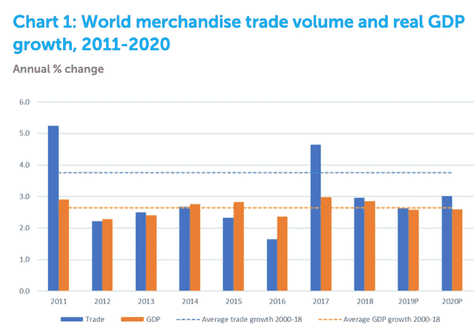
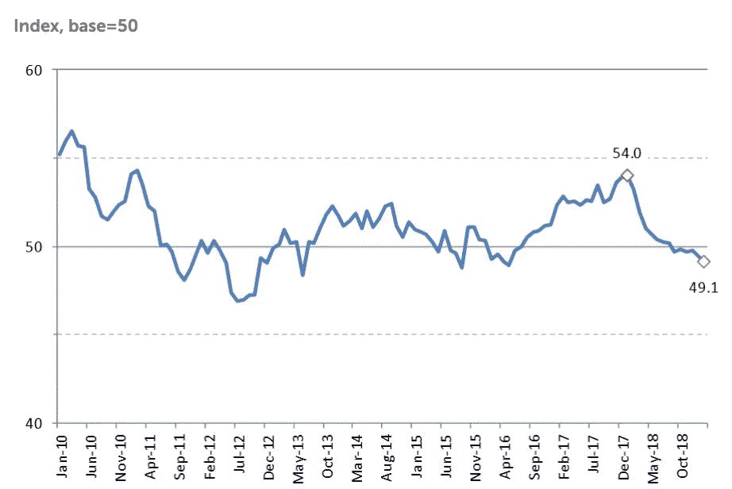
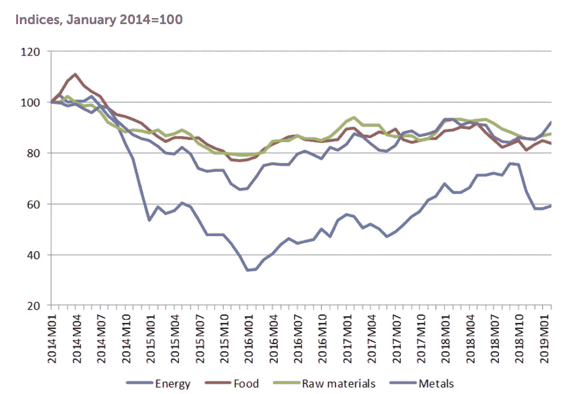

# 财政政策将决定下一次金融危机期间应对措施的有效性

> 原文：<https://medium.datadriveninvestor.com/monetary-policy-and-the-role-of-fiscal-policy-5b6def8d652d?source=collection_archive---------12----------------------->

全球经济处于脆弱状态，深陷贸易战和民族主义驱动的政治，迄今为止危机已经避免。随着中国恢复购买美国农产品，美中贸易战似乎正在降温。在美国和中国之间针锋相对的关税、海湾紧张局势和商业投资放缓之后；全球经济继续增长，尽管不温不火(见下图)

Source: [WTO](https://www.wto.org/english/news_e/pres19_e/pr837_e.htm)

如上图所示，由于同步的周期性放缓、美中贸易紧张、经济政策不确定性、对伊朗、委内瑞拉和叙利亚的制裁以及英国退出欧盟的政治不确定性，世界商品贸易有所缓解。与此同时，2019 年的商品贸易低于 18 年的平均水平。此外，贸易战的影响导致商业信心减弱，大多数发达经济体的投资大幅下降。自 2016 年以来，法国和英国的投资平均为 12.9%和 4.4%，但这分别放缓至 10.7%和 1.6%。

 [## 为什么包容性财富指数比 GDP 更能衡量社会进步？|数据驱动…

### 你不需要成为一个经济奇才或金融大师就能知道 GDP 的定义。即使你从未拿过 ECON 奖…

www.datadriveninvestor.com](https://www.datadriveninvestor.com/2019/03/08/why-inclusive-wealth-index-is-a-better-measure-of-societal-progress-than-gdp/) 

随着美国经济接近第 11 个扩张年，与中国的贸易紧张加上地缘政治紧张可能会导致对去全球化的新担忧——正如我在这里所说的那样，这种担忧被夸大了——2019 年 10 月全球新出口订单从 54.0 降至 49.0 点(见下图)。

Source: [WTO](https://www.wto.org/english/news_e/pres19_e/pr837_e.htm)

英国退出欧盟的结果仍然不确定，这当然加剧了对衰退的担忧，尽管英国退出欧盟无协议的风险已经大大降低。随着离开欧盟的最后期限临近，商业投资下降和油价上涨可能会引发一场危机。然而，由于英国经济增长远超预期，受到 2019 年 Q1 股市上涨以及欧洲央行、美联储和其他央行支持全球经济和消费者需求的新一轮刺激措施的推动，这种情况得以避免。

***货币政策面临逆风面临越来越大的挑战***

Source: [WTO](https://www.wto.org/english/news_e/pres19_e/pr837_e.htm)

货币政策越来越受到温和通胀和 GDP 增长、日益全球化的市场以及外部驱动的通胀结果(即油价)的挑战。此外，它仍然是央行在发生金融危机时可用的主要工具之一，但随着大多数发达经济体的利率处于创纪录低位，它们的降息能力受到了削弱。[正如我在这里所说的](https://medium.com/@henrikouam/central-banks-mind-the-divergence-adf6cbd4615c)，央行对金融危机采取了全面的应对措施，即降息以刺激经济，并确保通胀率向央行 2.0%的目标靠拢。如上所述，能源价格已经下跌，这使得实现央行目标的任务变得更加复杂。也许是时候重新思考我们的外部驱动的通胀目标了，正如我在这里所主张的那样，或者使用有针对性的*财政政策和* [***消除破坏环境的补贴***](https://medium.com/@henrikouam/environmentally-dangerous-fossil-fuel-subsidies-are-also-economically-counterproductive-c69a93c72b43) 来确保更高的生产率和工资，从而确保可持续的需求。

货币政策是中央银行应对经济下滑的主要工具。通过降低利率、购买政府和企业债务，企业可以在经济低迷后投资和雇佣个人。这导致工资随着失业率下降而上升，因此对无资产家庭的影响只能通过劳动力市场紧缩带来的持续或增加的收入来增加。货币政策中潜在的不平等引起了大量的争论，这解释了为什么任何未来的资产购买计划都应该优先考虑绿色债券和技术，并确保更脏的行业完全不会被未来的购买所影响。

**与过去在金融危机后使用货币政策刺激经济不同，现在货币政策被用来维持扩张和延长金融周期。在美联储将联邦基金利率降至 1.50%-1.75%后，几家央行纷纷效仿，尽管美元走软可能会降低它们的偿债成本，因为它们希望提高出口竞争力。各国央行应降低贸易战引发就业冲击的可能性，并为商业投资可持续复苏创造经济背景。**

**全球贸易不确定性、全球贸易紧张局势、英国退出欧盟、成熟的增长周期以及海湾紧张局势可能引发的油价冲击，将在某种程度上抵消降息的扩张性影响。**

*****宏观调控政策的有效性将在下一次危机中得到检验*****

**诚然，通过降低政策利率来延长金融周期，可能会导致经济放缓不那么明显，并延长经济扩张。更有可能的是，降息将通过财富效应支持消费者需求，并发出继续货币宽松的信号，以刺激商业投资。未来任何金融危机的程度都将取决于宏观审慎框架的有效性。然而，重要的是要注意宏观审慎政策，即反周期缓冲、流动性资本、压力测试、国内系统性银行的审慎监管资本、普通股一级资本(CET1)和资本保护缓冲。**

**尽管未来的危机可能会变得越来越少、越来越不严重，但由此产生的影响仍将是失业率略高于大多数发达经济体目前的水平，潜在增长率甚至会更低。正如我在这里所指出的，在缺乏有针对性的财政支出的情况下，潜在增长率将保持在令人担忧的低位，生产率和工资也不会落后太多。**

**后者将由财政支出推动，财政支出将采取对中低收入者减税的形式，这些人的支出倾向更高，基础设施支出也更高。随着发达经济体向更清洁的能源、先进制造业和服务驱动型经济转型，旨在提升劳动力技能和实现劳动力数字化的积极劳动力市场项目支出的缺失将强化潜在增长率下降的趋势。**

**"R *政府应该投资于数字基础设施，而不是进行资本和基础设施投资，这对于减缓生产力没有什么帮助，政府应该通过工资补贴以及对去工业化或煤矿城镇的绿色投资来激励&支持日益熟练和数字化的劳动力，以纠正地区不平衡" Henri Kouam***

**这将确保纳税人出资减税的好处更有针对性，植根于国家的产业政策，提高生产率和工资，同时通过利用康沃尔锂业等公司的竞争力来解决地区不平等问题。这也将提高发达经济体的潜在增长率，并减少对中央工资谈判或工会的需求——后者已变得越来越过时。**

**货币政策的弹性将受到考验，但设计不当的财政政策只会在短期内导致通胀上升。**

**不仅货币政策实现通胀目标的弹性和能力将受到考验；财政支出在更持久的基础上支持家庭需求的有效性将受到考验。一个设计不当的财政刺激的结果将是通货膨胀，充其量是短暂的破产。如果对资本支出的强调仅集中在住宅和商业建筑上，而很少强调非住宅投资，这种情况很可能发生。**

*****有针对性的财政刺激将提振生产率、工资，并导致通胀朝着央行的目标持续上升*****

**因此，央行行长和政策制定者必须不再强调通过消费税或对建筑和机械等资本投资减税来提高价格的财政杠杆的必要性。相反，他们必须明确地倡导在绿色金融、清洁技术和非住宅投资方面增加支出，尤其是在服务业占英国经济的比重从 1948 年的 46%上升到 75%的情况下。与此同时，消费占 GDP 的 67.9%。因此，有必要大力倡导突出针对具体部门的结构性改革，旨在减少结构性宏观经济和财政脆弱性。**

**"B *通过强调有针对性的改革，即针对绿色技术和基础设施的工资补贴和减税，政策制定者不仅会提高现有税基的质量，而且生产率驱动的工资增长也将补充货币政策，以实现央行的通胀目标" Henri Kouam***

*****财政刺激应优先考虑绿色技术和再培训，以解决技能差距并实现碳中和目标*****

**此外，政府必须采取平衡的方法来分配财政资源或赤字融资支出。超过 50%的额外支出/补贴应该用于资助新的投资，30%用于其他中高技术制造业的学徒和工资补贴，以同步经济和气候转型。例如， [Hyperdrive Innovation](https://eandt.theiet.org/content/articles/2019/07/uk-s-largest-lithium-ion-battery-manufacturing-facility-opens/) 今天在桑德兰开设了英国最大的独立电池制造工厂，将支持政府的产业战略和 2050 年碳中和目标。除了 Ovo Energy 和 BBox 之外，这些公司设计先进的存储技术来加速制造锂离子电池。**

*****精心设计的财政刺激将以两种方式为货币政策服务:*****

1.  **通过促进失业、消费到价格的传递，它将改善货币政策发挥作用的传导机制。这种关系——通常被称为菲利普斯曲线——在金融危机后有所减弱，将决定发达经济体通胀目标制的可行性。利率影响金融状况和金融系统中的资本可用性，进而影响经济增长和通货膨胀。前者是通过更高的商业投资和更低的家庭利息支出，后者是通过资本向消费品的重新配置实现的。与此同时，家庭信心得到提振，因为他们的净值通过降低利率而增加，因此需要针对绿色能源和技术的财政政策。**
2.  **通过提高生产率和工资(前者在金融危机后一直低得令人担忧)来支持经济需求侧的结构性变化，较低的政策利率将更容易通过金融体系传导。尽管将利率降至负值并购买政府债券，但各国央行一直在努力将通胀率控制在 2.0%的目标水平，尽管各经济体以创纪录的低失业率保持或略高于趋势水平的速度增长。这引发了对传导机制和菲利普斯曲线流行的新一轮辩论。**
3.  **这将降低央行资产负债表上扩张性货币政策的成本；为货币政策创造更多空间，以便在发生危机时实现通胀目标和刺激经济。由于应对危机的工具越来越有限，央行变得紧张不安——这也情有可原。当前资产负债表扩张的趋势没有产生预期的好处，央行行长们现在必须努力应对金融稳定风险，实现通胀目标。**

*****财政政策将在金融危机期间再造增长中不可或缺*****

**众所周知，财政政策在金融危机中是不可或缺的，但在政策辩论中，财政政策的设计依然低调，尽管各国央行要求增加政府支出的呼声越来越高。如果像最近几年那样执行财政政策——侧重于基础设施支出和减税——通胀只会短暂上升。因此，困扰发达经济体并降低货币政策效力的结构性挑战将持续存在，而工资补贴本应是任何财政措施的核心，但却基本上没有得到探索。繁荣与萧条的循环将无法避免，但如果货币政策被证明比现在更加无效，将不得不提出更困难的问题。**

**中央银行必须开始绿化他们的资产负债表！**

**2008 年的危机见证了前所未有的资产购买水平，因为各国央行寻求重新设计增长，防止通缩压力出现，并确保工资增长在整个复苏期间保护消费者。现在是央行绿化资产负债表的时候了。**

*****央行必须向金融市场发出绿色信号*****

**自 2017 年 10 月开始正常化进程后，美联储的资产负债表目前在 2019 年 9 月达到[3.8 万亿美元](https://www.federalreserve.gov/monetarypolicy/bst_recenttrends.htm)，而英国央行的资产负债表价值 [22.0%的 GDP](https://www.ecb.europa.eu/pub/annual/balance/html/index.en.html) ，而欧洲央行的资产负债表目前超过 [€的 4 万亿美元](https://www.ecb.europa.eu/pub/annual/balance/html/index.en.html)。**

> **“在未来的衰退中，各国央行必须更加重视绿色债券和其他更清洁的行业/公司，以向市场发出强烈信号，加快绿色转型”。亨利·库恩**

**他们必须为未来债券购买计划中有资格购买的债券设定并传达明确的标准。这将迫使企业在预期中绿色运营，解决供应链漏洞，同时增强金融稳定。这种方法将确保央行实现通胀目标，增强金融弹性，降低企业资产负债表的脆弱性。**

*****由于气候变化对家庭和企业资产负债表的影响，气候变化完全属于央行的职权范围*****

**一些人此前认为央行无法解决气候风险，但碳排放对家庭资产负债表、国内和商业房地产、供应链、保险费和公司资产负债表的影响表明，气候变化完全属于央行改善宏观经济弹性和金融稳定的职责范围。因此，尽管央行无法解决气候变化问题，但它们可以开始发出信号，表明未来债券需求的变化。**