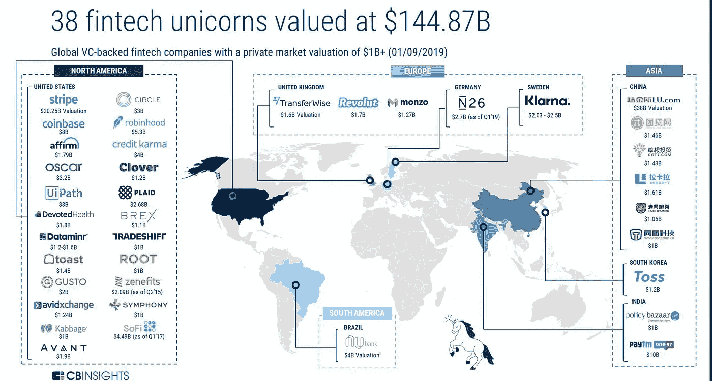
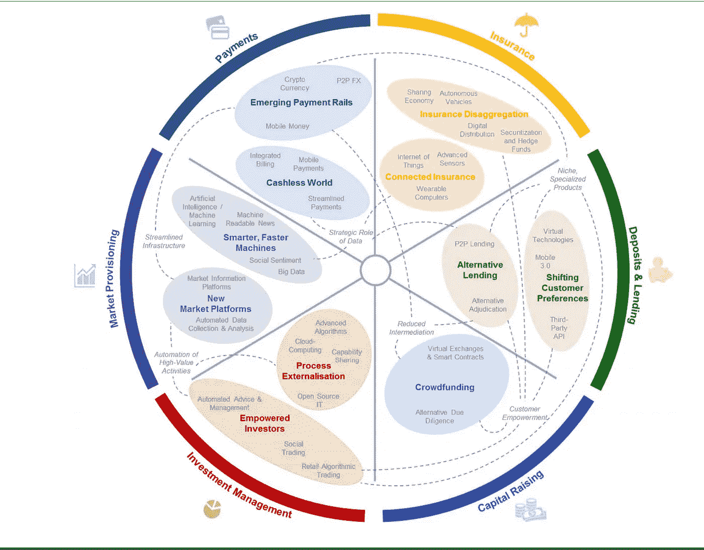
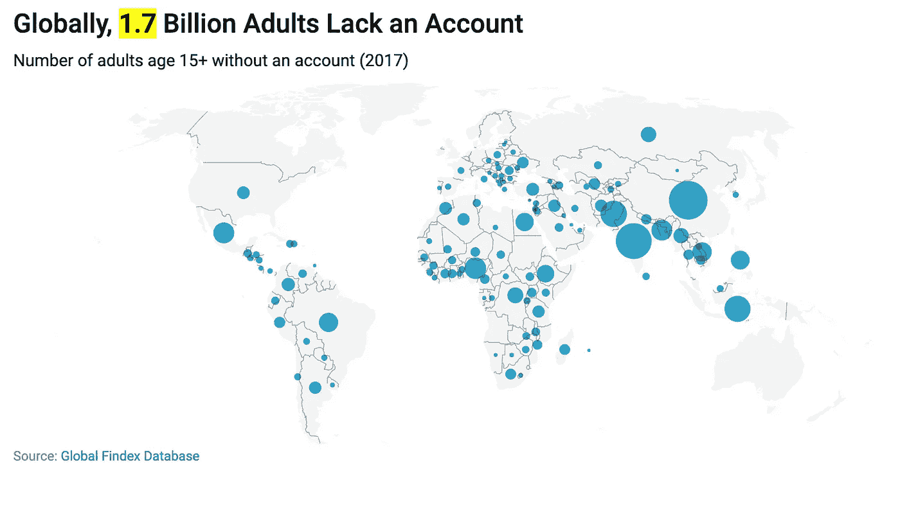

# 货币->银行->金融服务->科技= >金融科技

> 原文：<https://medium.datadriveninvestor.com/money-banking-financial-services-technology-fintech-244a7ae05071?source=collection_archive---------2----------------------->

向金融科技世界和其他地方介绍你自己！

[https://www.cbinsights.com/research/briefing/fintech-trends-2019/](https://www.cbinsights.com/research/briefing/fintech-trends-2019/)

## 变复杂为机遇

一想到金融服务，大多数人首先想到的是什么！

**复杂的世界！！！**

在某种程度上，这是事实，因为金融服务(如贷款、存款、支付、保险)是与银行、政府法规和合规性/指令协调进行的，而这些并不容易熟悉。 ***在当今的数字世界中，我们可以访问娱乐或与任何人即时联系，金融访问尚未达到世界上几乎任何人都可以访问的状态。***

 [## 分散金融的出现|数据驱动的投资者

### 当前的全球金融体系为拥有资源、知识和财富的人创造了巨大的财富

www.datadriveninvestor.com](https://www.datadriveninvestor.com/2019/03/14/the-emergence-of-decentralized-finance/) 

以你今天进行的一次典型的[信用卡支付](https://medium.com/datadriveninvestor/payment-ecosystem-demystified-beaa08d85959)为例，作为消费者或商家，我们并没有意识到在处理一笔交易时所经历的复杂性。有*授权、地址验证、批量提交、捕获、拒付、清算、货币兑换、扣留、交换费和结算*发生在后台，有多个参与者参与其中，如*收单方、发行方、支付服务商和处理方。*还有卡协会，比如*万事达、Visa、美国运通、Discover* 。

**现在，你可能会想到这样一个问题“为什么我真的要担心后端会发生什么事情”**

嗯，对一些人来说，这很复杂，但对金融科技公司来说，这是一个探索和创造解决方案的机会，这反过来又有助于消费者、商家和银行机构！

**现在让我们试着理解一些金融科技公司正在处理的复杂问题。**

## 看看一些金融科技公司和金融服务领域

*   [**条纹**](https://stripe.com/gb/about) 注意到监管的复杂性，错综复杂的全球金融体系，以及工程师的短缺都制约着互联网经济的影响。此外，无论您是希望定期向客户收费、建立市场，还是仅仅接受付款，都可以通过一个完全集成的全球平台来完成，该平台可以支持在线和面对面付款。
*   robin hood****注意到投资股票、[ETF](https://en.wikipedia.org/wiki/Exchange-traded_fund)和[期权](https://en.wikipedia.org/wiki/Option_(finance))的复杂性，特别是对千禧一代(年龄从 18 岁到 29 岁)来说，并以应用程序的形式创建了解决方案，使这些看起来更容易。****
*   ****[**Klarna**](https://www.klarna.com/uk/about-us/) 欧洲最大的银行之一，为 14 个国家的 130，000 家商户的 6，000 万消费者提供支付解决方案。Klarna 提供直接支付、交货后支付选项和分期付款计划，让消费者可以在他们喜欢的时间和方式支付。****
*   ****虽然我们自己无法拆除和重建破碎的医疗保健系统，但我们可以每天努力为您提供更多的钱，让您接触最好的医生，并让您在医疗保健系统内的体验更好。Oscar 已经[声明](https://en.wikipedia.org/wiki/Oscar_Health)其目标是通过“重新设计保险以适应用户体验”来改变美国人参与医疗保健系统的体验****
*   ****[**Kabbage**](https://www.kabbage.com/help-center/)**是一家快速连接小企业与资本的科技公司。他们的技术平台审查由数十个业务运营生成的数据，以自动了解业务绩效，并完全在线提供快速、灵活的资金。******

******那么，如何着手了解金融科技世界，让我们从了解货币和银行开始，这是金融科技行业的基础。******

## ******金钱和银行的概念！******

******在原始时代，物物交换是直接交换的媒介，货物和服务交换其他货物和服务。在某种程度上，如果双方之间的相互谈判进展顺利，这可能是一个很好的方法。当交换的价值受到质疑时，问题就出现了！！******

******这时，金钱的概念就出现了。货币有助于确定商品的价值，而商品的价值又会在交易中使用。******

******易货系统的一个问题是货物的储存。与物物交换相比，货币的存储成本通常较低，尽管这里也有存储成本。******

******当企业家发现价值和储存的问题时，他们开始相信“银行”，银行会告诉他们把钱安全地存在他们那里，反过来他们会给你利息。******

******现在，当人们开始把钱存入银行时，银行也开始把一部分钱借给其他项目，这些项目可以创造更多的机会，从而创造财富。******

> ******银行是接受公众存款并创造信用的金融机构。借贷活动可以通过[资本市场](https://en.wikipedia.org/wiki/Capital_market)直接或间接进行。由于银行在一个国家的金融稳定中的重要性，在大多数国家，银行受到高度监管[。大多数国家已经将部分准备金银行制度制度化，在这种制度下，银行持有的流动资产仅相当于其流动负债的一部分。](https://en.wikipedia.org/wiki/Banking_regulation)[https://en.wikipedia.org/wiki/Bank](https://en.wikipedia.org/wiki/Bank)******

******有几家老银行(比如成立于 1690 年 11 月 17 日的巴克莱银行)仍然在运营！ ***但是银行给消费者和企业家带来了怎样的创新！！*********

********

****[http://www.oldest.org/structures/banks/](http://www.oldest.org/structures/banks/)****

> ****在过去的 20 年里，我看到的最重要的金融创新是自动取款机，它真的帮助了人们，避免了去银行，这是一个真正的便利。你能告诉我有多少其他创新像自动取款机一样对个人如此重要，自动取款机更多的是一种机械创新而不是金融创新？[[https://ny post . com/2009/12/13/唯一有用的东西——银行在 20 年内发明的——是自动取款机/](https://nypost.com/2009/12/13/the-only-thing-useful-banks-have-invented-in-20-years-is-the-atm/) ]****

## ****金融服务框架****

****世界经济论坛在其研究中将金融服务分为六大功能，如下所示。****

********

****[http://www3.weforum.org/](http://www3.weforum.org)****

****问题是如何让世界上的每个人都能获得金融信息？****

****根据世界银行的报告，全球仍有 17 亿成年人没有银行账户，然而其中三分之二的人拥有 T4 手机，这可以帮助他们获得金融服务。Fintech 确实可以帮助和使这些人在技术的帮助下获得金融服务。****

********

> *******世界银行集团总裁金永吉*** *称* ***。*获得金融服务是减少贫困和不平等的关键一步，关于手机拥有率和互联网接入的新数据显示，利用技术实现普遍金融普惠有着前所未有的机遇。”******

****让我们快进，进入正在改变游戏的科技和互联网时代！！****

## ****互联网、移动技术和数据——游戏规则的改变者！！****

****在信息时代，当人们相互联系并快速交换信息时。当我们只需轻轻一点就能在世界各地发送信息时，为什么像支付这样的金融服务不能以同样的方式实现呢！！****

****银行必须跟上技术的快速发展。他们仍然有遗留系统，连接它们需要努力。****

> ****今天，我们有公开可用的 API 和开源技术。我们有现代化的硬件和开源数据库。小商户可以使用手机作为 POS[销售点]终端，使他们能够接受信用卡，而不仅仅是现金或支票。—杰森·加德纳，Marqeta 的创始人兼首席执行官****

*******随着科技的力量和金融服务的发展，FINTECH 通过为消费者和企业提供比以往更多的功能、更多的选择和更多的金融服务，对传统金融行业的智慧提出了质疑！*******

******区块链科技和比特币******

****关于金融科技的报道不能不涉及区块链技术，该技术正在彻底改变整个金融服务关键框架领域，并进一步创新。****

******区块链**技术也称为**分布式账本技术**是一种数据库，其中信息被记录在多个实例中，网络中的任何人都可以访问、验证或添加信息。没有集中的权力机构，协议帮助管理网络。****

****这项技术的实现之一就是**比特币**。*在现实世界中，纸币可以在两个人之间转移，而不需要银行的介入，那么为什么我们不能在数字世界实现同样的事情呢？比特币是一种数字代币(也称为加密货币)，它在数字世界中无需中介即可进行结算。*****

******区块链科技为金融世界带来了新的可能性。******

> ****"货币有三个时代:商品时代、政治时代和现在的数学时代."— Chris Dixon，Hunch 的联合创始人，现归易贝所有，SiteAdvisor 的联合创始人，现归迈克菲所有****

## ****那么接下来呢！****

****Fintech 完全是关于如何通过利用创新技术来提供、构建和消费金融服务！在未来的几年里，我们将看到如何进一步探索这一点。****

> ****尽管金融科技只是全球金融服务生态系统的一部分，但它正迅速演变成社交媒体和在线搜索的范畴和规模。至少，它将从根本上改变我们与支持和围绕我们日常生活的众多金融系统的关系。迈克·巴洛****