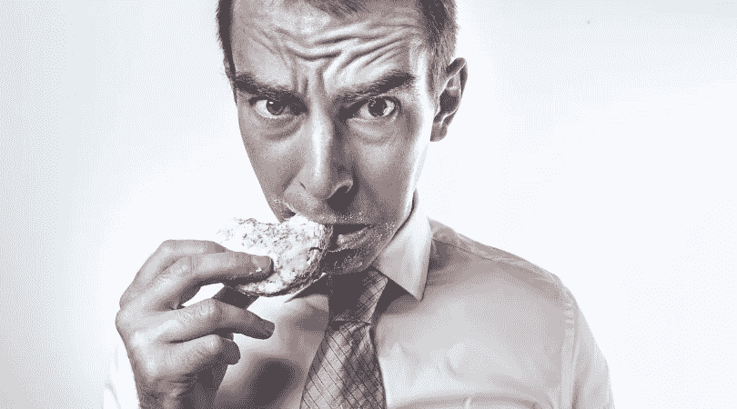

# 金钱禁食:抵制购买东西的欲望

> 原文：<https://medium.datadriveninvestor.com/money-fasting-resisting-the-hunger-to-buy-stuff-81859e1baa6b?source=collection_archive---------14----------------------->

因为对健康有益，禁食似乎完全违反直觉。你的意思是告诉我，通过在一段时间内不吃东西，你的身体实际上会茁壮成长？嗯，*是啊。*健康范围内的禁食已被证明有助于一切事情，从你的身体如何控制血糖水平、管理血压，一直到帮助调节你的新陈代谢和降低神经退行性疾病(如帕金森氏病和阿尔茨海默氏病)的可能性。出于这些原因，自从有史以来，许多人从食物或饮料中寻找禁食的不可思议的好处…现在又回来了。

如果我们把这些关于食物消费的感觉应用到我们思考如何消费我们辛苦挣来的美元上，会怎么样？

 [## 外汇投资如何帮助偿还债务|数据驱动的投资者

### 外汇是对外汇市场的投资，不同国家的货币在外汇市场上进行兑换

www.datadriveninvestor.com](https://www.datadriveninvestor.com/2019/02/13/how-forex-investment-helps-to-repay-your-debts/) 

# 像禁食一样，预算很糟糕

根据 Debt.com 在 2019 年进行的[调查，尽管 93%的参与者声称*每个人*都应该有预算，但这些人中只有 67%的人报告说实际上有预算。断开在哪里？参与者没有预算的原因多种多样，从觉得自己的收入太少或太多都不值得做预算，到认为预算只在一年中的某些时候才有必要——比如假期。其他人说他们已经尝试过预算，但是没有任何效果。](https://www.debt.com/research/best-way-to-budget-2019/)

在这些答案中，22%的答案是最模糊的:“……做预算太费时间了。”花的时间太长了？花点时间想想从你的收入中减去你的支出、储蓄和投资需要多长时间，确定这些数额应该在哪里，然后制定一个计划来保持在这些数额之内。即使你一个月做一次，这需要多长时间？15 分钟？最多 30 分钟。所以，在不到一集《绝命毒师》的时间里，你就可以制定出你的预算。

实话实说吧——这个选择的真正答案应该是，虽然制定预算相对简单，但坚持预算糟糕透了。当我们想说“是”的时候，这意味着我们要说很多“不”从这个意义上说，坚持预算几乎就像坚持禁食一样；尽管有令人难以置信的、提高生活质量的好处，但当你身处其中时，它们都非常糟糕。

尽管如此，我们可能更倾向于通过禁食而不是预算来获得成功。为什么会这样呢？禁食是有重量的。

# 像对待物理禁食一样对待金钱禁食

当进行斋戒时，很少有人“只是尝试”斋戒。他们完全准备好进入这个过程，知道这有多难。他们意识到他们的胃会像灰熊一样咆哮，他们的能量会被耗尽，甚至一套咸饼干会突然看起来像是戈登·拉姆齐自己准备的。

那他们为什么不直接吃呢？因为他们知道这主要是他们大脑中饥饿激素的激增，而不是真正的饥饿。

*   他们知道自己不会死。
*   他们知道如果他们坚持到底，他们将会体验到斋戒的好处。
*   他们知道，如果他们放弃得太早，所有那些在晨会上尴尬的腹部漫谈都将是徒劳的。
*   他们相信延迟满足的力量。

我们也可以用金钱禁食来做到这一点。

对更好的耳机或新笔记本电脑说“不”可能很难。毕竟，你的耳机，尽管仍然像你买的时候一样好用，但已经有油漆开始从耳罩上剥落，顶部的缓冲垫开始撕裂。你的笔记本电脑仍然可以，但需要一点时间来加载，只有一个特定的分辨率显示。尽管如此，你知道购买这些新产品中的任何一种都会减少你可以节省的金额，甚至可能在发薪日之前使事情变得紧张。在最坏的情况下，这些项目可能会加重你的债务。然而，如果你看到你的钱像一个物理禁食一样快，你会知道这种对非必需品的渴望只是暂时的，并不比错过早餐更重要。

还有更好的消息…

# 就像饮食禁食一样，金钱禁食随着时间变得越来越容易

无论你以前是否节食过，或者你知道有人节食过，有一件事是显而易见的:他们对时间越来越适应。我记得我第一次赎罪日斋戒的头几个小时相当糟糕。因为我以前从来没有禁食过，我的下一餐感觉像是一个星期以后。仅仅禁食三个小时左右，我的胃就开始对我尖叫。快进到斋戒结束前的最后一个小时，食物不再是我真正关心的事情了。事实上，吃东西感觉完全是可有可无的，我的能量水平感觉出奇的合理。

我从来没有做过持续超过 24 小时的禁食，但我的妻子报告说:

“我禁食的最长时间是三天。第一天就像一个正常的斋戒——相当普通。第二天很难熬……到了第三天，我的饥饿感比第一天减轻了很多。当我终于开斋的时候，我甚至没有品尝前两口。他们在我嘴里觉得别扭。”

许多人报告说，一旦他们的身体知道吃饭是不可能的(没有双关语的意思)，这种令人惊讶的饥饿感就会消失。这很大程度上是因为，对我们大多数人来说，我们每天在两餐之间经历的饥饿根本不是真正的饥饿。相反，这些吃东西的欲望仅仅是刺激我们大脑中“吃点东西吧，笨蛋”按钮的荷尔蒙。就像一只猫意识到在回收站里玩耍不再引起你的注意，它多半会放弃。这并不是说它会永远消失，但它会降低强度，直到不吃东西开始变得危险。

就像身体禁食一样，金钱禁食也会随着时间的流逝而变得更加舒适。对我们大多数人来说，我们购买非必需品并不是因为我们真的需要甚至想要它们，而是因为我们想要购买这些物品所能提供的感觉。如今，越来越多的人可以即时获得商品，这让我们的大脑将美好情感的冲动与整洁的购买和商品本身更紧密地联系在一起。像亚马逊这样的在线零售商知道这一点，这就是为什么两天甚至第二天送货变得越来越容易。他们知道，如果你要等一周左右才能收到你购买的物品，购物的兴奋感就会开始消失。你曾经为了得到某个不知名的物品而不得不等待一个月或更长时间吗？当你收到它的时候，感觉就像别人已经买了一样。兴奋感几乎完全消失了。

当我们用钱快速购买非必需品时，购买欲望会随着时间的推移而减弱。购买非必需品的冲动/渴望，即使是看似无关紧要的物品，也会开始消退。

# 快速存钱的小贴士

# 让购买变得痛苦

零售商使得买东西比以往任何时候都更容易。通过手机上的一个应用程序，你可以轻松地发送一条短信就能买到一个桑拿浴室。为了解决这个问题，在购买过程中制造一些摩擦。从你的手机上移除亚马逊和易贝等应用。不使用时注销这些服务。不要在在线零售网站上保存你的信用卡信息或送货地址。

# 取代快乐

如果你有一个好习惯来代替坏习惯，尝试改掉坏习惯会容易得多。这个好习惯也需要同样令人愉快。用不买代替买一个很酷的新部件的一个方法是把体验游戏化。使用像 Roubit 这样的日常程序应用，你可以创建一个快速赚钱的日常程序。你每一天不买一件非必需品，你就可以在这个日常任务/惯例的方框里打勾。几周后，你可以看看 Roubit 的日历功能，为自己的不花钱记录感到骄傲。更多信息，你可以参考我写的关于[用一个例程生成器应用](https://www.thekenlane.com/2019/08/20/secret-to-routine-building-playing-with-my-phone/)形成新例程的文章。

# 拖延

如果我告诉你有一种方法可以让拖延为你所用，会怎么样？现在你可以了！每当你发现一件看起来很酷的东西时，不要冲动地购买，而是在一个月后把它列在你选择的日历上。当那一天到来的时候，真正确定这件物品是否仍然吸引你。很有可能不会。如果确实如此，而且你知道你想要它，那就为它做预算。

# 珍惜你所拥有的

最近，我看了一部由著名登山者亚历克斯·洪诺德在 [GQ 拍摄的视频。Honnold 最出名的是在约塞米蒂国家公园的埃尔卡皮坦花岗岩岩壁上自由单人攀登(不用绳索或其他安全设备)——大约 3000 多英尺。然而，这个视频的标题却是“亚历克斯·霍诺德离不开的 10 件事”从唯物主义的角度来看，这是有史以来最无聊的视频之一。他的钱包是一个普通的棕色皮钱包。这台 MacBook Air 是 2012 年的。他的电脑包是十年前的旧衣服，上面写着“也许有一天，我会换掉这个。就目前而言，它仍然有效。”他的耳机不是无线的。他的 iPhone SE 用了 3 年多，外壳坏了。尽管得到了 North Face 的支持，但他的 North Face 背包已经有几年的历史了，因为在世界各地的岩壁上被拖过，有严重的装饰性撕裂和洞。尽管有磨损，他说，“这至少能让我再用 5 年。”如果他愿意，亚历克斯可以让 North Face 给他运一打备用包，但他觉得他有一个非常好的包。对我们大多数人来说，即使没有体力要求高的工作或代言协议，我们也总是想要更多——为了新事物而新事物。我们也可能有同一事物的多个版本。在你购买一个华而不实的新部件之前，问问你自己，“我现有的足够好吗？”](https://www.youtube.com/watch?v=QIV9sgcdqRM)

# 不要混淆想要和需要

我们真正需要的东西很少，以至于这个词的定义被误用和误解。

> “…人们混淆了想要和需要。我们需要的是空气、水、健康和栖身之所。几乎所有其他的东西都是想要的。如果我们有足够的特权，我们会决定我们想要的其他东西实际上是需要。”— 塞斯·戈丁，[这是营销](https://amzn.to/2HODZkH)

*[本文原载于《TheKenLane.com》。](https://www.thekenlane.com/2019/08/29/money-fasting-resisting-the-hunger-to-buy-stuff/?utm_source=medium&utm_medium=medium)*