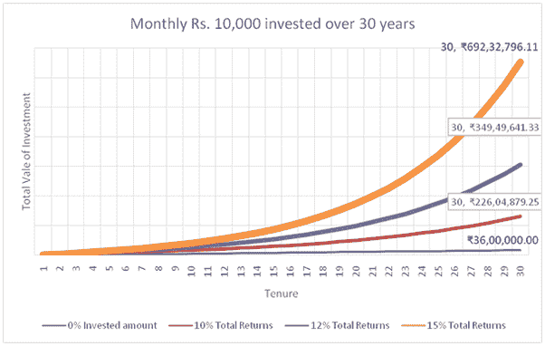

# 理财基础:20 多岁的年轻人

> 原文：<https://medium.datadriveninvestor.com/money-management-basics-for-young-people-in-their-20s-2c3a717db556?source=collection_archive---------4----------------------->

Dream to have these things early in life. Start investing now.

没有比二十几岁更好的时间让你的钱为你工作，这样你就可以实现你一生的财务目标 。在 20 多岁的时候，养成良好的消费和储蓄习惯，学会预算和投资，可以帮助你避免不必要的债务。20 多岁是人生的一个阶段，你有很多渴望和梦想要追逐，面临挑战和机会来证明你的金属。25 岁左右，你完成了学业，开始了新的工作或事业。这是开始你的财务规划的时候了。 ***作为一个 20 岁的人，你拥有很多人都没有的东西:时间！让我们利用这一点，为自己早日实现财务自由*** 。

很多时候年轻人认为储蓄和投资是一回事。但是这两个概念之间只有一线之隔。储蓄和投资是相互联系的，但不是同一的**。**

 [## 外汇投资如何帮助偿还你的债务-数据驱动的投资者

### 外汇是对外汇市场的投资，不同国家的货币在外汇市场上进行兑换

www.datadriveninvestor.com](https://www.datadriveninvestor.com/2019/02/13/how-forex-investment-helps-to-repay-your-debts/) 

储蓄是我们的收入在满足所有开支后的剩余金额。

**储蓄=总收入-支出**。

大多数时候，人们把钱以现金的形式存到银行的储蓄账户里。但这样一来，他们的储蓄几乎得不到任何回报。

鉴于**投资是一个将储蓄配置在金融资产中以获取回报的过程**。储蓄转化为投资，让钱为我们工作。**投资意味着一种有特定目标的长期方法。因此，没有目标的投资意味着随机投资，这可能是不可持续的，如果发生紧急情况，随时都可能停止。所以你的投资过程应该基于**基于目标的投资策略。****

储蓄率取决于你的年龄和你的责任。20 至 30 岁的人比 40 多岁的人能存更多的钱，因为他们的家庭责任比 40 多岁的人少。当你单身且没有重大责任时，储蓄率应该超过 50% 。

检查以下几点，以节省开支。

*   **开立单独的银行账户**。从你的工资账户中转出你在这个单独账户中决定的金额。锁上它。任何形式的支出都不能从这个账户中提取。一旦你习惯了这种安排，你就可以开始投资这笔储蓄。
*   **记录你的花费**。我们应该有对我们的开销进行跟踪。很多时候，我们把更多的钱花在我们想要的东西上，而不是我们需要的东西上。考虑使用你的信用卡或银行对账单来帮助你。**记下每一笔开销会帮助你知道你的钱都花到哪里去了。**
*   制定你的每月预算。一旦你对一个月的开销有了概念，你就可以开始将你记录的开销组织成一个可行的预算。预算将帮助你计划你的支出，限制超支。
*   将你的开支分类。费用也可以分为**需求和**需求。你应该明白你的总体需求是什么，以及为了你的需求你会付出什么代价。尽量避免花在旅馆、短期度假、郊游、看电影、聚会上。**首先关注你的需求**。这有助于我们减少在不需要的东西上的花费。
*   选择一些要存起来的东西。省钱的最好方法之一就是设定目标。先确定你的目标。没有目标的投资意味着随意的投资，这种投资可能是不可持续的，如果发生紧急情况，随时都有可能停下来。**基于目标的储蓄**有助于在投资中保持专注和自律，直到目标实现。
*   决定你的优先事项。你的目标可以是短期的，也可以是长期的。你必须分清目标的轻重缓急，并相应地不断存钱。将储蓄金额的百分比与每个目标对应起来。
*   **自动保存**。几乎所有的银行都提供支票账户和储蓄账户之间的自动转账。你可以选择转账的时间、金额和地点，甚至可以将你的直接存款进行分割，这样你的一部分薪水就会直接进入你的储蓄账户。
*   看到您的储蓄增长。每月回顾你的预算，检查你的进度。这不仅能帮助你坚持你的个人储蓄计划，还能帮助你快速发现并解决问题。

一旦你开始赚钱就开始投资，你就能为自己创造巨大的财富。早年起步会让你远远领先于众人。在年轻的时候，你可以从**复利**中获益匪浅。还有一个好处是，相对于起步晚的人，你可以投资**很小的比例来积累更大的语料库。让我们从下面的例子来理解这一点。**

让我们假设你在 25 岁时开始每月投资 10000 卢比的股票共同基金，持续 30 年，为你的退休做准备。如果利率是 10%，12%，15%，你能实现多少财富。？

根据这个折线图，你可以积累

*   **~ Rs 2，26 Cr** 如果回报率为每年 10%
*   **~ 3.50 卢比**如果回报率为每年 12%
*   **~卢比 7.00 卢比**如果回报率为每年 15%。

**这样你就可以累积高达 7 Cr 的积分。每月仅投资 10000 卢比**

*新手开始投资要谨慎。投资的一般规则是，投资那些你了解的资产，投资过程简单易行。*

沿着这条投资之路走下去，将有助于那些年轻人早日实现财务自由。

*   根据你的年龄，你可以允许 80%的储蓄用于股票，20%用于债务。按如下方式分配您的可投资盈余
*   80%的盈余应通过共同基金 SIP 转为股权。根据评级最高的 ***大型股和多股股票基金中的**核心和卫星方法**或优秀的 ELSS 基金、*** 其余为优质的 ***中型股和小型股基金，构建您的股票投资组合。***
*   如果你没有足够的直接投资股票的基础和技术知识，请不要盲目投资直接投资股票。而是走共同基金路线。如果你不熟悉股票市场，你可以从漂亮的 ETF 和指数基金或者平衡基金开始。
*   你 20%的可投资盈余应该投资于 **PPF、优质债务基金和 NPS** 。PPF、NPS 和 EPF 是创造长期财富的最佳债务工具。对于短期目标，投资于**债务共同基金。**
*   你也可以持有 5%到 10 %的黄金。通过**黄金 ETF 和黄金债券**保持每月购买 1 克黄金。
*   每当你得到年度奖金时，就灌满一小口。这项额外充值将以多种形式返还给您。
*   一旦你熟悉了上述资产类别，当你的薪水增加时，你就可以把房地产看作一种资产类别。
*   **永远不要把所有的鸡蛋放在同一个篮子里。这意味着你应该拥有不同类型投资的正确组合，如股票、债券、房地产和黄金等。**
*   **税务规划**需要明智地进行。**尝试将 15 万英镑的 70%投资于 ELSS 股票，其余留在 PPF。**千万不要为了节税而投资非生产性金融产品。比如不要把保险和投资混在一起。为保险制定一个纯粹的 T4 计划，为创造财富投资共同基金。
*   **提升你工作所需的技能:**专注于增加你目前工作所需的知识和技能。这将使你领先于你的竞争对手。
*   **千万不要陷入债务陷阱。请不要借任何昂贵的贷款来实现你的愿望。债务会妨碍你的储蓄。**
*   **坚持每年回顾一次你的投资组合，根据生活中的重大变化调整你的资产配置。**
*   **财富创造是一个长期现象。**坚持你的长期资产配置。不要对股票市场的短期波动感到恐慌。坚持喝我们的。
*   **控制你的贪婪**。关注可持续增长，而不是赚取不合理利润的捷径。
*   最后但同样重要的是，请为您的所有投资完成**提名流程**。

**你身边有时间。最大限度地利用它。早早开始投资，享受财务自由。**