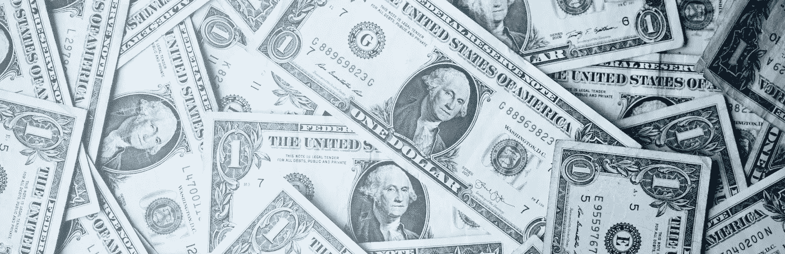
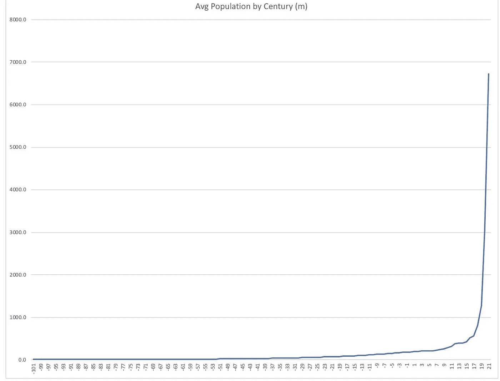

# 金钱:最大的信心诡计

> 原文：<https://medium.datadriveninvestor.com/money-the-great-confidence-trick-f73e1d9e280f?source=collection_archive---------3----------------------->

Based on Photo by Sharon McCutcheon on Unsplash

世界上大多数的钱是不存在的。你不相信我？你有信心？你是看准了 [*大局*](https://economicsfor.business/the-big-picture/) *？在你滚动到下一篇文章“下周你会忘记的五件事”之前，想想 2017 年的美国经济:*

*   *现金或等价物总额为****1.5 万亿美元，按照美国美联储*** *计算。*
*   *即使包括储蓄和投资资金，也有****3.5 万亿美元*******但是****
*   **美国总支出为****19.4 万亿美元*** *。**

*来源是这里的。(1 万亿= 100 万亿。)*

*把这些点连起来。如果你把消费者、企业和政府的所有支出都加起来，这比 2017 年美国经济中可以称为钱的一个非常宽泛的定义还要多大约 16 万亿美元。然而买的东西是非常真实的。*

*更奇怪的是，似乎没有人对这种不平衡感到不安(甚至没有人注意到)。我不记得它出现在新闻中，而且(当然)有太多事实让它出现在社交媒体中。为什么不大惊小怪？*

# *起初*

*为了搞清楚为什么地球上最强大的国家要花费大量并不存在的钱，我们必须知道钱意味着什么，并理解它是如何随着岁月、世纪和千年而变化的。*

* [## 为什么包容性财富指数比 GDP 更能衡量社会进步？|数据驱动…

### 你不需要成为一个经济奇才或金融大师就能知道 GDP 的定义。即使你从未拿过 ECON 奖…

www.datadriveninvestor.com](https://www.datadriveninvestor.com/2019/03/08/why-inclusive-wealth-index-is-a-better-measure-of-societal-progress-than-gdp/) 

从表面上看，现金就是钱。如果你必须为某样东西付款，你会用美元、美分、英镑和便士等来考虑——现金。在这个非接触式支付的时代仍然如此。为什么？即使你在网上银行，你的某个部分相信在某个安全的房间里有一堆现金只属于你。用信用卡支付只是把钱从一个现金堆转移到另一个现金堆。

这与人们相信金钱是有形的东西有很大关系。这只是物物交换的高级形式。你不是用商品换其他商品，而是用商品换钱。钱更方便，更灵活，但还是你能摸到的东西。即使钱不在我们的口袋里，它也在某个地方。

物物交换和货币是农业发展的结果。公元前 10，000 年至 6，000 年间，世界各地都出现了农业。这一创新使人们能够生产比他们需要的更多的食物，贸易第一次成为可能。

物物交换是最自然的交易方式。我的小麦比我需要的多，而你的橄榄比我多，所以我们做个交换吧。你把时间都花在做陶器上了，就没时间种苹果了。我将用商定数量的苹果换你做的陶器。

有些商品比其他商品更容易用于易货交易。亚里士多德谈到商品有两种价值。他们的第一个价值是他们明显的目的，但第二个是他们的物物交换价值。

最终人们意识到，拥有一些只有物物交换价值的东西是有用的；比如硬币。我们有证据的第一枚硬币是在以弗所发现的，可追溯到公元前 600 年。

即使在硬币出现之后，物物交换仍然非常重要。一些学者甚至质疑现金是物物交换的自然继承者。有一段时间罗马士兵的军饷是用盐支付的，甚至在 16 和 17 世纪，就有了‘易货货币’。北美殖民者将海狸皮用于一般贸易。

综上所述，不难相信贸易是真实存在的事物的公平交换。不幸的是，如果这是真的，现代生活将是不可能的，因为它将经济的规模限制在物质的可用性上。

和我在一起。

# 价值储存

为了达到我们现在的地位，我们必须完全摆脱物物交换。让我们发展亚里士多德的观点，商品有两种价值，它们的目的价值和它们的易货价值。事实证明，从贸易的角度来看，两者兼而有之实际上是相当低效的。

想象一下，欧洲想从美国购买 100 万吨小麦。那相当于多少法国葡萄？交付时，葡萄预计处于什么状态？对美国来说，说它想要 2 亿美元的粮食(2018 年末价格)要容易得多。

从大的范围来看，我们必须摒弃这样的观念，即某样东西必须有实际用途才是有价值的。事实上，我们可能会怀疑，大规模贸易的唯一方式是我们拥有像货币这样的东西，一种抽象的价值储存手段。

我的 MBA 会计学教授曾经说过，金钱不会让你远离风雨，也不会驱使你去工作。它没有实际价值，但这却是一种优势。这使得价值比较更加容易，你也有更多的自由来选择金钱的形式。选择耐用的东西，你可以为将来存钱。

然而，我们还没有完成。这不足以解释我们的现代世界是如何依赖“虚拟”货币的。

# 18 世纪

如果你看一张从公元前 10，000 年到今天的世界人口增长图，你会注意到从 18 世纪中期开始，人口增长急剧加速。从大约 1000 万人的全球人口到大约 4 亿人的全球人口，经历了大约 11000 年。从 18 世纪到 21 世纪(约 260 年)，人口已经增长到 770 万人。什么变了？

Global Population Over Last 12,000 in Millions

18 世纪是欧洲启蒙运动的世纪，它本质上代表了从神秘主义心态向科学心态的转变。支撑这种增长的是金融创新和资本理念。

资本家利用资源(比如钱)购买或建造能产生更多资源的东西，如此循环往复。用来产生更多资源的资源被称为资本。在现代生活中，只有少数(富有的)人是资本家，甚至他们也是别的什么东西。

我们所有人都是消费者，他们购买我们需要的东西，这些东西不会产生新的收入。当我每周去超市购物时，我的购物车里没有一样东西会让我变得更富有。它让我吃饱喝足，但没有什么会成为新的收入来源。

当人们以资本家的身份行事时，他们会购买可能会让他们进一步富裕的东西。我可能会买一栋房子，把它租出去，而不是住在里面。我用一部分租金来支付抵押贷款，一部分用来维护房子，如果我是一个真正的资本家，剩余的大部分用来买另一栋房子出租。

资本可以是金钱，但通常不是。它是从哪里来的，它和钱有什么关系？

# 交换价值

随着贸易和繁荣的增长，规模成为一个问题。欧洲冒险家带回了各种各样的财宝，大部分人变得越来越富有。不再仅仅是高等生物需要保护他们的财富。

银行是一个自然的发展。探索和开发新奇迹的商人不想回家后发现他们的财宝被偷了。将财富委托给能够保证其安全的人或组织会方便得多。银行最早出现于 18 世纪末，以满足这种需求。

这导致了另一项创新。以前，如果我向你买东西，我会给你一些硬币。如果我们都把钱存在同一家银行会怎么样？我去那家银行取出一些现金，只是为了让你把现金还给同一家银行，这有什么意义呢？如果我们定期交易的话，情况就更令人讨厌了。

如果我们只是写一些记录交易的笔记，并在月底进行统计，会怎么样？然后银行会调整它的记录，记录有多少硬币属于谁。现在我用承诺兑换现金的交易代替了现金交易。

你认为月底会有什么东西移动吗？你认为某个地位低下的职员从商人 A 的一堆硬币中拿走硬币放在商人 B 的硬币上吗？我也不这么认为。有分类账和谁拥有多少的流水总数。实际上没有任何物理移动。

我们快到了。钱还不是完全虚构的，但它的运动是虚构的。

# 接受荣誉

没过多久，银行家们就意识到，他们将很快坐拥大量现金。所有商户多久会同时决定提取他们所有的现金？哪怕是一小部分人提取全部现金的可能性有多大？

银行的金库里有现金，新的世界就在他们周围打开。许多商人想利用新的贸易机会，但缺乏资源或资本。

如果银行将部分现金储备借给企业家，给他们所需的资本，会怎么样？将收取利息，利息的大小将反映对贷款偿还的信心。只要这些现金的原主人不想全部收回，又有什么害处呢？

然而，银行敢贷出多少？在一家银行无法再向储户提供偶尔提款之前，它敢拿出多少储户的钱来发放贷款？这最终导致了所谓的“部分准备金银行”。

这在尼尔·弗格森的书《金钱的崛起》中有所描述，我将在这里大致解释一下。显然，哈佛大学一年级 MBA 学生就是这样接触到它的。

要实现这一点，必须有一个像美联储或英国银行这样的中央银行。这充当了最后贷款人的角色。事情是这样的:

1.  比方说，一家央行向一家商户支付 1000 英镑有形货币，为其修建一个新金库。
2.  商人将钱存入当地银行，同时她决定如何处理这笔钱。
3.  当地银行有一个关于存多少钱和借多少钱的政策。这被称为“储备规则”，这里是 10%。
4.  当地银行将 100 英镑存入中央银行，并向一家想要扩充船队的公司贷出 900 英镑。
5.  在船只建造期间，该公司将这 900 英镑存入了另一家银行的商业账户。
6.  该公司的银行也有 10%的准备金规定，将 90%交给央行，贷款 810%。
7.  只要银行足够大，准备金规则正确，它们就能支持对“真实”货币的需求。

央行原来发行 1000，现在流通的是 1000+900+810 = 2710 的货币。只有 1000 存在于物理意义上。剩下的就是信用，或者说是想象中的钱。

啊，我们到了。我们已经进入了想象，但故事并没有就此结束。这只是我们错综复杂、不透明的全球金融体系的开始。这是一个将抽象包裹在抽象之中的金融世界。

# 欺诈

一切都靠信心。你要相信大家会继续遵守规则。如果很大一部分人开始玩弄这个系统，或者未来不确定，那就意味着麻烦。如果信心崩溃，就像 2008 年几乎发生的那样，就有“银行挤兑”的风险。

如果银行发生挤兑，所有的客户都会失去信心，同时试图取出所有的现金。当然，问题是银行没有足够的现金来这么做。它的大部分只是作为一个数字存在于某个地方的电脑上。为了避免全面的灾难，政府进行了干预，引入银行股份，为它们提供新的资本，扭转了局面。

据我们所知，没有其他方式可以像现在这样管理全球经济。770 万人可以以物易物的想法是荒谬的。即使使用现金也是不切实际的，即使你铸造了它，你会把它存放在哪里呢？

*Nial Ferguson 评论说，2006 年全球贸易总额刚刚超过 4 亿美元，但全球经济规模只有 5140 万美元。只有当我们相信财富是真实的，世界上的大部分财富才是真实的。(不要让我从 bit coin 开始；嗯，还没有。)*

*你只需要有信心。*

更多经济信息:

货币和债务是齐头并进的，但是巨额债务对一个国家有伤害吗？[点击此处了解详情。](https://link.medium.com/9EypJkCUQZ)

关税真正伤害的是谁？[在这里了解](https://link.medium.com/rLWOWhLUQZ)。*