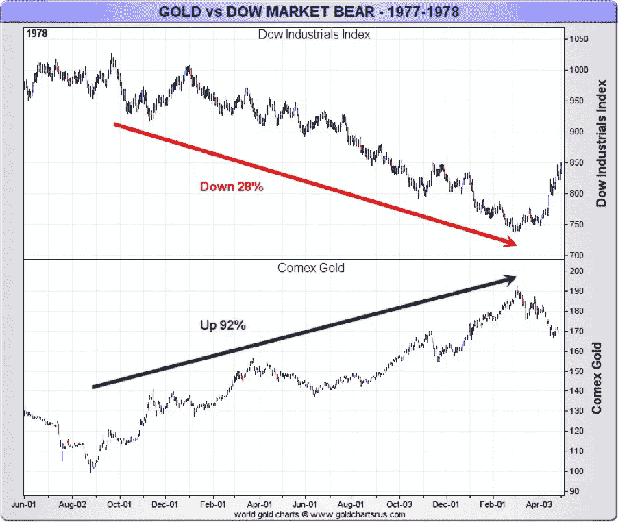
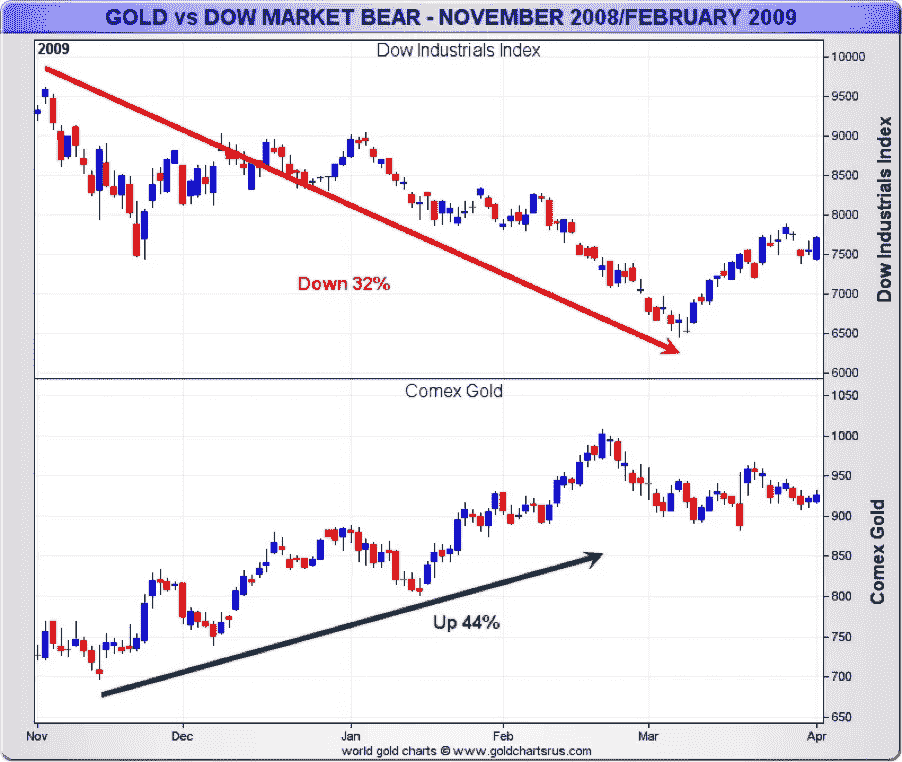
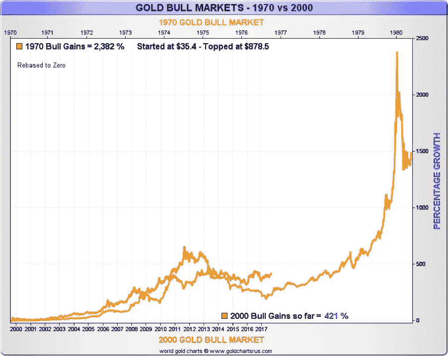
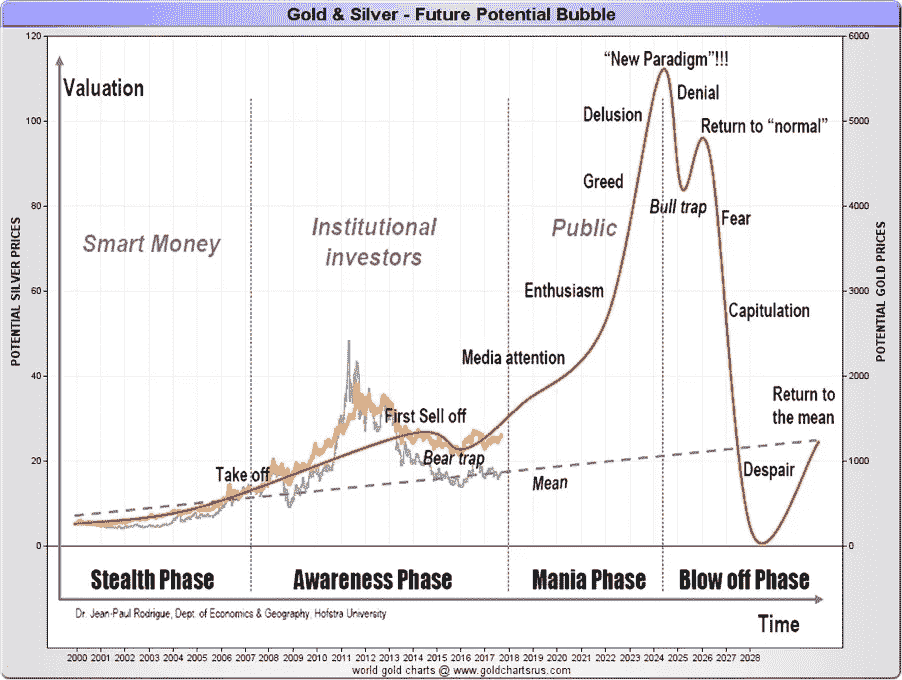

# 金钱烦恼…

> 原文：<https://medium.datadriveninvestor.com/money-worries-4a0f21e7a69c?source=collection_archive---------49----------------------->

# 想象

# 失去

# 一切

# 你没做错什么。

# 但是你什么也没做…这就是问题所在。

我将要告诉你的可能要花费 20 便士、50 便士或者 1 英镑。

但这可能会改变生活。

之后，我将向你展示如何赚到可能会改变你一生的钱。但首先让我向你展示如何迈出一大步来保护你已经拥有的东西。

让我解释一下。

我们刚去度假，外出时我们把房子租给了一些朋友，他们的房子正在重建。一位网络安全专家和他的家人。

常识建议我们告诉他们一些关于房产的事情，但是因为我们都是大忙人，这是我们离开的前一天，我们仍然没有设法见面。

乔(父亲)打电话来，建议我们叙叙旧，所以他过来了，我们大吃大喝。我想我一次都没提到房子。我 5 岁的女儿耐心地玩着她的洋娃娃，这一点我没有忘记。我们有两只猫，我们不在的时候，它们会由我们的朋友来照看，很明显，她在留意它们。

当我被质问时，我承认没有提到这些，但同意列出需要做的事情。食物、水等。一切都很容易，直到我按下打印，什么也没发生。更准确地说，报纸出来了，但你什么也看不懂。我打开和关闭打印机，但信息是一样的。我需要更多的墨水。

没有戏剧，我们不飞，直到后来，所以我有时间去城里买墨水。却发现打印机太旧了(我很少用)，你再也买不到墨水了。我需要一台新打印机。

这让我开始思考。

我完全依赖一切工作。

如果发生金融危机或重大黑客攻击，我无法访问我的银行或经纪账户，该怎么办？实际上我所有的东西都是电子形式的。我没有任何证据证明我的财富。

当然，事情是备份的。但是在危机时刻，我想让**告诉**人们他们欠我什么。不是**问**他们。我一无所有。

想象一下与我的银行的对话。

我(假设我足够幸运能和任何人交谈):我拿不到我的钱

我知道，系统坏了。你带了多少钱？

我:我想大概是一万左右吧

**他们(他们很可能会接到很多骚扰电话)**:如果你能提供一些证据，我们会在事情解决后联系你。

**我:**恐怕我什么都没有。

这里有两个问题。首先，在崩溃中，我没有任何东西来证明我所拥有的，我可能对细节有点粗略。其次，我已经告诉持有我资产的人，我基本上没有所有权的证明。

在正常情况下，这可能不是一个问题，但在金融危机中，这可能是我能否拿回钱的区别。

这就是为什么你应该持有你主要投资的书面证据。

这是常识。但我打赌你不知道。

如果系统瘫痪了，你会怎么办？你会如何应对？如果你认为打印出来会有帮助。如果有意义，请与你的朋友或爱人分享。你永远不会。

我没有生意要谈。我不想给任何人留下深刻印象。这才说得通。

我的第二个问题是。当其他东西下降时，什么东西上升。

这里有一些线索。

这就是 1977/78 年道指暴跌时黄金的遭遇。

同样，它在 1987 年的崩盘中表现良好

对于那些记性不好的人来说，这里是 2008/09 年发生的事情。

哦不！我听到你说。又不是金银！我已经投资了。

在你做任何事情之前，听听这个非常有趣的事实。

90%的首次创业都失败了。

90%的二次创业成功了。但是 80%的企业主从来不会尝试第二次。

我的观点很简单。许多投资者涉足黄金和白银矿业股票，但并不真正知道他们在做什么。有点像拥有一辆法拉利却不知道如何驾驶。

他们买错了股票，或者错误地把握了时机。赔钱走人。

**第一课——如果市场崩盘，黄金可能是一个非常好的朋友**

第 2 课可能会让你大吃一惊。许多人认为黄金价格必须大幅上涨才能在黄金市场赚钱。这绝对不是真的。

**第二课——黄金价格不需要大幅波动就能获得一些改变人生的回报**

我的策略很简单。我称之为常识。但是让我告诉你。

你大概可以看出我喜欢真实的东西。有形的财富。事实上，黄金和白银股票是我的激情所在。他们对我既残酷又友好，但我学到了很多东西，并在这个部门工作了多年。

我现在的生活与我刚开始投资矿业股票时大不相同，我喜欢与特定人群分享我的想法。最棒的是，我不觉得我在工作。一旦研究完成，剩下的工作就由公司来做，而不是我。我只是坐享其成。

这需要勇气，因为这些股票非常不稳定。如果你不喜欢冒险，总是随大流，这不适合你。

但是如果你这样做了，这将是非常令人兴奋的，因为第三课是关于时间的。首先，这是一张对比当前形势和 1970 年牛市的图表。

这是另一个例子，展示了历史重演的可能性。

关键在于时机。