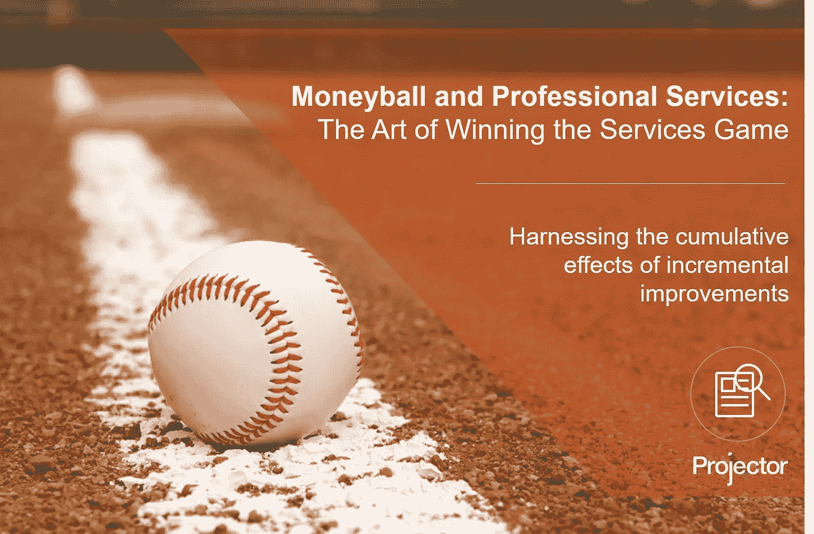
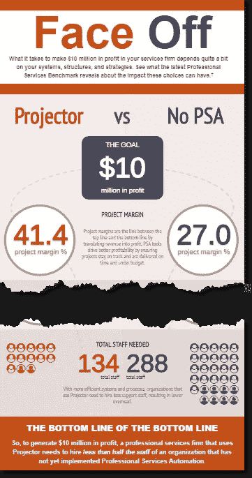

# 金钱球和专业服务:赢得服务游戏的艺术

> 原文：<https://medium.datadriveninvestor.com/moneyball-and-professional-services-the-art-of-winning-the-services-game-538049461102?source=collection_archive---------26----------------------->

2004 年，迈克尔·刘易斯出版了*money ball:The Art of Winning A fair Game，*这本书记录了奥克兰运动家队(Oakland A)寻求成为美国职业棒球大联盟(Major League Baseball)最成功的球队之一的过程——尽管奥克兰运动家队的薪水在比赛中排名倒数第二。他们通过寻找被市场低估的球员，成功地与那些在超级明星身上花费三倍于运动家队的球队竞争。

运动家队打破常规，采用一种非常量化的，数字驱动的方法来评估每个球员的表现。他们没有依赖棒球业内人士长期以来普遍接受的关于团队成功因素的智慧，而是通过分析数据来确定真正重要的指标。

> 他们发现在棒球比赛中获胜更多的是许多小动作的累积效应，而不是单一的横扫手势。这是一场靠保送和单打而不是高耸的本垒打赢得的比赛。

当我阅读 SPI Research 今年的[专业服务基准](https://www.projectorpsa.com/resources/professional-services-benchmark-survey)时，我对 SPI 团队在专业服务行业所做的事情与早期 Sabermetricians 为美国国家消遣所做的事情之间的相似之处感到震惊。该基准并不盲目接受传统智慧，而是定量测量服务经理每天做出的过多决策(无论大小)的影响。

该研究客观地检查了对组织的绩效有实际影响的度量标准、工具和策略。它清楚地表明，专业服务的成功，就像在棒球比赛中获胜一样，是基于同时优化流程的许多不同方面。可计费利用率[的微小改善](https://www.projectorpsa.com/blog/three-key-questions-you-need-to-answer-when-measuring-utilization/)，计费率的逐步提高，可计费与不可计费比率的略微改善，以及项目交付的微小改善，这些加在一起可以带来两位数的利润增长。

数据显示，这些指标中每一项的微小增长的累积效应都可以让一个使用正确工具的组织用一半的员工实现特定的盈利水平。要了解如何做到这一点，请看我们的信息图[如何让专业服务盈利 1000 万美元](https://www.projectorpsa.com/blog/growing-a-professional-services-firm)。

该基准不仅阐明了数据驱动管理的优势，还提供了对引入这种科学严谨性至关重要的一些工具、流程和技术的见解。SPI 团队强调的关键工具之一是专业服务自动化(PSA)解决方案，它构成了执行和衡量服务公司所有交付活动的基础。SPI 关于 [PSA 软件](https://www.projectorpsa.com/)的结论是“这些系统在净利润方面有 74%的提高，可以收回成本”，并且“必须考虑任何拥有 10 名或更多顾问的组织。”SPI 发现“今年表现最佳的每个人都使用了商业 PSA 应用程序，并将其归功于提高了…计费利用率和按时完成项目。”

SPI 基准报告的重要之处在于，它在不断发展的专业服务市场及其面临的挑战的背景下讲述了这个故事。它提供了可能违背传统智慧的实用策略，但被证明对企业的成功具有可衡量的影响。就像路易斯的《T2》中的主角一样，它使用经验测量的严格性来挑战长期以来的假设。

要了解这些观点并开始将您的组织与同行进行比较:

> **报名下载** [**专业服务基准调查结果**](https://www.projectorpsa.com/resources/professional-services-benchmark-survey)

我们希望它所包含的洞察力能帮助你实现你的目标，不管来年或以后会带来什么惊喜。

*原载于*[*www.projectorpsa.com*](https://www.projectorpsa.com/blog/moneyball-and-psa-software-the-art-of-winning-the-professional-services-game)*。*