# 远程监控机器学习训练的进度

> 原文：<https://medium.datadriveninvestor.com/monitor-progress-of-your-training-remotely-f9404d71b720?source=collection_archive---------1----------------------->

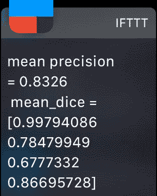

我正在设计一个具有相对较大的训练集的 MRI 自动标记网络(在以后的文章中会有更多的介绍)。每个纪元需要大约 45 分钟运行(在我全新的 Nvidia 1080 TI 卡上),聚合需要大约 10 个纪元。我希望在每个时期结束时得到进度通知，并获得该时期的精度指标，这样，如果精度数没有像我预期的那样收敛，我可以更改一些超参数或模型结构。当训练进行时，我不想坐在电脑前。

这篇文章是关于实现这个目标的一个非常简单的方法。我们将创建一个 IFTTT 小程序，当它收到一个 http GET 请求形式的触发器时，它会向您的手机发送推送通知。

# 如果设置了

登录你的 IFTTT 账户(或者注册，如果你还没有注册的话——在[ifttt.com](http://ifttt.com)注册是免费的)。然后点击“我的小程序”并启动一个新的小程序，你猜对了，点击“新小程序”按钮，如下图所示:

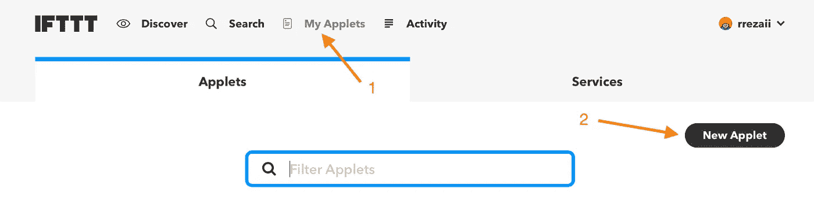

Creating a New Applet

搜索“webhook”服务(这个以前叫“创客频道”)。IMO 这是 IFTTT 中最有用的服务。这个服务在收到一个特定的 http GET 请求时触发一个动作(IFTTT 的“then”部分)。

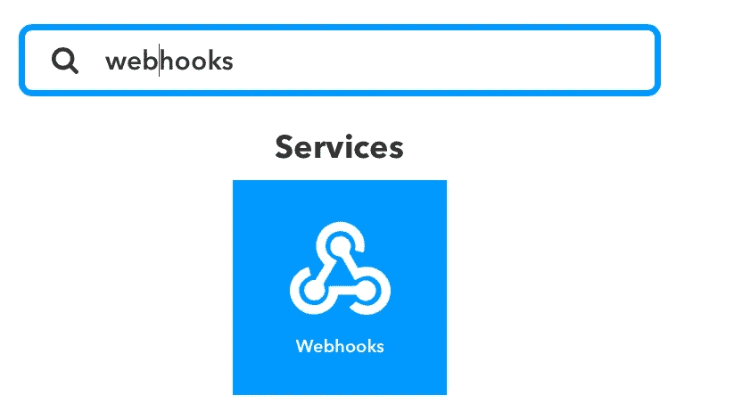

Search for Webhooks

单击“网络挂钩”进入下一页并配置此服务。

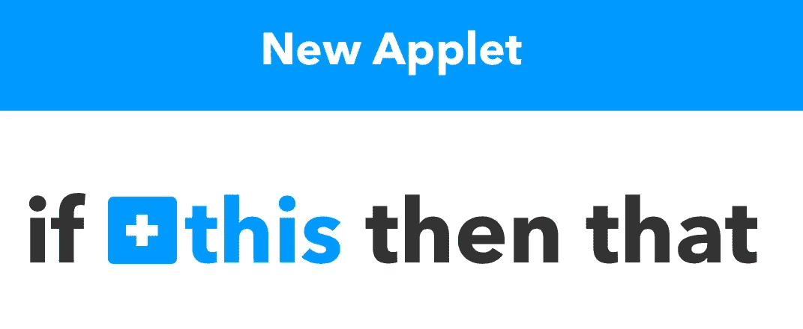

点击“+ this”进入下面显示的下一个屏幕，在这里我们为我们的活动指定一个名称。我们称之为“时代终结”

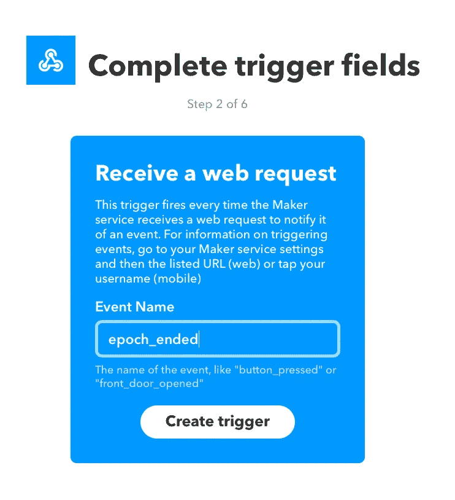

点击“创建触发器”进入如下所示的屏幕:

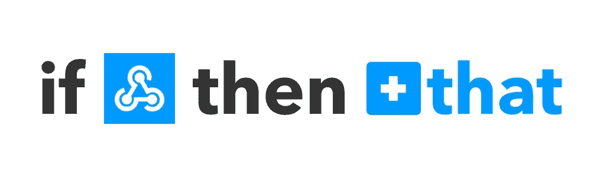

点击“+ that”并在搜索框中输入通知。这是我们将用来生成手机推送通知的服务。

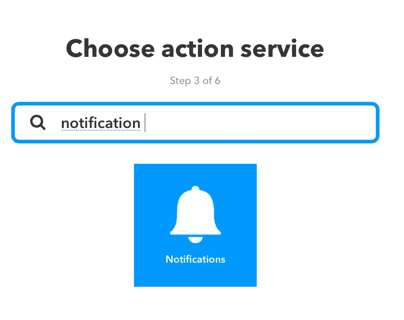

点击通知。我们可以生成“简单”或“丰富”的通知。丰富的通知允许你指定图片和其他东西的链接。简单通知足以满足我们的需求，但是选择“富通知”只是为了看看您可以在通知中包含什么样的内容。

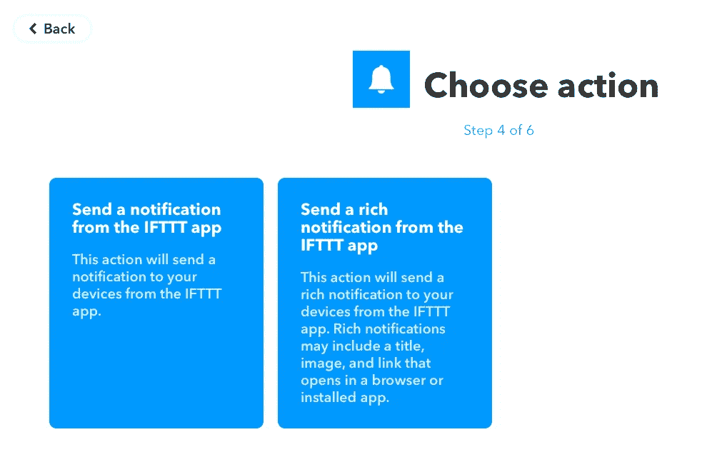

在此屏幕中，我们可以指定推送通知的内容。在“信息”框中，点击“添加配料”并选择“值 1”。在我们将包含在程序中的 python 代码中，我们可以传递一个字典作为 http 请求的一部分，其中包含三个键:“值 1”、“值 2”、“值 3”。我们可以使用这些键将参数传递给 IFTTT，并根据需要在通知中显示它们。在这里，我只使用“value1 ”,因为我可以在 python 中进行格式化，并将“value1”设置为我想要的任何字符串。正如您将在本例中看到的，我将在“value1”中包含两个参数(precision 和 recall)。

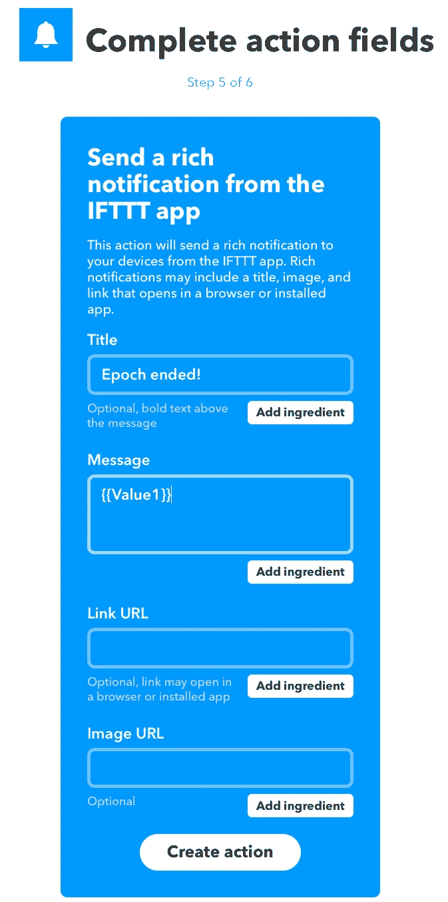

点击“创建操作”，然后点击“完成”:

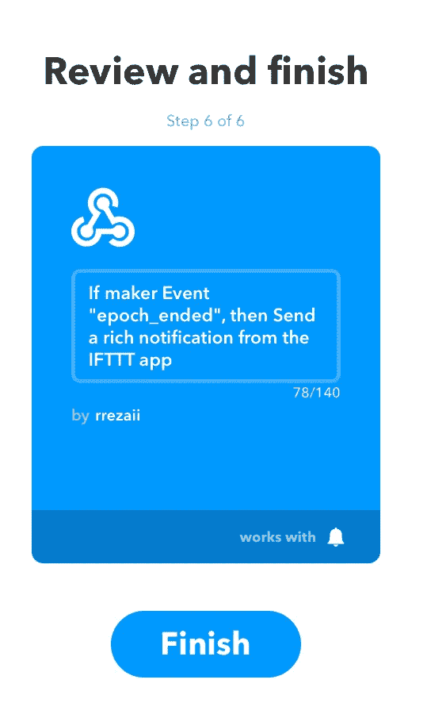

IFTTT 中还有一步:在我们转向 python 代码之前，我们需要 webhook 服务的秘密密钥。点击“webhook ”,如下图所示:

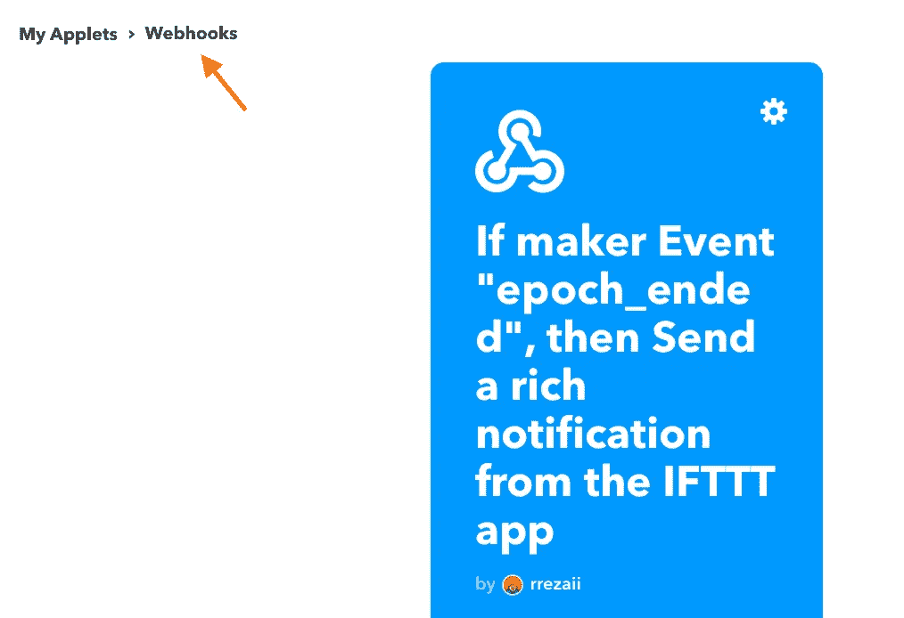

这是你的 webhook 密钥。复制它。

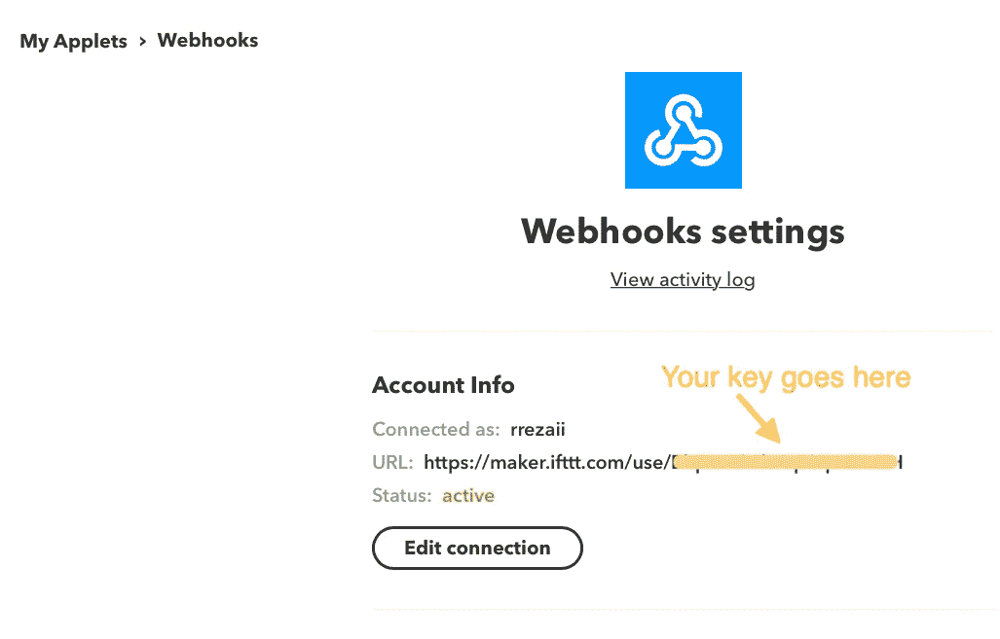

Copy Your Secret Key for IFTTT

# Python 代码

这个 python 函数接收消息，并向 IFTTT 发送一个格式正确的 http 请求，从而触发 IFTTT 向您的手机发送推送通知。不要忘记用您在上一步中复制的 IFTTT 密钥替换'<your_ifttt_key_here>'。</your_ifttt_key_here>

现在，您已经准备好在每个时段结束时调用通知函数，并使用您想要监控的指标:

除了发送推送通知，您还可以创建发送电子邮件或 SMS 的 IFTTT 小程序。我发现推送通知更有用。你现在需要做的就是为你的 [iOS](https://itunes.apple.com/us/app/ifttt/id660944635?mt=8) / [Android](https://play.google.com/store/apps/details?id=com.ifttt.ifttt&hl=en_US) 设备下载 IFTTT 应用，并在设备上登录你的账户。

以下是我的手机和 Apple Watch 上的通知示例:

Apple Watch Notification

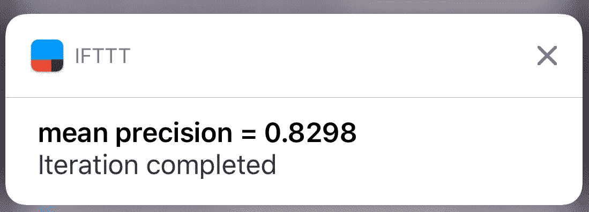

Notification on my iPhone

你现在可以开始训练，去健身房或骑自行车或做一些有趣的事情。当你不在电脑后面看你的机器学习训练进度时，时间过得更快:)